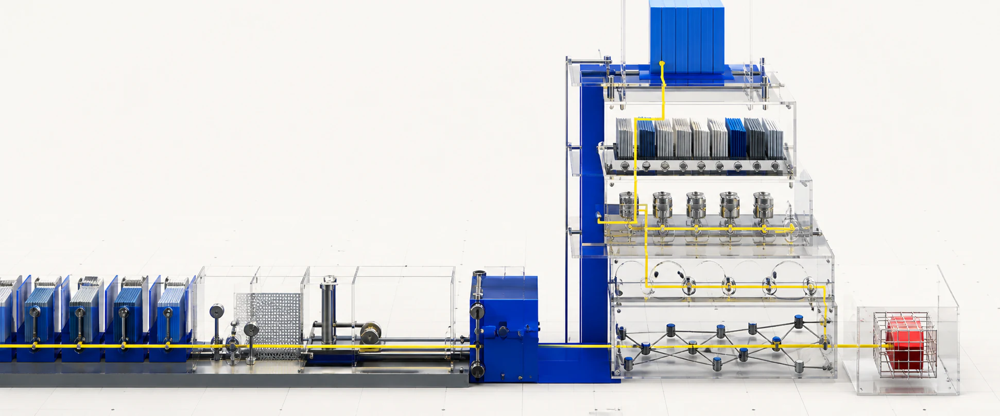

# LLM Engineering Course: RAG, AI Agents, Evals, MCP & Production

<p align="center">
  <a href="#english">English</a> · <a href="#espanol">Español</a> ·
  <a href="https://llmengineerclub.com">Interactive course</a> ·
  <a href="https://llmengineerclub.com/quiz/">Club Quiz</a>
</p>

<p align="center">
  
</p>

<p align="center">
  <a href="https://github.com/jlcases/llm-engineering-program/actions/workflows/content-quality.yml"></a>
  <a href="https://github.com/jlcases/llm-engineering-program/actions/workflows/github-code-scanning/codeql"></a>
  <a href="LICENSE.md"></a>
  
</p>

<a id="english"></a>

An open-source, bilingual LLM engineering course for people who need to ship reliable AI systems,
not just demos. Work through nine modules and executable Python labs covering model interfaces,
prompt contracts, retrieval-augmented generation (RAG), AI agents, Model Context Protocol (MCP),
agent harnesses, execution loops, knowledge graphs, LLM evaluation, security and LLMOps.

Working practitioners maintain the curriculum through public pull requests. Every merged improvement
keeps its author and review history visible.

> **Build something useful in the first 40 minutes.** Start with an observable multi-provider LLM
> client that measures tokens, latency and failures.
>
> **[Start Module 01 →](https://llmengineerclub.com/learn/model-interfaces/)** &nbsp;·&nbsp;
> **[Measure your level in the Club Quiz →](https://llmengineerclub.com/quiz/)** &nbsp;·&nbsp;
> **[Run a live team challenge →](https://llmengineerclub.com/live/)**

## The problem this course starts with

The demo answers correctly on your laptop. Then the provider changes a model, retrieval misses the
one passage that matters, a tool retries twice and nobody can explain the resulting bill. The hard
part of LLM engineering begins after the first successful response.

This curriculum teaches you to build an LLM system that you can inspect, measure, stop, recover and
defend in a technical review. Progress is demonstrated with executable artifacts rather than time
spent watching videos.

## Choose your entry point

| You want to… | Start here |
|---|---|
| Build your first measurable LLM application | **[Start the interactive course](https://llmengineerclub.com/)** |
| Find the gaps in your current knowledge | **[Take the 20-question Club Quiz](https://llmengineerclub.com/quiz/)** |
| Run the same timed challenge with a team | **[Create a Club Live room](https://llmengineerclub.com/live/)** |
| Improve a lesson, lab or example | **[Read the contribution guide](CONTRIBUTING.md)** |

The website stores ordinary course progress in the browser without signup or cookies. Competitive
features are separate, and a result only becomes attached to a social profile if its owner chooses
to link one afterwards.

## What you will build

| Module | Engineering question | Proof of work | Suggested effort |
|---|---|---|---:|
| [01 · Model interfaces](translations/en/modulo-01-fundamentos-llm/) | How can a model be replaced without rewriting the product? | Observable multi-provider client | 15–18 h |
| [02 · Context and output contracts](translations/en/modulo-02-prompt-engineering/) | How do instructions and outputs become testable interfaces? | A/B contract regression | 38–45 h |
| [03 · Retrieval Engineering](translations/en/modulo-03-rag/) | How do you know what evidence was retrieved and why? | RAG with citations, abstention and metrics | 50–60 h |
| [04 · Agent and tool interfaces](translations/en/modulo-04-agentes/) | What may an AI agent do, and under whose authority? | Agent with typed tools and MCP | 50–60 h |
| [05 · Harness Engineering](translations/en/modulo-05-harness-engineering/) | What environment lets an agent work verifiably? | Isolated harness with an eval suite | 25–35 h |
| [06 · Loop Engineering](translations/en/modulo-06-loop-engineering/) | How does an execution progress, stop and recover? | Bounded, durable, idempotent loop | 25–35 h |
| [07 · Graph Engineering](translations/en/modulo-07-graph-engineering/) | How do state, knowledge and provenance connect? | Evaluated hybrid graph system | 25–35 h |
| [08 · Production Engineering](translations/en/modulo-08-production-engineering/) | What happens when models, data or dependencies fail? | Service with SLOs, evals and a runbook | 50–60 h |
| [09 · Field project](translations/en/modulo-09-proyecto-de-campo/) | Can every decision be defended with real evidence? | Deployed system and reproducible demo | 47–57 h |

The [complete English learning path](translations/en/RUTA_DE_APRENDIZAJE.md) explains prerequisites,
branches and the proof required to skip material you already know. Certification preparation under
[certifications/](translations/en/certificaciones/) is optional; it is not the center of the course.

## How the curriculum works

1. Pick the first proof of work you cannot already produce.
2. Read only the theory required to build it.
3. Run the lab and break its happy path.
4. Keep the traces, metrics and decisions that explain the result.
5. Ask another engineer to reproduce and challenge it.

Every module includes a map, lessons, executable labs, exercises with public acceptance criteria and
a project. The models and frameworks may change; the contracts, failure modes and evidence remain
useful.

## Current LLM engineering stack

The executable stack was reviewed on **August 23, 2026**. Its configurable defaults are
[gpt-5.6-luna](https://developers.openai.com/api/docs/models) and
[claude-haiku-4-5](https://platform.claude.com/docs/en/about-claude/models/overview).
Labs use OpenAI Responses, Anthropic Messages and tool use, LangGraph 1.2, MCP Python SDK 2.x,
Qdrant and RAGAS 0.4.3. Historical integrations only remain when they explain a migration or design
decision.

## Public knowledge, private competitive material

This public repository contains lessons, task statements, fictional datasets, rubrics, source links
and tests. It does **not** contain editorial solutions, mock-exam answer keys or the active Club Quiz
question bank.

Contributors may propose an assessable objective and public blueprint. The exact competitive variant
is produced and reviewed outside the public repository. Retired questions may later return as open
practice material. Read the [Club Quiz contribution policy](docs/club-quiz-contributions.md) for the
full boundary.

## Contributing

A useful contribution can be a corrected claim, a reproducible failure, a better explanation, a new
lab, an updated model integration or a technical review. Merged work is permanently attributed to
the contributor's GitHub profile and pull request.

Read [CONTRIBUTING.md](CONTRIBUTING.md), use primary sources and include both a happy path and a
meaningful failure case. Full solutions and active answer keys are rejected automatically.

## Run locally

You need Python 3.12+, Node.js and `uv`. The complete setup is in
[translations/en/setup/README.md](translations/en/setup/README.md).

```bash
uv sync --locked --all-extras
uv run python setup/check_env.py --profile all
node scripts/validate-public-content.mjs
node scripts/validate-course-contracts.mjs
node scripts/validate-translations.mjs --complete
node --test scripts/tests/*.test.mjs
uv run pytest -q
```

The CI also audits dependencies, scans Python and workflow code, verifies the hardened production
container and blocks accidental publication of solution material.

## License

Educational content is available under [CC BY 4.0](LICENSE.md); code is available under the MIT
License. Attribution from merged contributions is preserved on
[llmengineerclub.com](https://llmengineerclub.com).

---

<a id="espanol"></a>

# Curso de LLM Engineering: RAG, agentes, evals, MCP y producción

Curso abierto y bilingüe de LLM Engineering para quienes necesitan llevar sistemas de IA a
producción. Sus nueve módulos y laboratorios ejecutables cubren interfaces de modelos, contratos de
prompt, RAG, agentes, Model Context Protocol (MCP), harnesses, loops, grafos de conocimiento,
evaluación, seguridad y LLMOps.

Profesionales en activo mantienen el currículo mediante pull requests públicas. Cada mejora
fusionada conserva la autoría y el historial de revisión.

> **Construye algo útil en los primeros 40 minutos.** Empieza con un cliente LLM multiproveedor que
> mide tokens, latencia y fallos.
>
> **[Empezar el módulo 01 →](https://llmengineerclub.com/es/aprender/interfaces-de-modelo/)** &nbsp;·&nbsp;
> **[Medir mi nivel en el Club Quiz →](https://llmengineerclub.com/es/quiz/)** &nbsp;·&nbsp;
> **[Crear un reto en directo →](https://llmengineerclub.com/es/live/)**

## El problema desde el que parte este curso

La demo responde bien en tu portátil. Después el proveedor cambia un modelo, el retrieval no
encuentra el fragmento decisivo, una herramienta repite una operación y nadie sabe explicar la
factura. La parte difícil de LLM Engineering empieza después de obtener la primera respuesta
correcta.

Esta ruta enseña a construir sistemas LLM que puedas inspeccionar, medir, detener, recuperar y
defender durante una revisión técnica. El progreso se demuestra con artefactos ejecutables, no con
horas de vídeo consumidas.

## Elige tu punto de entrada

| Quieres… | Empieza aquí |
|---|---|
| Construir tu primera aplicación LLM medible | **[Empezar el curso interactivo](https://llmengineerclub.com/es/)** |
| Descubrir qué lagunas tienes | **[Hacer el Club Quiz de 20 preguntas](https://llmengineerclub.com/es/quiz/)** |
| Competir con las mismas preguntas junto a un equipo | **[Crear una sala de Club Live](https://llmengineerclub.com/es/live/)** |
| Mejorar una lección, lab o ejemplo | **[Leer la guía de contribución](CONTRIBUTING.md)** |

La web conserva el progreso normal en el navegador, sin registro ni cookies. Las funciones
competitivas están separadas y el resultado solo se vincula a un perfil social si su propietario lo
decide después.

## Qué vas a construir

| Módulo | Pregunta de ingeniería | Prueba de trabajo | Esfuerzo orientativo |
|---|---|---|---:|
| [01 · Interfaces de modelo](modulo-01-fundamentos-llm/) | ¿Cómo sustituir un modelo sin reescribir el producto? | Cliente multiproveedor observable | 15–18 h |
| [02 · Contexto y contratos](modulo-02-prompt-engineering/) | ¿Cómo convertir instrucciones y salidas en interfaces testeables? | Regresión A/B de contratos | 38–45 h |
| [03 · Retrieval Engineering](modulo-03-rag/) | ¿Cómo saber qué evidencia se recuperó y por qué? | RAG con citas, abstención y métricas | 50–60 h |
| [04 · Interfaces de agentes](modulo-04-agentes/) | ¿Qué puede hacer un agente y con qué autoridad? | Agente con tools tipadas y MCP | 50–60 h |
| [05 · Harness Engineering](modulo-05-harness-engineering/) | ¿Qué entorno permite que un agente trabaje de forma verificable? | Harness aislado con una suite de evals | 25–35 h |
| [06 · Loop Engineering](modulo-06-loop-engineering/) | ¿Cómo progresa, se detiene y se recupera una ejecución? | Loop acotado, duradero e idempotente | 25–35 h |
| [07 · Graph Engineering](modulo-07-graph-engineering/) | ¿Cómo se conectan estado, conocimiento y procedencia? | Sistema híbrido de grafos evaluado | 25–35 h |
| [08 · Production Engineering](modulo-08-production-engineering/) | ¿Qué ocurre cuando fallan modelos, datos o dependencias? | Servicio con SLOs, evals y runbook | 50–60 h |
| [09 · Proyecto de campo](modulo-09-proyecto-de-campo/) | ¿Puedes defender cada decisión con evidencia real? | Sistema desplegado y demo reproducible | 47–57 h |

La [ruta de aprendizaje completa](RUTA_DE_APRENDIZAJE.md) explica prerrequisitos, bifurcaciones y la
evidencia necesaria para saltarse material que ya dominas. La preparación de certificaciones en
[certificaciones/](certificaciones/) es opcional y no constituye el centro del curso.

## Cómo funciona el currículo

1. Elige la primera prueba de trabajo que todavía no puedas producir.
2. Lee solamente la teoría necesaria para construirla.
3. Ejecuta el laboratorio y rompe su camino feliz.
4. Conserva las trazas, métricas y decisiones que explican el resultado.
5. Pide a otra persona que lo reproduzca y lo cuestione.

Cada módulo contiene un mapa, lecciones, laboratorios ejecutables, ejercicios con criterios públicos
y un proyecto. Los modelos y frameworks cambiarán; los contratos, los modos de fallo y la evidencia
seguirán siendo útiles.

## Stack actual de LLM Engineering

El stack ejecutable fue revisado el **23 de agosto de 2026**. Sus valores configurables por defecto
son [gpt-5.6-luna](https://developers.openai.com/api/docs/models) y
[claude-haiku-4-5](https://platform.claude.com/docs/en/about-claude/models/overview).
Los laboratorios usan OpenAI Responses, Anthropic Messages y tool use, LangGraph 1.2, MCP Python SDK
2.x, Qdrant y RAGAS 0.4.3. Las integraciones históricas solo permanecen cuando ayudan a explicar una
migración o decisión de diseño.

## Conocimiento público y material competitivo privado

Este repositorio público contiene lecciones, enunciados, datos ficticios, rúbricas, fuentes y tests.
No contiene solucionarios editoriales, claves de simulacros ni el banco activo de preguntas del Club
Quiz.

Una contribución puede proponer un objetivo evaluable y su blueprint público. La variante competitiva
exacta se produce y revisa fuera del repositorio público. Las preguntas retiradas podrán publicarse
después como práctica abierta. Consulta la
[política de contribuciones al Club Quiz](docs/club-quiz-contributions.md) para conocer la frontera
completa.

## Contribuir

Una contribución útil puede ser una afirmación corregida, un fallo reproducible, una explicación
mejor, un nuevo laboratorio, una integración actualizada o una revisión técnica. El trabajo
fusionado queda atribuido permanentemente al perfil de GitHub y a la pull request de su autor.

Lee [CONTRIBUTING.md](CONTRIBUTING.md), utiliza fuentes primarias y cubre tanto el camino feliz como
un fallo relevante. Las soluciones completas y las claves activas se rechazan automáticamente.

## Ejecutar en local

Necesitas Python 3.12+, Node.js y `uv`. La instalación completa está explicada en
[setup/README.md](setup/README.md).

```bash
uv sync --locked --all-extras
uv run python setup/check_env.py --profile all
node scripts/validate-public-content.mjs
node scripts/validate-course-contracts.mjs
node scripts/validate-translations.mjs --complete
node --test scripts/tests/*.test.mjs
uv run pytest -q
```

El CI también audita dependencias, analiza el código Python y los workflows, prueba el contenedor de
producción y evita que se publiquen soluciones por accidente.

## Licencia

El contenido educativo se publica bajo [CC BY 4.0](LICENSE.md) y el código bajo licencia MIT. La
atribución de cada contribución fusionada se conserva en
[llmengineerclub.com](https://llmengineerclub.com/es/).
