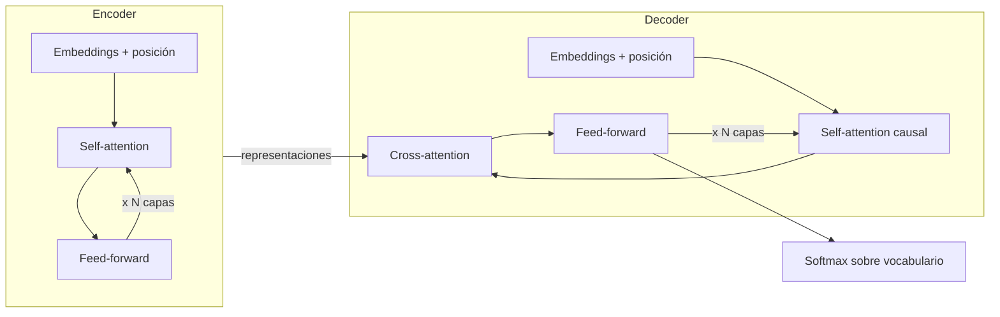

# Arquitectura Transformer: encoder, decoder y atención multi-cabeza

> **Módulo 1 · Tema 1** · Tiempo estimado de estudio: 3 h
> Lab asociado: ninguno directo (este tema es la base conceptual de todo el módulo).
> Ejercicios asociados: 1 y 9.

---

## 1. Por qué existe el Transformer

Antes de 2017, los modelos de lenguaje dominantes eran redes recurrentes (RNN, LSTM, GRU).
Una RNN procesa el texto **token a token, en orden**: para entender la palabra 20 de una
frase, primero tiene que haber "digerido" las 19 anteriores y comprimido todo lo relevante
en un vector de estado de tamaño fijo. Esto tiene dos problemas graves:

1. **No se puede paralelizar.** El paso 20 depende del paso 19, que depende del 18...
   El entrenamiento es secuencial y lento, y las GPU (que son máquinas de hacer
   multiplicaciones de matrices en paralelo) se desaprovechan.
2. **La memoria se degrada con la distancia.** Si la palabra clave para entender el final
   de un párrafo está al principio, su información tiene que sobrevivir a decenas de pasos
   de compresión. En la práctica, las dependencias largas se pierden.

El paper *Attention Is All You Need* (Vaswani et al., 2017) propuso una idea radical:
eliminar la recurrencia por completo y construir el modelo **solo con atención**. Cada
token puede "mirar" directamente a cualquier otro token de la secuencia, sin importar la
distancia, y todos los tokens se procesan **a la vez**. De ahí el título del paper.

**Analogía.** Una RNN es como leer un libro con una memoria que solo te deja recordar un
resumen de una frase de todo lo anterior. Un Transformer es como leer con el libro abierto
delante de ti: en cada momento puedes releer cualquier página anterior. No dependes de tu
resumen; consultas la fuente.

---

## 2. Vista de pájaro de la arquitectura

El Transformer original era un modelo **encoder-decoder** pensado para traducción
automática:



- El **encoder** lee la frase de entrada completa (p. ej. en inglés) y produce una
  representación contextual de cada token. Cada token ve a todos los demás,
  hacia delante y hacia atrás. Es **bidireccional**.
- El **decoder** genera la salida (p. ej. en español) token a token. Tiene dos tipos de
  atención: *self-attention causal* (solo mira los tokens ya generados, nunca el futuro)
  y *cross-attention* (mira las representaciones del encoder).

De este diseño original salieron tres familias:

| Familia | Qué usa | Ejemplos | Para qué sirve |
|---|---|---|---|
| **Encoder-only** | Solo el encoder | BERT, RoBERTa | Clasificación, embeddings, búsqueda semántica |
| **Decoder-only** | Solo el decoder (sin cross-attention) | GPT, Claude, Llama, Mistral | Generación de texto: los LLM actuales |
| **Encoder-decoder** | Ambos | T5, BART, Whisper | Traducción, resumen, transcripción |

**Dato clave para este curso:** prácticamente todos los LLM con los que vas a trabajar
(GPT-5.6, Claude 5, Llama 4, Mistral y Gemini 3.x) son **decoder-only**. Predicen el siguiente token
dada la secuencia anterior, y nada más. Todo lo que hacen —responder preguntas, escribir
código, razonar— emerge de esa única tarea entrenada a escala masiva.

---

## 3. Del texto a los vectores: embeddings y posición

Un modelo no opera sobre palabras, opera sobre números. El camino es:

1. **Tokenización**: el texto se trocea en tokens (lo vemos a fondo en el tema 2).
   Cada token es un entero, un índice en un vocabulario de ~50.000-200.000 entradas.
2. **Embedding**: cada índice se convierte en un vector denso de dimensión `d_model`
   (p. ej. 4096 en Llama 3 8B, 12.288 en GPT-3 175B). Es una tabla de consulta aprendida:
   la fila 7423 de la matriz de embeddings es "el vector del token 7423".
3. **Información posicional**: la atención, por sí sola, no sabe en qué orden llegan los
   tokens (es una operación sobre conjuntos). Hay que inyectar la posición. El paper
   original sumaba ondas sinusoidales al embedding; los modelos modernos usan sobre todo
   **RoPE** (Rotary Position Embeddings), que rota los vectores Q y K en función de la
   posición, y funciona mejor al extrapolar a contextos largos.

Después de este paso, una frase de `n` tokens es una matriz `X` de tamaño `n × d_model`.
Todo lo que viene ahora son transformaciones de esa matriz.

---

## 4. Self-attention: el corazón del asunto

### 4.1 La intuición

En la frase *"el banco estaba cerrado porque era festivo"*, para representar bien "banco"
necesitas mirar a "cerrado" y "festivo" (es una oficina, no un asiento ni una orilla).
La atención es un mecanismo que permite a cada token construir su representación como una
**mezcla ponderada** de todos los tokens de la secuencia, donde los pesos los decide el
propio modelo según la relevancia.

La metáfora estándar es una **base de datos difusa**:

- Cada token emite una **query** (Q): "¿qué estoy buscando?"
- Cada token expone una **key** (K): "¿qué ofrezco?"
- Cada token expone un **value** (V): "¿qué contenido entrego si me eliges?"

Un token compara su query con las keys de todos (producto escalar: a mayor alineación,
mayor puntuación), convierte esas puntuaciones en pesos que suman 1 (softmax) y se lleva
la media ponderada de los values.

### 4.2 La fórmula

```
Attention(Q, K, V) = softmax( Q · Kᵀ / √d_k ) · V
```

Q, K y V no caen del cielo: se obtienen multiplicando la entrada X por tres matrices
aprendidas durante el entrenamiento:

```
Q = X · W_Q        K = X · W_K        V = X · W_V
```

El escalado por `√d_k` (la dimensión de las keys) evita que los productos escalares
crezcan tanto que el softmax se sature (pondría casi todo el peso en un solo token y los
gradientes se desvanecerían).

### 4.3 Ejemplo numérico a mano

Vamos a calcular una atención completa con 2 tokens y `d_k = 2`. Supón que tras
multiplicar por W_Q, W_K y W_V tenemos:

```
Q = | 1  0 |      K = | 1  0 |      V = | 1  2 |
    | 0  1 |          | 1  1 |          | 3  4 |
```

**Paso 1 — Puntuaciones: Q · Kᵀ**

```
Q · Kᵀ = | 1·1+0·0   1·1+0·1 |   =   | 1  1 |
         | 0·1+1·0   0·1+1·1 |       | 0  1 |
```

**Paso 2 — Escalar por √d_k = √2 ≈ 1.414**

```
| 0.707  0.707 |
| 0.000  0.707 |
```

**Paso 3 — Softmax por filas** (cada fila es "cómo reparte su atención un token")

- Fila 1: e^0.707 = 2.028 para ambos → pesos `[0.5, 0.5]` (atiende a los dos por igual).
- Fila 2: e^0 = 1.000 y e^0.707 = 2.028 → suma 3.028 → pesos `[0.330, 0.670]`
  (el token 2 atiende más al token 2 que al 1).

**Paso 4 — Mezcla ponderada de values: pesos · V**

- Salida token 1: `0.5·[1,2] + 0.5·[3,4] = [2.0, 3.0]`
- Salida token 2: `0.330·[1,2] + 0.670·[3,4] = [2.34, 3.34]`

Resultado final:

```
| 2.00  3.00 |
| 2.34  3.34 |
```

Eso es *todo* el mecanismo. Cada fila de salida es una nueva representación del token,
construida mirando a toda la secuencia. En un LLM real esto ocurre con `d_k = 128`,
secuencias de miles de tokens y decenas de capas, pero la operación es exactamente esta.

**Ejercicio 1** te pide repetir este cálculo con otras matrices. Hazlo a mano una vez en
la vida: después ya nunca verás la atención como magia.

### 4.4 Máscara causal: no mirar el futuro

En un decoder, el token en la posición `i` solo puede atender a las posiciones `≤ i`.
Se implementa poniendo `-∞` en las puntuaciones prohibidas antes del softmax (con lo que
su peso queda en 0):

```
Puntuaciones enmascaradas (secuencia de 4 tokens):

| s11  -∞   -∞   -∞  |
| s21  s22  -∞   -∞  |
| s31  s32  s33  -∞  |
| s41  s42  s43  s44 |
```

Esto es lo que permite entrenar en paralelo (todas las posiciones predicen su "siguiente
token" a la vez) sin que ninguna haga trampa mirando la respuesta.

---

## 5. Multi-head attention: varios focos a la vez

Una sola atención tiene que elegir *un* criterio de relevancia. Pero "banco" necesita
mirar a la vez a la sintaxis (¿de qué verbo soy sujeto?), a la semántica (¿qué palabras
me desambiguan?) y a la correferencia (¿a qué se refiere "estaba"?).

La solución: en vez de una atención con vectores de dimensión `d_model`, se ejecutan
**h atenciones en paralelo** ("cabezas"), cada una con sus propias W_Q, W_K, W_V y con
dimensión reducida `d_k = d_model / h`. Cada cabeza aprende a fijarse en un tipo de
relación distinto. Sus salidas se concatenan y se proyectan de vuelta a `d_model`:

```
MultiHead(X) = Concat(cabeza_1, ..., cabeza_h) · W_O
```

En el paper original: `d_model = 512`, `h = 8`, `d_k = 64`. En Llama 3 70B:
`d_model = 8192`, `h = 64` cabezas de query. El coste total es similar al de una sola
cabeza grande, pero la expresividad es mucho mayor.

**Analogía.** Es como analizar un partido de fútbol con 8 cámaras: una sigue el balón,
otra los fueras de juego, otra al portero. Cada cámara (cabeza) es de menor resolución
que una única cámara gigante, pero el conjunto captura mucho más.

Variantes modernas que verás en fichas técnicas: **MQA** (multi-query: todas las cabezas
comparten K y V) y **GQA** (grouped-query: grupos de cabezas comparten K y V; lo usan
Llama 3 y Mistral). Reducen drásticamente la memoria de la KV cache en inferencia con una
pérdida de calidad mínima.

---

## 6. El resto del bloque: FFN, residuales y normalización

Cada capa de un Transformer no es solo atención. El bloque completo es:

```
        ┌────────────────────────────────────┐
  X ──►│ LayerNorm ─► Multi-Head Attention  ├──(+)──┐   suma residual
        └────────────────────────────────────┘   │
   ┌─────────────────────────────────────────────┘
   │    ┌────────────────────────────────────┐
   └──►│ LayerNorm ─► Feed-Forward (MLP)    ├──(+)──►  salida de la capa
        └────────────────────────────────────┘
```

- **Feed-forward (FFN/MLP)**: dos capas lineales con una no linealidad en medio
  (GELU o SwiGLU), aplicadas a cada token por separado. La capa interna suele ser
  ~4× `d_model`. Si la atención es "comunicación entre tokens", el FFN es "computación
  dentro de cada token". Aquí vive la mayor parte de los parámetros del modelo, y la
  evidencia apunta a que gran parte del conocimiento factual se almacena en estas capas.
- **Conexiones residuales**: la entrada se suma a la salida de cada subloque
  (`x + f(x)`). Permiten entrenar redes de 100+ capas: el gradiente siempre tiene una
  "autopista" directa hacia atrás.
- **Normalización**: estabiliza las magnitudes. Los modelos modernos usan *pre-norm*
  (normalizar antes del subloque, como en el diagrama) y a menudo RMSNorm en vez de
  LayerNorm, por eficiencia.

Un LLM es este bloque repetido N veces (32 capas en Llama 3 8B, 126 en Llama 3.1 405B),
con una capa final que proyecta al vocabulario y produce un **logit por cada token
posible**. El softmax de esos logits es la distribución del siguiente token — y sobre esa
distribución actúan `temperature` y `top_p`, que veremos en el tema 3.

---

## 7. Inferencia: cómo se genera texto de verdad

Generar es un bucle:

1. Procesa el prompt completo y obtén la distribución del siguiente token (*prefill*).
2. Muestrea un token de esa distribución.
3. Añádelo a la secuencia y vuelve a predecir (*decode*), un token por iteración.

Recalcular la atención de toda la secuencia en cada paso sería un despilfarro: las K y V
de los tokens anteriores no cambian. Por eso se guardan en la **KV cache**. Consecuencias
prácticas que notarás al usar APIs:

- El *prefill* es paralelo y rápido; el *decode* es secuencial → el "tiempo hasta el
  primer token" y la velocidad de generación son métricas distintas.
- La KV cache crece linealmente con el contexto → contextos largos consumen mucha memoria
  y por eso el input largo se cobra y se optimiza (prompt caching de Anthropic/OpenAI).
- La atención completa es O(n²) con la longitud de secuencia → duplicar el contexto
  cuadruplica el coste de atención en prefill.

---

## 8. Errores comunes

1. **"El modelo entiende palabras."** No: opera sobre tokens y vectores. Muchos fallos
   aparentemente misteriosos (contar letras, aritmética con números largos) son problemas
   de tokenización, no de "inteligencia" (tema 2).
2. **"La atención es cara porque el modelo es grande."** Son costes distintos: el número
   de parámetros fija el coste por token; la atención O(n²) fija el coste extra del
   contexto largo. Un prompt de 100K tokens es caro incluso en un modelo pequeño.
3. **Confundir encoder-only con decoder-only.** BERT no genera texto; GPT no da
   embeddings bidireccionales de serie. Si necesitas embeddings para búsqueda, usa un
   modelo de embeddings, no un LLM generativo.
4. **"Multi-cabeza = más parámetros."** No necesariamente: se reparte la dimensión entre
   cabezas. Es diversidad de perspectivas, no fuerza bruta.
5. **Olvidar la máscara causal al razonar sobre el modelo.** El token 50 *no sabe nada*
   del token 51. Por eso el orden del prompt importa: instrucciones al principio,
   pregunta al final, y el modelo "relee" todo al generar cada token nuevo.

---

## 9. Para profundizar

- **Vaswani et al. (2017), *Attention Is All You Need*** — el paper original:
  https://arxiv.org/abs/1706.03762
- **Jay Alammar, *The Illustrated Transformer*** — la mejor explicación visual:
  https://jalammar.github.io/illustrated-transformer/
- **Andrej Karpathy, *Let's build GPT from scratch*** — implementación completa en vídeo:
  https://www.youtube.com/watch?v=kCc8FmEb1nY
- **Harvard NLP, *The Annotated Transformer*** — el paper anotado línea a línea en PyTorch:
  https://nlp.seas.harvard.edu/annotated-transformer/
- **Su et al. (2021), *RoFormer* (RoPE)** — embeddings posicionales rotatorios:
  https://arxiv.org/abs/2104.09864
- **Ainslie et al. (2023), *GQA*** — grouped-query attention:
  https://arxiv.org/abs/2305.13245
