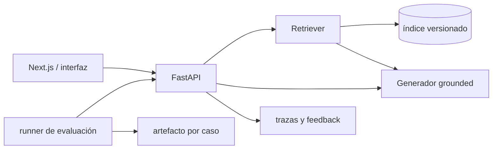

# Proyecto del módulo — NebulaOps Knowledge Assistant

Construye un asistente RAG evaluado sobre la documentación ficticia de NebulaOps. El repositorio
incluye una API baseline completa y sin red: no es el resultado final, sino el control contra el
que debes justificar embeddings, reranking y generación.

## Resultado esperado

El usuario hace una pregunta, recibe una respuesta breve con citas y puede abrir exactamente los
fragmentos usados. Si la evidencia no basta, el sistema se abstiene. Un panel de evaluación compara
configuraciones con el dataset congelado sin mezclar casos de desarrollo y test.



## Baseline incluido

Desde la raíz:

```bash
uv sync --extra rag --extra dev
uv run uvicorn app.main:app --app-dir modulo-03-rag/proyecto/backend --reload
```

En otra terminal:

```bash
curl -s http://127.0.0.1:8000/health
curl -s -X POST http://127.0.0.1:8000/query \
  -H 'content-type: application/json' \
  -d '{"question":"¿Cuánto dura un enlace de recuperación?","top_k":4}'
```

El baseline carga `labs/data/*.md`, divide por secciones, usa TF-IDF, selecciona frases y devuelve
IDs de evidencia. No llama a ningún LLM. Sus limitaciones son deliberadas y medibles.

## Iteraciones obligatorias

1. **Ingesta:** manifest con hashes, parser y chunker versionados; alta, cambio y baja.
2. **Retrieval:** embeddings más lexical con RRF; evaluación por documento y por chunk.
3. **Reranking:** candidatos amplios y contexto final pequeño; latencia y batch medidos.
4. **Generación:** prompt grounded, citas por afirmación y abstención explícita.
5. **Interfaz:** pregunta, respuesta, fuentes desplegables, latencia y feedback; no ocultes errores.
6. **Evaluación:** runner offline en CI y evaluación RAGAS autorizada con límite de coste.
7. **Operación:** health/readiness, logs sin contenido sensible, timeout y presupuesto.

## Contrato de API

`POST /query` acepta:

```json
{"question": "texto no vacío", "top_k": 4}
```

Devuelve `answer`, `abstained`, `evidence[]` y `latency_ms`. Cada evidencia contiene `chunk_id`,
`document_id`, título, extracto y score. No cambies el contrato al sustituir el baseline: así los
tests y el comparador siguen siendo válidos.

## Criterios de aceptación

Sobre los 30 casos incluidos, manteniendo los cinco no respondibles:

- doc recall@4 ≥ 0,90 y MRR@4 ≥ 0,85;
- context recall y faithfulness medias ≥ 0,75 en la corrida RAGAS final;
- abstención correcta en ≥ 80 % de preguntas no respondibles;
- ninguna afirmación sin cita en la auditoría manual de 20 respuestas;
- latencia p95 local y coste estimado por 1.000 consultas documentados;
- `pytest` offline y reproducible, sin depender de claves;
- threat model para prompt injection, exfiltración, poisoning y control de acceso.

Un score medio no compensa un fallo crítico. Presenta métricas por tag y cinco failure cases con su
causa raíz.

## Estructura

```text
proyecto/
├── README.md
└── backend/
    ├── app/
    │   ├── __init__.py
    │   ├── main.py
    │   ├── rag.py
    │   └── schemas.py
    └── tests/
        └── test_api.py
```

La interfaz y el índice persistente forman parte de la entrega del alumno. Mantén la API baseline
como comparación y añade las implementaciones mediante configuración, no editando resultados.

## Evidencia de entrega

Incluye comando exacto, commit, manifest del corpus, modelos/versiones, configuración, hardware,
dataset hash, resultados JSON y fecha. La demo debe mostrar una respuesta correcta, una abstención,
una inyección contenida y un fallo conocido; ocultar el fallo hace la defensa menos creíble.
