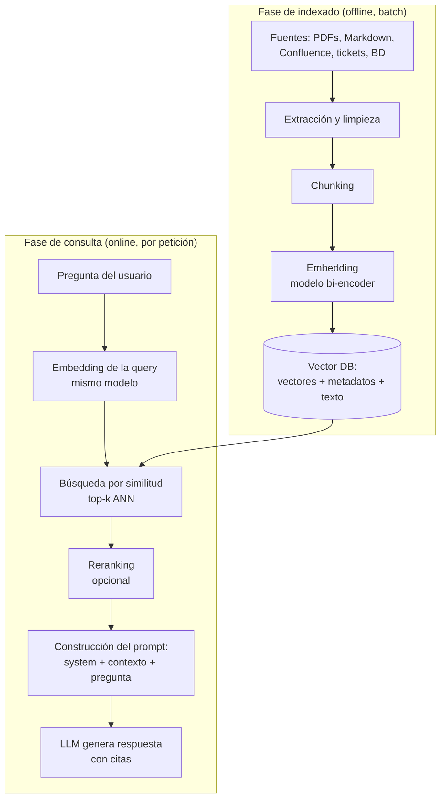

# 01 — Arquitectura RAG: ingestion, embedding, indexado y retrieval

## Por qué existe RAG

Un LLM tiene dos límites estructurales que ningún prompt arregla:

1. **Conocimiento congelado**: el modelo solo sabe lo que había en su corpus de
   entrenamiento hasta el cutoff. No conoce tu documentación interna, tus tickets, ni
   la noticia de ayer.
2. **Contexto finito y caro**: aunque los contextos de 128k-1M tokens permitan "meter
   todo", pagar cientos de miles de tokens por petición no escala, la latencia crece
   linealmente con el prompt y la calidad de atención sobre contextos enormes se degrada
   (el efecto *lost in the middle*: los modelos recuperan peor la información situada
   en el centro de un contexto largo que en los extremos).

RAG (Retrieval-Augmented Generation, Lewis et al., 2020) ataca ambos: en vez de esperar
que el modelo *sepa* la respuesta, se le **entrega en el prompt** la evidencia relevante,
recuperada en el momento de la pregunta desde un índice actualizable.

Las alternativas y cuándo tienen sentido:

| Enfoque | Cuándo usarlo | Cuándo no |
|---|---|---|
| **RAG** | Conocimiento que cambia, corpus grande, necesidad de citar fuentes | Tareas de razonamiento puro sin conocimiento externo |
| **Fine-tuning** | Cambiar *comportamiento* o *formato* (tono, estilo, DSL propio) | Inyectar *hechos* — es caro, se desactualiza y alucina igual |
| **Long context (todo en el prompt)** | Corpus pequeño (< decenas de páginas), prototipo rápido | Corpus grande, coste/latencia sensibles, multiusuario |
| **Nada (modelo solo)** | Conocimiento general estable | Cualquier dato privado o posterior al cutoff |

En la práctica se combinan: fine-tuning para el formato + RAG para los hechos es un
patrón común. La regla mnemotécnica: **fine-tuning enseña *cómo*, RAG aporta el *qué***.

## Las dos fases: indexado (offline) y consulta (online)



Separar mentalmente ambas fases evita errores de diseño frecuentes:

- El **indexado** se ejecuta cuando cambian los documentos (batch nocturno, webhook,
  cola de eventos). Su métrica es *frescura* y *coste de reindexado*.
- La **consulta** se ejecuta por cada petición de usuario. Sus métricas son *latencia*,
  *coste por query* y *calidad de retrieval/respuesta*.

Una decisión en una fase condiciona la otra: si cambias el modelo de embeddings o la
estrategia de chunking, **hay que reindexar todo el corpus**. Por eso conviene versionar
el índice (p. ej. colecciones `docs_v3_minilm_512tok`) y hacer blue/green entre versiones.

## Anatomía de la fase de ingesta

### 1. Extracción

El paso más subestimado. La calidad del RAG tiene un techo: la calidad del texto extraído.

- **PDFs**: `pypdf` para PDFs digitales sencillos; para tablas, columnas múltiples o
  escaneados hacen falta herramientas de layout (Unstructured, Azure Document
  Intelligence, Textract) u OCR. Una tabla aplastada a texto plano produce chunks
  incoherentes que envenenan el retrieval.
- **HTML**: eliminar navegación, footers y boilerplate (trafilatura, readability) o el
  índice se llena de "Cookies · Aviso legal · Contacto".
- **Markdown / wikis**: el caso fácil — la estructura de headers es oro para chunking
  jerárquico, no la tires.

### 2. Limpieza y normalización

Deduplicación (docs repetidos sesgan el retrieval hacia lo duplicado), normalización de
espacios/unicode, y **enriquecimiento con metadatos**: fuente, título, sección, fecha,
permisos, idioma. Los metadatos no son decorativos: habilitan filtrado (`WHERE team =
'infra'`), control de acceso y citas en la respuesta.

### 3. Chunking

Se trata en profundidad en el [capítulo 03](03-chunking.md). Aquí basta la idea clave:
el chunk es **la unidad de retrieval**. Chunks demasiado grandes diluyen el embedding
(mezclan temas → el vector no representa bien ninguno); demasiado pequeños pierden el
contexto necesario para que el LLM responda.

### 4. Embedding e indexado

Cada chunk pasa por un modelo de embeddings (bi-encoder) que lo convierte en un vector
denso (384-3072 dimensiones según el modelo). El vector se guarda en la vector DB junto
con el **texto original** y los metadatos. Detalle práctico que se olvida: guarda el
texto en la propia DB (o un puntero fiable) — en la fase online necesitas el texto, no
solo el vector.

## Anatomía de la fase de consulta

1. **Embedding de la query** con el *mismo modelo* usado en indexado. Mezclar modelos
   (o versiones distintas del mismo) produce espacios vectoriales incompatibles: el
   sistema no falla con error, simplemente recupera basura. Es uno de los bugs
   silenciosos más comunes.
2. **Búsqueda top-k**: la DB devuelve los k chunks más similares (ANN, capítulo 02).
   k típico: 3-10 sin reranker; 20-50 si luego reranqueas.
3. **(Opcional) Reranking**: un cross-encoder reordena los candidatos con mucha más
   precisión (capítulo 04).
4. **Construcción del prompt**. Un esqueleto razonable:

```text
system: Eres un asistente de NebulaOps. Responde SOLO con la información del contexto.
Si el contexto no contiene la respuesta, di "No encuentro esa información en la
documentación". Cita la fuente de cada afirmación como [doc: <source>].

user:
<contexto>
[doc: runbook-incidentes.md] Para escalar un incidente P1...
[doc: politica-vacaciones.md] Los empleados disponen de...
</contexto>

Pregunta: ¿Cómo escalo un incidente P1?
```

5. **Generación** y, opcionalmente, verificación posterior (capítulo 08).

## Decisiones de diseño y sus trade-offs

| Decisión | Opciones | Trade-off real |
|---|---|---|
| top-k | 3 · 5 · 10 · 30+rerank | Más k = más recall pero más ruido, coste y riesgo de distraer al LLM |
| Tamaño de chunk | 128-1024 tokens | Precisión del embedding vs contexto suficiente para responder |
| Embeddings | local (MiniLM) vs API (OpenAI, Cohere) | Coste cero y privacidad vs calidad multilingüe y cero ops |
| Búsqueda | densa vs híbrida (dense+BM25) | La híbrida rescata términos exactos (códigos, nombres propios, SKUs) que la densa pierde |
| Frescura | reindex batch vs incremental | Simplicidad vs latencia de actualización |
| Prompt | contexto crudo vs con citas obligadas | Las citas reducen alucinación y permiten auditar, a cambio de algo de rigidez |

### Búsqueda híbrida: no la ignores

La búsqueda densa (embeddings) captura semántica ("¿cómo pido días libres?" ≈ "política
de vacaciones") pero es sorprendentemente mala con **identificadores exactos**: códigos
de error, nombres de producto, versiones ("error NB-4012"). BM25/keyword lo clava. La
mayoría de sistemas de producción combinan ambas señales (p. ej. con Reciprocal Rank
Fusion) — Qdrant, Weaviate, OpenSearch y pgvector+tsvector lo soportan de serie.

## Errores comunes

1. **Evaluar con "vibes"**: probar 5 preguntas a mano y declarar victoria. Sin un
   dataset de evaluación (capítulo 07) no sabes si un cambio mejora o empeora.
2. **Optimizar la generación cuando falla el retrieval**. Si el chunk correcto no está
   en el top-k, ningún prompt lo arregla. Mide retrieval por separado (hit rate, MRR).
3. **Modelos de embedding distintos en indexado y consulta** (o reindexados a medias
   tras cambiar de modelo).
4. **Ignorar permisos**: indexar docs confidenciales y servirlos a cualquiera. El filtro
   de ACL va en la query a la vector DB (metadatos), nunca "se lo pedimos al LLM".
5. **Chunks sin fuente**: si no guardas metadatos, no puedes citar ni depurar.
6. **Contexto ilimitado**: meter 30 chunks "por si acaso" degrada la respuesta y
   multiplica el coste. Más contexto no es más calidad.
7. **No versionar el índice**: cambias el chunking, reindexas encima y ya no puedes
   comparar ni hacer rollback.

## Métricas mínimas de un RAG en producción

- **Retrieval**: hit rate@k (¿está el chunk correcto en el top-k?), MRR/nDCG.
- **Generación**: faithfulness y answer relevancy (RAGAS, capítulo 07).
- **Operación**: latencia p50/p95 por fase (retrieval vs generación), coste por query,
  tasa de "no encuentro la respuesta" (si sube de golpe, algo se rompió en ingesta).

## Para profundizar

- Lewis et al. (2020), *Retrieval-Augmented Generation for Knowledge-Intensive NLP
  Tasks* — el paper original de RAG: https://arxiv.org/abs/2005.11401
- Liu et al. (2023), *Lost in the Middle: How Language Models Use Long Contexts*:
  https://arxiv.org/abs/2307.03172
- Gao et al. (2023), *Retrieval-Augmented Generation for Large Language Models: A
  Survey* — panorámica de variantes (naive/advanced/modular RAG):
  https://arxiv.org/abs/2312.10997
- Documentación de Qdrant sobre búsqueda híbrida:
  https://qdrant.tech/documentation/concepts/hybrid-queries/
