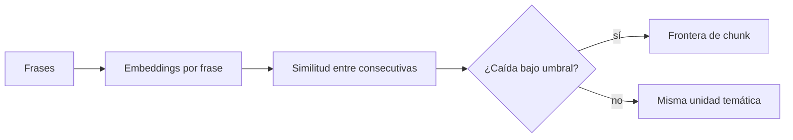
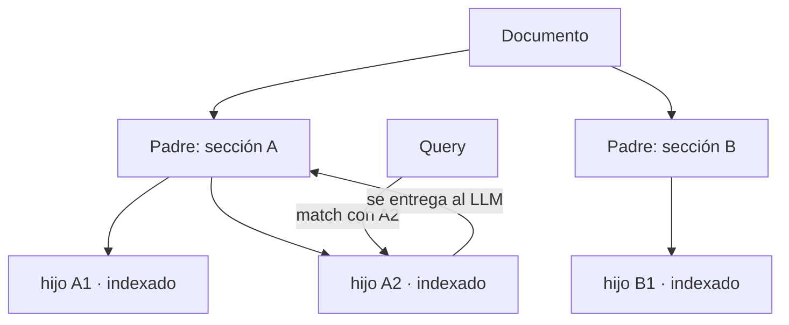

# 03 — Estrategias de chunking

## El problema que resuelve el chunking

El chunk es la unidad atómica de todo el sistema: es lo que se embebe, lo que se indexa,
lo que se recupera y lo que ve el LLM. Un mal chunking impone un techo de calidad que
ninguna otra pieza puede superar. La tensión fundamental:

- **Chunks pequeños** → el embedding es preciso (un solo tema por vector), el retrieval
  afina… pero el LLM recibe fragmentos sin contexto ("...como se indica arriba, el
  límite es de 3." — ¿3 qué?).
- **Chunks grandes** → el LLM tiene contexto de sobra… pero el embedding es una media
  difusa de varios temas y el retrieval empeora; además quemas ventana de contexto y
  puedes exceder la ventana del modelo de embeddings.

No hay un tamaño universal. Puntos de partida razonables que luego se **miden** (lab 03):
256-512 tokens con 10-15 % de solape para documentación técnica; menos para FAQ (cada
entrada ya es una unidad); más para prosa narrativa.

## Estrategia 1 — Fixed-size (con solape)

Cortar cada N tokens/caracteres, con un solape de M entre chunks consecutivos para no
partir ideas justo en la frontera.

```text
[--- chunk 1: 512 tok ---]
                  [--- chunk 2: 512 tok ---]      ← solape de 64 tok
                                    [--- chunk 3 ---]
```

- **Pros**: trivial, determinista, rápido, sin dependencias. Baseline obligatorio.
- **Contras**: ciego a la estructura — parte frases, tablas y secciones por la mitad.
- **Mejora barata**: la variante **recursiva** (el `RecursiveCharacterTextSplitter` de
  LangChain la popularizó): intenta cortar por separadores en orden de preferencia
  (`\n\n` → `\n` → `. ` → ` `) hasta caber en el presupuesto. Respeta párrafos casi
  gratis y debería ser tu "fixed" por defecto.

Cortar por **tokens** y no por caracteres: los presupuestos de los modelos (embeddings
y LLM) se miden en tokens, y en español la ratio caracteres/token difiere del inglés.

## Estrategia 2 — Estructural / por documento

Antes que nada: usa la estructura que el documento ya trae. Markdown y HTML tienen
headers; los PDFs decentes tienen secciones. Cortar por secciones (y subdividir las que
excedan el presupuesto con el splitter recursivo) produce chunks alineados con cómo el
autor organizó las ideas. Adjunta la ruta de headers como metadato y **prepéndela al
texto del chunk** antes de embeber:

```text
[Handbook > Política de vacaciones > Solicitud]
Las solicitudes se envían mediante...
```

Ese prefijo de contexto mejora tanto el embedding como la respuesta del LLM, con coste
casi nulo. Es probablemente la mejora de chunking con mejor ratio esfuerzo/beneficio.

## Estrategia 3 — Semantic chunking

Idea: que las fronteras las decida el contenido, no un contador. Algoritmo típico:

1. Divide el texto en frases.
2. Embebe cada frase (o ventanas deslizantes de 2-3 frases).
3. Calcula la similitud coseno entre frases consecutivas.
4. Donde la similitud cae por debajo de un umbral (o de un percentil de las caídas),
   hay un cambio de tema → frontera de chunk.



- **Pros**: chunks temáticamente coherentes; brilla en texto sin estructura explícita
  (transcripciones, emails largos, prosa).
- **Contras**: cuesta un embedding por frase en ingesta; sensible al umbral (hay que
  calibrarlo por corpus); chunks de tamaño variable (algunos pueden salir enormes y
  necesitan un corte de seguridad); resultados no deterministas si cambias de modelo.
- **Veredicto de producción**: pruébalo contra el baseline recursivo **midiendo**. En
  corpus bien estructurados (documentación con headers) a menudo no supera al chunking
  estructural, que es más barato y predecible.

## Estrategia 4 — Hierarchical (parent-child / small-to-big)

Rompe la tensión precisión-contexto usando **dos granularidades**:

- **Chunks hijo** (pequeños, 128-256 tok): se embeben y se indexan → retrieval preciso.
- **Chunks padre** (grandes, 512-2048 tok, o la sección entera): NO se indexan; se
  almacenan aparte. Cuando un hijo hace match, al LLM se le entrega **su padre**.



- **Pros**: lo mejor de ambos mundos; patrón muy usado en producción (es la base del
  "parent document retriever" de LangChain y de los índices jerárquicos de LlamaIndex).
- **Contras**: dos almacenes que mantener sincronizados; deduplicar padres cuando varios
  hijos del mismo padre hacen match; más complejidad de ingesta.
- Variante ligera: **sentence-window retrieval** — indexas frases y devuelves la frase
  ± una ventana de vecinas.

## Estrategia 5 — Late chunking

Propuesta de Jina AI (2024) que invierte el orden: en vez de *chunkear y luego embeber*,
**embebe el documento completo con un modelo de contexto largo y chunkea después**, a
nivel de los token embeddings:

1. Pasa el documento entero (hasta 8k tokens) por el transformer → un embedding
   contextualizado por token, donde cada token "ha visto" todo el documento.
2. Define fronteras de chunk sobre la secuencia.
3. El vector de cada chunk = pooling (media) de sus token embeddings.

El resultado: el chunk "El límite es de 3 días" produce un vector que *sabe* que habla
de la política de vacaciones, porque sus tokens se contextualizaron con el documento
entero. Ataca el mismo problema de contexto perdido que el prefijo de headers o que el
"contextual retrieval" de Anthropic (que antepone a cada chunk un resumen contextual
generado por un LLM), pero sin coste de generación.

- **Pros**: chunks pequeños sin pérdida de contexto; sin llamadas extra a LLM.
- **Contras**: requiere un modelo de embeddings de contexto largo con acceso a los
  token embeddings (p. ej. `jina-embeddings-v3`); no aplicable con APIs que solo
  devuelven el vector final (OpenAI); documentos > ventana siguen necesitando macro-chunking.

## Comparativa

| Estrategia | Coste ingesta | Complejidad | Cuándo brilla |
|---|---|---|---|
| Fixed / recursivo | Mínimo | Mínima | Baseline; corpus heterogéneo; siempre como control |
| Estructural + prefijo headers | Mínimo | Baja | Markdown/HTML/wikis — casi siempre que hay estructura |
| Semantic | Medio (embeddings por frase) | Media | Texto largo sin estructura |
| Hierarchical | Medio | Alta (dos almacenes) | Preguntas que exigen contexto amplio con retrieval fino |
| Late chunking | Medio (modelo long-context) | Media | Chunks pequeños con referencias al resto del doc |

## Cómo evaluar chunking (adelanto del lab 03)

El chunking se evalúa por su efecto en **retrieval**, no por estética:

1. Dataset de preguntas con el documento/pasaje fuente anotado (ground truth).
2. Indexa el corpus con cada estrategia (misma DB, mismo modelo de embeddings).
3. Mide **hit rate@k** (¿algún chunk recuperado proviene del doc correcto?) y **MRR**
   (¿en qué posición aparece el primero correcto?).
4. Después, mira el efecto extremo a extremo con RAGAS (capítulo 07): un chunking puede
   ganar en hit rate y perder en faithfulness si entrega fragmentos truncados.

## Errores comunes

1. **Elegir estrategia por moda y no medir.** El baseline recursivo bien afinado gana a
   implementaciones descuidadas de técnicas sofisticadas con frecuencia embarazosa.
2. **Partir tablas y bloques de código por la mitad**: protégelos como unidades
   indivisibles en el splitter.
3. **Solape excesivo** (>25 %): infla el índice, duplica contenido en el top-k y roba
   diversidad al contexto (mitigable con deduplicación en retrieval, pero mejor no crearlo).
4. **Perder los metadatos al chunkear**: cada chunk debe heredar fuente, sección y fecha
   del documento padre.
5. **Un solo tamaño para tipos de documento distintos**: la FAQ y el runbook no piden lo
   mismo. El pipeline debe permitir estrategia por tipo de fuente.
6. **Olvidar la ventana del modelo de embeddings** al fijar el tamaño máximo del chunk.

## Para profundizar

- Günther et al. / Jina AI (2024), *Late Chunking: Contextual Chunk Embeddings Using
  Long-Context Embedding Models*: https://arxiv.org/abs/2409.04701
- Anthropic (2024), *Introducing Contextual Retrieval*:
  https://www.anthropic.com/news/contextual-retrieval
- Documentación de LlamaIndex sobre node parsers (jerárquico, sentence-window,
  semantic): https://docs.llamaindex.ai/en/stable/module_guides/loading/node_parsers/
- Greg Kamradt, *The 5 Levels of Text Splitting* (notebook de referencia muy citado):
  https://github.com/FullStackRetrieval-com/RetrievalTutorials
