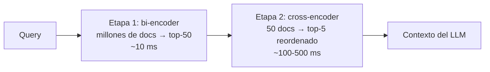

# 04 — Reranking: cross-encoders, Cohere Rerank y ColBERT

## El problema: el bi-encoder es rápido porque es tonto

El retrieval con embeddings (bi-encoder) comprime cada texto en **un solo vector** de
forma independiente: el documento se embebe sin saber qué se le va a preguntar. Esa
compresión pierde matices — negaciones, relaciones entre entidades, condiciones ("solo
si", "excepto cuando") — y por eso el top-k denso suele contener la respuesta correcta…
pero no siempre en primera posición, y rodeada de falsos positivos temáticamente
parecidos.

El **reranking** añade una segunda etapa: un modelo más caro y preciso reordena los
candidatos que el retrieval barato preseleccionó.



Es el clásico patrón *retrieve & rerank* de los buscadores: una etapa optimizada para
**recall** (que la respuesta esté en los 50) y otra para **precisión** (que quede la
primera).

## Cross-encoders

Un cross-encoder recibe **query y documento concatenados** en la misma pasada del
transformer. La atención cruza tokens de la query con tokens del documento, capturando
interacciones que un vector resumen no puede. La salida es un score de relevancia.

| | Bi-encoder | Cross-encoder |
|---|---|---|
| Entrada | query y doc por separado | (query, doc) juntos |
| Salida | vector por texto | score por par |
| Precomputable | Sí (todo el corpus offline) | No — depende de la query |
| Coste por query | 1 embedding + búsqueda ANN | 1 inferencia **por candidato** |
| Escala | Millones de docs | Decenas de candidatos |
| Precisión de ranking | Media | Alta |

Por eso no se puede "buscar con un cross-encoder" directamente: puntuar 1M de documentos
por query es inviable. Su sitio es la segunda etapa, sobre 20-100 candidatos.

Modelos abiertos usables con `sentence-transformers` (clase `CrossEncoder`):
`cross-encoder/ms-marco-MiniLM-L-6-v2` (rápido, inglés, el del lab 04),
`BAAI/bge-reranker-v2-m3` (multilingüe, más pesado), `mixedbread-ai/mxbai-rerank-*`.

```python
from sentence_transformers import CrossEncoder

reranker = CrossEncoder("cross-encoder/ms-marco-MiniLM-L-6-v2")
scores = reranker.predict([(query, doc) for doc in candidatos])
# ordenar candidatos por score desc y quedarse con los 3-5 primeros
```

## Cohere Rerank (reranking como API)

Si no quieres servir un modelo, Cohere ofrece reranking como servicio: envías query +
lista de documentos y devuelve índices con scores. `rerank-v3.5` es multilingüe (español
incluido) y maneja documentos largos.

```python
import cohere
co = cohere.ClientV2()
res = co.rerank(model="rerank-v3.5", query=query, documents=docs, top_n=5)
```

- **Pros**: cero ops, calidad alta, multilingüe, se integra en cualquier stack.
- **Contras**: coste por búsqueda, latencia de red, los documentos viajan al proveedor
  (revisa compliance), dependencia de un vendor.

Equivalentes: los rerankers de Voyage AI y Jina AI, y en AWS el servicio Amazon Bedrock
Rerank (capítulo 06).

## ColBERT: interacción tardía (late interaction)

ColBERT (Khattab & Zaharia, 2020) es el término medio entre bi- y cross-encoder. En vez
de un vector por documento, almacena **un vector por token**. La relevancia se calcula
con **MaxSim**: para cada token de la query, se toma la similitud máxima contra todos los
tokens del documento, y se suman.

```text
score(q, d) = Σ_{i ∈ tokens(q)} max_{j ∈ tokens(d)} (E_qi · E_dj)
```

- Los embeddings de documento se **precomputan** (como un bi-encoder) → escalable.
- La interacción query-documento ocurre a nivel de token (como un cross-encoder, aunque
  más superficial) → precisión notablemente superior al bi-encoder, especialmente
  fuera de dominio.
- Precio: **almacenamiento** — cientos de vectores por documento en lugar de uno
  (mitigado con compresión agresiva en ColBERTv2 y en índices PLAID).

En el ecosistema práctico: la librería RAGatouille facilita usar ColBERT como retriever
o reranker; Qdrant y Vespa soportan multivectores con MaxSim de forma nativa; los
modelos tipo `colbert-ir/colbertv2.0` y variantes multilingües están en Hugging Face.

## Comparativa de las tres familias

| | Bi-encoder | ColBERT (late interaction) | Cross-encoder |
|---|---|---|---|
| Granularidad | 1 vector/doc | 1 vector/token | atención completa q×d |
| Rol típico | Etapa 1 (retrieval) | Etapa 1 potente o etapa 2 | Etapa 2 (rerank) |
| Almacenamiento | Bajo | Alto (mitigable) | N/A (nada precomputado) |
| Latencia por query | Mínima | Baja-media | Alta (por candidato) |
| Calidad de ranking | Base | Alta | La más alta |

## Decisiones de diseño en la etapa de rerank

- **¿Cuántos candidatos recuperar (k1) y cuántos pasar al LLM (k2)?** Punto de partida:
  k1=25-50, k2=3-5. Si k1 es pequeño, el reranker no puede rescatar nada que el
  retrieval no trajo (el recall de la etapa 1 es el techo); si k2 es grande, devuelves
  el ruido que querías filtrar.
- **¿Umbral de score?** Además del top-n, corta por score mínimo: si ningún candidato
  supera el umbral, mejor responder "no lo encuentro" que forzar contexto irrelevante.
  Los scores de cross-encoders no están calibrados entre modelos: fija el umbral
  empíricamente con tu dataset de evaluación.
- **¿Cuándo compensa el reranker?** Mide primero el retrieval solo (hit rate@k, MRR).
  Si el chunk correcto ya sale casi siempre en el top-3, el reranker aporta poco y
  añade latencia. Si está "en el top-30 pero no en el top-5", el reranker es
  exactamente la herramienta.
- **Latencia**: el rerank añade decenas-cientos de ms. En chat interactivo suele ser
  aceptable (la generación domina); en autocompletado, no.

## Errores comunes

1. **Rerankear 5 candidatos**: con k1 tan bajo no hay margen de mejora; el reranker
   necesita un pool amplio donde elegir.
2. **Usar un cross-encoder inglés sobre corpus en español** y concluir que "el reranking
   no funciona". Verifica el idioma del modelo (bge-reranker-v2-m3 o Cohere para
   multilingüe).
3. **Comparar scores de reranker entre queries o entre modelos** como si fueran
   probabilidades calibradas. Solo ordenan dentro de una misma query.
4. **Truncamiento silencioso**: los cross-encoders tienen ventana limitada (típicamente
   512 tokens para query+doc); un chunk largo se trunca y el score se calcula sobre el
   fragmento visible.
5. **Medir solo la calidad final del LLM**: si añades reranker y la respuesta no mejora,
   no sabes si el problema era retrieval o generación. Mide el ranking (MRR/nDCG) antes
   y después del reranker por separado.

## Para profundizar

- Khattab & Zaharia (2020), *ColBERT: Efficient and Effective Passage Search via
  Contextualized Late Interaction over BERT*: https://arxiv.org/abs/2004.12832
- Santhanam et al. (2021), *ColBERTv2: Effective and Efficient Retrieval via
  Lightweight Late Interaction*: https://arxiv.org/abs/2112.01488
- Nogueira & Cho (2019), *Passage Re-ranking with BERT* — el paper que estableció el
  patrón retrieve & rerank con transformers: https://arxiv.org/abs/1901.04085
- Documentación de Cohere Rerank: https://docs.cohere.com/docs/rerank-overview
- Documentación de sentence-transformers sobre cross-encoders:
  https://www.sbert.net/examples/applications/cross-encoder/README.html
