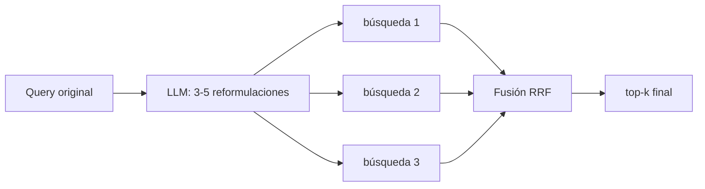
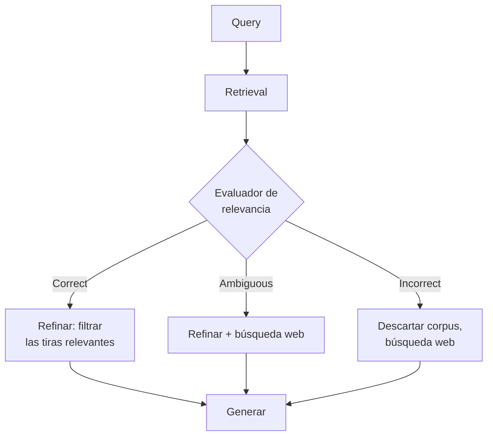

# 05 — RAG avanzado: HyDE, multi-query, Self-RAG y CRAG

El RAG "naive" (embed → top-k → prompt) falla de formas predecibles: queries mal
formuladas, vocabulario que no coincide con el corpus, preguntas que requieren varias
piezas de evidencia, retrieval que trae ruido y el LLM que responde igual. Las técnicas
de este capítulo atacan cada punto. Regla general antes de aplicarlas: **todas cuestan
latencia y/o llamadas extra al LLM** — se justifican midiendo, no por defecto.

## Transformación de queries

### Multi-query (expansión de la pregunta)

La query del usuario es una sola proyección de su intención, a menudo pobre ("¿y las
vacaciones?"). Multi-query pide a un LLM generar 3-5 reformulaciones desde ángulos
distintos, busca con todas, y **fusiona** los resultados.

La fusión estándar es **Reciprocal Rank Fusion (RRF)**: cada documento suma
`1/(k + rank_i)` por cada lista donde aparece (k≈60). Premia aparecer en varias listas
sin depender de scores incomparables entre búsquedas.

- **Coste**: 1 llamada LLM barata + N búsquedas (las búsquedas son baratas).
- **Cuándo brilla**: queries cortas/ambiguas, corpus con vocabulario heterogéneo.
- **Variantes**: *decomposition* (partir una pregunta compuesta en sub-preguntas
  independientes, responder cada una y sintetizar) y *step-back prompting* (generar
  una pregunta más general primero — útil cuando la concreta no tiene match directo).

### HyDE (Hypothetical Document Embeddings)

Gao et al. (2022). Observación: la query y los documentos viven en "regiones" distintas
del espacio de embeddings — una pregunta corta no se parece a un párrafo de documentación,
aunque este contenga su respuesta. HyDE cierra esa brecha:

1. Pide al LLM que **escriba una respuesta hipotética** a la pregunta (sin retrieval;
   puede contener datos inventados, da igual).
2. Embebe **ese documento hipotético** en lugar de (o además de) la query.
3. Busca con ese vector: documento-a-documento en vez de pregunta-a-documento.

La intuición: el documento falso es factualmente dudoso pero **estilística y
temáticamente** se parece a los documentos reales que buscamos; su vecindario en el
espacio vectorial es el correcto.

- **Cuándo brilla**: zero-shot, corpus técnicos donde las preguntas usan lenguaje llano
  y los docs jerga; cuando no hay datos para afinar el retriever.
- **Riesgos**: si el LLM malinterpreta la pregunta, la hipótesis dirige la búsqueda al
  sitio equivocado (mitigación: buscar con hipótesis **y** query original y fusionar);
  añade una generación completa de latencia.

## Pipelines auto-correctivos

### Self-RAG

Asai et al. (2023). En vez de recuperar siempre y generar lo que salga, el modelo
**decide y se critica** mediante tokens especiales de reflexión aprendidos en
entrenamiento:

- `Retrieve?` — ¿esta pregunta necesita retrieval, o respondo directo? (evita recuperar
  para "hola" o para aritmética).
- `IsRel` — ¿este pasaje recuperado es relevante?
- `IsSup` — ¿mi respuesta está soportada por el pasaje? (crítica de groundedness).
- `IsUse` — ¿la respuesta es útil?

El paper entrena un modelo específico (7B/13B) con estos tokens. En la práctica de
industria casi nadie despliega el modelo original: se implementa la **idea** como
pipeline con LLMs normales — un paso que decide si recuperar, un grader de relevancia
por documento, un verificador de soporte tras generar, con reintentos. LangGraph
documenta esta versión como patrón canónico.

**Lección transferible**: retrieval condicional + autoverificación con evidencia. Coste:
varias llamadas LLM por query.

### CRAG (Corrective RAG)

Yan et al. (2024). Ataca el caso "el retrieval trajo basura y el LLM responde igual".
Añade un **evaluador ligero de retrieval** que clasifica los documentos recuperados y
dispara una acción correctiva:

- **Correct**: hay evidencia buena → se refina (descomponer en tiras, quedarse con las
  relevantes) y se genera.
- **Incorrect**: nada relevante → se descarta el corpus y se recurre a una fuente
  alternativa (en el paper, búsqueda web).
- **Ambiguous**: mezcla de ambas.

La pieza clave es honesta y barata: un evaluador (en el paper, un T5 fine-tuned; en
implementaciones prácticas, una llamada a un LLM pequeño con salida estructurada) que
da al sistema **un camino de escape cuando el retrieval falla**, en lugar de alucinar
sobre contexto irrelevante.

## Comparativa y criterio de adopción

| Técnica | Ataca | Coste extra por query | Complejidad | Adóptala si... |
|---|---|---|---|---|
| Multi-query + RRF | Queries pobres/ambiguas | 1 llamada LLM + N búsquedas | Baja | El hit rate sube al reformular a mano |
| HyDE | Brecha query↔documento | 1 generación | Baja | Retrieval zero-shot flojo en corpus con jerga |
| Self-RAG (patrón) | Recuperar de más / respuestas sin soporte | 2-4 llamadas LLM | Alta | Mezcla de queries que necesitan y no necesitan corpus; groundedness crítico |
| CRAG | Generar sobre contexto basura | 1 evaluación (+ fallback) | Media | El sistema alucina cuando el corpus no cubre la pregunta |

Orden de implantación recomendado en un sistema real (de más a menos ROI típico):
**búsqueda híbrida y reranking primero** (capítulos 01 y 04), después multi-query,
después un grader tipo CRAG, y Self-RAG completo solo si el caso lo exige. Cada etapa
se valida contra el dataset de evaluación (capítulo 07) antes de añadir la siguiente:
un pipeline de 6 etapas que nadie ha medido es deuda, no sofisticación.

## Otros patrones que conviene conocer (mapa rápido)

- **Contextual retrieval** (Anthropic): anteponer a cada chunk un mini-resumen de su
  contexto generado por LLM en ingesta. Coste en indexado, no en query.
- **RAG-Fusion**: nombre popular de multi-query + RRF.
- **FLARE**: retrieval activo durante la generación — cuando el modelo va a generar un
  token con baja confianza, dispara una búsqueda.
- **GraphRAG** (Microsoft): construir un grafo de entidades/comunidades sobre el corpus
  y responder preguntas globales ("¿cuáles son los temas principales?") que el RAG
  clásico no puede, porque ningún chunk individual las contiene.
- **Agentic RAG**: el retrieval como herramienta de un agente que decide cuándo y qué
  buscar en un bucle ReAct (se retoma en el módulo 4).

## Errores comunes

1. **Apilar técnicas sin baseline medido.** Si no sabes cuánto rinde el RAG simple, no
   puedes saber qué aporta cada capa. (El lab 05 compara baseline vs multi-query vs
   HyDE sobre el mismo dataset.)
2. **Usar un modelo caro para los pasos auxiliares.** Reformular queries y evaluar
   relevancia funcionan bien con el tier pequeño vigente (`gpt-5.6-luna` en agosto de
   2026); reserva el modelo
   grande para la respuesta final si hace falta.
3. **HyDE con temperatura alta**: hipótesis creativas dispersan la búsqueda;
   temperatura baja para hipótesis, y fusiona siempre con la query original.
4. **Fusionar por score en vez de por rango**: los scores de búsquedas distintas no son
   comparables; RRF existe por eso.
5. **Bucles de auto-corrección sin límite**: un grader estricto + reintentos sin tope =
   latencia sin cota. Máximo 1-2 correcciones y un fallback honesto ("no lo encuentro").
6. **Ignorar el impacto en latencia p95**: cada llamada LLM secuencial suma segundos.
   Paraleliza lo paralelizable (las N búsquedas de multi-query, los graders por documento).

## Para profundizar

- Gao et al. (2022), *Precise Zero-Shot Dense Retrieval without Relevance Labels*
  (HyDE): https://arxiv.org/abs/2212.10496
- Asai et al. (2023), *Self-RAG: Learning to Retrieve, Generate, and Critique through
  Self-Reflection*: https://arxiv.org/abs/2310.11511
- Yan et al. (2024), *Corrective Retrieval Augmented Generation*:
  https://arxiv.org/abs/2401.15884
- Cormack et al. (2009), *Reciprocal Rank Fusion outperforms Condorcet and individual
  rank learning methods* (RRF): https://dl.acm.org/doi/10.1145/1571941.1572114
- Edge et al. (2024), *From Local to Global: A Graph RAG Approach to Query-Focused
  Summarization*: https://arxiv.org/abs/2404.16130
- Tutoriales de LangGraph sobre Self-RAG y CRAG como grafos:
  https://langchain-ai.github.io/langgraph/tutorials/rag/langgraph_self_rag/
