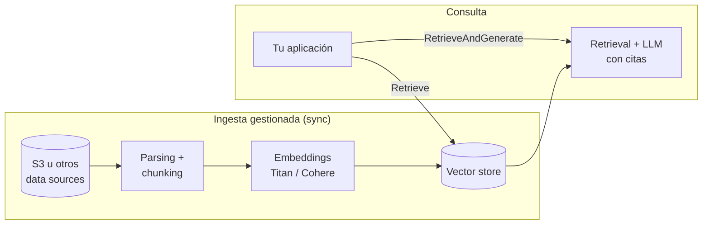

# 06 — Amazon Bedrock Knowledge Bases: RAG gestionado en AWS

## Qué es y qué problema resuelve

Amazon Bedrock Knowledge Bases es el RAG gestionado de AWS: tú apuntas a tus datos
(típicamente un bucket de S3), eliges modelo de embeddings y almacén vectorial, y el
servicio se encarga de la ingesta (parsing, chunking, embedding, sincronización) y
expone APIs de retrieval y de generación con citas. Es la respuesta a "quiero RAG sobre
mis documentos sin construir ni operar el pipeline".

Encaja especialmente cuando: los datos ya viven en AWS, hay requisitos de compliance
que Bedrock ya cubre (IAM, KMS, CloudTrail, VPC endpoints, sin retención de datos por
los proveedores de modelos), y el equipo prefiere pagar servicio gestionado a mantener
pipeline propio.

## Arquitectura



### Piezas configurables

- **Data sources**: S3 es el principal; hay conectores para Confluence, SharePoint,
  Salesforce y web crawler (verifica su estado GA por región antes de diseñar sobre
  ellos). La sincronización es bajo demanda o programada; detecta altas, bajas y
  modificaciones.
- **Parsing**: parser estándar (texto) o parsing avanzado con un foundation model /
  Bedrock Data Automation para PDFs complejos, tablas e imágenes (más caro; actívalo
  solo para las fuentes que lo necesiten).
- **Chunking**: fixed-size (tokens + solape), jerárquico (parent-child), semántico, sin
  chunking (un doc = un chunk), o **chunking custom con una Lambda** — el mapa directo
  del [capítulo 03](03-chunking.md), con las mismas decisiones y trade-offs; que sea
  gestionado no te exime de elegir y medir.
- **Embeddings**: Amazon Titan Text Embeddings v2 o Cohere Embed (multilingüe) vía
  Bedrock.
- **Vector store**: OpenSearch Serverless (la opción por defecto), Aurora PostgreSQL
  con pgvector, Pinecone, Redis Enterprise Cloud, MongoDB Atlas, o Amazon S3 Vectors
  (opción de bajo coste para índices grandes con menos exigencia de latencia).
  La elección importa en la factura: OpenSearch Serverless factura por OCUs con un
  mínimo mensual apreciable aunque el índice esté ocioso — para prototipos pequeños
  suele ser el mayor coste de toda la KB.

## Las dos APIs de consulta

**`Retrieve`** — solo retrieval: devuelve chunks con score, texto y metadatos. Tú
construyes el prompt y llamas al LLM que quieras (incluso fuera de Bedrock). Es la
opción cuando quieres control del prompt, reranking propio o tu propia lógica avanzada.

**`RetrieveAndGenerate`** — pipeline completo: retrieval + prompt gestionado + modelo de
Bedrock (Claude, Nova...) + **citas estructuradas** que referencian los pasajes usados.
Menos control, menos código.

```python
import boto3

client = boto3.client("bedrock-agent-runtime", region_name="eu-west-1")

resp = client.retrieve(
    knowledgeBaseId="KB_ID",
    retrievalQuery={"text": "¿Cómo escalo un incidente P1?"},
    retrievalConfiguration={
        "vectorSearchConfiguration": {
            "numberOfResults": 8,
            # "overrideSearchType": "HYBRID",  # denso + keyword si el store lo soporta
            # "filter": {"equals": {"key": "team", "value": "infra"}},
            "rerankingConfiguration": {
                "type": "BEDROCK_RERANKING_MODEL",
                "bedrockRerankingConfiguration": {
                    "modelConfiguration": {
                        "modelArn": (
                            "arn:aws:bedrock:eu-west-1::foundation-model/"
                            "amazon.rerank-v1:0"
                        )
                    },
                    "numberOfRerankedResults": 5,
                },
            },
        }
    },
)
for r in resp["retrievalResults"]:
    print(round(r["score"], 3), r["location"], r["content"]["text"][:120])
```

Capacidades adicionales del lado de consulta: búsqueda híbrida, filtrado por metadatos
(ficheros `.metadata.json` junto a cada documento en S3), reranking gestionado (Bedrock
Rerank), query reformulation, y guardrails de Bedrock aplicados a la generación.
Para datos estructurados existen variantes de KB que hacen text-to-SQL sobre Redshift,
y GraphRAG gestionado sobre Neptune — útiles de conocer, fuera del alcance del módulo.

## Build vs buy: pipeline propio vs Knowledge Bases

| Dimensión | Pipeline propio (labs de este módulo) | Bedrock Knowledge Bases |
|---|---|---|
| Tiempo hasta producción | Semanas | Días |
| Control fino (chunking, retrieval, prompt) | Total | Parcial (bueno y creciente, pero acotado) |
| Ops (índice, sync, escalado) | Tuyo | De AWS |
| Coste | Infra + tu tiempo | Embeddings + vector store + LLM + (parsing avanzado); el store gestionado domina en corpus pequeños |
| Lock-in | Bajo | Medio-alto (APIs y servicios AWS) |
| Compliance/seguridad | La construyes tú | IAM/KMS/VPC/CloudTrail de serie |
| Evaluación | La construyes tú (RAGAS) | Bedrock Evaluations ofrece evaluación RAG gestionada; RAGAS sigue aplicando vía `Retrieve` |

Criterio honesto: si tu organización ya está en AWS y el caso es "Q&A sobre documentos",
KB resuelve el 80 % con el 20 % del esfuerzo. El pipeline propio se justifica cuando
necesitas técnicas que el servicio no expone (late chunking, ColBERT, Self-RAG completo,
embeddings propios), multi-cloud, o coste mínimo absoluto a gran escala. Y aunque uses
KB, **todo lo aprendido en este módulo sigue siendo tu trabajo**: elegir chunking,
evaluar retrieval, medir alucinaciones. Lo gestionado es la tubería, no el criterio.

## Errores comunes

1. **Asumir que "gestionado" = "bien configurado"**: los defaults (chunking 300 tokens,
   top-5, sin híbrida) son un punto de partida, no una recomendación para tu corpus.
   Evalúa con tu dataset igual que harías con pipeline propio.
2. **Sorpresa en la factura de OpenSearch Serverless** en entornos de desarrollo: para
   probar, considera Aurora PostgreSQL (o S3 Vectors) como store, y borra las KBs de
   experimentos.
3. **Olvidar la sincronización**: subir docs a S3 no actualiza el índice; hay que
   disparar el sync job (o programarlo) y monitorizar sus fallos de parsing.
4. **Metadatos ausentes**: sin ficheros `.metadata.json` no hay filtrado por equipo,
   fecha o permisos, y el multi-tenant se vuelve imposible de asegurar.
5. **Usar `RetrieveAndGenerate` cuando necesitas control del prompt**: si vas a pelear
   contra el prompt gestionado, usa `Retrieve` y genera tú.
6. **Ignorar los límites por región**: modelos de embeddings, conectores y features
   varían por región y evolucionan rápido; verifica en la documentación oficial antes
   de comprometer arquitectura.

## Para profundizar

- Documentación oficial de Bedrock Knowledge Bases:
  https://docs.aws.amazon.com/bedrock/latest/userguide/knowledge-base.html
- Opciones de chunking y parsing avanzado:
  https://docs.aws.amazon.com/bedrock/latest/userguide/kb-advanced-parsing.html
- APIs `Retrieve` / `RetrieveAndGenerate` (bedrock-agent-runtime en boto3):
  https://boto3.amazonaws.com/v1/documentation/api/latest/reference/services/bedrock-agent-runtime.html
- Precios de Bedrock (embeddings, rerank, evaluación):
  https://aws.amazon.com/bedrock/pricing/
- Blog de AWS sobre evaluación de RAG en Bedrock:
  https://aws.amazon.com/blogs/machine-learning/
