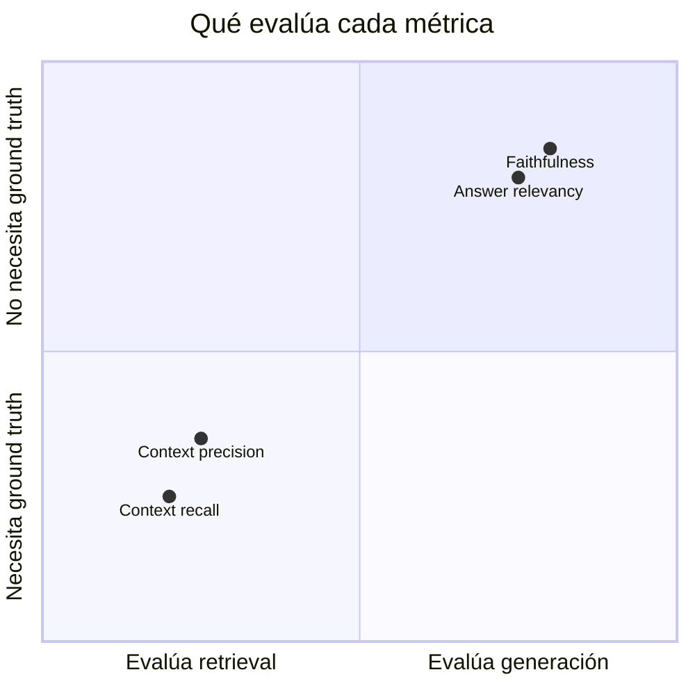
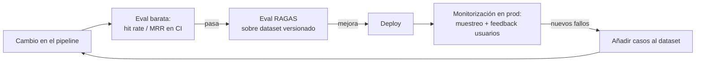

# 07 — Evaluación de RAG con RAGAS

## Por qué la evaluación es la mitad del sistema

Un RAG tiene demasiadas perillas (chunking, k, modelo de embeddings, híbrida sí/no,
reranker, prompt...) para ajustarlas a ojo. Sin evaluación automatizada, cada cambio es
una apuesta: puede mejorar las 5 preguntas que pruebas a mano y hundir las 200 que no.
La evaluación convierte el desarrollo de RAG en ingeniería: cambias una cosa, corres el
dataset, comparas métricas, decides con datos.

Además, RAG falla en **dos lugares distintos** que exigen diagnóstico separado:

- **Retrieval**: ¿recuperamos la evidencia correcta?
- **Generación**: ¿la respuesta usa esa evidencia con fidelidad y responde la pregunta?

Optimizar la generación cuando falla el retrieval (o viceversa) es tiempo perdido. Un
buen framework de métricas te dice **dónde** está el problema.

## La tupla de evaluación

Toda métrica de RAG opera sobre alguna combinación de cuatro elementos:

| Elemento | Qué es |
|---|---|
| `question` | La pregunta del usuario |
| `contexts` | Los chunks recuperados que se pasaron al LLM |
| `answer` | La respuesta generada |
| `ground_truth` | La respuesta correcta de referencia (anotada por humanos o generada y revisada) |

## Las cuatro métricas nucleares de RAGAS

RAGAS (Retrieval-Augmented Generation Assessment, Es et al., 2023) usa **LLM-as-judge**:
un LLM evaluador descompone y verifica afirmaciones. Sus cuatro métricas clásicas
cubren el cuadrante retrieval×generación:



### Faithfulness (generación, sin ground truth)

*¿Todo lo que afirma la respuesta está soportado por el contexto recuperado?*

Mecánica: el LLM juez descompone la `answer` en afirmaciones atómicas y verifica cada
una contra `contexts`. Score = afirmaciones soportadas / afirmaciones totales.

Es **la métrica anti-alucinación**: una faithfulness baja significa que el modelo está
añadiendo contenido que no viene de la evidencia (correcto o no — eso es otra métrica).

### Answer relevancy (generación, sin ground truth)

*¿La respuesta responde realmente a la pregunta?*

Mecánica ingeniosa: el juez genera N preguntas hipotéticas a partir de la `answer` y
mide su similitud (embeddings) con la `question` original. Una respuesta evasiva,
incompleta o divagante genera preguntas que no se parecen a la original → score bajo.
Penaliza el "mucho texto, poca respuesta"; no comprueba corrección factual.

### Context precision (retrieval, con referencia)

*De los chunks recuperados, ¿los relevantes están y están arriba?*

Evalúa la **señal frente a ruido** del retrieval y premia el orden (los relevantes en
las primeras posiciones pesan más — es un precision@k ponderado por rango). Un context
precision bajo con buen recall dice: "la evidencia llega, pero enterrada en basura" →
sube el listón del retrieval o añade reranker.

### Context recall (retrieval, con ground truth)

*¿El contexto recuperado contiene todo lo necesario para dar la respuesta correcta?*

Mecánica: descompone el `ground_truth` en afirmaciones y comprueba cuántas son
atribuibles a `contexts`. Un recall bajo dice: "la evidencia ni siquiera llegó" → el
problema es de chunking, embeddings, k o cobertura del corpus, y **ningún prompt lo
arreglará**.

### Diagnóstico con las cuatro juntas

| Síntoma | Lectura | Acción típica |
|---|---|---|
| recall ↓ | La evidencia no se recupera | Revisar chunking, k, modelo embeddings, híbrida |
| recall ↑, precision ↓ | Evidencia con mucho ruido | Reranker, bajar k final, umbral de score |
| precision/recall ↑, faithfulness ↓ | El LLM ignora o adorna el contexto | Prompt más estricto, citas obligatorias, modelo mejor |
| faithfulness ↑, answer relevancy ↓ | Fiel pero no responde | Prompt (instrucción de responder directo), contexto insuficiente |

## Construir el dataset de evaluación

Es la parte con más trabajo y más valiosa. Opciones, de mejor a peor calidad:

1. **Preguntas reales de usuarios** (logs de producción) anotadas por humanos.
2. **Anotación manual por expertos del dominio**: 30-100 preguntas con ground truth y
   documento fuente. Para un proyecto interno, 50 preguntas bien hechas bastan para
   detectar regresiones.
3. **Generación sintética revisada**: RAGAS incluye `TestsetGenerator` (genera preguntas
   de distintos tipos — simples, de razonamiento, multi-contexto — a partir del corpus).
   Genera 3× lo que necesitas y **revisa a mano**: las preguntas sintéticas tienden a
   calcar el vocabulario del documento (regalan el retrieval) y a veces son triviales o
   imposibles.

Reglas del dataset: incluye preguntas **negativas** (cuya respuesta no está en el
corpus — el sistema debe decir "no lo sé"), preguntas multi-documento, y paráfrasis que
no compartan vocabulario con la fuente. Versiona el dataset con el código.

## RAGAS en la práctica

Desde RAGAS 0.4, la API recomendada es orientada a objetos: cada métrica se instancia y
se puntúa con `ascore`. Esto evita depender de columnas implícitas y deja claro qué dato
consume cada juez:

```python
import asyncio

from openai import AsyncOpenAI
from ragas.embeddings import embedding_factory
from ragas.llms import llm_factory
from ragas.metrics.collections import AnswerRelevancy, Faithfulness


async def score() -> dict[str, float]:
    client = AsyncOpenAI()
    judge = llm_factory("gpt-5.6-luna", client=client)
    embeddings = embedding_factory(
        "openai",
        model="text-embedding-3-small",
        client=client,
    )
    faithfulness = await Faithfulness(llm=judge).ascore(
        user_input="¿Cuánto dura el enlace?",
        response="Dura 30 minutos.",
        retrieved_contexts=["El enlace caduca a los 30 minutos."],
    )
    relevancy = await AnswerRelevancy(
        llm=judge,
        embeddings=embeddings,
        strictness=1,
    ).ascore(
        user_input="¿Cuánto dura el enlace?",
        response="Dura 30 minutos.",
    )
    return {
        "faithfulness": float(faithfulness.value),
        "answer_relevancy": float(relevancy.value),
    }


print(asyncio.run(score()))
```

El lab 06 fija RAGAS 0.4.3, evalúa las cuatro métricas y guarda configuración, medias y
detalle por muestra. Como esa release arrastra Instructor/OpenAI SDK 2.x, el modo live
usa `setup/requirements-ragas.txt` en un proceso aislado; el resto del curso conserva
OpenAI SDK 3.x. También ofrece proxies deterministas explícitamente etiquetados para CI;
no los presenta como equivalentes a un juez LLM.

### Coste y fiabilidad del LLM-judge

- Cada métrica hace varias llamadas al juez **por muestra**: un dataset de 50 preguntas
  × 4 métricas puede suponer cientos de llamadas. Usa un modelo barato como juez
  (`gpt-5.6-luna`, en el catálogo de agosto de 2026) para iteración y un tier superior
  para la evaluación final si dudas. Revalida el catálogo antes de ejecutar.
- El juez tiene varianza: la misma evaluación dos veces no da números idénticos. Compara
  tendencias y diferencias claras, no centésimas. Para decisiones importantes, corre
  2-3 veces o sube el tamaño del dataset.
- Audita al juez: revisa a mano los 5-10 peores casos de cada métrica. A veces el
  "fallo" es del juez, no del pipeline — y a veces descubres un tipo de error que
  ninguna métrica captura.

## Métricas complementarias (no-RAGAS)

- **Retrieval clásico sin LLM**: hit rate@k, MRR, nDCG contra el documento fuente
  anotado. Baratas, deterministas, perfectas para CI en cada commit (los labs 03-05 las
  usan). RAGAS queda para evaluación más profunda y menos frecuente.
- **Answer correctness** (RAGAS): compara answer vs ground_truth (factual + semántica)
  — la nota "final" extremo a extremo.
- **Latencia y coste por query**: una mejora de calidad del 2 % que duplica la latencia
  no suele ser mejora.

## Evaluación continua: el ciclo completo



El dataset de evaluación es un artefacto vivo: cada fallo real de producción que
descubras se convierte en un caso nuevo. Así el dataset converge hacia lo que de verdad
preguntan tus usuarios.

## Errores comunes

1. **Evaluar solo extremo a extremo**: sin métricas de retrieval separadas no sabes qué
   componente arreglar.
2. **Dataset 100 % sintético sin revisar**: mide lo fácil, no lo real.
3. **Sin preguntas negativas**: el sistema que nunca dice "no lo sé" parece perfecto
   hasta que un usuario pregunta algo fuera del corpus.
4. **Tratar los scores como verdad absoluta**: 0.83 vs 0.85 con 50 muestras y un juez
   estocástico es ruido, no mejora.
5. **Evaluar con el mismo modelo que genera** sin al menos revisar el sesgo: los jueces
   LLM tienden a favorecer salidas de su propia familia (self-preference bias).
6. **No versionar dataset + configuración + resultados juntos**: sin eso no hay
   comparaciones válidas entre experimentos.

## Para profundizar

- Es et al. (2023), *RAGAS: Automated Evaluation of Retrieval Augmented Generation*:
  https://arxiv.org/abs/2309.15217
- Documentación de RAGAS (métricas, testset generation):
  https://docs.ragas.io/
- Zheng et al. (2023), *Judging LLM-as-a-Judge with MT-Bench and Chatbot Arena* —
  fiabilidad y sesgos de jueces LLM: https://arxiv.org/abs/2306.05685
- Alternativas para contrastar: TruLens (RAG triad), DeepEval, promptfoo (asserts de
  RAG en CI), Arize Phoenix (observabilidad + evals).
