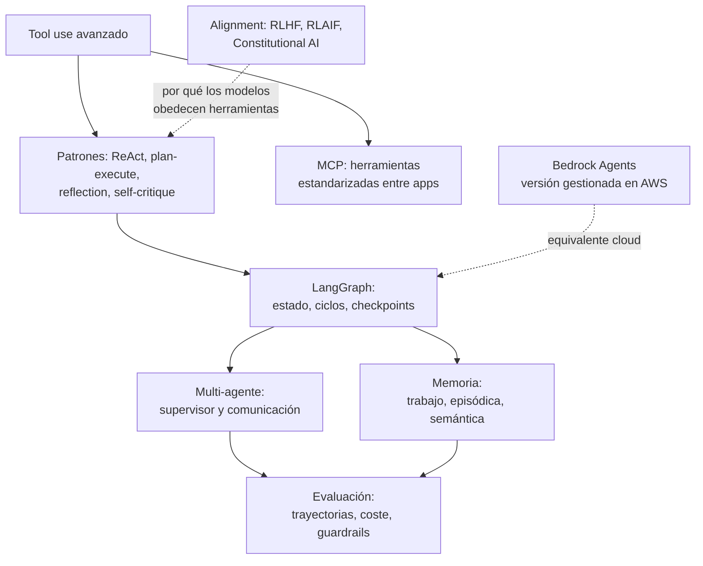

# Módulo 04 — Interfaces de agentes y tools

> Agentes capaces de planificar, razonar y usar herramientas. Multi-agente con LangGraph y MCP.
> Memoria, control de flujos y evaluación de fiabilidad. **~55 horas de trabajo.**

## Qué vas a saber hacer al terminar

1. Implementar el bucle ReAct **a mano**, sin frameworks, y explicar exactamente qué hace cada pieza.
2. Modelar agentes como **grafos de estado** en LangGraph: ciclos, condicionales, checkpoints y human-in-the-loop.
3. Desarrollar y publicar un **servidor MCP** propio y conectarlo a Claude Desktop / Claude Code.
4. Diseñar herramientas robustas: contratos claros, manejo de errores, idempotencia.
5. Construir un sistema **multi-agente con supervisor** y razonar cuándo (no) merece la pena.
6. Dotar a un agente de memoria de trabajo, episódica y semántica.
7. Explicar la arquitectura de **Amazon Bedrock Agents** (action groups, KBs) de cara al AIF-C01.
8. Evaluar agentes: trayectorias, determinismo, coste por tarea y guardrails de seguridad.
9. Situar RLHF, RLAIF y Constitutional AI en el panorama de alignment y fine-tuning.

## Requisitos previos

- Módulos I–III completados (en particular: function calling del módulo II y embeddings del módulo III).
- Dependencias del grupo `agents` instaladas desde la **raíz del repo**:

```bash
uv sync --extra agents
```

- `.env` en la raíz con `OPENAI_API_KEY` (los labs usan `gpt-5.6-luna`, verificado en
  agosto de 2026; casi todos aceptan también `ANTHROPIC_API_KEY` +
  `claude-haiku-4-5`). `LANGSMITH_API_KEY` es opcional pero
  recomendable a partir del lab 02 para ver las trazas.

## Orden de estudio y tiempos estimados

| # | Teoría | Lab asociado | Horas |
|---|--------|--------------|-------|
| 1 | [`teoria/01-patrones-de-agentes.md`](teoria/01-patrones-de-agentes.md) — ReAct, plan-execute, reflection, self-critique | [`labs/01_react_desde_cero.py`](labs/01_react_desde_cero.py) | 7 |
| 2 | [`teoria/02-langgraph.md`](teoria/02-langgraph.md) — grafos de estado, ciclos, condicionales, checkpoints | [`labs/02_langgraph_basico.py`](labs/02_langgraph_basico.py), [`labs/03_langgraph_ciclos_condicionales.py`](labs/03_langgraph_ciclos_condicionales.py), [`labs/04_langgraph_checkpoints.py`](labs/04_langgraph_checkpoints.py) | 10 |
| 3 | [`teoria/03-mcp.md`](teoria/03-mcp.md) — arquitectura MCP y desarrollo de servidores | [`labs/05_mcp_server.py`](labs/05_mcp_server.py) | 6 |
| 4 | [`teoria/04-tool-use-avanzado.md`](teoria/04-tool-use-avanzado.md) — diseño de herramientas, errores, idempotencia | (transversal: se aplica en todos los labs) | 4 |
| 5 | [`teoria/05-multi-agente.md`](teoria/05-multi-agente.md) — coordinación, supervisores, comunicación | [`labs/06_multiagente_supervisor.py`](labs/06_multiagente_supervisor.py) | 7 |
| 6 | [`teoria/06-memoria.md`](teoria/06-memoria.md) — memoria episódica, semántica y de trabajo | [`labs/07_memoria_agente.py`](labs/07_memoria_agente.py) | 6 |
| 7 | [`teoria/07-bedrock-agents.md`](teoria/07-bedrock-agents.md) — action groups, knowledge bases | sin lab (requiere cuenta AWS; se documenta el flujo de consola) | 3 |
| 8 | [`teoria/08-evaluacion-de-agentes.md`](teoria/08-evaluacion-de-agentes.md) — determinismo, costes, guardrails | (se evalúa el mini-proyecto con esta rúbrica) | 5 |
| 9 | [`teoria/09-alignment-y-fine-tuning.md`](teoria/09-alignment-y-fine-tuning.md) — RLHF, RLAIF, Constitutional AI | sin lab (teórico) | 4 |
| — | [`ejercicios.md`](ejercicios.md) — 12 ejercicios + mini-proyecto (agente de investigación) | Tests y rúbrica | 13 |

**Esfuerzo orientativo: 50–60 h.** Avanza cuando puedas producir la evidencia, no al cumplir una fecha.

## Cómo trabajar el módulo

1. Lee la teoría del bloque **antes** del lab; cada lab asume los conceptos de su fichero de teoría.
2. Ejecuta cada lab, léelo entero y modifícalo (cada docstring propone variaciones). Los labs
   ofrecen recorridos offline y tienen límites de iteraciones. Antes de los modos live,
   calcula el coste con la tarifa vigente y fija un presupuesto.
3. Haz los ejercicios del bloque al terminarlo, no todos al final.
4. El **mini-proyecto** (ejercicio 12) es el hito de salida del módulo: un agente de investigación
   con 3+ herramientas, trazas y evaluación. Guárdalo: será la entrada de Harness Engineering.

## Mapa mental del módulo



## Advertencia honesta antes de empezar

La mayoría de los problemas que verás en producción **no necesitan un agente**: un pipeline fijo de
2-3 llamadas LLM es más barato, más rápido y más depurable. Este módulo insiste una y otra vez en
la pregunta "¿necesito un agente aquí?" — saber responderla es tan importante como saber construirlos.
Léelo con esa mentalidad crítica: es lo que diferencia a un ingeniero de alguien que encadena demos.
