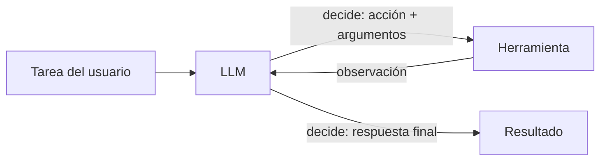
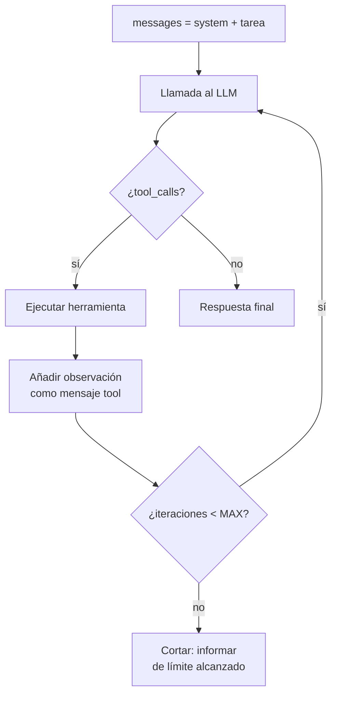
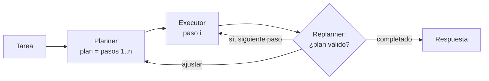
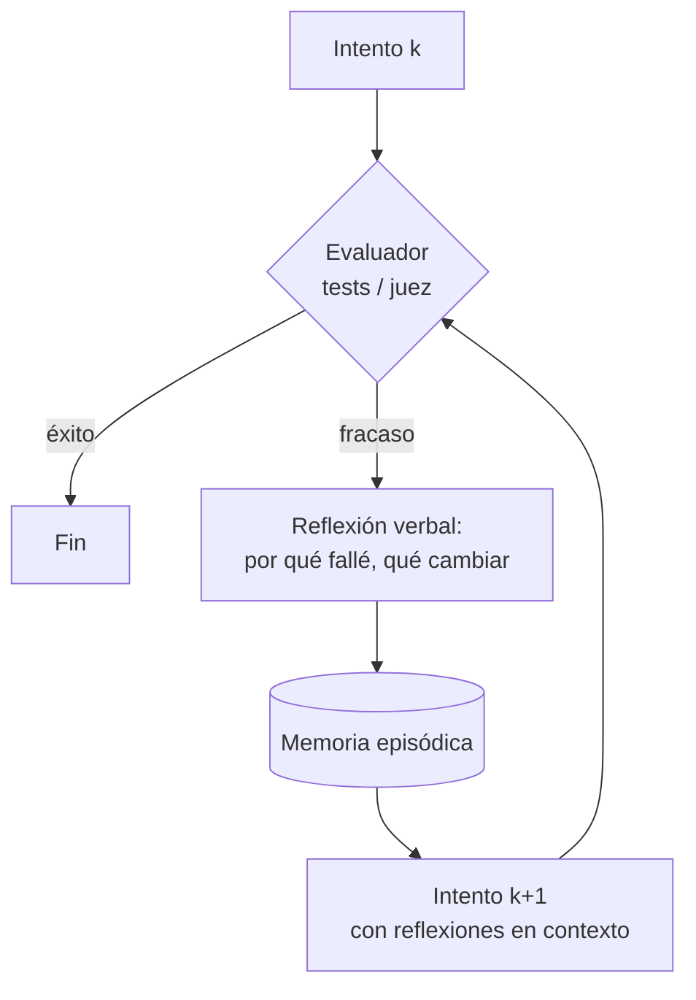

# 01 — Patrones de agentes: ReAct, plan-execute, reflection, self-critique

> **Objetivo:** entender qué es (y qué no es) un agente LLM, dominar los cuatro patrones
> fundamentales y saber elegir el más simple que resuelva tu problema.
> **Lab asociado:** [`../labs/01_react_desde_cero.py`](../labs/01_react_desde_cero.py)

## 1. Qué es un agente (y qué no)

La definición útil, tomada de "Building effective agents" de Anthropic (2024):

- **Workflow:** sistema donde el LLM y las herramientas se orquestan mediante **rutas de código
  predefinidas**. El desarrollador decide el flujo; el LLM rellena los pasos.
- **Agente:** sistema donde el **LLM dirige dinámicamente su propio proceso** — decide qué
  herramienta usar, en qué orden, y cuándo ha terminado.

La diferencia no es el número de llamadas al LLM sino **quién controla el flujo**. Un pipeline de
cinco pasos fijos (clasificar → buscar → resumir → redactar → revisar) es un workflow por muy
sofisticado que sea. Un bucle donde el modelo elige entre parar o llamar a una de N herramientas
es un agente aunque solo dé dos vueltas.

Anatomía mínima de un agente:



Tres componentes: un **modelo** que razona, un conjunto de **herramientas** con contratos claros,
y un **bucle** con condición de parada. Todo lo demás (memoria, planificación, multi-agente) son
extensiones de este núcleo.

### 1.1 Cuándo NO usar un agente

Esta sección va primero a propósito. Usa un workflow (o una sola llamada) cuando:

- **El flujo es conocido de antemano.** Si puedes dibujar el diagrama de pasos sin condicionales
  que dependan del contenido, no necesitas que el LLM decida el flujo.
- **La latencia o el coste importan.** Un agente ReAct típico hace 3–10 llamadas donde un workflow
  haría 1–2. Cada vuelta añade latencia acumulada y reenvía todo el historial (el coste crece
  aproximadamente de forma cuadrática con el número de pasos si no gestionas el contexto).
- **Necesitas depurabilidad y comportamiento predecible.** Un workflow falla siempre en el mismo
  sitio; un agente falla de formas nuevas cada día.
- **La tarea es de una sola herramienta.** "Consulta esta API y formatea el resultado" es function
  calling simple (módulo II), no un agente.

Regla práctica de Anthropic: *encuentra el sistema más simple posible; sube en complejidad solo
cuando lo simple demuestre no ser suficiente*. Los agentes intercambian latencia y coste por
autonomía — ese intercambio solo compensa en tareas abiertas donde no puedes enumerar los pasos.

## 2. ReAct: Reasoning + Acting

El patrón fundacional, del paper **"ReAct: Synergizing Reasoning and Acting in Language Models"**
(Yao et al., 2022). La idea: intercalar **trazas de razonamiento** (Thought) con **acciones**
(Action) y sus **observaciones** (Observation), en bucle, hasta llegar a una respuesta.

```text
Question: ¿Cuánto es la población de Francia dividida entre 4?
Thought: Necesito la población de Francia. Usaré la búsqueda.
Action: search[población de Francia]
Observation: Francia tiene 68 millones de habitantes (2024).
Thought: Ahora divido 68.000.000 entre 4.
Action: calculator[68000000 / 4]
Observation: 17000000.0
Thought: Ya tengo la respuesta.
Final Answer: 17 millones.
```

¿Por qué funciona mejor que actuar sin razonar o razonar sin actuar? El paper lo mide en HotpotQA
y ALFWorld: el razonamiento **sin** acciones alucina hechos (no puede consultar nada), y las
acciones **sin** razonamiento pierden el hilo en tareas de varios saltos. La traza de pensamiento
actúa como plan incremental y como registro de qué se sabe ya; las observaciones anclan el
razonamiento en datos reales.

### 2.1 ReAct en 2025: de texto parseado a tool calling nativo

El paper original parseaba texto (`Action: search[...]`) con expresiones regulares — frágil: el
modelo se inventa formatos, cierra corchetes mal, mezcla idiomas. Hoy el mismo patrón se implementa
con **function calling nativo** de las APIs: el modelo devuelve `tool_calls` estructurados, tú
ejecutas la herramienta y devuelves el resultado como mensaje `role: "tool"`. El bucle conceptual
es idéntico; cambia el transporte. El razonamiento ("Thought") sobrevive como el texto que el
modelo emite antes del tool call, o como razonamiento extendido en modelos que lo soportan.

En el lab 01 implementas exactamente esto: el bucle ReAct a mano con la API de OpenAI, sin
frameworks, para que veas que "un agente" son ~60 líneas de Python.



### 2.2 Debilidades de ReAct

- **Miopía:** decide una acción cada vez; en tareas con estructura (reserva vuelo + hotel + coche,
  con restricciones cruzadas) puede tomar decisiones tempranas que invalidan las tardías.
- **Contexto creciente:** cada vuelta añade mensajes; en tareas largas el historial explota
  (§5, errores comunes).
- **Sin autocorrección estructural:** si una estrategia no funciona, tiende a insistir en ella
  (el historial de intentos fallidos "ancla" al modelo en la misma dirección).

Estas debilidades motivan los otros tres patrones.

## 3. Plan-and-Execute

Separa la planificación de la ejecución:

1. **Planner:** una llamada (a un modelo potente) produce un plan explícito: lista de pasos.
2. **Executor:** ejecuta cada paso (con un modelo barato, o con un mini-ReAct por paso).
3. **Replanner (opcional):** tras cada paso, revisa si el plan sigue siendo válido y lo ajusta.



**Ventajas:** el plan es inspeccionable (puedes mostrárselo a un humano antes de ejecutar), los
pasos pueden paralelizarse si son independientes, y el executor no necesita el historial completo
— solo su paso y los resultados relevantes, lo que controla el contexto. Variante notable:
**ReWOO** (Xu et al., 2023) genera el plan completo con variables (`#E1`, `#E2`...) y ejecuta las
herramientas sin volver a llamar al LLM entre pasos, reduciendo tokens drásticamente.

**Desventajas:** rígido ante lo inesperado (por eso existe el replanner) y el plan inicial se hace
"a ciegas", sin haber visto ninguna observación. Úsalo cuando la tarea tiene estructura clara y
pasos costosos que conviene aprobar antes de ejecutar.

## 4. Reflection y self-critique

Familia de patrones donde el modelo **evalúa y mejora su propia salida**:

- **Self-critique básico (generator–critic):** generar → criticar (misma o distinta llamada) →
  regenerar incorporando la crítica. Dos o tres vueltas suelen bastar; más produce rendimientos
  decrecientes y a veces degradación (el modelo "sobre-corrige").
- **Reflexion** (Shinn et al., 2023): la versión agéntica. El agente intenta la tarea completa,
  un evaluador (tests, heurística, o LLM-judge) da señal de éxito/fracaso, y el agente escribe
  una **reflexión verbal** ("fallé porque asumí X; la próxima vez debo Y") que se guarda en una
  memoria episódica y se inyecta en el siguiente intento. Es "aprendizaje por refuerzo verbal":
  la política mejora entre episodios sin tocar los pesos. En HumanEval, Reflexion sobre GPT-4
  pasó del ~80% al 91% pass@1.



**Condición crítica:** reflection solo aporta valor si hay una **señal de evaluación fiable**
(tests que pasan/fallan, un verificador, un juez bien calibrado). Un modelo criticándose a sí
mismo sin señal externa tiende a la complacencia ("todo correcto") o a inventarse problemas.
Si no puedes verificar el resultado, reflection es teatro caro.

## 5. Errores comunes (los verás todos)

1. **Loops infinitos.** El agente repite la misma acción con los mismos argumentos porque la
   observación no le da lo que espera. Mitigaciones: límite duro de iteraciones (**siempre**,
   en todo bucle de agente, sin excepciones — todos los labs de este módulo lo llevan), detectar
   repetición de (herramienta, argumentos) y cortar, y mensajes de error de herramienta que
   **sugieran qué cambiar** en vez de solo "error".
2. **Contexto que explota.** Historial + observaciones enormes (un HTML de 200 KB como
   observación) → coste disparado, latencia, y el modelo pierde el hilo ("lost in the middle").
   Mitigaciones: truncar/resumir observaciones antes de añadirlas, ventana deslizante con resumen
   de lo antiguo (lo verás en el fichero 06 de memoria), y herramientas que devuelvan lo mínimo útil.
3. **Herramientas ambiguas.** Dos herramientas que se solapan (`search` y `lookup` que hacen casi
   lo mismo) o descripciones vagas → el modelo elige mal o alterna entre ambas. La calidad de un
   agente depende más del **diseño de sus herramientas** que del prompt (fichero 04).
4. **Parar demasiado tarde.** El agente ya tiene la respuesta pero sigue "verificando" con más
   llamadas. Mitigación: instruir explícitamente el criterio de parada en el system prompt y
   premiar respuestas directas en los ejemplos.
5. **Confiar en la traza de razonamiento como si fuera el estado real.** El "Thought" puede decir
   "ya he guardado el fichero" sin que ninguna herramienta lo haya hecho. El estado de verdad son
   las observaciones, no los pensamientos.

## 6. Elegir patrón: guía de decisión

| Situación | Patrón |
|---|---|
| Flujo enumerable de antemano | **Workflow** (no agente) |
| Tarea abierta, pocos pasos, herramientas claras | **ReAct** |
| Tarea larga con estructura, pasos costosos o que requieren aprobación | **Plan-and-execute** |
| Hay verificador fiable (tests, juez) y margen para reintentar | **+ Reflexion** |
| Salida de calidad crítica (informe, código) sin verificador duro | **+ self-critique (1–2 vueltas)** |

Los patrones se componen: un plan-and-execute cuyo executor es ReAct con self-critique final es
una arquitectura perfectamente razonable — si la tarea lo justifica.

## Para profundizar

- Yao et al., *ReAct: Synergizing Reasoning and Acting in Language Models* (2022) — [arxiv.org/abs/2210.03629](https://arxiv.org/abs/2210.03629)
- Shinn et al., *Reflexion: Language Agents with Verbal Reinforcement Learning* (2023) — [arxiv.org/abs/2303.11366](https://arxiv.org/abs/2303.11366)
- Anthropic, *Building effective agents* (2024) — [anthropic.com/research/building-effective-agents](https://www.anthropic.com/research/building-effective-agents) — el texto más influyente sobre cuándo usar workflows vs agentes; léelo entero.
- Xu et al., *ReWOO: Decoupling Reasoning from Observations* (2023) — [arxiv.org/abs/2305.18323](https://arxiv.org/abs/2305.18323)
- Madaan et al., *Self-Refine: Iterative Refinement with Self-Feedback* (2023) — [arxiv.org/abs/2303.17651](https://arxiv.org/abs/2303.17651)
