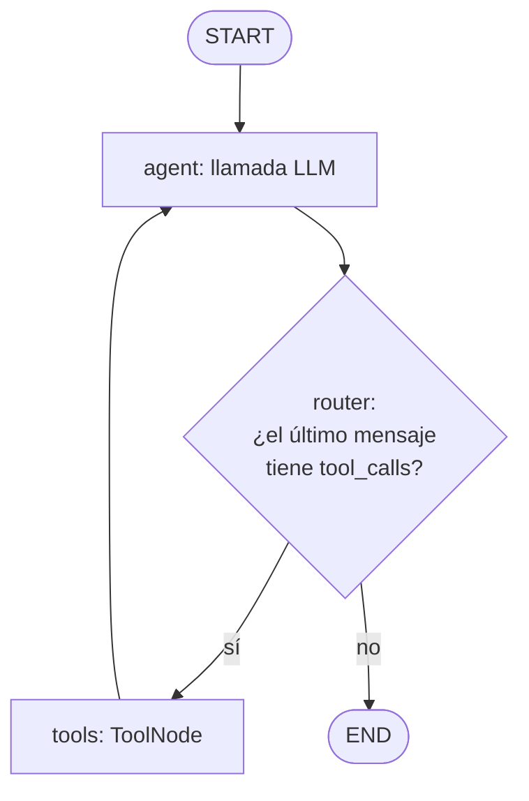
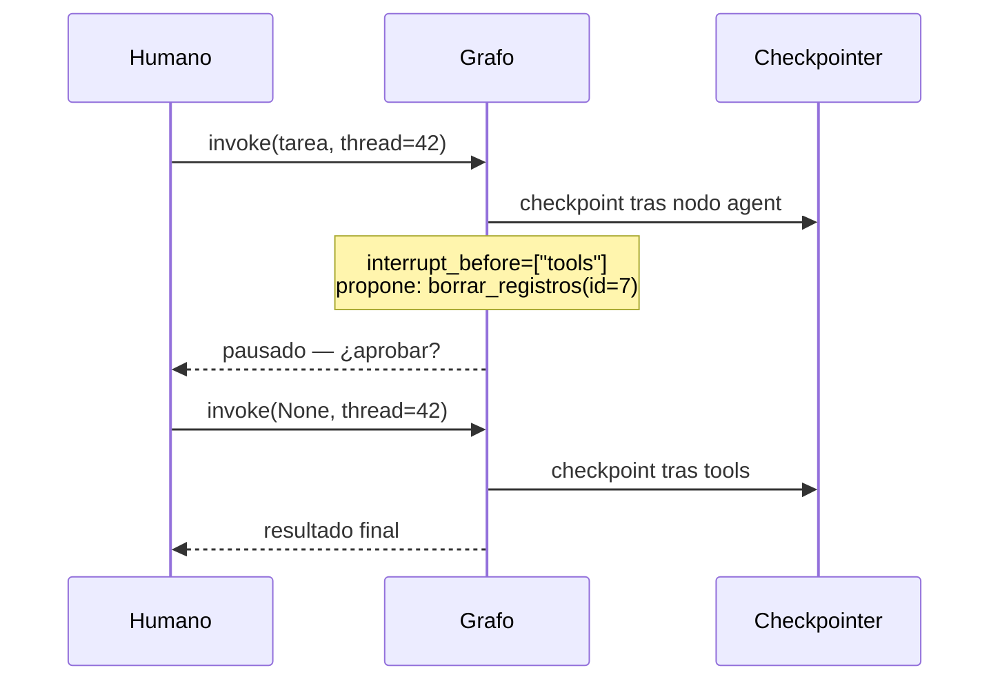

# 02 — LangGraph: grafos de estado, ciclos, condicionales y checkpoints

> **Objetivo:** modelar agentes como grafos de estado explícitos: nodos, aristas condicionales,
> ciclos con límite, persistencia con checkpoints y human-in-the-loop.
> **Labs asociados:** [`../labs/02_langgraph_basico.py`](../labs/02_langgraph_basico.py),
> [`../labs/03_langgraph_ciclos_condicionales.py`](../labs/03_langgraph_ciclos_condicionales.py),
> [`../labs/04_langgraph_checkpoints.py`](../labs/04_langgraph_checkpoints.py)

## 1. Por qué un framework de grafos (después de hacerlo a mano)

En el lab 01 escribiste el bucle ReAct en ~60 líneas. Entonces, ¿para qué LangGraph? Porque ese
bucle artesanal se queda corto en cuanto necesitas: **persistir** el estado entre ejecuciones,
**pausar** para que un humano apruebe una acción, **reanudar** tras un fallo, ramificar el flujo
según condiciones, o combinar varios agentes. Todo eso es infraestructura, y reescribirla por
proyecto es un error.

LangGraph modela la aplicación como una **máquina de estados**: un grafo dirigido donde los nodos
son funciones (llamadas LLM, herramientas, lógica pura) y las aristas definen qué nodo va después.
A diferencia de un DAG clásico (Airflow, un pipeline), **los ciclos están permitidos** — y un
agente *es* un ciclo: LLM → herramienta → LLM → ...

Lo que compras con el framework:

- **Estado explícito y tipado** — todo lo que fluye por el grafo está en un solo objeto inspeccionable.
- **Checkpointing** — el estado se guarda tras cada paso; puedes reanudar, hacer time-travel, o
  ejecutar en threads independientes por usuario.
- **Human-in-the-loop de serie** — interrumpir antes/después de un nodo y reanudar con input humano.
- **Streaming de eventos** — ver cada transición en tiempo real (y trazas en LangSmith).

Lo que pagas: una capa de abstracción más que aprender y depurar. Para un bucle simple de una
herramienta, el lab 01 sigue siendo la respuesta correcta.

## 2. Los tres conceptos: State, Nodes, Edges

### 2.1 State

Un esquema (normalmente `TypedDict`) que define la "pizarra" compartida. Cada clave puede llevar
un **reducer**: una función que define cómo se combina el valor nuevo con el existente.

```python
from typing import Annotated
from typing_extensions import TypedDict
from langgraph.graph.message import add_messages

class State(TypedDict):
    messages: Annotated[list, add_messages]  # reducer: apendiza en vez de sobreescribir
    intentos: int                            # sin reducer: el último valor gana
```

`add_messages` es el reducer estrella: los nodos devuelven mensajes nuevos y el reducer los
apendiza a la lista (deduplicando por id). Sin reducer, devolver `{"messages": [msg]}` **borraría**
el historial. Este detalle causa la mitad de los bugs de principiante en LangGraph.

Los nodos **no mutan** el estado: reciben el estado actual y devuelven un diccionario con las
claves que quieren actualizar. LangGraph aplica los reducers. Esto hace cada paso reproducible
y es lo que permite el checkpointing.

### 2.2 Nodes

Funciones Python `state -> dict` (actualización parcial del estado). Un nodo puede llamar a un
LLM, ejecutar una herramienta, o ser lógica pura. LangGraph trae `ToolNode` prefabricado: ejecuta
los `tool_calls` del último mensaje AI y devuelve los `ToolMessage` correspondientes.

### 2.3 Edges

- **Normales:** `graph.add_edge("a", "b")` — tras `a`, siempre `b`.
- **Condicionales:** `graph.add_conditional_edges("agent", router, {"tools": "tools", END: END})` — una función
  **determinista** inspecciona el estado y devuelve el nombre del siguiente nodo. Aquí vive el
  control de flujo del agente.
- **Especiales:** `START` (entrada) y `END` (terminación).

El agente ReAct completo, como grafo:



El ciclo `agent → tools → agent` es la esencia. El router es código tuyo, determinista y
testeable — el LLM decide *emitiendo tool_calls o no*, pero la lógica que enruta esa decisión
es Python normal. Esta separación (el modelo propone, el grafo dispone) es la gran idea del diseño.

```python
from langgraph.graph import StateGraph, START, END
from langgraph.prebuilt import ToolNode

def route(state: State) -> str:
    last = state["messages"][-1]
    return "tools" if last.tool_calls else END

builder = StateGraph(State)
builder.add_node("agent", call_llm)
builder.add_node("tools", ToolNode(tools))
builder.add_edge(START, "agent")
builder.add_conditional_edges("agent", route, {"tools": "tools", END: END})
builder.add_edge("tools", "agent")
graph = builder.compile()
```

## 3. Ciclos y cómo no morir en ellos

Un ciclo sin freno es un loop infinito con factura de API. Tres frenos, úsalos combinados:

1. **`recursion_limit`** — LangGraph corta la ejecución tras N "supersteps" (por defecto 25) y
   lanza `GraphRecursionError`. Es el airbag, no el freno de servicio: atrápalo y degrada con
   elegancia.
2. **Contador en el estado** — una clave `intentos` que un nodo incrementa y el router comprueba:
   al llegar al máximo, enruta a un nodo de "rendición honesta" que explica qué se consiguió y qué
   no. Este es el freno de servicio: da una salida controlada, no una excepción.
3. **Detección de estancamiento** — si el estado no cambia entre vueltas (misma herramienta,
   mismos argumentos, misma observación), corta: repetir no va a arreglar nada.

En el lab 03 implementas un ciclo de "generar → evaluar → reintentar" con contador y salida
condicional — el esqueleto de cualquier agente con self-critique.

## 4. Checkpoints: persistencia, threads y time-travel

Un **checkpointer** guarda una foto del estado tras cada superstep. Al compilar:

```python
from langgraph.checkpoint.memory import InMemorySaver
graph = builder.compile(checkpointer=InMemorySaver())  # en producción: SQLite / PostgreSQL

config = {"configurable": {"thread_id": "usuario-42"}}
graph.invoke(
    {"messages": [{"role": "user", "content": "¿Qué incidentes P1 siguen abiertos?"}]},
    config,
)
```

- **`thread_id`** identifica una conversación/sesión. Invocar de nuevo con el mismo `thread_id`
  **continúa** desde el último checkpoint (memoria a corto plazo gratis); un `thread_id` nuevo
  parte de cero. Un thread por usuario/conversación es el patrón estándar.
- **`get_state(config)` / `get_state_history(config)`** — inspeccionar el estado actual o toda la
  historia de checkpoints.
- **Time-travel:** puedes coger un checkpoint antiguo, modificar el estado con
  `update_state`, y reanudar desde ahí — una bifurcación de la historia. Utilísimo para depurar
  ("¿qué habría pasado si la herramienta hubiera devuelto otra cosa?") y para tests.

Backends: `InMemorySaver` (RAM, para desarrollo y tests) y paquetes de checkpoint para
SQLite/PostgreSQL en persistencia real. Instálalos por separado y ejecuta su setup/migraciones;
la interfaz de checkpointer permite conservar el grafo.

## 5. Human-in-the-loop

Con checkpointer, pausar es trivial — y es la funcionalidad que justifica LangGraph en cualquier
agente que toque dinero, datos de producción o el mundo exterior:

```python
graph = builder.compile(checkpointer=saver, interrupt_before=["tools"])
```

El grafo se detiene **antes** de ejecutar el nodo `tools`, con el tool call propuesto ya visible
en el estado. El proceso puede terminar; horas después, otra invocación con el mismo `thread_id`:

- **Aprobar:** `graph.invoke(None, config)` — `None` significa "continúa desde donde estabas".
- **Rechazar/corregir:** `graph.update_state(config, {"approval": "rejected"})` para editar un
  campo `approval` declarado en el estado (p. ej.
  sustituir el tool call o inyectar un mensaje de rechazo) y luego reanudar.



Las versiones modernas añaden `interrupt()` llamable *dentro* de un nodo (pausa dinámica con
payload para el humano, se reanuda con `Command(resume=valor)`), que es más flexible que el
`interrupt_before` estático. El lab 04 usa el estático por claridad y menciona el dinámico.

## 6. Errores comunes con LangGraph

1. **Olvidar el reducer** en `messages` y machacar el historial en cada nodo (síntoma: el agente
   "amnésico" que repite la primera acción eternamente).
2. **Meter lógica en el prompt que debería ser una arista.** "Si la búsqueda falla, intenta con
   otra query, máximo 2 veces" como instrucción al LLM es una súplica; como router + contador es
   una garantía. Todo lo que pueda ser determinista, que lo sea.
3. **Estado gigante.** Guardar HTMLs completos o DataFrames en el estado infla cada checkpoint y
   cada prompt. Guarda referencias (paths, ids) y que las herramientas lean el dato pesado.
4. **Confiar en `recursion_limit` como control de flujo** en vez de como airbag: el usuario ve una
   excepción en lugar de una respuesta degradada.
5. **No fijar `thread_id`** y sorprenderse de que no hay memoria, o usar uno global y mezclar
   conversaciones de usuarios distintos.
6. **Depurar a ciegas.** Activa LangSmith (`LANGSMITH_API_KEY` + `LANGSMITH_TRACING=true` en el
   `.env`): cada ejecución queda trazada nodo a nodo con prompts, respuestas y latencias. Depurar
   agentes sin trazas es arqueología.

## 7. ¿LangGraph o hacerlo a mano? (criterio honesto)

| Necesitas... | A mano (lab 01) | LangGraph |
|---|---|---|
| Bucle simple, 1–3 herramientas, sin persistencia | ✅ menos dependencias, cero magia | sobredimensionado |
| Persistencia / reanudación / threads por usuario | reinventarías SQLite + serialización | ✅ |
| Human-in-the-loop con pausas largas | muy costoso de hacer bien | ✅ |
| Flujos con ramas, ciclos acotados, multi-agente | espagueti de ifs | ✅ |
| Control total y cero dependencias (librería, edge) | ✅ | pesa |

La habilidad valiosa no es "saber LangGraph": es saber modelar un problema como máquina de estados.
El framework solo te ahorra la fontanería.

## Para profundizar

- Docs actuales de LangGraph — [docs.langchain.com/oss/python/langgraph/](https://docs.langchain.com/oss/python/langgraph/) — en particular las guías de *persistence*, *human-in-the-loop* y *streaming*.
- Tutorial oficial "Introduction to LangGraph" (LangChain Academy) — [academy.langchain.com](https://academy.langchain.com/courses/intro-to-langgraph) — gratuito, el mejor recorrido guiado.
- Anthropic, *Building effective agents* (2024) — la sección de workflows (prompt chaining, routing, orchestrator-workers) mapea 1:1 a topologías de grafo.
- LangSmith — [docs.smith.langchain.com](https://docs.smith.langchain.com/) — trazas y evaluación; lo retomamos en el fichero 08.
