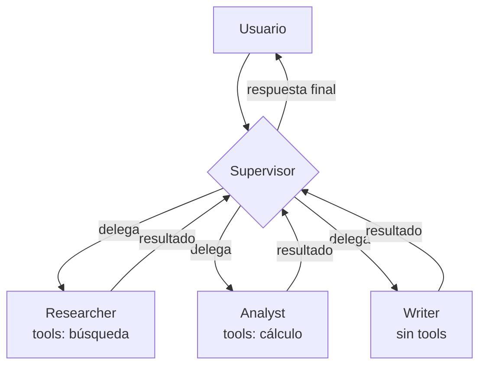
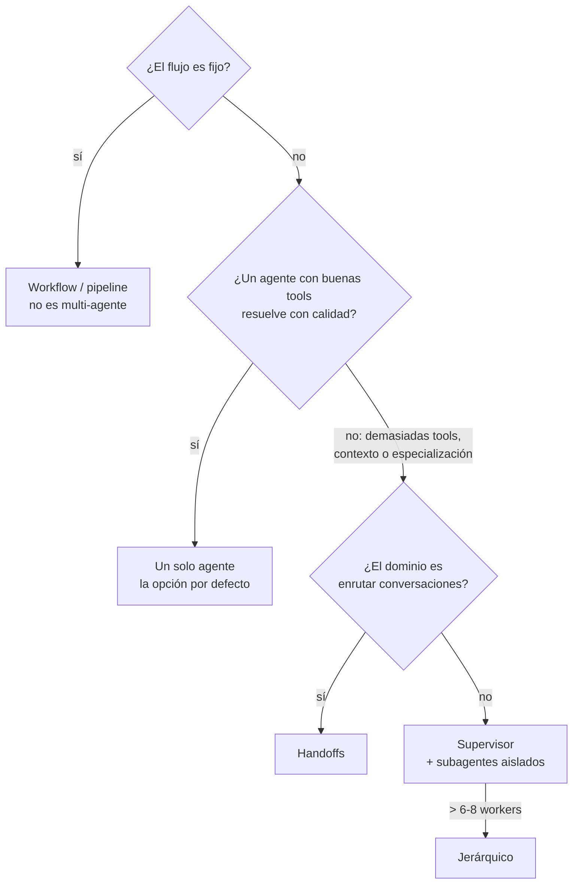

# 05 — Sistemas multi-agente: coordinación, supervisores, comunicación

> **Objetivo:** conocer las topologías multi-agente (supervisor, jerárquica, red, handoffs),
> cómo se comunican los agentes, y — sobre todo — cuándo un solo agente es la respuesta correcta.
> **Lab asociado:** [`../labs/06_multiagente_supervisor.py`](../labs/06_multiagente_supervisor.py)

## 1. Por qué (y por qué no) dividir en varios agentes

Un "sistema multi-agente" es un sistema donde varios bucles de agente — cada uno con su prompt,
sus herramientas y a veces su modelo — colaboran en una tarea. Las razones legítimas para dividir:

1. **Sobrecarga de herramientas.** Un agente con 30 tools elige mal; tres agentes con 8–10 tools
   coherentes cada uno eligen bien. (La ventana de atención sobre los schemas es finita.)
2. **Aislamiento de contexto.** Cada subagente trabaja con su propio historial corto en vez de
   arrastrar todo; el orquestador solo recibe resúmenes. Es la táctica más efectiva contra el
   "contexto que explota".
3. **Especialización real:** prompts de sistema distintos e incompatibles (un crítico despiadado
   y un redactor creativo no conviven bien en un solo prompt), o modelos distintos por coste
   (planner potente, workers baratos).
4. **Paralelismo:** subtareas independientes ejecutándose a la vez (p. ej. investigar 5 fuentes
   en paralelo, como el sistema de research multi-agente de Anthropic).

Y la advertencia simétrica: **cada agente extra añade latencia, coste y un modo de fallo nuevo**
(malentendidos entre agentes, trabajo duplicado, pérdida de información en los resúmenes). La
mayoría de los sistemas "multi-agente" que se publican como demo serían más rápidos, baratos y
fiables como un solo agente con buenas herramientas — o como un workflow. Empieza con uno;
divide cuando midas que la división mejora algo concreto.

## 2. Topologías

### 2.1 Supervisor (orchestrator–workers)

Un agente central recibe la tarea, decide qué especialista actúa, recibe su resultado y decide el
siguiente paso (u otro especialista, o terminar). Los workers no se hablan entre sí: toda
comunicación pasa por el supervisor.

En LangGraph: el supervisor es un nodo LLM cuya salida **estructurada** (un enum:
`researcher | analyst | writer | FINISH`) alimenta una arista condicional que enruta al worker;
cada worker devuelve al supervisor. Es la topología del lab 06 y la más usada en producción
porque el flujo es trazable: siempre sabes quién decidió qué.

**Riesgos propios:** el supervisor como cuello de botella (todo pasa por su contexto — pide a los
workers resúmenes, no transcripciones), y el **ping-pong**: supervisor y worker rebotándose la
tarea sin avanzar. Mismo remedio de siempre: contador de turnos en el estado y salida forzada.

### 2.2 Jerárquica

Supervisores de supervisores: un nivel superior delega en equipos, cada equipo tiene su propio
supervisor y workers. Escala organizativamente (equipos desarrollables y testeables por separado)
a costa de más capas donde perder información. Solo tiene sentido cuando un supervisor plano
superaría los ~6–8 workers.

### 2.3 Red (peer-to-peer) y handoffs

Cada agente puede pasar el control a cualquier otro (**handoff**: "transfiero esta conversación
al agente de reembolsos, con este contexto"). Es el modelo de OpenAI Swarm/Agents SDK y de los
`Command(goto=...)` de LangGraph. Natural para **enrutamiento conversacional** (soporte al
cliente: triaje → especialista), pero como arquitectura general una red completa es difícil de
trazar y depurar — con N agentes hay N² rutas posibles. Prefiere supervisor salvo que el dominio
sea genuinamente "pasar la llamada al departamento adecuado".

### 2.4 Pipeline y debate

- **Pipeline:** A → B → C fijo (redactor → crítico → editor). Si el orden es fijo, esto es un
  workflow con etapas LLM — la opción más depurable; no le llames multi-agente ni le pongas
  supervisor.
- **Debate / comité:** varios agentes proponen, critican las propuestas ajenas y un juez decide.
  Mejora tareas de razonamiento en benchmarks (Du et al., 2023) a un coste de tokens brutal
  (N agentes × R rondas). Nicho: decisiones puntuales de alto valor. Es el patrón del
  "consejo de agentes" que ya conoces si usas comités de agentes en tu flujo de trabajo.

## 3. Comunicación y estado compartido

Dos modelos de comunicación, con consecuencias distintas:

1. **Historial compartido:** todos los agentes leen/escriben la misma lista de mensajes (en
   LangGraph, el mismo canal `messages` del estado). Simple, máxima transparencia — pero el
   contexto crece con todo lo de todos, y los prompts de cada agente deben convivir con mensajes
   "de otros".
2. **Estados aislados + resúmenes (scratchpads privados):** cada subagente corre con su propio
   historial; al supervisor solo vuelve un resultado destilado (en LangGraph: subgrafos con
   esquemas de estado propios, o invocar al worker como función). Controla el contexto, a costa
   de decidir *qué* se destila — la pérdida de información en el resumen es el bug silencioso
   típico de estos sistemas.

Regla práctica: historial compartido para ≤2–3 agentes y tareas cortas; aislamiento con resúmenes
en cuanto la tarea es larga o los workers son verbosos. En ambos casos, define el **contrato del
handoff**: qué campos exactos recibe el worker (tarea, contexto mínimo, formato de respuesta
esperado). Los malentendidos entre agentes son malentendidos de contrato, y se corrigen en el
contrato, no añadiendo "por favor sé claro" al prompt.

Lecciones del sistema de research multi-agente de Anthropic (2025), el escrito público más útil
sobre esto en producción:

- El orquestador debe dar a cada subagente **objetivo, formato de salida, herramientas
  recomendadas y límites** explícitos; las instrucciones vagas producen trabajo duplicado y
  lagunas.
- **Escala el esfuerzo a la complejidad**: consultas simples, 1 agente y 3–10 tool calls; tareas
  grandes, más subagentes con presupuestos claros — codifica esas reglas en el prompt del
  orquestador.
- Los sistemas multi-agente queman ~15× más tokens que un chat; solo valen para tareas cuyo
  valor lo justifica.

## 4. Errores comunes específicos de multi-agente

1. **Multi-agente por estética.** Dividir "porque los agentes especializados son mejores" sin
   medirlo. Cada frontera agente-agente es una pérdida potencial de información.
2. **Ping-pong y bucles de cortesía.** Dos agentes agradeciéndose y re-delegándose la tarea.
   Límite de turnos global + prompts que prohíben delegar sin añadir trabajo nuevo.
3. **Trabajo duplicado en paralelo** por instrucciones de reparto vagas (dos workers investigando
   lo mismo). El reparto lo hace el orquestador con límites nítidos, no los workers.
4. **Resúmenes con pérdida en el punto crítico:** el worker encontró el dato clave, el resumen lo
   omitió, el supervisor concluye mal. Exige a los workers formato de salida con campos
   obligatorios ("hallazgos", "fuentes", "lagunas").
5. **Evaluar solo el resultado final.** Cuando falla, no sabes qué agente falló. Traza cada
   transición (LangSmith) y evalúa también decisiones intermedias del supervisor (fichero 08).
6. **Presupuesto sin dueño:** N agentes × M vueltas × contexto creciente = factura sorpresa.
   Presupuesto de tokens/llamadas por tarea, medido y con corte.

## 5. Criterio de decisión (resumen ejecutivo)

## Para profundizar

- Anthropic, *How we built our multi-agent research system* (2025) — [anthropic.com/engineering/multi-agent-research-system](https://www.anthropic.com/engineering/multi-agent-research-system)
- Docs de LangGraph, *Multi-agent systems* — [langchain-ai.github.io/langgraph/concepts/multi_agent/](https://langchain-ai.github.io/langgraph/concepts/multi_agent/) — supervisor, jerárquico, handoffs con `Command`.
- Anthropic, *Building effective agents* (2024) — patrón orchestrator-workers.
- Du et al., *Improving Factuality and Reasoning in Language Models through Multiagent Debate* (2023) — [arxiv.org/abs/2305.14325](https://arxiv.org/abs/2305.14325)
- Wu et al., *AutoGen: Enabling Next-Gen LLM Applications via Multi-Agent Conversation* (2023) — [arxiv.org/abs/2308.08155](https://arxiv.org/abs/2308.08155)
