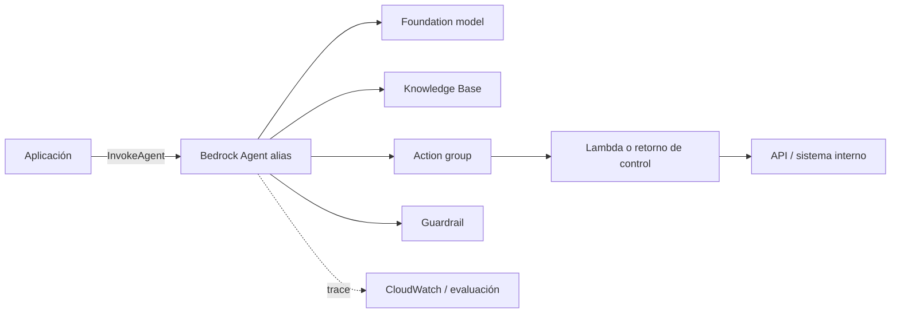

# 07 — Agents for Amazon Bedrock

> Tema teórico con walkthrough. Requiere cuenta AWS para ejecutarlo y puede generar coste.

Agents for Amazon Bedrock es la opción gestionada de AWS para orquestar un foundation model,
action groups y Knowledge Bases. El servicio resuelve parte del bucle y del despliegue; tú sigues
siendo responsable de contratos de herramientas, permisos, evaluación, costes y efectos.

## 1. Mapa de componentes



- **Agent:** instrucciones, modelo y estrategia de orquestación.
- **Action group:** conjunto de acciones descritas por funciones o por un esquema OpenAPI.
- **Executor:** normalmente Lambda; también puedes pedir *return of control* para ejecutar en tu app.
- **Knowledge Base:** retrieval gestionado que el agente puede consultar.
- **Guardrail:** políticas de contenido, temas, palabras y detección de información sensible.
- **Alias:** endpoint lógico que apunta a una versión preparada del agente.
- **Session:** conversación identificada por `sessionId`, con atributos y estado.

## 2. Ciclo de vida

1. Crea el agente con un rol IAM de servicio de mínimo privilegio.
2. Elige modelo compatible y escribe instrucciones.
3. Añade action groups y, si aplica, una Knowledge Base y un Guardrail.
4. **Prepare** valida y construye el borrador de trabajo.
5. Prueba en el alias de test con trazas activadas.
6. Crea una versión inmutable y un alias de entorno.
7. Invoca el alias desde la aplicación.
8. Evalúa, monitoriza y promociona o revierte el alias.

No conectes producción al borrador mutable. El alias permite despliegue controlado y rollback.

## 3. Diseñar action groups

Una acción estrecha y tipada supera a una Lambda genérica:

```yaml
openapi: 3.0.3
info:
  title: NebulaOps Incidents API
  version: 1.0.0
paths:
  /incidents/{incidentId}:
    get:
      operationId: getIncident
      description: Recupera estado y severidad de un incidente existente. No modifica datos.
      parameters:
        - name: incidentId
          in: path
          required: true
          schema:
            type: string
            pattern: '^INC-[0-9]{6}$'
      responses:
        '200':
          description: Incidente encontrado
        '404':
          description: El incidente no existe
```

Separa lectura de escritura. `getIncident` puede ejecutarse automáticamente; `closeIncident`
debería exigir confirmación, autorización adicional e idempotency key.

La Lambda valida de nuevo todos los parámetros. El esquema guía al modelo, no autentica al usuario
ni prueba que el cambio tenga sentido.

## 4. Lambda frente a return of control

**Lambda executor:** Bedrock invoca la función con el evento del action group. Conviene cuando la
integración vive en AWS y quieres un flujo gestionado.

**Return of control:** el agente devuelve a tu aplicación la acción y los parámetros; tu código
ejecuta y reanuda la sesión con el resultado. Conviene si:

- necesitas confirmación interactiva;
- la API vive fuera de AWS;
- quieres aplicar autorización con el contexto de tu aplicación;
- el efecto debe pasar por una cola o workflow propio;
- necesitas controlar exactamente reintentos e idempotencia.

No devuelvas credenciales ni errores internos al modelo. Traduce fallos a resultados seguros y
accionables.

## 5. Invocación desde boto3

El cliente de inferencia es `bedrock-agent-runtime`, distinto del cliente de administración:

```python
import boto3


runtime = boto3.client("bedrock-agent-runtime", region_name="eu-west-1")
response = runtime.invoke_agent(
    agentId="ABCDEFGHIJ",
    agentAliasId="TSTALIASID",
    sessionId="user-42:conversation-7",
    inputText="Consulta el estado del incidente INC-004217",
    enableTrace=True,
)

parts: list[str] = []
for event in response["completion"]:
    if "chunk" in event:
        parts.append(event["chunk"]["bytes"].decode("utf-8"))
    if "trace" in event:
        trace = event["trace"]
        print(trace)

answer = "".join(parts)
print(answer)
```

La respuesta es un event stream. Procesa chunks, trazas, retornos de control y errores; no asumas
que siempre llega un único bloque de texto.

Genera `sessionId` en servidor y asócialo al usuario autenticado. No permitas que un cliente lea o
continúe sesiones ajenas eligiendo IDs.

## 6. Sesiones, atributos y memoria

Los atributos de sesión sirven para datos de vida corta como locale o filtros de tenant. No metas
secretos ni confíes en atributos aportados por el cliente sin validarlos. Para datos autoritativos,
consulta el sistema fuente mediante una acción.

Si habilitas capacidades de memoria, define retención, aislamiento, corrección y borrado como en
el tema 06. "Gestionado" no elimina obligaciones de privacidad.

## 7. Knowledge Bases integradas

La integración facilita que el agente decida recuperar contexto. Aun así debes medir:

- cobertura y calidad de ingestión;
- chunking y embeddings;
- filtros de metadata por tenant/versión;
- context precision/recall;
- faithfulness y citas;
- comportamiento ante corpus vacío o contradictorio.

Una acción explícita de retrieval puede ser preferible cuando necesitas controlar top-k, reranking,
trazas o un vector store ya existente.

## 8. IAM y red

El rol del agente solo debe poder invocar los modelos, KBs, guardrails y Lambdas concretos que
necesita. La Lambda usa otro rol limitado a su backend. Separa identidades para que comprometer una
capa no entregue todos los permisos.

Controles habituales:

- condiciones por ARN y región;
- KMS para datos cifrados cuando aplique;
- Secrets Manager para credenciales externas;
- VPC endpoints/PrivateLink según arquitectura;
- CloudTrail para cambios administrativos;
- logs con redacción de PII y retención definida.

## 9. Trazas y evaluación

`enableTrace=True` ayuda a observar razonamiento de orquestación, selección de action group,
inputs, outputs y retrieval. Las trazas pueden contener datos sensibles: controla acceso y
retención.

Dataset mínimo:

- selección correcta de cada acción;
- casos donde no debe llamar ninguna;
- argumentos inválidos y entidades ambiguas;
- timeouts, 4xx, 5xx y resultados vacíos;
- autorización denegada;
- confirmación de acciones con efecto;
- prompt injection directa e indirecta;
- límite de pasos y coste por tarea.

Mide éxito final, precisión de tool selection, exactitud de argumentos, pasos, latencia y coste.

## 10. Bedrock Agents frente a LangGraph

| Necesidad | Bedrock Agents | LangGraph |
|---|---|---|
| Operación AWS gestionada | fuerte | la construyes |
| Control exacto del grafo | limitado/configurable | alto |
| Portabilidad de proveedor | baja | alta |
| Integración IAM/KB/Guardrails | nativa | manual |
| Debug de cada transición | trazas del servicio | estado y código propios |
| Lógica determinista compleja | puede forzarse | natural |

Elige por requisitos operativos y de control. No uses Bedrock Agents solo porque ya usas un modelo
de Bedrock; una llamada Converse más un workflow determinista puede ser suficiente.

## Errores comunes

1. Dar a la Lambda permisos amplios porque "solo la llama el agente".
2. Desplegar el draft en vez de versionar y usar alias.
3. Tratar guardrails como sustituto de autorización.
4. No capturar el event stream completo ni las trazas de fallo.
5. Permitir acciones destructivas sin confirmación/idempotencia.
6. Confundir `bedrock-agent` (control plane) con `bedrock-agent-runtime` (inferencia).
7. Evaluar únicamente en la consola con ejemplos felices.

## Para profundizar

- Agents for Amazon Bedrock: https://docs.aws.amazon.com/bedrock/latest/userguide/agents.html
- Action groups: https://docs.aws.amazon.com/bedrock/latest/userguide/agents-action-create.html
- Runtime `invoke_agent`: https://boto3.amazonaws.com/v1/documentation/api/latest/reference/services/bedrock-agent-runtime/client/invoke_agent.html
- Security in Amazon Bedrock: https://docs.aws.amazon.com/bedrock/latest/userguide/security.html
