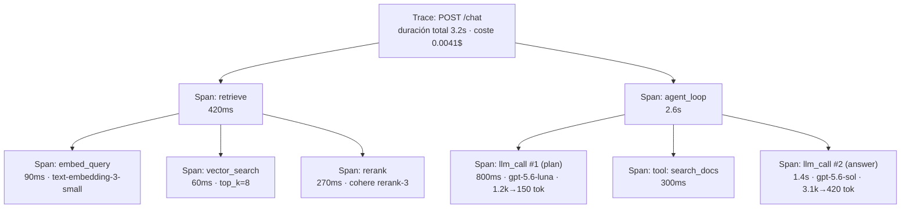
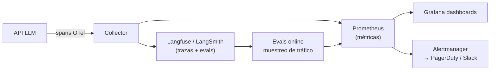

# Observabilidad LLM: trazas, spans, métricas y alertas

> **Labs asociados:** [`01_trazas_manuales.py`](../labs/01_trazas_manuales.py) y
> [`02_langsmith_tracing.py`](../labs/02_langsmith_tracing.py)

## Por qué la observabilidad LLM es distinta

Un servicio web clásico es (casi) determinista: misma entrada, misma salida, y los fallos
son excepciones que puedes capturar. Un sistema LLM falla de formas que no lanzan ninguna
excepción: la respuesta llega en 200 OK pero es una alucinación, el agente entra en un bucle
de 40 llamadas que cuesta 2 €, o un cambio de prompt "inocente" degrada la calidad un 15 %
sin que ningún dashboard se entere.

La consecuencia práctica: **la observabilidad clásica (¿está vivo? ¿responde rápido?) es
necesaria pero no suficiente**. Necesitas tres capas:

1. **Infraestructura**: latencia, throughput, errores HTTP, saturación. Lo de siempre.
2. **LLM-específica**: tokens de entrada/salida, coste por request, modelo usado, tasa de
   caché, número de pasos de agente, tool calls fallidas.
3. **Calidad**: feedback de usuario, evaluaciones online (LLM-as-judge sobre muestras de
   tráfico), tasa de respuestas "no sé", detección de degradación por drift.

La capa 3 conecta con el siguiente tema del módulo ([evaluación continua](02-evaluacion-continua.md)):
observabilidad y evaluación son el mismo músculo, uno mira producción y el otro mira CI.

## El modelo mental: trazas, spans y metadatos

El vocabulario viene de tracing distribuido (OpenTelemetry) y todas las herramientas LLM
lo han adoptado:

- **Traza (trace)**: el registro completo de una request de usuario, de punta a punta.
  "El usuario preguntó X y esto es todo lo que pasó hasta que respondimos".
- **Span**: cada operación dentro de la traza, con inicio, fin y metadatos. Un span puede
  contener spans hijos, formando un árbol.
- **Metadatos/atributos**: pares clave-valor sobre el span: modelo, tokens, temperatura,
  versión del prompt, id de usuario (pseudonimizado), coste estimado.

Una traza típica de un sistema RAG con agente:



Este árbol responde las preguntas que importan en producción:

- ¿Dónde se va el tiempo? (aquí: en la segunda llamada LLM, no en el retrieval)
- ¿Dónde se va el dinero? (en la llamada a `gpt-5.6-sol` con 3.1k tokens de entrada)
- ¿Qué contexto exacto vio el modelo cuando alucinó? (el input del span `llm_call #2`)

**Regla de oro**: si no guardas los inputs y outputs completos de cada llamada LLM, no
puedes depurar. Un log que dice "llamada al LLM, 200 OK, 1.4s" es inútil cuando el
usuario reporta una respuesta mala. La contrapartida es privacidad y volumen — se gestiona
con retención corta, muestreo y redacción de PII, no renunciando a los payloads.

## Las cuatro métricas que siempre debes emitir

| Métrica | Tipo | Ejemplo de dimensiones (labels) | Para qué |
|---|---|---|---|
| `llm_request_duration_seconds` | histograma | modelo, endpoint, éxito/error | Latencia P50/P95/P99. En LLM streaming, mide también **TTFT** (time to first token): es lo que percibe el usuario. |
| `llm_tokens_total` | contador | modelo, dirección (input/output) | Base del coste y de detectar prompts que engordan. |
| `llm_cost_usd_total` | contador | modelo, feature, tenant | Coste por request, por feature y por cliente. Imprescindible para pricing. |
| `llm_errors_total` | contador | modelo, tipo (rate_limit, timeout, content_filter, invalid_json) | Los errores LLM tienen tipos propios: un 429 del proveedor y un JSON malformado se mitigan de formas distintas. |

Sobre estas cuatro se construyen las derivadas: coste/día, coste medio por conversación,
ratio tokens output/input (si sube, tus respuestas se están alargando), tasa de hit de
caché, etc. El lab [`01_trazas_manuales.py`](../labs/01_trazas_manuales.py) implementa
exactamente esto a mano, sin ninguna plataforma, para que veas que no hay magia.

### Latencia en LLMs: P95 y TTFT, no la media

La latencia LLM tiene cola larga: la media miente. Reporta percentiles. Y con streaming,
separa dos números:

- **TTFT (time to first token)**: percepción de arranque. Objetivo típico < 1 s.
- **Duración total**: depende linealmente de los tokens de salida (~cada token de salida
  cuesta un forward pass). Si quieres bajar la latencia total, la palanca más barata suele
  ser **pedir respuestas más cortas**, no cambiar de infraestructura.

## Logs estructurados: JSON o nada

En producción, un log es un evento que una máquina va a agregar, no una frase para humanos.
Formato mínimo razonable por cada llamada LLM (el lab 01 lo genera):

```json
{
  "timestamp": "2026-08-21T10:32:11Z",
  "event": "llm_call",
  "trace_id": "a1b2c3",
  "model": "gpt-5.6-luna",
  "latency_ms": 812,
  "tokens_in": 1240,
  "tokens_out": 158,
  "cost_usd": 0.000281,
  "prompt_version": "support-v3",
  "success": true
}
```

Puntos que la gente descubre tarde:

- **`prompt_version` es la dimensión más valiosa** y casi nadie la emite. Sin ella no
  puedes correlacionar "desplegamos el prompt v4 el martes" con "la satisfacción cayó el
  martes".
- `trace_id` propagado por todos los componentes (API → retriever → agente) es lo que
  permite reconstruir la traza. Con OpenTelemetry esto viene gratis vía contexto.
- Los payloads completos (prompt y respuesta) van a un almacén aparte con retención y
  control de acceso propios, no al log general.

## Plataformas: LangSmith, Langfuse y el ecosistema OTel

| | **LangSmith** | **Langfuse** | **OpenTelemetry + backend genérico** |
|---|---|---|---|
| Modelo | SaaS propietario (LangChain Inc.); self-host solo en plan enterprise | **Open-source (MIT en core)**, self-host gratuito con Docker, o cloud | Estándar abierto; tú eliges backend (Jaeger, Grafana Tempo, Datadog…) |
| Integración | Trivial con LangChain/LangGraph (env vars y ya); `@traceable` para código propio | SDK propio + decorador `@observe`; integraciones OpenAI/LangChain/LiteLLM | Instrumentación manual o auto-instrumentación (p. ej. OpenLLMetry) |
| Puntos fuertes | Datasets + evals integrados con el tracing; playground para reproducir llamadas; annotation queues | Self-host barato, prompt management, evals, buen soporte multi-proveedor | Neutralidad total, se integra con la observabilidad que ya tenga tu empresa |
| Puntos débiles | Lock-in relativo; coste a volumen alto; incómodo fuera del ecosistema LangChain | Menos pulido en evals que LangSmith; operar el self-host es trabajo tuyo | No entiende semántica LLM out-of-the-box: tokens/coste/evals los montas tú |
| Cuándo elegirla | Ya usas LangChain/LangGraph y quieres velocidad | Quieres control del dato (GDPR, sanidad, banca) o coste predecible | Organización grande con plataforma de observabilidad establecida |

Notas de realidad:

- Las tres opciones convergen: Langfuse y LangSmith aceptan trazas OTel, y la convención
  semántica **GenAI de OpenTelemetry** (atributos `gen_ai.*`) va camino de ser el estándar
  común. Instrumentar con OTel es la apuesta menos arriesgada a 3 años vista.
- El coste de estas plataformas escala por eventos/spans ingeridos. Un agente de 30 pasos
  genera 30+ spans por request: a 100k requests/día son millones de spans. **Muestrea**:
  100 % de las trazas con error o feedback negativo, 1–10 % del resto.
- En el docker-compose de este módulo ([docker/](../docker/README.md)) levantamos
  **Langfuse self-hosted** junto a la API, para que veas el stack completo sin depender
  de ningún SaaS.

## Alertas: qué avisa y qué no

Una alerta debe ser accionable a las 3 de la mañana; lo demás es un dashboard. Para LLMs:

**Alertas (pagean):**

- Tasa de error > umbral (separando 429/5xx del proveedor de errores propios).
- P95 de latencia o TTFT fuera de SLO durante N minutos.
- **Gasto**: coste por hora > X, o proyección de coste diario > presupuesto. Esta es la
  alerta más específica de LLMOps: un bucle de agente desbocado puede quemar cientos de
  euros en una noche. Ponle presupuesto y circuit breaker, no solo alerta.
- Caída de la tasa de éxito de validación de salida (JSON inválido, guardrail disparado
  en > X % de respuestas).

**Dashboard (no pagean):**

- Deriva lenta de calidad (evals online), distribución de tokens, hit rate de caché,
  mezcla de modelos del router.



## Errores comunes

1. **Loguear solo metadatos y no payloads.** Cuando llegue el bug de calidad no podrás
   reproducirlo. Guarda inputs/outputs con retención y acceso controlados.
2. **Medir latencia media en vez de percentiles**, y no medir TTFT en streaming.
3. **No versionar prompts en las trazas.** Todo cambio de prompt es un despliegue; si no
   aparece en la telemetría, es un despliegue invisible.
4. **Calcular coste con precios hardcodeados y no actualizarlos.** Los precios de los
   proveedores cambian varias veces al año. Centraliza la tabla de precios (o usa la de
   LiteLLM, que la mantiene) y ponle fecha.
5. **Instrumentar solo las llamadas LLM.** El retrieval, el reranking y las tools también
   fallan y también son lentos; sin sus spans, cada depuración empieza a ciegas.
6. **Alertar por calidad con umbrales duros sobre muestras pequeñas.** Un LLM-as-judge
   sobre 20 requests/hora tiene varianza enorme; alerta sobre ventanas y tendencias.
7. **Enviar PII a un SaaS de observabilidad sin pasarlo por legal.** Los prompts contienen
   datos de usuario. Redacción de PII o self-host (Langfuse) si el dato es sensible.

## Para profundizar

- LangSmith — documentación de observabilidad: <https://docs.langchain.com/langsmith/observability>
- Langfuse — self-hosting y arquitectura: <https://langfuse.com/self-hosting>
- OpenTelemetry — convenciones semánticas para GenAI: <https://opentelemetry.io/docs/specs/semconv/gen-ai/>
- OpenLLMetry (Traceloop) — auto-instrumentación OTel para LLMs: <https://github.com/traceloop/openllmetry>
- Google SRE Book, cap. 6 "Monitoring Distributed Systems" (los cuatro golden signals): <https://sre.google/sre-book/monitoring-distributed-systems/>
- Prometheus — tipos de métricas e histogramas: <https://prometheus.io/docs/concepts/metric_types/>
