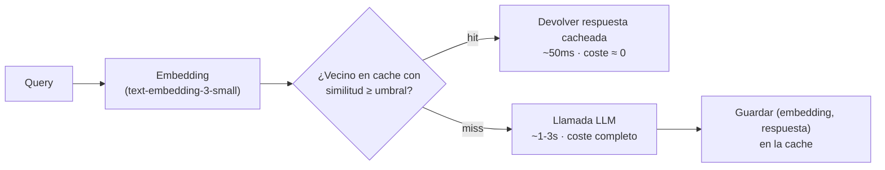

# Optimización de costes: caching semántico, model routing y batching

> **Labs asociados:** [`03_cache_semantico.py`](../labs/03_cache_semantico.py) y
> [`04_model_routing.py`](../labs/04_model_routing.py)

## Entender la factura antes de optimizarla

El coste de un sistema LLM con API de proveedor es, esencialmente:

```
coste = Σ requests × (tokens_in × precio_in + tokens_out × precio_out)
```

Tres observaciones que ordenan todas las técnicas de este capítulo:

1. **Los tokens de salida cuestan típicamente 3–4× más** que los de entrada. Respuestas
   más cortas = más baratas *y* más rápidas.
2. **La diferencia de precio entre tiers puede ser de un orden de magnitud** (p. ej.
   `gpt-5.6-luna` frente a `gpt-5.6-sol`, Haiku frente a Opus). Ninguna optimización de infra se acerca al ahorro de usar
   el modelo pequeño donde basta → *routing*.
3. **Gran parte del tráfico real es repetitivo**: las mismas preguntas, el mismo system
   prompt, los mismos documentos en contexto → *caching* en sus tres formas.

Antes de optimizar, **mide** (capítulo [01](01-observabilidad.md)): coste por request,
por feature y por usuario. La optimización sin medición es superstición; con medición,
suele empezar por un hallazgo vergonzoso tipo "el 40 % del gasto es un cron que nadie
recuerda".

Orden recomendado de las palancas, por ratio ahorro/esfuerzo:

| Palanca | Ahorro típico | Esfuerzo | Riesgo de calidad |
|---|---|---|---|
| Acortar prompts y salidas (limpiar contexto, `max_tokens`, pedir concisión) | 20–50 % | Bajo | Bajo |
| Prompt caching del proveedor | 50–90 % del coste del prefijo repetido | Bajo | Nulo |
| Model routing (pequeño por defecto, grande bajo demanda) | 30–70 % | Medio | Medio |
| Caching exacto y semántico de respuestas | Depende del tráfico (hit rate) | Medio | Medio |
| Batch API para cargas offline | 50 % fijo | Bajo | Nulo (si toleras latencia) |
| Self-hosting de modelos abiertos | Variable; solo a gran escala | Alto | Alto |

## Caching: tres niveles distintos que la gente confunde

### 1. Prompt caching (del proveedor, sobre el prefijo)

OpenAI, Anthropic y Bedrock cachean el **prefijo** del prompt (system prompt, few-shots,
documentos largos) y cobran los tokens cacheados a una fracción del precio (50 % en
OpenAI automático; hasta 90 % de descuento con cache explícita en Anthropic). No devuelve
respuestas cacheadas: solo abarata reprocesar el mismo prefijo.

Implicación de diseño: **pon lo estático al principio y lo variable al final**. Un system
prompt de 4k tokens seguido de la pregunta del usuario cachea 4k tokens; si intercalas la
fecha actual al principio del system prompt, rompes la cache en cada request.

### 2. Cache exacta de respuestas

`hash(modelo + params + prompt) → respuesta`, en Redis o similar. Hit rate alto solo
cuando las entradas se repiten literalmente (FAQs con botón, pipelines batch). Barata,
sin falsos positivos, TTL y listo.

### 3. Cache semántica (lab 03)

La idea: "¿cuánto cuesta enviar un email con adjunto?" y "como adjunto un archivo a un
correo, ¿me cobran?" deberían compartir respuesta. Pipeline:



El parámetro crítico es el **umbral de similitud**, y es un trade-off puro:

- Umbral alto (≥ 0.95): pocos hits, casi ningún falso positivo.
- Umbral bajo (≤ 0.85): buen hit rate, y empiezas a devolver **respuestas incorrectas
  con total confianza** — el peor modo de fallo posible, porque no hay error que loguear.

Reglas duras aprendidas en producción:

- **Nunca caches semánticamente respuestas personalizadas** (dependen del usuario, de la
  fecha, del estado de una cuenta). Solo conocimiento general y estable. Segmenta la cache
  por tenant si hay datos privados: un hit cross-tenant es una fuga de datos.
- La similitud coseno no entiende negaciones ni entidades: "¿puedo cancelar?" y "¿puedo
  cancelar sin coste?" quedan cerquísima. Mide el hit rate **y** la tasa de falsos
  positivos con un dataset etiquetado antes de fijar el umbral (el lab 03 hace ambas).
- Invalidación: TTL corto (horas/días) + purga cuando cambie la base de conocimiento.
- Herramientas: el lab lo hace a mano (embeddings + coseno, y así se entiende); en
  producción, Redis con búsqueda vectorial (LangCache), GPTCache, o la cache integrada
  de un gateway como LiteLLM.

## Model routing: el modelo caro solo cuando hace falta

La mayoría del tráfico de un asistente real es trivial (saludos, FAQs, reformulaciones)
y una minoría es difícil (razonamiento multi-paso, código, análisis largos). Pagar
el tier insignia/Opus para el 100 % es tirar dinero; usar solo el pequeño degrada el 20 % difícil.

Estrategias de clasificación de la query, de simple a sofisticada:

1. **Heurísticas** (longitud, palabras clave, ¿hay código?, ¿pide análisis?): gratis,
   sorprendentemente efectivas como línea base. Es lo que implementa el lab 04.
2. **Clasificador LLM de volumen**: `gpt-5.6-luna` decide "simple/compleja"; mide el
   precio real de la corrida en vez de copiar una cifra que caduca.
   Pagas una llamada extra pero pequeña; cuidado con la latencia añadida.
3. **Clasificador entrenado** (regresión logística/BERT sobre embeddings de queries
   etiquetadas con "¿bastó el modelo pequeño?"): lo que hacen RouteLLM y los routers
   comerciales (OpenRouter, Martian, el routing de LiteLLM).
4. **Cascada (fallback)**: intenta siempre el barato; si la respuesta no pasa validación
   (JSON inválido, juez la puntúa baja, el propio modelo dice "no estoy seguro"),
   reintenta con el caro. Máximo ahorro, pero duplica latencia en los escalados y
   necesitas un validador fiable.

Métricas del router que debes vigilar: % de tráfico por modelo, tasa de escalado, y —
la que se olvida — **calidad por rama** (evals muestreadas sobre lo que respondió el
barato). Un router sin evals deriva silenciosamente hacia "todo al barato, calidad en
caída libre".

Nota de arquitectura: el routing encaja de forma natural en un **gateway LLM** (LiteLLM
proxy, OpenRouter, Bedrock inference profiles): un punto único que ya centraliza claves,
retries, límites de gasto y telemetría. Si vas a hacer routing serio, hazlo ahí y no
esparcido por el código de la app.

## Batching: dos significados distintos

### Batch API del proveedor (offline)

OpenAI y Anthropic ofrecen endpoints batch: subes miles de requests, te comprometes a
esperar (hasta 24 h, normalmente mucho menos) y pagan **50 % del precio**. Úsalo para
todo lo que no sea interactivo: generación de embeddings masiva, enriquecimiento de
catálogos, evals nocturnas, clasificación retroactiva. Es la palanca más fácil del
capítulo: mismo código, mitad de precio, cero riesgo de calidad.

### Continuous batching (en serving propio)

Si sirves modelos open-source (capítulo [05](05-despliegue-open-source.md)), el servidor
(vLLM, TGI) agrupa requests concurrentes en cada forward pass de la GPU. No es una
técnica que "actives" desde el cliente: es el motivo por el que vLLM multiplica el
throughput frente a servir con transformers a pelo. Aquí solo importa la conexión
conceptual: batching online = throughput de GPU; batch API = descuento por latencia.

## Otras palancas que debes conocer

- **`max_tokens` y formato de salida**: pedir JSON compacto con campos cortos en vez de
  prosa reduce tokens de salida (los caros) sin perder información.
- **Recorte de contexto en RAG**: pasar 4 chunks relevantes en vez de 12 mediocres ahorra
  y además mejora la calidad (lost in the middle, módulo III).
- **Historial de conversación**: resumir o truncar el historial en vez de reenviarlo
  entero; un chat largo sin gestión de historial crece cuadráticamente en coste.
- **Distillation / fine-tuning de un modelo pequeño** con salidas del grande: convierte
  una tarea estable de un tier general a un modelo pequeño fine-tuneado. Solo para tareas de alto volumen
  y bien acotadas: el fine-tuning es un compromiso de mantenimiento.

## Errores comunes

1. **Optimizar sin baseline de calidad.** Primero la suite de evals (capítulo 02), luego
   el router y la cache. Si no, no sabrás qué has roto.
2. **Cache semántica con umbral elegido "a ojo".** El umbral se elige con un dataset de
   pares (duplicado real / parecido-pero-distinto) mirando falsos positivos.
3. **Cachear respuestas con datos personales o temporales.** "¿Cuál es mi saldo?" nunca
   puede salir de una cache compartida.
4. **Routing sin telemetría por rama.** Ahorro visible, degradación invisible.
5. **Ignorar la Batch API.** Equipos que pelean céntimos en el prompt mientras corren
   millones de embeddings a precio interactivo.
6. **Saltar a self-hosting "para ahorrar" demasiado pronto.** Una GPU A100/H100 corriendo
   24/7 más el ingeniero que la cuida cuesta más que la factura de API de la mayoría de
   productos pequeños. Haz el número completo (capítulo 05).
7. **Romper el prompt caching** metiendo contenido variable (fecha, nombre del usuario)
   al principio del prompt.

## Para profundizar

- OpenAI — prompt caching y Batch API: <https://platform.openai.com/docs/guides/prompt-caching> · <https://platform.openai.com/docs/guides/batch>
- Anthropic — prompt caching: <https://docs.anthropic.com/en/docs/build-with-claude/prompt-caching>
- GPTCache (arquitectura de cache semántica): <https://github.com/zilliztech/GPTCache>
- Redis — semantic caching para LLMs: <https://redis.io/docs/latest/develop/ai/>
- RouteLLM (paper y framework de routing): <https://arxiv.org/abs/2406.18665>
- LiteLLM — router y proxy/gateway: <https://docs.litellm.ai/docs/routing>
- Kwon et al., "Efficient Memory Management for LLM Serving with PagedAttention" (vLLM, continuous batching): <https://arxiv.org/abs/2309.06180>
