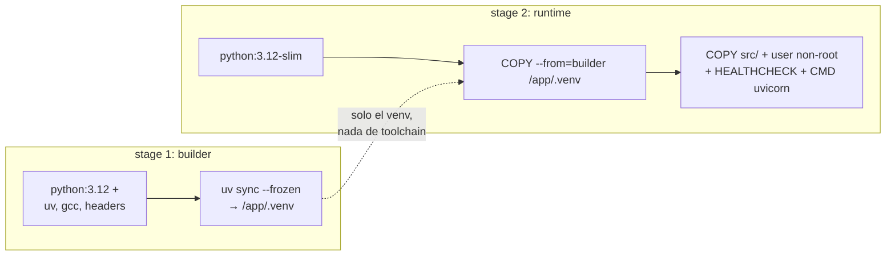

# Docker para LLMs: contenedores, multi-stage builds y optimización de imágenes

> **Práctica asociada:** [`docker/`](../docker/README.md) — Dockerfile multi-stage real
> para una API FastAPI + Prometheus, explicado y verificable sin claves.

## Qué contenerizas exactamente (y qué no)

En un sistema LLM hay tres cosas empaquetables, con perfiles totalmente distintos:

| Qué | Imagen típica | Particularidad |
|---|---|---|
| **La API de aplicación** (FastAPI que llama a OpenAI/Bedrock) | 150–400 MB | Es un servicio Python normal. Este capítulo va sobre esto. |
| **El servidor de inferencia** (vLLM, TGI, Triton) | 5–15 GB | Base CUDA, drivers, necesita `--gpus`; los **pesos del modelo NUNCA van en la imagen**: se montan como volumen o se descargan al arrancar. |
| **El stack de apoyo** (Langfuse, Redis, Postgres, vector DB) | según imagen oficial | Se orquesta con compose; no lo construyes tú. |

La regla de los pesos merece énfasis: un modelo de 7B son ~14 GB en fp16. Meterlos en la
imagen da imágenes de 20 GB que tardan 10 minutos en hacer pull, rompen el límite de
muchos registries y acoplan versión de código a versión de modelo. Los pesos son *datos*:
volumen, object storage (S3) o descarga en el arranque con cache local.

## Repaso mínimo: capas y cache de build

Cada instrucción del Dockerfile crea una capa inmutable. Docker reutiliza capas cacheadas
hasta la primera instrucción cuyo input cambió; a partir de ahí, reconstruye todo. De aquí
sale la regla nº 1 de todo Dockerfile de Python:

```dockerfile
# MAL: cualquier cambio de código reinstala todas las dependencias
COPY . .
RUN pip install -r requirements.txt

# BIEN: las dependencias solo se reinstalan si cambia el lockfile
COPY pyproject.toml uv.lock ./
RUN uv sync --frozen --no-dev
COPY . .
```

En un proyecto LLM esto importa el doble: dependencias como `torch` o `vllm` pesan
gigabytes y tardan minutos; con el orden correcto, el rebuild tras tocar código tarda
segundos.

## Multi-stage builds: por qué y cómo

Un multi-stage build usa una imagen "builder" con todas las herramientas de compilación
y copia al stage final **solo los artefactos**: el venv y el código. Resultado: imagen
final sin compiladores, sin caches de pip, sin `.git`, y muchas veces la mitad de tamaño.



Beneficios concretos:

- **Tamaño**: menos pull time = despliegues y autoescalado más rápidos (en Fargate o
  Lambda, el tamaño de imagen es literalmente latencia de cold start).
- **Superficie de ataque**: sin gcc, sin curl, sin pip en la imagen final, un atacante
  que consiga ejecución tiene muchas menos herramientas. Esto conecta con el
  [capítulo 08](08-seguridad-y-governance.md).
- **Separación build/runtime**: los secretos de build (tokens de repos privados) se usan
  en el builder y no existen en la imagen final (usa `--mount=type=secret`, nunca `ENV`).

El [Dockerfile del módulo](../docker/Dockerfile) implementa este patrón con `uv` y está
comentado línea a línea en [docker/README.md](../docker/README.md).

## Checklist de una imagen de producción para una API LLM

1. **Base `-slim`, versión pineada** (`python:3.12-slim-bookworm`, no `latest`).
   Alpine + Python es una trampa conocida: musl obliga a compilar wheels (pydantic,
   numpy…) y los builds se vuelven lentos y frágiles.
2. **`.dockerignore` agresivo**: `.git`, `.venv`, `__pycache__`, datasets, notebooks,
   `.env`. Un `.env` copiado a una imagen es un secreto filtrado a todo el que pueda
   hacer pull.
3. **Usuario non-root** (`USER app`). Los runtimes serios (y los escáneres de seguridad)
   lo exigen.
4. **Secretos por entorno, jamás en la imagen**: `docker run -e OPENAI_API_KEY` en local;
   en AWS, Secrets Manager inyectado por la task definition ([capítulo 06](06-aws-despliegue.md)).
5. **`HEALTHCHECK` / endpoint `/health`**: el orquestador necesita distinguir "arrancando"
   de "muerto". Para una API LLM, el health check **no** debe llamar al proveedor LLM
   (te cobraría y acoplaría tu salud a la suya); comprueba solo que el proceso responde.
6. **Graceful shutdown**: uvicorn maneja SIGTERM, pero asegúrate de usar la forma *exec*
   de CMD (`CMD ["uvicorn", ...]`, con corchetes) para que las señales lleguen al proceso
   y las requests en vuelo (que en LLM duran segundos) terminen antes de morir.
7. **Timeouts pensados para LLM**: una respuesta larga puede tardar 60–120 s. Alinea
   timeout de uvicorn/gunicorn, del load balancer y del cliente, o tendrás 504s fantasma.
8. **Escaneo de vulnerabilidades en CI**: `docker scout cves` o `trivy image` como paso
   del pipeline.
9. **Plataforma explícita**: en Mac con Apple Silicon, construye con
   `--platform linux/amd64` si el destino es Fargate/EC2 x86 (o usa builds multi-arch
   con buildx). El "en mi máquina funciona" de 2026 es un error de arquitectura de CPU.

## Particularidades de imágenes con GPU (serving propio)

Cuando el contenedor es el servidor de inferencia (vLLM, TGI, Triton):

- Base sobre imágenes CUDA de NVIDIA (`nvidia/cuda:12.x-runtime`) o directamente la
  imagen oficial (`vllm/vllm-openai`, que ya resuelve el infierno de versiones
  torch/CUDA/driver). **Usa la oficial salvo motivo fuerte.**
- En el host hace falta el **NVIDIA Container Toolkit**; se ejecuta con `--gpus all`
  (o `runtime: nvidia` en compose).
- La versión de driver del host debe ser ≥ la que exige el CUDA de la imagen: es el
  fallo de arranque más común en despliegues GPU.
- En Kubernetes: `resources.limits: nvidia.com/gpu: 1` + device plugin. Fuera del alcance
  de este módulo, pero el concepto es idéntico.
- En un Mac (como esta máquina de desarrollo) **no hay CUDA**: los contenedores GPU no
  corren. Para desarrollo local se usa Ollama nativo (lab 06) y el serving GPU se aprende
  en teoría o en una instancia cloud puntual.

## docker-compose como laboratorio de LLMOps

Compose brilla para levantar el stack completo de este módulo en local: la API y
Prometheus para métricas. Las trazas del lab 02 pueden enviarse a LangSmith por separado.
Patrones que usa nuestro
[docker-compose.yml](../docker/docker-compose.yml):

- `depends_on` con `condition: service_healthy` para arrancar en orden real, no solo en
  orden de creación.
- Red interna: Prometheus scrapea la API por nombre de servicio (`http://api:8000`);
  solo se publican al host los puertos imprescindibles.
- Volúmenes nombrados para la persistencia de Postgres.
- Filesystem read-only, `cap_drop: ALL` y `no-new-privileges` para practicar hardening.

## Errores comunes

1. **Copiar el código antes que el lockfile** y perder la cache de dependencias en cada
   build (el error nº 1 en Dockerfiles de Python, y el más caro con deps de ML).
2. **Hornear pesos de modelo o `.env` dentro de la imagen.** Los primeros son datos, lo
   segundo es un incidente de seguridad.
3. **`FROM python:3.12` a secas** (1 GB con toolchain incluida) o el extremo contrario,
   Alpine, que rompe wheels. `-slim` es el punto dulce.
4. **CMD en forma shell** (`CMD uvicorn app:app`): las señales van a `/bin/sh`, SIGTERM
   no llega a uvicorn y el orquestador acaba matando el contenedor con requests LLM a
   medias.
5. **Health check que llama al LLM**: pagas por comprobar tu salud y tu liveness depende
   del uptime de OpenAI.
6. **Ignorar la arquitectura de CPU** al construir en Apple Silicon para desplegar en x86.
7. **Un solo worker sin justificarlo**: para una API LLM, la carga es I/O-bound (esperar
   al proveedor); un uvicorn async con pocas workers rinde mucho; lo que necesitas es
   concurrencia async bien hecha, no 16 procesos.

## Para profundizar

- Docker — multi-stage builds: <https://docs.docker.com/build/building/multi-stage/>
- Docker — best practices de Dockerfile: <https://docs.docker.com/build/building/best-practices/>
- uv en Docker (guía oficial de Astral, el patrón que usamos): <https://docs.astral.sh/uv/guides/integration/docker/>
- Imagen oficial de vLLM: <https://docs.vllm.ai/en/latest/deployment/docker.html>
- NVIDIA Container Toolkit: <https://docs.nvidia.com/datacenter/cloud-native/container-toolkit/latest/index.html>
- Langfuse self-host con Docker Compose: <https://langfuse.com/self-hosting/docker-compose>
- Itamar Turner-Trauring, "Docker packaging for Python" (serie de referencia): <https://pythonspeed.com/docker/>
