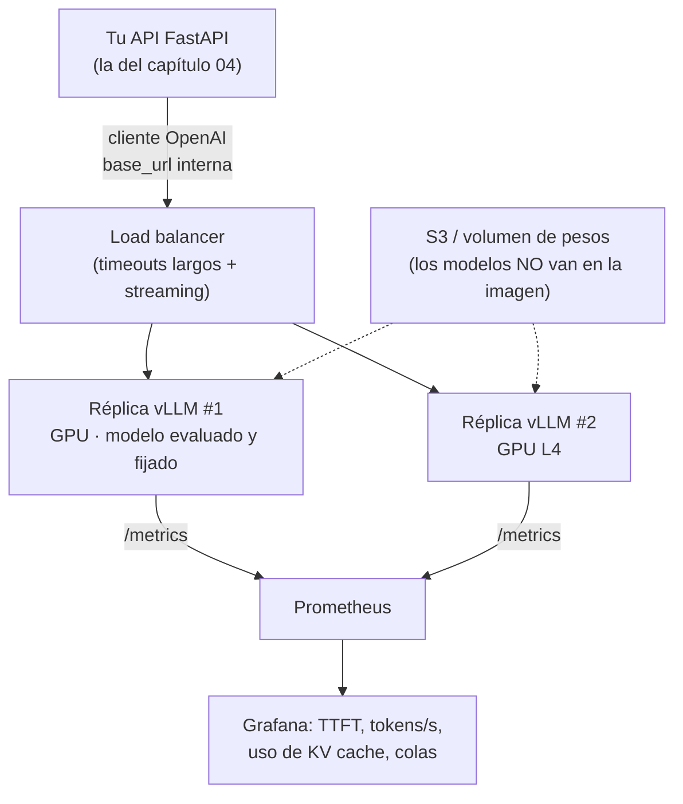

# Despliegue de LLMs open-source: vLLM, Ollama y Triton Inference Server

> **Lab asociado:** [`06_ollama_local.py`](../labs/06_ollama_local.py)

## ¿Cuándo tiene sentido servir tu propio modelo?

Antes de la herramienta, la decisión. Servir un modelo abierto (Llama, Mistral, Qwen,
Gemma…) en tu infraestructura compite contra pagar una API. Motivos legítimos:

- **Datos**: requisitos regulatorios o contractuales de que el dato no salga de tu
  infraestructura (sanidad, banca, defensa, on-premise).
- **Coste a escala**: con volumen alto y sostenido, una GPU amortizada sale más barata
  que pagar por token. La palabra clave es *sostenido*: la GPU cuesta lo mismo al 5 % de
  uso que al 90 %.
- **Latencia/control**: modelos pequeños afinados a tu tarea, latencia predecible sin
  depender de rate limits ajenos, versiones congeladas (nadie te deprecia el modelo).
- **Fine-tuning propio**: si has afinado un modelo, tienes que servirlo en algún sitio.

El número honesto: una instancia con una GPU seria (L4/A10G en cloud) cuesta del orden
de 500–1.500 $/mes encendida 24/7, más el tiempo de ingeniería de operarla. Con las APIs
de modelos pequeños a céntimos por millón de tokens, **el break-even está mucho más
lejos de lo que la intuición dice**. Haz la cuenta con tu tráfico real antes de comprar
el argumento "self-host = ahorro".

## Conceptos de serving que explican todos los benchmarks

- **Continuous batching**: el servidor mezcla requests en cada paso de generación de la
  GPU en vez de esperar a que termine un batch. Es la técnica que separa un servidor de
  producción (vLLM, TGI, TensorRT-LLM) de un script con `transformers`. Multiplica el
  throughput ×5–20 con carga concurrente.
- **PagedAttention** (la contribución original de vLLM): gestiona la KV cache como
  memoria paginada, eliminando la fragmentación y permitiendo muchos más requests
  simultáneos en la misma VRAM.
- **KV cache**: la memoria de atención crece con (nº de secuencias × longitud). Es el
  recurso escaso real de un servidor LLM: la VRAM que no ocupan los pesos la ocupa la
  KV cache, y cuando se agota, el throughput se hunde.
- **Cuantización** (AWQ, GPTQ, FP8, y GGUF en llama.cpp/Ollama): pesos en 4–8 bits.
  Reduce VRAM ×2–4 con pérdida de calidad pequeña (pero no nula: evalúa con TU suite,
  no con el leaderboard).
- **Métricas de serving**: TTFT (latencia percibida), tokens/segundo por request
  (velocidad de lectura), throughput agregado del servidor (tokens/s totales), y
  requests concurrentes sostenibles. Se optimiza throughput *o* latencia; los benchmarks
  de marketing suelen enseñar solo la que les favorece.

## Los tres contendientes

### Ollama — la vía de desarrollo local

Ollama empaqueta llama.cpp con una experiencia tipo Docker: `ollama pull <tag>`,
`ollama run <tag>`, y un servidor HTTP con **API compatible con OpenAI** en
`http://localhost:11434/v1`. Esa compatibilidad es la clave pedagógica y práctica: el
mismo código cliente (`openai.OpenAI(base_url=...)`) funciona contra Ollama, vLLM o
OpenAI cambiando una URL — exactamente lo que demuestra el lab 06.

- Corre en CPU y en GPU de consumo, incluida la GPU Metal de los Mac (esta máquina, un
  M-series con memoria unificada, es un entorno excelente para Ollama).
- Usa modelos GGUF cuantizados; carga y descarga modelos bajo demanda.
- Su nicho: desarrollo local, prototipos, apps personales, edge. **No** está diseñado
  para servir tráfico concurrente de producción: su batching y su gestión multi-usuario
  son mínimos comparados con vLLM.

### vLLM — el estándar de facto para producción en GPU

Proyecto académico (Berkeley) convertido en el servidor más usado para LLMs abiertos.
Python/PyTorch, sirve modelos de Hugging Face directamente, expone API
OpenAI-compatible, e implementa continuous batching + PagedAttention, tensor parallelism
multi-GPU, cuantización, speculative decoding y structured outputs.

- Su nicho: producción sobre GPUs NVIDIA (y crecientemente AMD/otros aceleradores),
  desde una L4 hasta clusters multi-nodo.
- Operarlo = operar GPUs: elegir `--max-model-len`, `--gpu-memory-utilization`,
  monitorizar la KV cache (expone métricas Prometheus en `/metrics`), y dimensionar
  réplicas.

### Triton Inference Server — la plataforma de inferencia generalista de NVIDIA

Triton no es un servidor "de LLMs": es un servidor de **cualquier modelo** (visión, TTS,
recomendadores, LLMs) con backends conectables (TensorRT-LLM, PyTorch, ONNX, Python…),
model repository versionado, ensembles (pipelines de modelos encadenados dentro del
servidor), y métricas/health integrados. Para LLMs, el camino de máximo rendimiento es
**Triton + backend TensorRT-LLM**, que exige compilar el modelo a "engines" específicos
de la GPU de destino.

- Su nicho: organizaciones con muchos modelos heterogéneos, equipos de plataforma ML,
  y quien necesite exprimir hasta el último token/s de hardware NVIDIA.
- Coste: complejidad operacional notablemente mayor (compilación por GPU, configuración
  del repository, dos piezas que versionar). Aparece en el temario de NCA-GENL y en
  SageMaker (que lo ofrece como contenedor gestionado).

### Tabla comparativa

| | **Ollama** | **vLLM** | **Triton (+TensorRT-LLM)** |
|---|---|---|---|
| Objetivo | Desarrollo local, edge | Producción GPU, alto throughput | Plataforma de inferencia multi-modelo |
| Instalación | Un binario, un `pull` | `pip install vllm` / imagen Docker (necesita GPU NVIDIA) | Imagen NGC + model repository + compilación de engines |
| Hardware | CPU, Metal (Mac), GPUs consumo | GPUs NVIDIA (datacenter/consumo), multi-GPU | GPUs NVIDIA, multi-GPU/multi-nodo |
| Formato de modelo | GGUF cuantizado | Pesos HF (safetensors), AWQ/GPTQ/FP8 | Engines TensorRT-LLM compilados por GPU |
| API | OpenAI-compatible + API propia | OpenAI-compatible | HTTP/gRPC propio; OpenAI-compatible (frontend) |
| Continuous batching | Limitado | Sí (referencia del sector) | Sí (in-flight batching) |
| Concurrencia real | Baja (unos pocos usuarios) | Alta (cientos de streams) | Alta |
| Curva operacional | Trivial | Media | Alta |
| Cuándo elegirlo | Prototipar, desarrollar, demos, privacidad personal | Servir un LLM abierto en producción: el default sensato | Muchos modelos heterogéneos o rendimiento extremo en NVIDIA |

Menciones honrosas que verás en el mercado: **TGI** (Hugging Face, muy similar a vLLM en
rol), **SGLang** (rendimiento puntero, radix cache para prefijos compartidos),
**llama.cpp/llamafile** (la base de Ollama, para CPU/edge), **LM Studio** (GUI de
escritorio). El análisis de decisión es el mismo: ¿local o producción? ¿cuánta
concurrencia? ¿cuánta complejidad puedes operar?

## Arquitectura de referencia de un despliegue vLLM

Decisiones típicas: réplicas homogéneas con un modelo cada una (más simple que
multi-modelo por GPU); autoscaling por profundidad de cola o uso de KV cache, no por
CPU; health check en `/health` del propio vLLM; y el cliente siempre con la API
OpenAI-compatible para poder cambiar de servidor sin tocar la app.

## Errores comunes

1. **Benchmarkear con un solo request** y concluir que "vLLM no es para tanto". Las
   ventajas de vLLM aparecen con concurrencia; con un usuario, llama.cpp puede ir igual
   de rápido.
2. **Ignorar la KV cache al dimensionar**: "el modelo cabe en la GPU" no basta; sin VRAM
   libre para la cache, la concurrencia se desploma. Vigila
   `vllm:gpu_cache_usage_perc`.
3. **Elegir contexto máximo enorme "por si acaso"** (`--max-model-len 128k`): la KV
   cache se reserva en función de eso; pagas en concurrencia lo que no usas en contexto.
4. **Usar Ollama para servir tráfico multi-usuario de producción.** Funciona… hasta que
   llegan 20 usuarios a la vez.
5. **No re-evaluar tras cuantizar.** AWQ/GGUF-Q4 suelen perder poco, pero "suelen" no es
   un SLO: pasa tu suite de evals (capítulo 02) sobre el modelo cuantizado.
6. **Olvidar el número total del coste**: GPU 24/7 + almacenamiento + el ingeniero de
   guardia. Compara contra batch y el tier de volumen vigente del proveedor antes de firmar.
7. **Acoplarse a una API propietaria del servidor** cuando existe la OpenAI-compatible:
   la portabilidad entre Ollama/vLLM/proveedor es gratis si la respetas desde el día 1.

## Para profundizar

- vLLM — documentación: <https://docs.vllm.ai/>
- Kwon et al., "Efficient Memory Management for LLM Serving with PagedAttention": <https://arxiv.org/abs/2309.06180>
- Ollama — docs y API OpenAI-compatible: <https://docs.ollama.com/> · <https://docs.ollama.com/openai>
- NVIDIA Triton Inference Server: <https://docs.nvidia.com/deeplearning/triton-inference-server/user-guide/docs/>
- TensorRT-LLM: <https://nvidia.github.io/TensorRT-LLM/>
- Hugging Face TGI: <https://huggingface.co/docs/text-generation-inference/>
- BentoML — "LLM inference handbook" (métricas y trade-offs de serving): <https://bentoml.com/llm/>
