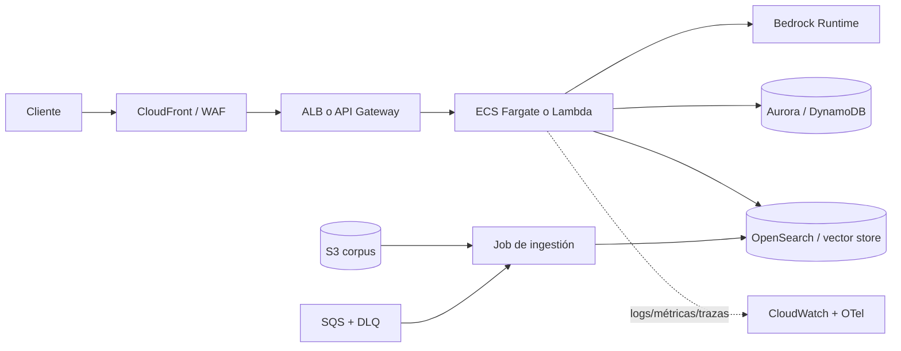

# 06 — Despliegue y monitorización en AWS

> Walkthrough teórico: ningún lab requiere cuenta AWS. Los principios se aplican al sistema RAG
> o agente construido en los módulos III–IV.

"Desplegar en AWS" no identifica una arquitectura. Primero separa **modelo**, **aplicación**,
**datos** y **trabajo offline**. Cada pieza tiene perfil de escalado, seguridad y coste distinto.

## 1. Dos decisiones independientes

### ¿Quién sirve el modelo?

- **Amazon Bedrock:** API gestionada multi-modelo; pagas por uso/capacidad y delegas serving.
- **SageMaker real-time endpoint:** tú eliges artefacto/contenedor/instancia y operas endpoint.
- **ECS/EKS/EC2 con vLLM o TGI:** máximo control; también máxima responsabilidad de GPU.
- **Proveedor externo:** la app corre en AWS y llama a una API fuera de tu cuenta.

### ¿Dónde corre la aplicación?

- **Lambda:** requests cortas, tráfico irregular, workers event-driven.
- **ECS Fargate:** API/contenedor persistente sin gestionar nodos.
- **ECS sobre EC2 / EKS:** control o escala que justifica operar capacidad.
- **App Runner:** despliegue web administrado sencillo cuando sus límites encajan.
- **SageMaker endpoint:** inferencia ML, no sustituto general de una API de negocio.

No despliegues un modelo GPU dentro de Lambda. La función puede orquestar una llamada a Bedrock o
a un endpoint, pero sus límites y ciclo de vida no corresponden a serving pesado.

## 2. Matriz de decisión

| Opción | Encaja cuando | Cuidado con |
|---|---|---|
| Lambda + Bedrock | bajo/irregular volumen, API sencilla | cold start, timeout, streaming, conexiones |
| ECS Fargate + Bedrock | API continua, streaming, workers | mínimo de tareas, balanceador, coste idle |
| SageMaker endpoint | modelo propio y stack ML gestionado | instancia siempre activa, autoscaling/cold start |
| ECS/EKS GPU + vLLM | alto volumen estable, control de batching | drivers, capacidad GPU, upgrades, observabilidad |
| Batch + SQS/Step Functions | ingestión/evals no interactivas | idempotencia, DLQ, límites y backpressure |

Calcula el punto de cruce con tráfico real. Una GPU "más barata por millón de tokens" sale cara si
pasa el 90 % del tiempo vacía.

## 3. Arquitectura de referencia con Bedrock



Separa ingestión de serving. Un PDF roto no debe bloquear el healthcheck de la API, y una nueva
estrategia de chunking debe poder reindexarse en paralelo con versión propia.

## 4. Lambda: patrón y límites

Lambda funciona bien como adaptador fino:

```python
import json
import os

import boto3


runtime = boto3.client("bedrock-runtime", region_name=os.environ["AWS_REGION"])


def handler(event: dict, context: object) -> dict:
    body = json.loads(event.get("body") or "{}")
    question = str(body.get("question", "")).strip()
    if not question or len(question) > 4000:
        return {"statusCode": 400, "body": json.dumps({"error": "invalid_question"})}

    response = runtime.converse(
        modelId=os.environ["BEDROCK_MODEL_ID"],
        system=[{"text": "Responde de forma breve y no inventes datos."}],
        messages=[{"role": "user", "content": [{"text": question}]}],
        inferenceConfig={"maxTokens": 300, "temperature": 0.1},
    )
    answer = response["output"]["message"]["content"][0]["text"]
    return {
        "statusCode": 200,
        "headers": {"content-type": "application/json"},
        "body": json.dumps({"answer": answer}),
    }
```

En producción añade autenticación, trazas, gestión explícita de errores/throttling, presupuesto y
streaming si el frontend lo necesita. Reutilizar el cliente fuera del handler permite pooling.

Riesgos de Lambda:

- cold starts y dependencias pesadas;
- duración y tamaño de payload;
- ráfagas que multiplican llamadas caras al modelo;
- conexiones a DB sin proxy/pooling adecuado;
- falta de backpressure si cada request dispara trabajos masivos.

Reserva concurrencia y cuotas para convertir una factura ilimitada en un límite operativo.

## 5. ECS Fargate: API persistente

Componentes mínimos:

- imagen en ECR con digest inmutable y escaneo;
- task definition con CPU/memoria y usuario non-root;
- secrets inyectados desde Secrets Manager, no en la imagen;
- ALB con TLS, healthcheck barato y deregistration delay;
- autoscaling por CPU, memoria, requests o métrica de cola;
- logs y métricas con IDs de correlación;
- dos Availability Zones para alta disponibilidad.

`/health/live` solo confirma que el proceso vive. `/health/ready` comprueba dependencias necesarias
con timeouts cortos. No hagas una llamada LLM de pago en cada healthcheck.

Para streaming, revisa timeouts de ALB/API Gateway, keep-alive y cancelación cuando el cliente se
desconecta; seguir generando tokens después del abandono cuesta dinero.

## 6. SageMaker endpoints

Úsalos cuando necesitas servir un artefacto/modelo propio con capacidades de ML gestionadas:

- real-time endpoints para latencia interactiva;
- asynchronous inference para payloads o duración mayores;
- serverless inference para ciertos perfiles intermitentes;
- batch transform para lotes offline;
- multi-model endpoints cuando el patrón y tamaño encajan.

Para LLMs grandes, valida soporte de contenedor, GPU, tensor parallelism, cuantización, contexto,
streaming y autoscaling. No asumas que un contenedor que carga en local cabe en la instancia.

Versiona model artifact, imagen, parámetros de serving y prompt. Un endpoint solo con nombre
`production` no es reproducible.

## 7. Procesamiento asíncrono

Ingestión, embeddings masivos y evals deben entrar por cola:

```text
API → SQS → worker → resultado persistente
             ↘ error agotado → DLQ
```

Diseña:

- idempotency key por trabajo;
- visibility timeout superior a una ejecución normal;
- reintentos limitados y clasificación de errores;
- DLQ con alarma y runbook;
- estado `queued/running/succeeded/failed` consultable;
- límite de concurrencia hacia proveedores;
- checkpoints para reanudar lotes.

Step Functions conviene para workflows con ramas, espera, compensación y auditoría; no para envolver
una sola llamada.

## 8. IAM y secretos

Roles separados:

- **task/function role:** permisos de runtime de la app;
- **execution role:** descargar imagen, logs y secretos de arranque;
- **ingestion role:** leer corpus y escribir índice;
- **CI role:** desplegar, sin acceso a datos de producción;
- **human roles:** acceso temporal y auditado.

Aplica recursos/acciones concretos, condiciones y separación por entorno. Una wildcard global
`bedrock:*` o `s3:*` acelera el prototipo y bloquea una revisión de seguridad seria.

Secrets Manager/Parameter Store guardan secretos; KMS controla cifrado. No registres valores ni
los expongas como argumentos de línea de comandos.

## 9. Red

Patrón habitual:

- ALB/API Gateway público; tasks, DB e índices en subredes privadas;
- security groups referenciándose entre sí, no CIDRs amplios;
- VPC endpoints para servicios AWS compatibles cuando privacidad/coste lo justifican;
- NAT controlado para APIs externas;
- egress restringido si el riesgo exige allowlist/proxy;
- WAF/rate limiting delante del endpoint público.

"Está en una VPC" no significa seguro. IAM, autorización de aplicación y filtros por tenant siguen
siendo necesarios.

## 10. Observabilidad con CloudWatch y OpenTelemetry

Correlaciona una petición con:

- `trace_id`, `request_id`, usuario/tenant pseudonimizado;
- versión de servicio, prompt, modelo e índice;
- spans `retrieve`, `rerank`, `llm`, `tool`;
- tokens, coste, latencia, throttling, reintentos;
- status de safety y calidad muestreada;
- dependencia y región.

Alarmas mínimas:

- tasa 5xx y timeout;
- p95/p99 de latencia y tiempo al primer token;
- throttling de Bedrock/endpoint;
- edad/profundidad de SQS y mensajes en DLQ;
- tasks no saludables;
- gasto diario/anomalía y tokens por request;
- caída de métrica de calidad.

Una alarma sin propietario ni runbook es ruido.

## 11. Despliegue seguro

Pipeline:

1. tests, scan de dependencias/imagen y eval offline;
2. push a ECR por digest;
3. deploy en staging con dataset sintético;
4. smoke + carga + seguridad;
5. canary o blue/green;
6. observación de métricas y promoción;
7. rollback de imagen **y** configuración/prompt/índice.

Las migraciones de vector index usan blue/green: construye versión nueva, evalúala, cambia el alias
de lectura y conserva la anterior durante la ventana de rollback.

## Errores comunes

1. Elegir servicio por familiaridad antes de medir tráfico.
2. Mezclar ingestión pesada con requests de usuario.
3. Autoscaling por CPU cuando el cuello es una API externa o una cola.
4. Exponer tasks/DB públicamente sin necesidad.
5. Usar healthchecks que llaman al LLM.
6. No limitar concurrencia ni gasto.
7. Poder revertir la imagen pero no prompt o índice.

## Para profundizar

- AWS Well-Architected, Machine Learning Lens: https://docs.aws.amazon.com/wellarchitected/latest/machine-learning-lens/
- Bedrock runtime y Converse: https://docs.aws.amazon.com/bedrock/latest/userguide/conversation-inference.html
- ECS Fargate: https://docs.aws.amazon.com/AmazonECS/latest/developerguide/AWS_Fargate.html
- SageMaker deployment: https://docs.aws.amazon.com/sagemaker/latest/dg/deploy-model.html
- AWS Distro for OpenTelemetry: https://aws-otel.github.io/
