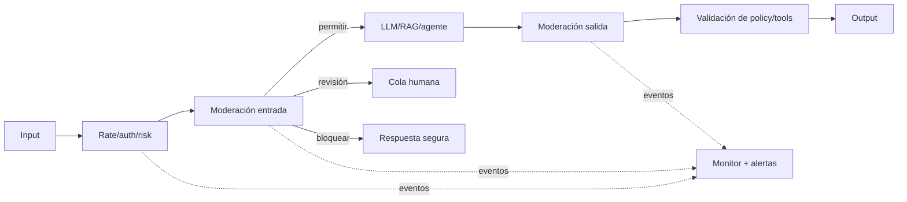

# 09 — Safety en producción: políticas, guardrails y respuesta

Safety es mantener el comportamiento dentro de límites de daño definidos, incluso con entradas
adversarias, incertidumbre y cambios de distribución. No es lo mismo que seguridad: seguridad
protege activos frente a amenazas; safety reduce resultados o acciones dañinas. Se solapan.

## 1. Política antes que clasificador

Escribe una taxonomía concreta para el producto:

| Categoría | Acción | Ejemplo de producto |
|---|---|---|
| permitida | responder | explicación técnica legítima |
| permitida con límites | responder de forma segura | información general de salud con fuentes |
| requiere revisión | pausar/escalar | decisión de alto impacto o ambigua |
| bloqueada | rechazar y ofrecer alternativa | instrucciones de daño específicas |
| emergencia | mensaje y recursos definidos | riesgo inminente según política |

Define severidad, excepciones (educación, prevención, ficción), jurisdicción, edad y canal. Un
moderador no puede aplicar una política que el equipo no ha escrito.

## 2. Arquitectura en capas



Capas:

- controles deterministas de tamaño, tipo, rate y permisos;
- clasificación/moderación de input;
- instrucciones del modelo;
- restricciones de retrieval/tools;
- moderación y validación de output;
- revisión humana;
- monitorización y respuesta.

Ninguna capa es perfecta. Mide cómo fallan juntas.

## 3. Input moderation

Clasifica intención y riesgo, pero preserva contexto legítimo. La palabra "bomba" aparece en
noticias, química, seguridad y daño. Evalúa falsos positivos por idioma/dialecto y ataques con:

- ortografía alterada y Unicode;
- codificación o idiomas mezclados;
- role-play y ficción;
- petición fragmentada en varios turnos;
- contenido dentro de documentos/imágenes;
- transformación "traduce este texto".

La conversación completa puede cambiar el significado. Moderar solo el último mensaje pierde
patrones acumulativos; enviar todo también aumenta privacidad/coste. Diseña un estado de riesgo.

## 4. Output moderation

El modelo puede generar contenido no permitido aun con input inocuo, o reproducir PII/secrets del
contexto. Comprueba:

- categorías de política;
- datos sensibles y secretos;
- URLs/dominios y adjuntos;
- citas existentes;
- instrucciones operativas peligrosas;
- formato y longitud;
- afirmaciones que requieren disclaimer/fuente;
- tool calls antes de ejecutarlas, no solo texto final.

Para streaming, moderar solo al final permite mostrar tokens dañinos. Opciones: buffer por bloques,
modelo con garantías adecuadas, moderación incremental y capacidad de cortar stream. Cada opción
añade latencia.

## 5. Guardrails deterministas y basados en modelo

**Deterministas:** enums, schemas, allowlists, permisos, regex de secretos, límites, state machine.
Alta precisión para reglas claras.

**Clasificadores/modelos:** intención, toxicidad contextual, riesgo semántico. Más cobertura, pero
probabilísticos y sesgados.

**LLM-judge de policy:** flexible para políticas complejas; más caro/lento y vulnerable a prompt
injection si recibe contenido sin aislamiento.

Combínalos. Nunca uses un judge para autorizar un write que un ACL puede decidir exactamente.

## 6. Guardrails de Amazon Bedrock

Bedrock Guardrails puede aplicar filtros y políticas a entradas/salidas según las capacidades
vigentes: temas denegados, categorías de contenido, palabras, información sensible y comprobaciones
de grounding/relevancia en escenarios compatibles. Puede usarse junto a invocaciones de modelos o
mediante APIs de evaluación independientes según configuración.

Para adoptarlo:

1. versiona guardrail y configuración;
2. crea dataset por categoría, idioma y excepción legítima;
3. mide precision/recall y latencia;
4. decide conducta ante timeout/error;
5. registra decisión y versión sin exponer payload innecesario;
6. prueba bypasses y cambios de modelo.

Un guardrail gestionado no reemplaza permisos, validación de tools ni política del producto.

## 7. Fail-open o fail-closed

Si el moderador no responde:

- **fail-closed:** bloquea/pausa. Adecuado para acciones o dominios de alto riesgo; reduce
  disponibilidad.
- **fail-open:** continúa. Adecuado solo si el impacto es bajo y hay controles posteriores.
- **degradación:** modo read-only, respuesta genérica segura o cola humana.

Decídelo por categoría, no globalmente. Documenta SLO del guardrail y alerta sobre bypass por fallo.

## 8. Human review y escalado

La cola necesita:

- prioridad por severidad y SLA;
- contenido mínimo y redactado;
- razón de escalado y policy version;
- acciones permitidas al revisor;
- doble control en alto impacto;
- feedback estructurado para eval;
- protección del personal ante contenido sensible.

No prometas respuesta inmediata si el SLA humano es horas. La UX debe decir qué ocurre.

## 9. Métricas

Por categoría e idioma:

```text
precision = bloqueos_correctos / bloqueos_totales
recall    = casos_dañinos_bloqueados / casos_dañinos_totales
FPR       = casos_legitimos_bloqueados / casos_legitimos_totales
FNR       = casos_dañinos_permitidos / casos_dañinos_totales
```

Además:

- tasa de escalado y tiempo de revisión;
- appeals/overrides y resultado;
- bypasses confirmados;
- reincidencia por actor (con privacidad);
- latencia/coste del guardrail;
- decisiones por versión;
- incidentes y near misses.

El umbral depende del daño. Maximizar recall puede bloquear a usuarios legítimos que buscan ayuda.

## 10. Dataset safety

Capas:

1. ejemplos claros permitidos/bloqueados;
2. fronteras y excepciones;
3. variantes lingüísticas y culturales;
4. ataques obfuscados y multi-turno;
5. inyección indirecta en fuentes;
6. outputs generados por el sistema real;
7. fallos e incidentes anonimizados.

Separa red-team set del test cotidiano para evitar sobreajuste. Renueva periódicamente y controla
acceso: el dataset puede contener material peligroso.

## 11. Abuso y comportamiento adaptativo

Los atacantes aprenden del mensaje de rechazo. Evita revelar reglas internas o umbrales exactos.
Combina señales de cuenta, rate, patrón de sesiones y contenido dentro de las restricciones legales
y de privacidad.

Controles:

- rate limits escalonados;
- límites de contexto/tools/gasto;
- cooldown o verificación adicional;
- bloquear automatización masiva, no solo un prompt;
- canales para investigadores y falsos positivos;
- revisión de clusters de nuevos ataques.

## 12. Alertas y runbooks

Alerta por:

- pico de bloqueos o caída súbita a cero;
- aumento de FNR en muestreo humano;
- guardrail timeout/error;
- categoría crítica detectada;
- escalados fuera de SLA;
- drift por nuevo idioma o endpoint;
- cambio de versión sin evaluación asociada.

Runbook:

1. confirmar señal y alcance;
2. activar modo seguro o retirar variante;
3. preservar IDs y evidencia con acceso restringido;
4. ajustar política/control, no solo una frase del prompt;
5. añadir casos de regresión;
6. reevaluar falsos positivos;
7. comunicar y cerrar con postmortem.

## Errores comunes

1. Moderar solo input y asumir salida segura.
2. Aplicar el mismo umbral a todas las categorías/idiomas.
3. Ignorar tool calls porque "el texto final está limpio".
4. No decidir fail-open/fail-closed.
5. Entrenar el test adversario hasta memorizarlo.
6. Ocultar falsos positivos y medir solo bloqueos.
7. Dejar alertas sin runbook ni propietario.

## Para profundizar

- Bedrock Guardrails: https://docs.aws.amazon.com/bedrock/latest/userguide/guardrails.html
- OpenAI Moderation guide: https://platform.openai.com/docs/guides/moderation
- OWASP GenAI Security Project: https://genai.owasp.org/
- NIST AI RMF Generative AI Profile: https://www.nist.gov/publications/artificial-intelligence-risk-management-framework-generative-artificial-intelligence
