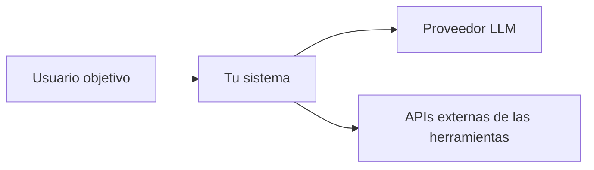
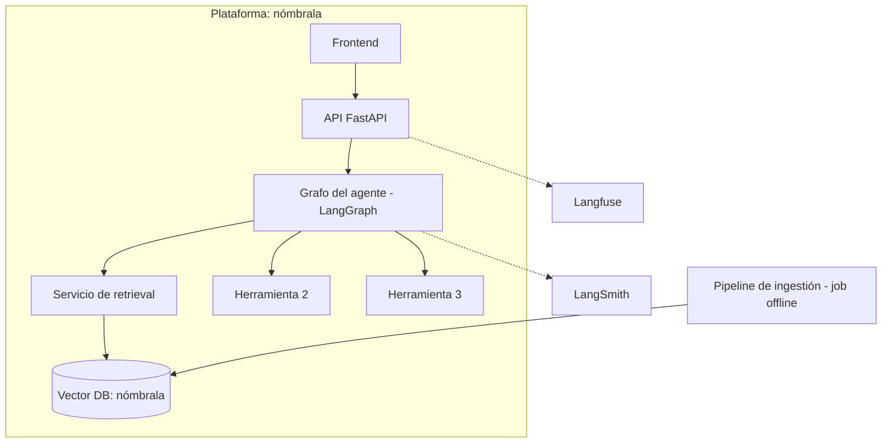
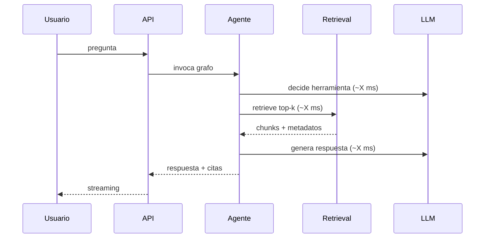

# Documento de arquitectura — [Nombre del proyecto]

> **Cómo usar esta plantilla.** Sustituye cada bloque de instrucciones (citas como esta) por tu contenido y bórralas. Extensión objetivo: 8–15 páginas equivalentes. Un documento de arquitectura no es un catálogo de tecnologías: es el registro de *decisiones* y de los *trade-offs* que las justifican. Todo lo que sea una decisión con alternativas reales va a un ADR ([formato aquí](plantilla-adr.md)); este documento las referencia y las conecta.

**Versión:** v1.0 · **Fecha:** AAAA-MM-DD · **Autor:** [nombre] · **Estado:** borrador / en revisión / aprobado

---

## 1. Contexto y problema

> 3–5 párrafos. Quién es el usuario, qué hace hoy sin tu sistema, qué le cuesta (tiempo/dinero/errores), y qué hará con él. Termina con una frase de alcance negativo: qué **no** hace el sistema (tan importante como lo que hace; te la preguntarán en la defensa).

## 2. Requisitos

### 2.1 Funcionales

> Lista numerada (RF-1, RF-2…) de capacidades observables por el usuario. Cada una en una frase verificable. Ejemplo del estilo esperado: "RF-3: ante una pregunta cuya respuesta no esté en el corpus, el sistema lo dice explícitamente y no inventa" — nótese que es testeable.

### 2.2 No funcionales (con número, no con adjetivo)

| ID | Requisito | Objetivo | Cómo se mide |
|---|---|---|---|
| RNF-1 | Latencia extremo a extremo | P95 < 3 s | Test de carga k6, 15 min, ver [guía de despliegue](../05-guia-despliegue.md) |
| RNF-2 | Disponibilidad | ≥ 99% en ventana de ≥ 2 semanas | Monitor externo (UptimeRobot) |
| RNF-3 | Fidelidad de respuestas | RAGAS faithfulness ≥ 0,75 | Dataset de evaluación, ver [guía RAG](../03-guia-rag.md) |
| RNF-4 | Coste por query | < [tu objetivo] € | Instrumentación Langfuse |
| RNF-5 | Seguridad | Sin secretos en repo; sandbox en herramientas de ejecución; rate limiting | Revisión + test |

> Añade los tuyos. Un RNF sin columna "cómo se mide" no es un requisito, es una intención.

## 3. Vista de arquitectura

### 3.1 Diagrama de contexto (C4 nivel 1)

> Quién habla con el sistema y con qué sistemas externos habla él. Mermaid o imagen exportada.

### 3.2 Diagrama de contenedores (C4 nivel 2)

> El diagrama central del documento. Cada caja debe existir en tu código o en tu cloud: nada de cajas aspiracionales. Incluye: frontend/cliente, API, orquestador del agente, pipeline de ingestión (¡es un contenedor distinto al de serving!), vector DB, observabilidad, y por dónde entran las peticiones.

### 3.3 Flujo de una petición

> Diagrama de secuencia de la query típica, con latencias reales medidas por tramo una vez tengas el sistema (v1: estimadas; versión final: medidas). Este diagrama es el que usarás para justificar dónde ataca cada optimización de latencia.

## 4. Stack tecnológico y justificación

> Tabla de componentes elegidos. La columna clave es la última: la alternativa que perdió. Si para alguna fila no puedes nombrar una alternativa seria, o bien no investigaste, o bien la decisión era trivial y no merece fila.

| Capa | Elección | Por qué (1 línea) | Alternativa descartada → ADR |
|---|---|---|---|
| LLM generación | | | `adr/ADR-001.md` |
| Embeddings | | | |
| Vector DB | | | |
| Orquestación agente | | | |
| API / backend | | | |
| Plataforma cloud | | | |
| Observabilidad | | | |

## 5. Decisiones de arquitectura (índice de ADRs)

> Mínimo 5 ADRs para el capstone. Candidatos que casi siempre merecen uno: elección de vector DB, estrategia de chunking, modelo(s) de LLM y política de enrutado barato/caro, arquitectura del agente (por qué grafo y no cadena), plataforma de despliegue, y qué haces cuando el retrieval no encuentra nada.

| ID | Título | Estado |
|---|---|---|
| `ADR-001` | | aceptado |
| `ADR-002` | | aceptado |
| ADR-NNN | Decisión pendiente de registrar | Propietario y fecha objetivo |

## 6. Datos

> Origen del corpus, licencia/legalidad, volumen (documentos, chunks, tokens totales), pipeline de ingestión (pasos, idempotencia, cómo se re-indexa), y esquema de metadatos de cada chunk. Incluye qué PII contiene el corpus y qué haces al respecto (aunque la respuesta sea "ninguna, porque X").

## 7. Seguridad

> Los cinco mínimos, con una frase cada uno sobre tu implementación concreta: (1) gestión de secretos, (2) prompt injection — qué entra del usuario y del corpus al prompt y qué mitigas, (3) sandboxing/permisos de cada herramienta del agente, (4) rate limiting y auth de la API pública, (5) qué registras en trazas y si contiene datos de usuario.

## 8. Escalabilidad y límites conocidos

> Sé honesto: dónde se rompe el sistema primero al crecer (¿la vector DB? ¿el rate limit del proveedor LLM? ¿el coste?). Conecta con la [proyección de costes](../07-analisis-de-costes.md). Un "límites conocidos" sólido da más puntos en la defensa que fingir que escala infinito.

## 9. Registro de cambios del documento

| Versión | Fecha | Cambio |
|---|---|---|
| v1.0 | | Versión inicial (semana 1) |
| v2.0 | | Revisión con el sistema ya medido (semana 5–6) |

> El documento se entrega dos veces: v1 al final de la semana 1 (con estimaciones) y la versión final en la semana 6 (con números medidos y los ADRs que hayan cambiado de estado). La diferencia entre ambas versiones es en sí misma material de defensa: qué creías, qué aprendiste.
