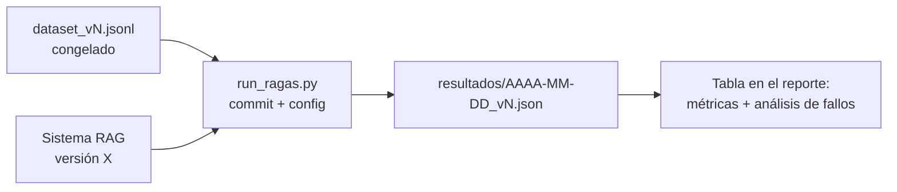

# Guía del pipeline RAG del capstone

El entregable 2 exige un pipeline RAG completo (ingestión, indexado, retrieval, generación) con **RAGAS faithfulness ≥ 0,75** demostrado sobre un dataset de evaluación propio. Esta guía es el checklist técnico y, sobre todo, el protocolo de evaluación: la métrica sin protocolo no vale nada. La teoría está en el [módulo 3](../modulo-03-rag/); aquí solo está lo que se te va a exigir.

## 1. Checklist técnico del pipeline

### Ingestión (job separado del serving)

- [ ] La ingestión es un **script/job independiente** de la API (se ejecuta offline, la API solo lee el índice). Mezclar ambos es el antipatrón número 1.
- [ ] **Idempotente y re-ejecutable**: correrla dos veces no duplica chunks (usa IDs deterministas, p. ej. hash de `doc_id + posición`).
- [ ] Extracción adaptada al formato real del corpus (PDF con tablas ≠ Markdown ≠ HTML). Has inspeccionado **a mano** la salida de al menos 10 documentos, incluyendo los feos (tablas, listas, cabeceras/pies).
- [ ] Registro de ingestión: cuántos documentos entraron, cuántos fallaron y por qué (un corpus donde "falló el 8% de PDFs" sin que lo sepas contamina todo lo demás).

### Chunking

- [ ] La estrategia de chunking es una **decisión escrita en un ADR**, no el default del framework. Sabes el tamaño medio y la distribución de tus chunks en tokens.
- [ ] Cada chunk lleva **metadatos**: documento origen, sección/título, posición, y los campos de filtrado de tu dominio (versión, categoría…).
- [ ] Los elementos que no sobreviven al troceado ciego (tablas, bloques de código, listas de requisitos) tienen tratamiento propio (chunk íntegro, o serialización a texto, o resumen + original).

### Retrieval

- [ ] top-k y umbral elegidos con datos (ver §3), no por defecto.
- [ ] **Búsqueda híbrida o reranker**: al menos una de las dos, y con ablation que demuestre qué aporta (ver §4). Vector-search-a-secas suele dejarte por debajo de 0,75 en corpus técnicos.
- [ ] Filtrado por metadatos funcionando cuando la query lo permite.
- [ ] **Caso "no hay respuesta"**: cuando el retrieval devuelve chunks por debajo del umbral de relevancia, el sistema lo dice en vez de generar sobre ruido. Esto es lo que más protege tu faithfulness.

### Generación

- [ ] El prompt de generación exige **citar las fuentes** (ID de chunk/documento) y la API las devuelve estructuradas, no incrustadas en prosa.
- [ ] Instrucción explícita y testeada de no responder fuera del contexto recuperado.
- [ ] Respuesta en streaming hacia el cliente (afecta a la percepción de latencia y al P95 que reportas: define si mides time-to-first-token o tiempo total, y dilo).

## 2. El dataset de evaluación

Es la pieza que separa un capstone serio de una demo. Requisitos:

- **Mínimo 50 preguntas** (recomendado 60–80) con esta composición:

| Tipo | % aprox. | Qué mide |
|---|---:|---|
| Factual simple (respuesta en 1 chunk) | 40% | Suelo de retrieval |
| Multi-chunk (combinar 2+ fragmentos o documentos) | 25% | Mérito real del sistema |
| Con filtro implícito (versión, categoría, fecha) | 15% | Metadatos y retrieval filtrado |
| **Sin respuesta en el corpus** | 10% | Abstención (la trampa clásica) |
| Ambiguas o mal formuladas, como pregunta la gente real | 10% | Robustez |

- Cada entrada tiene: `pregunta`, `respuesta_de_referencia` (escrita o verificada por ti contra el corpus, con la fuente anotada), y `chunks_relevantes` (IDs) para poder calcular context recall/precision.
- **Puedes generar borradores de preguntas con un LLM, pero cada una pasa revisión humana tuya**: las preguntas sintéticas sin revisar tienden a ser fáciles-para-el-retrieval (comparten vocabulario exacto con el chunk) e inflan las métricas. Reformula al menos la mitad con vocabulario distinto al del texto fuente.
- El dataset se **congela por versiones** (`eval/dataset_v1.jsonl`, `v2`…): si lo tocas después de medir, la comparación entre iteraciones muere. Añadir preguntas ⇒ nueva versión.
- **Prohibido iterar el sistema contra el dataset completo.** Divide: ~70% desarrollo (itera libremente) y ~30% holdout que solo ejecutas para el reporte final. Si solo reportas el set de desarrollo, dilo explícitamente; ocultarlo y que aflore en la defensa es mucho peor.

## 3. Protocolo de evaluación RAGAS

Métricas obligatorias y objetivo:

| Métrica | Qué mide | Objetivo |
|---|---|---|
| **Faithfulness** | Que lo afirmado esté soportado por el contexto recuperado | **≥ 0,75 (gate eliminatorio)** |
| Answer relevancy | Que la respuesta responda a la pregunta | ≥ 0,75 recomendado |
| Context precision | Que lo recuperado sea señal y no relleno | reportar |
| Context recall | Que lo necesario esté entre lo recuperado | reportar (diagnóstico clave: si es bajo, el problema es retrieval, no generación) |

Protocolo:

1. **Fija el juez**: modelo y versión exactos del LLM evaluador de RAGAS, temperatura 0. Cambiar de juez entre mediciones invalida la serie histórica. El juez debe ser **distinto o igual al generador, pero decláralo** (juez == generador es un sesgo conocido; si puedes, usa un juez de otra familia).
2. Ejecuta la evaluación **con un script versionado** (`eval/run_ragas.py`) que vuelca resultados a JSON/CSV con fecha, versión del dataset, commit del sistema y configuración (modelo, top-k, chunk size). Sin esto no hay reproducibilidad y el claim no se sostiene.
3. **Ejecuta 2–3 veces la medición final**: el juez tiene varianza. Reporta media y rango; si el rango cruza el 0,75, no has aprobado el gate, has tenido suerte una vez.
4. Coste: evaluar 60 preguntas × 4 métricas con un juez económico cuesta céntimos; con uno caro, pocos euros. Presupuéstalo y usa el juez económico durante el desarrollo, confirmando la cifra final con el juez que declares en el reporte.

## 4. Cómo se reporta (formato exigido)

Tu reporte de evaluación (en el README del proyecto o en `eval/REPORTE.md`) debe contener:

1. **Tabla de resultados** por métrica (media ± rango de las repeticiones), separando dev y holdout, con la configuración exacta del sistema medido.
2. **Serie de iteraciones**: tabla de cómo evolucionaron las métricas con cada cambio relevante (baseline → +híbrido → +reranker → prompt v3…). Es la evidencia de que la cifra final no es casualidad, y la mejor diapositiva de tu defensa.
3. **Al menos una ablation**: misma medición con y sin una decisión cara (el reranker, o el chunking especial de tablas). "El reranker sube faithfulness de 0,71 a 0,79 a cambio de +180 ms y +0,0004 €/query" es la frase que define un aprobado alto.
4. **Análisis de fallos**: las 5–10 preguntas peor puntuadas, clasificadas por causa (fallo de retrieval / fallo de generación / referencia discutible / pregunta sin respuesta mal abstenida) y qué harías con cada clase. Un 0,78 con análisis de fallos vale más que un 0,85 sin él.
5. **Limitaciones declaradas**: juez usado y su sesgo, tamaño del dataset, qué no cubre.

## 5. Errores que suspenden este entregable

- Medir una sola vez, el último día, y que salga 0,74.
- Dataset generado 100% por LLM sin revisión, con preguntas que repiten literalmente frases del corpus.
- Cambiar dataset y sistema a la vez entre mediciones (no sabes qué movió la métrica).
- Reportar solo faithfulness: sin context recall no puedes diagnosticar nada en la defensa.
- No versionar la configuración: te preguntarán "¿con qué top-k salió ese 0,79?" y "no me acuerdo" invalida el número.
