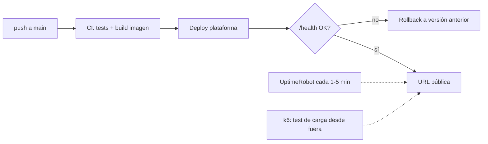

# Guía de despliegue en cloud

El entregable 4 exige **URL pública, uptime ≥ 99% y latencia P95 < 3 s**, los tres con evidencia medida, no afirmada. Esta guía compara plataformas, define cómo medir cada cifra de forma que sobreviva a un tribunal, y fija el checklist de producción mínima.

Decisión previa que condiciona todo: **despliega en la semana 2**. El uptime se demuestra con una ventana de observación; si despliegas en la semana 5, matemáticamente ya no puedes presentar dos semanas de historia.

## 1. Comparativa de plataformas

Perfil del capstone: API en contenedor (FastAPI + agente), vector DB gestionada aparte y tráfico
bajo. Los precios, free tiers, regiones y políticas de suspensión cambian con frecuencia: consulta
las páginas oficiales el día de decidir y guarda URL, fecha, moneda e impuestos en el ADR. La tabla
compara propiedades arquitectónicas; la columna de coste se completa con la cotización vigente.

| Plataforma | Coste mensual verificado | A favor | En contra | Encaja si… |
|---|---|---|---|---|
| **Railway** | _Rellena desde pricing oficial_ | Deploy desde repo en minutos, logs y variables de entorno integrados | Revisa RAM, regiones disponibles, egress y política de suspensión del plan elegido | Priorizas velocidad de entrega y la región cumple tu P95 medido. |
| **Fly.io** | _Rellena desde pricing oficial_ | Selección regional y control fino de Machines | Más decisiones operativas; auto-stop/cold start altera la latencia | Necesitas región próxima y quieres controlar ciclo de vida y escalado. |
| **Render** | _Rellena desde pricing oficial_ | Flujo gestionado, TLS y dominios integrados | Verifica si el plan elegido suspende el servicio y mide su cold start | Ya conoces la plataforma y el plan sostiene el SLO sin dormirse. |
| **AWS App Runner / ECS Fargate** | _Calcula cómputo, red, logs y registro_ | IAM, ECR y CloudWatch nativos; buena trazabilidad cloud | Más superficie de configuración y coste repartido entre servicios | Quieres demostrar arquitectura AWS y has presupuestado su operación. |
| **AWS Lambda + API Gateway** | _Calcula requests, duración, red y concurrencia_ | Escala a cero y cobra por uso | Cold starts con dependencias pesadas; streaming y agente multi-paso requieren validar límites | El perfil de tráfico es esporádico y tus pruebas cumplen P95 y duración. |
| **VPS + Docker** | _Suma instancia, backups, red y tiempo operativo_ | Control del host y coste predecible | Tú operas TLS, firewall, parches, backups y rollback | Puedes demostrar endurecimiento y operación reproducible. |

Reglas transversales:

- **La vector DB va gestionada** (free tier) salvo justificación en ADR: perder el índice en un redeploy es el accidente clásico de la semana 4.
- **El modelo LLM es una API externa**: no metas inferencia local en el despliegue del capstone; los requisitos de RAM/GPU rompen todos los presupuestos anteriores.
- Documenta la elección como **ADR con la tabla anterior rellenada con tus números** (incluida la latencia medida desde tu región a la plataforma).

## 2. La URL pública

- [ ] HTTPS obligatorio (todas las plataformas de la tabla lo dan; en VPS, Caddy o certbot).
- [ ] Un **frontend mínimo utilizable** en la raíz: una página de chat simple basta, pero el tribunal debe poder usar el sistema sin `curl`. (Streamlit/Gradio desplegado aparte también vale; documenta entonces las dos URLs.)
- [ ] `GET /health` es **liveness** y solo confirma que el proceso atiende HTTP; debe responder
  rápido y no llamar a servicios pagados. `GET /ready` es **readiness**: comprueba configuración y
  dependencias críticas con timeouts breves. El monitor externo vigila ambos y alerta de forma
  distinta: proceso caído frente a instancia viva pero incapaz de servir tráfico.
- [ ] **Rate limiting** (p. ej. slowapi) y una **API key simple** para los endpoints caros: tu URL es pública durante semanas y tu presupuesto de LLM es finito. Deja un modo demo/invitado con límites estrictos para el tribunal.
- [ ] Secretos en el gestor de la plataforma, jamás en el repo. `.env.example` documenta las variables.

## 3. Medir uptime ≥ 99%

**Protocolo exigido:**

1. Alta en un monitor **externo** gratuito (UptimeRobot, Better Stack free tier) contra `/health`, intervalo 1–5 min, **el mismo día del primer deploy**.
2. Ventana de reporte: **≥ 2 semanas** continuas antes de la entrega. 99% sobre 2 semanas permite ~3,4 h acumuladas de caída — es un listón alcanzable incluso con algún redeploy torpe, pero no si el servicio duerme.
3. Evidencia: captura/export del panel del monitor con el porcentaje y el histórico de incidentes. Auto-medirse con un cron en la misma máquina no vale (si la máquina cae, tu medidor también).
4. Cada caída registrada > 10 min lleva una línea de explicación en tu reporte ("redeploy sin health check en Railway, 22 min, corregido activando deploy con overlap"). Las caídas explicadas suman madurez; las caídas sin explicar restan el doble.

## 4. Medir latencia P95 < 3 s

Un número P95 honesto exige definir qué mides y bajo qué carga:

1. **Define el punto de medida**: extremo a extremo desde el cliente (lo que exige el capstone), sobre el endpoint principal de query. Si tu respuesta es streaming, reporta **dos** cifras: time-to-first-token y tiempo total, y declara que el gate de 3 s se evalúa sobre TTFT + justifica por qué (percepción de usuario), o sobre total si no haces streaming. Elegir la métrica *después* de ver los números es trampa; fíjala antes.
2. **Herramienta**: k6 o Locust, script versionado en el repo (`load/`).
3. **Escenario mínimo**: 10–15 min de duración, 3–5 usuarios virtuales concurrentes con think-time realista, y un set de ≥ 20 queries variadas del dataset de evaluación (no la misma query, que se cachea sola). Ejecutado **contra la URL pública**, no contra localhost.
4. **Reporta**: P50 / P95 / P99, tasa de error, y el desglose por tramo usando tus trazas (qué parte es retrieval, qué parte LLM). El desglose es lo que convierte el número en ingeniería: "P95 2,4 s, de los cuales 1,9 s son la llamada de generación" te dice dónde NO optimizar.
5. Ejecuta el test **dos veces en días distintos** (los proveedores LLM tienen horas malas) y reporta ambas.

Si no llegas a 3 s: las palancas por orden de rendimiento habitual — streaming + medir TTFT, modelo más rápido para los pasos de enrutado del agente (el paso "decidir herramienta" no necesita el modelo caro), paralelizar retrieval con lo que se pueda, recortar contexto (menos chunks mejor elegidos), y caché de queries repetidas. Cada palanca aplicada, a su ADR o al análisis de costes.

## 5. Checklist de producción mínima

- [ ] **Docker**: imagen construible con `docker build` en limpio; la plataforma despliega esa imagen (no "funciona en mi máquina con uv run").
- [ ] **CI/CD**: push a `main` → tests → deploy automático (GitHub Actions o el auto-deploy de la plataforma con gate de tests). Un deploy manual por SSH documentado a mano suspende este punto.
- [ ] **Logs estructurados** (JSON) con un request-id por petición que aparezca también en la traza de LangSmith: es tu única herramienta de diagnóstico el día que algo falle con el tribunal delante.
- [ ] **Rollback probado**: sabes (y has ensayado una vez) cómo volver a la versión anterior en < 5 min.
- [ ] Reinicio limpio: el contenedor puede morir y volver sin intervención (nada crítico en memoria/filesystem local; el índice vive en la vector DB gestionada).
- [ ] Presupuesto/alarma de facturación activada en la plataforma y en el proveedor LLM (ver [guía LLMOps](06-guia-llmops.md)).

## 6. Errores que suspenden este entregable

- Plan gratuito que duerme el servicio: el primer request del tribunal tarda 40 s y el uptime real es ficción.
- Monitor de uptime dado de alta la última semana: no hay ventana que reportar.
- P95 medido con 1 request en local, o con la misma query cacheada 500 veces.
- Índice vectorial dentro del contenedor: cada deploy borra el corpus.
- La API key del proveedor LLM en el repo público. Esto no baja nota: es incidente de seguridad y se trata como tal (rotar, documentar el postmortem).
