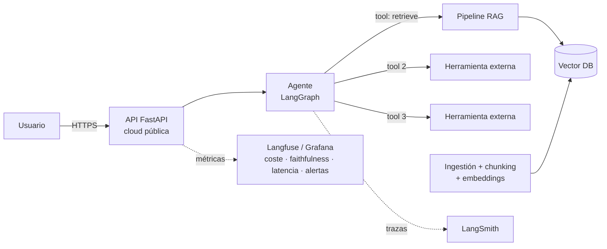

# Módulo VI — Proyecto final / Capstone (2 ECTS)

El capstone integra todo el programa en un único sistema de nivel producción: un **pipeline RAG de calidad demostrable** (RAGAS ≥ 0,75) orquestado por un **agente autónomo con al menos 3 herramientas**, **desplegado en cloud** con URL pública, **monitorizado con LLMOps** (coste, calidad, latencia, alertas) y con un **análisis de costes real y proyectado**. No es un notebook: es un servicio que otra persona puede abrir en el navegador, usar y romper.

El listón es deliberadamente el de una entrevista técnica de LLM Engineer: si al terminar no puedes enseñar la URL, las trazas, el dashboard y defender cada decisión de arquitectura durante 15 minutos de preguntas hostiles, el capstone no está terminado.

## Mapa del módulo

| Fichero | Qué resuelve |
|---|---|
| [`01-propuestas-de-proyecto.md`](01-propuestas-de-proyecto.md) | 5 proyectos listos para elegir + guía para proponer el tuyo |
| [`02-documento-de-arquitectura/`](02-documento-de-arquitectura/) | Plantilla del documento de arquitectura y formato ADR con ejemplo |
| [`03-guia-rag.md`](03-guia-rag.md) | Checklist del pipeline RAG y cómo demostrar RAGAS ≥ 0,75 |
| [`04-guia-agente.md`](04-guia-agente.md) | Diseño de herramientas, trazas LangSmith, errores y guardrails |
| [`05-guia-despliegue.md`](05-guia-despliegue.md) | Comparativa de plataformas, uptime ≥ 99% y P95 < 3 s medidos |
| [`06-guia-llmops.md`](06-guia-llmops.md) | Dashboard: coste/query, faithfulness, latencia y alertas |
| [`07-analisis-de-costes.md`](07-analisis-de-costes.md) | Plantilla de desglose de costes y proyección a 10x/100x |
| [`08-defensa-y-demo.md`](08-defensa-y-demo.md) | Guion de la demo de 20 min y 25+ preguntas de tribunal |
| [`checklist-final.md`](checklist-final.md) | Cada entregable oficial mapeado a su evidencia concreta |

## Entregables oficiales

1. **Documento de arquitectura** — diagrama técnico, ADRs y justificación del stack ([plantillas](02-documento-de-arquitectura/))
2. **Pipeline RAG completo** — ingestión, indexado, retrieval, con evaluación RAGAS ≥ 0,75 ([guía](03-guia-rag.md))
3. **Agente autónomo** — ≥ 3 herramientas integradas, trazas LangSmith documentadas ([guía](04-guia-agente.md))
4. **Despliegue en cloud** — URL pública, uptime ≥ 99%, latencia P95 < 3 s ([guía](05-guia-despliegue.md))
5. **Dashboard LLMOps** — coste/query, faithfulness, latencia y alertas configuradas ([guía](06-guia-llmops.md))
6. **Análisis de costes** — desglose real de inferencia y proyección a escala ([plantilla](07-analisis-de-costes.md))
7. **Simulacro AWS AIF-C01** — 65 preguntas con repaso de áreas de mejora → material en [`../certificaciones/aws-aif-c01/`](../certificaciones/aws-aif-c01/)
8. **Preparación NCA-GENL** — cinco áreas ponderadas, diez temas, flashcards y simulacro de 50 preguntas → material en [`../certificaciones/nvidia-nca-genl/`](../certificaciones/nvidia-nca-genl/)
9. **Demo en vivo (20 min) + code review + defensa técnica (15 min Q&A)** ([guía](08-defensa-y-demo.md))

## Arquitectura de referencia

Tu sistema concreto variará, pero todos los proyectos válidos encajan en esta forma general:

## Rúbrica de evaluación

La nota final se compone así. Cada criterio se puntúa de 0 a 10 y se pondera. **Nota mínima para aprobar: 7,0**, y además hay tres *gates* eliminatorios que, de no cumplirse, suspenden el capstone independientemente del resto: RAGAS faithfulness ≥ 0,75 sobre el dataset de evaluación, URL pública funcionando el día de la demo, y las 3 herramientas del agente ejecutándose con trazas verificables.

| Criterio | Peso | 10 significa | 5 significa |
|---|---:|---|---|
| Arquitectura y ADRs | 15% | Diagramas precisos, ≥ 5 ADRs con alternativas reales descartadas y trade-offs cuantificados | Diagrama genérico, ADRs que solo justifican lo que ya se había decidido |
| Calidad del RAG | 20% | RAGAS ≥ 0,75 en dataset ≥ 50 preguntas, análisis de fallos por categoría, ablation de al menos una decisión (chunking o reranker) | Métrica alcanzada pero sin análisis: no sabe *por qué* funciona |
| Agente y herramientas | 15% | 3+ herramientas no triviales, manejo de errores por herramienta, guardrails demostrados con trazas de casos adversarios | Herramientas que funcionan solo en el camino feliz |
| Despliegue y fiabilidad | 15% | URL pública, uptime ≥ 99% con evidencia de ≥ 2 semanas, P95 < 3 s medido con carga real, CI/CD | Desplegado pero sin métricas de fiabilidad o con mediciones de una sola sesión |
| Observabilidad LLMOps | 10% | Dashboard con las 4 señales, alertas que han saltado al menos una vez (provocado o real) y postmortem | Dashboard montado pero decorativo: nadie miraría ahí para diagnosticar |
| Análisis de costes | 10% | Coste/query real medido, desglose por componente, proyección 10x/100x con palancas concretas y su ahorro estimado | Estimación de calculadora sin contrastar con la factura real |
| Calidad de código | 5% | Tests, tipado, estructura de proyecto, secretos fuera del repo, README reproducible | Funciona pero no es reproducible por un tercero en < 30 min |
| Demo y defensa | 10% | Demo fluida con fallo controlado incluido, respuestas que citan datos propios del proyecto | Demo correcta pero respuestas genéricas de manual |

## Calendario sugerido: 6 semanas

Corresponde a las semanas 25–30 del [plan de estudios](../PLAN_DE_ESTUDIOS.md). La regla de oro: **desplegar en la semana 2, no en la 6**. Todo lo que midas (uptime, P95, coste real) necesita semanas de datos, y solo los acumulas si el sistema vive pronto.

| Semana | Hito de cierre (verificable) | Trabajo principal |
|---|---|---|
| 1 | Propuesta elegida + documento de arquitectura v1 con ≥ 3 ADRs. Corpus descargado y explorado. | Elegir proyecto, definir alcance, diagramas, decidir stack. Montar repo, CI y esqueleto FastAPI. |
| 2 | **Sistema desplegado en cloud con URL pública** (aunque sea un RAG mínimo sin agente). Dataset de evaluación v1 (≥ 30 preguntas). | Ingestión + indexado + retrieval básico. Deploy con healthcheck y monitor de uptime activado desde ya. |
| 3 | RAGAS ≥ 0,70 en el dataset v1. Primera herramienta del agente funcionando con trazas en LangSmith. | Iterar chunking/retrieval/reranking guiado por RAGAS. Esqueleto del agente en LangGraph. |
| 4 | Agente completo con las 3 herramientas, guardrails y manejo de errores. RAGAS ≥ 0,75 en dataset final (≥ 50 preguntas). | Herramientas 2 y 3, casos adversarios, ampliar dataset de evaluación. Simulacro AIF-C01 ([entregable 7](../certificaciones/aws-aif-c01/)). |
| 5 | Dashboard LLMOps completo con alertas probadas. Test de carga ejecutado: P95 < 3 s documentado. Análisis de costes v1. | Langfuse/Grafana, alertas, k6/locust, medir coste real por query. Flashcards y simulacro NCA-GENL ([entregable 8](../certificaciones/nvidia-nca-genl/)). |
| 6 | Todos los entregables cerrados según [`checklist-final.md`](checklist-final.md). Demo ensayada ≥ 2 veces con cronómetro. | Congelar features. Documento de arquitectura final, análisis de costes final, ensayo de demo y defensa, repaso de áreas flojas de los simulacros. |

## Reglas del juego

- **Alcance cerrado en la semana 1.** Cambiar de proyecto después de la semana 2 casi garantiza no llegar. Si el corpus resulta malo, cambia el corpus, no el proyecto.
- **Presupuesto de API: fíjalo antes de empezar.** Captura en el ADR la tarifa oficial vigente,
  el límite total para las 6 semanas y el reparto entre desarrollo, evaluación y demo. Usa el tier
  más eficiente que supere tus evals y escala solo las tareas cuya calidad lo justifique. Superar
  el límite sin haberlo detectado en tu dashboard es, en sí mismo, un fallo de LLMOps.
- **Todo claim necesita evidencia.** "Tiene 99% de uptime" sin captura del monitor externo es una frase, no un entregable. El [`checklist-final.md`](checklist-final.md) define la evidencia exacta de cada uno.
- **El código es tuyo.** Puedes usar asistentes de IA para escribirlo (es la práctica real de la industria), pero en la defensa se te preguntará línea a línea: lo que no sepas explicar cuenta como no hecho.
