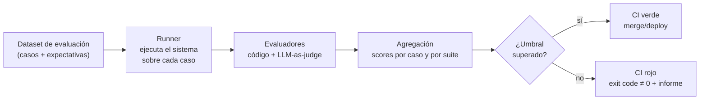

# Evaluación continua: pipelines de eval y regression testing en CI

> **Lab asociado:** [`05_eval_regresion.py`](../labs/05_eval_regresion.py)

## El problema: todo cambia debajo de ti

En software clásico, si no tocas el código, el comportamiento no cambia. En sistemas LLM
hay cuatro fuentes de cambio y solo controlas dos:

| Fuente de cambio | ¿La controlas? | Ejemplo |
|---|---|---|
| Tu prompt | Sí | Añades una regla al system prompt y rompes otra sin querer |
| Tu pipeline (retrieval, tools, parámetros) | Sí | Cambias `top_k` de 8 a 4 para ahorrar tokens |
| El modelo del proveedor | No | El proveedor retira el snapshot fijado y obliga a migrar |
| Los datos del mundo | No | Los usuarios empiezan a preguntar cosas que tu RAG no cubre |

La respuesta a esto es la misma que el software le dio a los bugs de regresión: **tests
automáticos que corren en cada cambio**. La diferencia es que aquí los tests no son
deterministas y "pasar" no es booleano sino un score con umbral.

## Anatomía de un pipeline de evaluación



### 1. El dataset de evaluación

Es el activo más valioso del pipeline y el que peor se cuida. Fuentes, por orden de valor:

1. **Fallos reales de producción** (de tus trazas — por esto la observabilidad va primero).
   Cada bug reportado se convierte en un caso de eval antes de arreglarse, exactamente como
   un test de regresión clásico.
2. **Casos escritos a mano por expertos de dominio**: el "golden set". 30–50 casos bien
   elegidos valen más que 5.000 sintéticos.
3. **Casos sintéticos generados por LLM**: útiles para volumen y cobertura de aristas
   (typos, idiomas, entradas hostiles), pero valídalos: heredan los sesgos del generador.

Estructura mínima de un caso (la que usa el lab 05):

```json
{
  "id": "refund-policy-01",
  "input": "¿Puedo devolver un producto después de 45 días?",
  "expectations": {
    "must_contain": ["30 días"],
    "must_not_contain": ["sí, sin problema"],
    "judge_criteria": "Debe decir que el plazo es 30 días y ofrecer la excepción de producto defectuoso"
  }
}
```

### 2. Los evaluadores: código primero, juez después

Hay dos familias, y el error típico es saltar a la segunda sin exprimir la primera:

**Evaluadores por código (deterministas, gratis, rápidos):**

- Formato: ¿es JSON válido? ¿cumple el schema Pydantic? ¿longitud dentro de rango?
- Contenido literal: contiene/no contiene strings o regex clave.
- Métricas clásicas cuando hay referencia: exact match, F1 sobre entidades extraídas.
- Comportamiento: ¿llamó a la tool correcta? ¿citó alguna fuente del contexto?

**LLM-as-judge (flexible, cuesta dinero, tiene sesgos):**

- Un modelo evalúa la salida contra una rúbrica ("¿la respuesta es fiel al contexto?").
- Imprescindible para calidad semántica, pero recuerda sus sesgos conocidos: prefiere
  respuestas largas (verbosity bias), prefiere la primera opción que le muestras
  (position bias) y se puntúa bien a sí mismo (self-preference). Mitigaciones: rúbricas
  con criterios binarios en vez de escalas 1–10, aleatorizar orden en comparaciones A/B,
  y usar un modelo distinto (o más potente) que el evaluado.
- **Calibra el juez contra humanos**: etiqueta 50 casos a mano, mide el acuerdo
  (Cohen's kappa) y solo confía en el juez donde el acuerdo sea alto.

Regla práctica: cada caso debería tener al menos un evaluador por código. El juez añade
señal, no la sustituye. En RAG ya conoces esta idea de RAGAS (módulo III: faithfulness,
answer relevance); aquí la generalizamos a cualquier sistema.

### 3. Umbrales y gates: cómo decidir rojo/verde

- **Umbral absoluto**: "score medio ≥ 0.85 y ningún caso crítico fallado". Simple, pero
  se queda obsoleto si el dataset crece.
- **Comparación contra baseline** (el verdadero *regression testing*): ejecuta la suite
  con la versión actual y la candidata, y falla si la candidata empeora más de X puntos
  o rompe casos que antes pasaban. Protege contra la regresión aunque el score absoluto
  sea alto.
- **Casos críticos marcados**: un subconjunto `critical: true` donde cualquier fallo
  bloquea, sin promedios. Aquí van los de seguridad y cumplimiento (p. ej., "nunca
  prometas devoluciones fuera de plazo", "nunca des consejo médico").

Sobre la no-determinismo: ejecuta con `temperature=0` y `seed` fijo donde el proveedor lo
soporte, y aun así asume varianza. Para suites pequeñas, ejecutar cada caso 3 veces y
promediar reduce falsos rojos; para CI rápido, una pasada con umbrales holgados y una
suite nocturna más exigente.

## Integración en CI

El contrato con CI es primitivo a propósito: **un proceso que imprime un informe y sale
con código 0 o 1**. Eso lo hace agnóstico de herramienta (GitHub Actions, GitLab,
Jenkins). El lab 05 implementa exactamente este contrato.

```yaml
# .github/workflows/eval.yml (esqueleto)
name: prompt-regression
on:
  pull_request:
    paths: ["prompts/**", "app/llm/**", "evals/**"]
jobs:
  eval:
    runs-on: ubuntu-latest
    steps:
      - uses: actions/checkout@v7
      - uses: astral-sh/setup-uv@v10
      - run: uv sync --extra ops
      - run: uv run python modulo-08-production-engineering/labs/05_eval_regresion.py
        env:
          OPENAI_API_KEY: ${{ secrets.OPENAI_API_KEY }}
```

Decisiones de diseño que importan en la práctica:

- **Dispara solo cuando cambian prompts/pipeline** (`paths:`): correr evals con API real
  en cada commit de README quema dinero y paciencia.
- **Presupuesta la suite**: nº de casos × tokens medios × precio. Una suite de 100 casos
  con `gpt-5.6-luna` cuesta mucho menos que con un tier insignia. Suite barata en PR,
  suite cara nightly.
- **Cachea respuestas por hash de (prompt, input, modelo, params)**: si el PR no toca un
  caso, no lo re-ejecutes.
- **Guarda el informe como artefacto** (JSON/HTML) para poder inspeccionar los fallos sin
  re-ejecutar.

### Niveles de madurez

| Nivel | Qué hay | Señal de que estás aquí |
|---|---|---|
| 0 | "Vibes": pruebas a mano en el playground | "A mí me funciona" en el PR |
| 1 | Golden set + script local | Se ejecuta "cuando nos acordamos" |
| 2 | Suite en CI con exit code, gate en PRs | Los cambios de prompt van por PR y pueden fallar |
| 3 | Baseline comparativo + evals online sobre tráfico muestreado | Detectas regresiones que el dataset no cubría |
| 4 | Ciclo cerrado: fallos de producción alimentan el dataset automáticamente | El dataset crece solo y el equipo confía en el verde |

El objetivo realista de este módulo es dejarte en el nivel 2–3.

## Herramientas del ecosistema

| Herramienta | Qué aporta | Trade-off |
|---|---|---|
| **pytest a pelo** (lab 05 es la versión sin framework) | Cero dependencias, control total, exit code nativo | Todo a mano: informes, paralelismo, cache |
| **LangSmith evals** | Datasets versionados en la plataforma, juez integrado, UI de comparación entre runs | SaaS, lock-in, coste |
| **Langfuse datasets + evals** | Lo mismo self-hosteable | Menos maduro en comparación de runs |
| **promptfoo** | CLI declarativa (YAML), matriz prompt × modelo, buen informe HTML | Orientado a prompts sueltos; incómodo para evaluar pipelines complejos |
| **DeepEval / Ragas** | Métricas listas (faithfulness, toxicity…), integración pytest | Métricas opinadas; revisa qué hay debajo antes de fiarte del número |
| **Inspect (UK AISI)** | Framework riguroso de evals, bueno para evaluaciones serias de modelos | Curva de entrada mayor; pensado más para evaluar modelos que features |

Consejo: empieza con el patrón del lab 05 (dataset JSON + runner propio + exit code).
Cuando el dataset pase de ~100 casos o necesites comparar runs históricos, migra a
LangSmith o Langfuse **manteniendo tu dataset en tu repo**: el dataset es tuyo, la
plataforma es reemplazable.

## Errores comunes

1. **Evaluar solo el caso feliz.** La mitad de la suite deberían ser adversarios: entradas
   ambiguas, fuera de dominio, hostiles, en otros idiomas.
2. **Usar LLM-as-judge sin calibrarlo.** Un juez no calibrado es un número aleatorio con
   buena presencia.
3. **Dataset estático.** Si en 3 meses no ha entrado ningún fallo real de producción al
   dataset, el pipeline evalúa el sistema de hace 3 meses.
4. **Optimizar contra la suite** (overfitting de prompts). Igual que con tests: si iteras
   el prompt mirando los casos, necesitas un held-out set que no miras.
5. **Bloquear el CI con evals lentas y caras en cada commit.** El equipo acabará
   saltándose el gate. Barato en PR, caro en nightly.
6. **Tratar el score como verdad absoluta.** 0.87 vs 0.85 con 40 casos no es señal, es
   ruido. Mira los intervalos y, sobre todo, mira los fallos concretos.

## Para profundizar

- Hamel Husain, "Your AI Product Needs Evals": <https://hamel.dev/blog/posts/evals/>
- LangSmith — evaluation concepts: <https://docs.langchain.com/langsmith/evaluation>
- promptfoo — guía de CI: <https://www.promptfoo.dev/docs/integrations/ci-cd/>
- Ragas (repaso del módulo III, aplicado a CI): <https://docs.ragas.io/>
- Inspect, UK AI Safety Institute: <https://inspect.aisi.org.uk/>
- Zheng et al., "Judging LLM-as-a-Judge with MT-Bench and Chatbot Arena" (sesgos del juez): <https://arxiv.org/abs/2306.05685>
