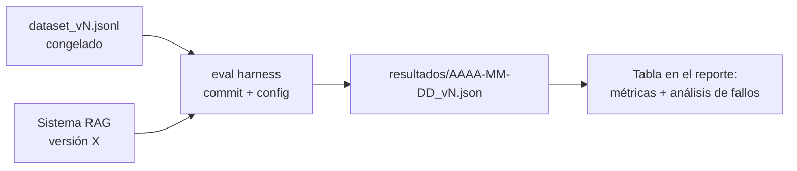

# Guía del pipeline RAG del proyecto de campo

El gate de evidencia exige demostrar qué recupera el sistema, qué afirmaciones quedan sustentadas y
cuándo se abstiene. No impone RAGAS ni un umbral universal: obliga a declarar dataset, segmentos,
jueces, baselines y objetivos **antes** de medir. La teoría está en el
[módulo 3](../modulo-03-rag/); aquí se construye una prueba reproducible de extremo a extremo.

## 1. Checklist técnico del pipeline

### Ingestión (job separado del serving)

- [ ] La ingestión es un **script/job independiente** de la API (se ejecuta offline, la API solo lee el índice). Mezclar ambos es el antipatrón número 1.
- [ ] **Idempotente y re-ejecutable**: correrla dos veces no duplica chunks (usa IDs deterministas, p. ej. hash de `doc_id + posición`).
- [ ] Extracción adaptada al formato real del corpus (PDF con tablas ≠ Markdown ≠ HTML). Has inspeccionado **a mano** la salida de al menos 10 documentos, incluyendo los feos (tablas, listas, cabeceras/pies).
- [ ] Registro de ingestión: cuántos documentos entraron, cuántos fallaron y por qué (un corpus donde "falló el 8% de PDFs" sin que lo sepas contamina todo lo demás).

### Chunking

- [ ] La estrategia de chunking es una **decisión escrita en un ADR**, no el default del framework. Sabes el tamaño medio y la distribución de tus chunks en tokens.
- [ ] Cada chunk lleva **metadatos**: documento origen, sección/título, posición, y los campos de filtrado de tu dominio (versión, categoría…).
- [ ] Los elementos que no sobreviven al troceado ciego (tablas, bloques de código, listas de requisitos) tienen tratamiento propio (chunk íntegro, o serialización a texto, o resumen + original).

### Retrieval

- [ ] top-k y umbral elegidos con datos (ver §3), no por defecto.
- [ ] Compara búsqueda léxica, semántica e híbrida cuando el corpus lo justifique. Añade reranker o
  grafo solo si una ablation demuestra qué segmento mejora y a qué coste.
- [ ] Filtrado por metadatos funcionando cuando la query lo permite.
- [ ] **Caso "no hay respuesta"**: cuando el retrieval devuelve chunks por debajo del umbral de relevancia, el sistema lo dice en vez de generar sobre ruido. Esto es lo que más protege tu faithfulness.

### Generación

- [ ] El prompt de generación exige **citar las fuentes** (ID de chunk/documento) y la API las devuelve estructuradas, no incrustadas en prosa.
- [ ] Instrucción explícita y testeada de no responder fuera del contexto recuperado.
- [ ] Respuesta en streaming hacia el cliente (afecta a la percepción de latencia y al P95 que reportas: define si mides time-to-first-token o tiempo total, y dilo).

## 2. El dataset de evaluación

Es la pieza que separa un proyecto de campo serio de una demo. Requisitos:

- Empieza con suficiente cobertura para que cada segmento tenga varios casos; **50–80 preguntas** es
  una referencia manejable, no un requisito. Amplía el dataset cuando el intervalo o el análisis de
  errores no permita sostener una conclusión.

| Tipo | % aprox. | Qué mide |
|---|---:|---|
| Factual simple (respuesta en 1 chunk) | 40% | Suelo de retrieval |
| Multi-chunk (combinar 2+ fragmentos o documentos) | 25% | Mérito real del sistema |
| Con filtro implícito (versión, categoría, fecha) | 15% | Metadatos y retrieval filtrado |
| **Sin respuesta en el corpus** | 10% | Abstención (la trampa clásica) |
| Ambiguas o mal formuladas, como pregunta la gente real | 10% | Robustez |

- Cada entrada tiene: `pregunta`, `respuesta_de_referencia` (escrita o verificada por ti contra el corpus, con la fuente anotada), y `chunks_relevantes` (IDs) para poder calcular context recall/precision.
- **Puedes generar borradores de preguntas con un LLM, pero cada una pasa revisión humana tuya**: las preguntas sintéticas sin revisar tienden a ser fáciles-para-el-retrieval (comparten vocabulario exacto con el chunk) e inflan las métricas. Reformula al menos la mitad con vocabulario distinto al del texto fuente.
- El dataset se **congela por versiones** (`eval/dataset_v1.jsonl`, `v2`…): si lo tocas después de medir, la comparación entre iteraciones muere. Añadir preguntas ⇒ nueva versión.
- **No iteres contra el dataset completo.** Separa desarrollo y holdout; declara cualquier uso del
  holdout y crea una versión nueva si deja de ser una prueba ciega.

## 3. Protocolo de evaluación

Elige métricas que separen retrieval, generación y decisión de abstenerse. RAGAS, DeepEval o un
harness propio pueden ejecutar parte del protocolo; el nombre de la librería no es la evidencia.

| Señal | Qué mide | Criterio |
|---|---|---|
| Recall/MRR/nDCG | Que la evidencia esperada aparezca y esté bien ordenada | Objetivo por segmento, fijado antes |
| Soporte de afirmaciones | Que cada claim material esté respaldado por evidencia | Gate definido por riesgo |
| Utilidad de respuesta | Que resuelva la tarea, no solo que sea fluida | Baseline humano o determinista |
| Abstención | Que rechace preguntas no respondibles sin penalizar las válidas | Matriz de falsos positivos/negativos |

Protocolo:

1. **Fija el juez**: modelo, snapshot, prompt/rúbrica y configuración exactos. Audita una muestra contra
   revisores humanos y mide desacuerdos; temperatura cero no elimina toda la varianza.
2. Ejecuta la evaluación **con un script versionado** que vuelca resultados por caso a JSON/CSV con
   dataset, commit, corpus, modelos, top-k y chunker. Sin esto el claim no se reproduce.
3. Repite las señales no deterministas y reporta distribución o intervalo, no solo una media. Un gate
   que cambia de estado entre repeticiones necesita más casos o una regla de decisión explícita.
4. Registra coste y latencia del propio harness. Usa evaluadores baratos para feedback frecuente y
   reserva el juez de confirmación para releases, siempre comprobando correlación entre ambos.

## 4. Evidencia de revisión

Tu reporte de evaluación (en el README del proyecto o en `eval/REPORTE.md`) debe contener:

1. **Tabla de resultados** por métrica (media ± rango de las repeticiones), separando dev y holdout, con la configuración exacta del sistema medido.
2. **Serie de iteraciones**: tabla de cómo evolucionaron las métricas con cada cambio relevante
   (baseline → +híbrido → +reranker → prompt v3…). Prueba qué decisión movió cada segmento.
3. **Al menos una ablation**: misma medición con y sin una decisión cara (reranker, grafo o chunking
   especial). Expresa mejora por segmento junto con latencia y coste; evita convertir una media única
   en una nota.
4. **Análisis de fallos**: las 5–10 preguntas peor puntuadas, clasificadas por causa (fallo de retrieval / fallo de generación / referencia discutible / pregunta sin respuesta mal abstenida) y qué harías con cada clase. Un 0,78 con análisis de fallos vale más que un 0,85 sin él.
5. **Limitaciones declaradas**: juez usado y su sesgo, tamaño del dataset, qué no cubre.

## 5. Fallos que impiden superar el gate

- Medir una sola vez al final y tratar el resultado como verdad estable.
- Dataset generado 100% por LLM sin revisión, con preguntas que repiten literalmente frases del corpus.
- Cambiar dataset y sistema a la vez entre mediciones (no sabes qué movió la métrica).
- Reportar solo una métrica de juez: sin señal de retrieval no puedes localizar el fallo.
- No versionar la configuración: te preguntarán "¿con qué top-k salió ese 0,79?" y "no me acuerdo" invalida el número.
