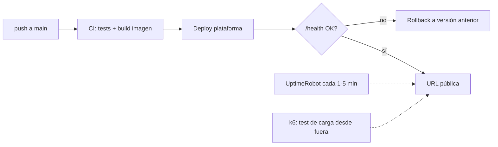

# Guía de despliegue en cloud

El gate de producción exige **un endpoint accesible, un SLO de disponibilidad y un objetivo de
latencia**, los tres con evidencia medida, no afirmada. Esta guía compara plataformas, define cómo
medir cada señal y fija el checklist de producción mínima. El 99% y P95 < 3 s son baselines útiles,
no números universales: el JTBD puede justificar otros objetivos antes de recoger datos.

Decisión previa que condiciona todo: **despliega la primera vertical en cuanto sea operable**. La
disponibilidad necesita una ventana de observación; un despliegue al final solo produce una captura,
no historia operativa.

## 1. Comparativa de plataformas

Perfil del proyecto de campo: API en contenedor (FastAPI + agente), vector DB gestionada aparte y tráfico
bajo. Los precios, free tiers, regiones y políticas de suspensión cambian con frecuencia: consulta
las páginas oficiales el día de decidir y guarda URL, fecha, moneda e impuestos en el ADR. La tabla
compara propiedades arquitectónicas; la columna de coste se completa con la cotización vigente.

| Plataforma | Coste mensual verificado | A favor | En contra | Encaja si… |
|---|---|---|---|---|
| **Railway** | _Rellena desde pricing oficial_ | Deploy desde repo en minutos, logs y variables de entorno integrados | Revisa RAM, regiones disponibles, egress y política de suspensión del plan elegido | Priorizas velocidad de entrega y la región cumple tu P95 medido. |
| **Fly.io** | _Rellena desde pricing oficial_ | Selección regional y control fino de Machines | Más decisiones operativas; auto-stop/cold start altera la latencia | Necesitas región próxima y quieres controlar ciclo de vida y escalado. |
| **Render** | _Rellena desde pricing oficial_ | Flujo gestionado, TLS y dominios integrados | Verifica si el plan elegido suspende el servicio y mide su cold start | Ya conoces la plataforma y el plan sostiene el SLO sin dormirse. |
| **AWS App Runner / ECS Fargate** | _Calcula cómputo, red, logs y registro_ | IAM, ECR y CloudWatch nativos; buena trazabilidad cloud | Más superficie de configuración y coste repartido entre servicios | Quieres demostrar arquitectura AWS y has presupuestado su operación. |
| **AWS Lambda + API Gateway** | _Calcula requests, duración, red y concurrencia_ | Escala a cero y cobra por uso | Cold starts con dependencias pesadas; streaming y agente multi-paso requieren validar límites | El perfil de tráfico es esporádico y tus pruebas cumplen P95 y duración. |
| **VPS + Docker** | _Suma instancia, backups, red y tiempo operativo_ | Control del host y coste predecible | Tú operas TLS, firewall, parches, backups y rollback | Puedes demostrar endurecimiento y operación reproducible. |

Reglas transversales:

- Decide si la vector DB es gestionada o propia mediante ADR. Si el índice vive dentro de un
  contenedor efímero, demuestra reconstrucción automática o persistencia externa.
- El modelo puede ser API o inferencia propia. Presupuesta cómputo, RAM/GPU, cold start, operación y
  recuperación; no compares solo el precio nominal por token.
- Documenta la elección como **ADR con la tabla anterior rellenada con tus números** (incluida la latencia medida desde tu región a la plataforma).

## 2. La URL pública

- [ ] HTTPS obligatorio (todas las plataformas de la tabla lo dan; en VPS, Caddy o certbot).
- [ ] Una **interfaz mínima utilizable**: la persona revisora debe poder ejecutar el JTBD sin conocer
  comandos internos. Puede ser web, CLI o API documentada según el producto.
- [ ] `GET /health` es **liveness** y solo confirma que el proceso atiende HTTP; debe responder
  rápido y no llamar a servicios pagados. `GET /ready` es **readiness**: comprueba configuración y
  dependencias críticas con timeouts breves. El monitor externo vigila ambos y alerta de forma
  distinta: proceso caído frente a instancia viva pero incapaz de servir tráfico.
- [ ] **Rate limiting** y autenticación proporcionada al riesgo de cada endpoint. El modo de revisión
  tiene presupuestos estrictos y no expone una clave de proveedor.
- [ ] Secretos en el gestor de la plataforma, jamás en el repo. `.env.example` documenta las variables.

## 3. Medir uptime ≥ 99%

**Protocolo exigido:**

1. Alta en un monitor **externo** gratuito (UptimeRobot, Better Stack free tier) contra `/health`, intervalo 1–5 min, **el mismo día del primer deploy**.
2. Declara la **ventana de reporte** antes de medir y conserva suficiente historia para incluir
   deploys e incidentes. Como referencia, 99% sobre 14 días permite ~3,4 h acumuladas de caída.
3. Evidencia: captura/export del panel del monitor con el porcentaje y el histórico de incidentes. Auto-medirse con un cron en la misma máquina no vale (si la máquina cae, tu medidor también).
4. Cada caída registrada > 10 min lleva una línea de explicación en tu reporte ("redeploy sin health check en Railway, 22 min, corregido activando deploy con overlap"). Las caídas explicadas suman madurez; las caídas sin explicar restan el doble.

## 4. Medir latencia P95 < 3 s

Un número P95 honesto exige definir qué mides y bajo qué carga:

1. **Define el punto de medida**: extremo a extremo desde el cliente, sobre la acción principal. Si la
   respuesta es streaming, reporta **dos** cifras: time-to-first-token y tiempo total. Liga el SLO a
   la percepción o decisión de usuario y fíjalo antes de ver los números.
2. **Herramienta**: k6 o Locust, script versionado en el repo (`load/`).
3. **Escenario mínimo**: 10–15 min de duración, 3–5 usuarios virtuales concurrentes con think-time realista, y un set de ≥ 20 queries variadas del dataset de evaluación (no la misma query, que se cachea sola). Ejecutado **contra la URL pública**, no contra localhost.
4. **Reporta**: P50 / P95 / P99, tasa de error, y el desglose por tramo usando tus trazas (qué parte es retrieval, qué parte LLM). El desglose es lo que convierte el número en ingeniería: "P95 2,4 s, de los cuales 1,9 s son la llamada de generación" te dice dónde NO optimizar.
5. Ejecuta el test **dos veces en días distintos** (los proveedores LLM tienen horas malas) y reporta ambas.

Si no llegas a 3 s: las palancas por orden de rendimiento habitual — streaming + medir TTFT, modelo más rápido para los pasos de enrutado del agente (el paso "decidir herramienta" no necesita el modelo caro), paralelizar retrieval con lo que se pueda, recortar contexto (menos chunks mejor elegidos), y caché de queries repetidas. Cada palanca aplicada, a su ADR o al análisis de costes.

## 5. Checklist de producción mínima

- [ ] **Docker**: imagen construible con `docker build` en limpio; la plataforma despliega esa imagen (no "funciona en mi máquina con uv run").
- [ ] **CI/CD**: push a `main` → tests → promoción reproducible. Si el despliegue es manual, debe
  existir un comando versionado, verificación y rollback; una secuencia recordada de SSH no basta.
- [ ] **Logs estructurados** con un request-id por petición que aparezca también en la traza de la
  ejecución, independientemente del proveedor de observabilidad.
- [ ] **Rollback probado**: sabes (y has ensayado una vez) cómo volver a la versión anterior en < 5 min.
- [ ] Reinicio limpio: el contenedor puede morir y volver sin intervención (nada crítico en memoria/filesystem local; el índice vive en la vector DB gestionada).
- [ ] Presupuesto/alarma de facturación activada en la plataforma y en el proveedor LLM (ver [guía LLMOps](06-guia-llmops.md)).

## 6. Fallos que impiden superar el gate

- Plan que duerme el servicio sin incorporarlo a la medición: el primer request tarda 40 s y el SLO
  reportado no representa al usuario.
- Monitor activado al final: no hay ventana operativa que reportar.
- P95 medido con 1 request en local, o con la misma query cacheada 500 veces.
- Índice vectorial dentro del contenedor: cada deploy borra el corpus.
- La API key del proveedor LLM en el repo público: es un incidente de seguridad que exige rotación,
  análisis de uso y postmortem.
