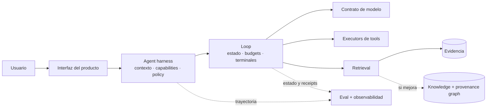

# Módulo 09 — Proyecto de campo

El cierre de la ruta no es un examen ni una maqueta que solo funciona durante una demo. Es un sistema
acotado que resuelve un trabajo real, acumula evidencia operativa y permite reconstruir por qué tomó
cada decisión importante.

No necesitas meter todas las técnicas del curso. Necesitas justificar las que usas, medirlas contra
una alternativa más simple y demostrar que el sistema falla de forma controlada.

## Mapa del módulo

| Recurso | Qué resuelve |
|---|---|
| [`01-propuestas-de-proyecto.md`](01-propuestas-de-proyecto.md) | Cinco escenarios y filtro para proponer uno propio |
| [`02-documento-de-arquitectura/`](02-documento-de-arquitectura/) | Documento vivo y ADRs con alternativas reales |
| [`03-guia-rag.md`](03-guia-rag.md) | Evidencia externa, retrieval y evaluación por etapas |
| [`04-guia-agente.md`](04-guia-agente.md) | Autoridad, tools, harness, loop y fallos |
| [`05-guia-despliegue.md`](05-guia-despliegue.md) | Despliegue, SLOs y medición desde un usuario real |
| [`06-guia-llmops.md`](06-guia-llmops.md) | Señales de calidad, coste, latencia y operación |
| [`07-analisis-de-costes.md`](07-analisis-de-costes.md) | Coste medido y escenarios de escala |
| [`08-defensa-y-demo.md`](08-defensa-y-demo.md) | Historia de producto, fallo real y revisión técnica |
| [`checklist-final.md`](checklist-final.md) | Evidencia verificable de cada gate |

## Gates de evidencia

El proyecto está listo únicamente cuando atraviesa todos los gates aplicables:

1. **Trabajo real:** usuario, decisión o tarea concreta; no «chatbot para X».
2. **Contrato de modelo:** proveedor reemplazable, límites y uso observables.
3. **Evidencia:** contexto externo con identidad, vigencia, citas o abstención.
4. **Harness:** capacidades, permisos, aislamiento, trazas y evals reproducibles.
5. **Loop:** estados terminales, presupuestos, cancelación, idempotencia y reanudación.
6. **Graph decision:** mejora medida en consultas relacionales o ADR que justifica no usar grafo.
7. **Producción:** SLOs, costes, seguridad, alertas y runbook probado.
8. **Reproducibilidad:** un tercero puede ejecutar, romper y verificar el sistema.

Las certificaciones son opcionales y viven en su propia ruta. No cuentan como evidencia de que este
sistema funciona.

## Arquitectura de referencia

Tu solución puede ser más simple. Este mapa muestra fronteras, no productos obligatorios:

Si una flecha no existe en tu caso, explica por qué. Si existe, debe tener contrato, owner y señal de
fallo.

## Secuencia de entrega

### 1. Enmarcar

Define JTBD, usuario, outcome, datos permitidos, acción de mayor riesgo y presupuesto. Escribe ADRs
para las dos decisiones que más pueden cambiar el producto.

### 2. Cortar una vertical viva

Despliega pronto el recorrido mínimo desde input hasta outcome. Activa trazas y medición antes de
optimizar calidad; no puedes reconstruir datos que nunca recogiste.

### 3. Establecer baselines

Compara el modelo más simple, retrieval mínimo, workflow determinista y ausencia de grafo. Añade
complejidad únicamente cuando un segmento del dataset demuestra la necesidad.

### 4. Romper el sistema

Inyecta tool failure, fuente contradictoria, timeout ambiguo, prompt injection, cancelación y cambio
de versión. Convierte cada fallo relevante en caso de regresión.

### 5. Endurecer y operar

Fija SLOs, presupuestos, alertas y runbook. Ejecuta carga representativa y un incidente simulado.
Mide coste real por outcome, no solo precio por token.

### 6. Defender

Cuenta qué creías, qué falló, qué evidencia cambió el diseño y qué retirarías con más tiempo. Incluye
un fallo controlado en la demo; una grabación perfectamente feliz no demuestra operabilidad.

## Señales de revisión

| Dimensión | Evidencia fuerte | Señal de demo frágil |
|---|---|---|
| Producto | Uso y outcome definidos; feedback de una persona objetivo | Caso genérico sin decisión real |
| Calidad | Dataset, segmentos, baseline y fallos revisados | Una media elegida después de probar |
| Autoridad | Capabilities y efectos acotados por policy | El prompt pide al modelo portarse bien |
| Durabilidad | Crash y reanudación sin duplicación | Solo happy path en memoria |
| Procedencia | Claims enlazados a fuentes y versiones | URLs decorativas al final del texto |
| Operación | SLOs, alertas y runbook activados | Dashboard sin una decisión asociada |
| Coste | Receipt real y proyección por drivers | Calculadora de tokens sin tráfico real |
| Ingeniería | Instalación reproducible y tests adversos | Solo funciona en el portátil del autor |

No hay una media que permita compensar una violación de autoridad con una demo bonita. Los gates de
seguridad, procedencia y reproducibilidad son binarios.

## Entregables

1. Repositorio ejecutable con setup automatizado y licencia clara.
2. Documento de arquitectura vivo y ADRs revisados tras medir.
3. Dataset de evaluación, baselines y resultados segmentados.
4. Harness, capability manifest y política de autoridad.
5. Loop, tabla de estados, journal, checkpoints y receipts.
6. Decisión de grafo respaldada por ablation.
7. Despliegue o paquete reproducible con observabilidad.
8. Costes, SLOs, threat model, runbook y postmortem.
9. Demo y revisión con enlaces a la evidencia anterior.

## Reglas de campo

- Cierra alcance antes de optimizar; cambia el corpus si no sostiene el problema.
- Fija presupuestos y métricas antes de ver resultados.
- Despliega una vertical mínima antes de necesitar historia operativa.
- No confundas una respuesta fluida con un outcome correcto.
- Conserva fallos que cambiaron el diseño: son parte central del portfolio.
- Usa asistentes para construir, pero no presentes una decisión que no puedas explicar y verificar.

## Criterio final

Entrega el proyecto a una persona que no participó en su construcción. Debe poder instalarlo, ejecutar
un caso feliz y uno adverso, localizar la evidencia de una respuesta, cancelar un run y entender el
estado final sin que tú limpies nada a mano. Cuando eso ocurre, ya no es una demo.
