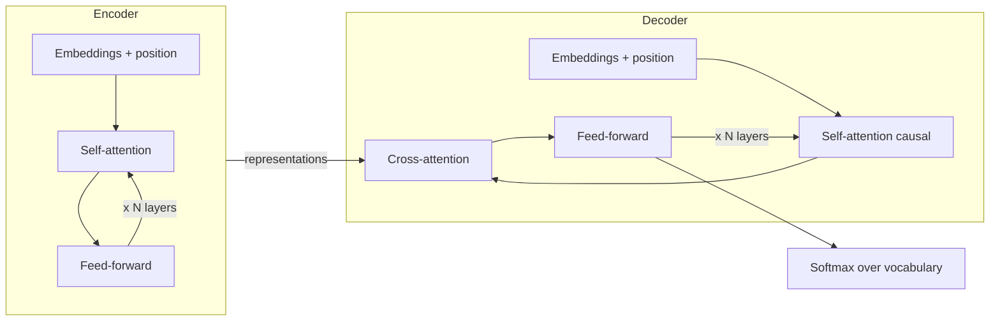

# Transformer Architecture: Encoder, Decoder, and Multi-Head Attention

> **Module 1 · Topic 1** · Estimated study time: 3 h
> Associated lab: none (this topic is the conceptual foundation for the entire module).
> Associated exercises: 1 and 9.

---

## 1. Why the Transformer Exists

Before 2017, dominant language models were recurrent networks (RNN, LSTM, GRU).
An RNN processes text **token by token, in order**: to understand the 20th word of a
sentence, it must first have "digested" the previous 19 and compressed all relevant
information into a fixed-size state vector. This presents two severe problems:

1. **It cannot be parallelized.** Step 20 depends on step 19, which depends on 18...
   Training is sequential and slow, and GPUs (which are parallel matrix multiplication machines) are underutilized.
2. **Memory degrades with distance.** If the key word needed to understand the end
   of a paragraph is at the beginning, its information must survive dozens of
   compression steps. In practice, long-range dependencies are lost.

The paper *Attention Is All You Need* (Vaswani et al., 2017) proposed a radical idea:
eliminate recurrence entirely and build the model **entirely with attention**. Each
token can "look" directly at any other token in the sequence, regardless of
distance, and all tokens are processed **simultaneously**. Hence the paper's title.

**Analogy.** An RNN is like reading a book with a memory that only lets you recall a
one-sentence summary of everything preceding. A Transformer is like reading with the book open
in front of you: at any moment, you can re-read any previous page. You don't rely on your
summary; you consult the source.

---

## 2. Bird's-Eye View of the Architecture

The original Transformer was an **encoder-decoder** model designed for
machine translation:



- The **encoder** reads the complete input sentence (e.g., in English) and produces a
  contextual representation for each token. Each token sees all others,
  forward and backward. It is **bidirectional**.
- The **decoder** generates the output (e.g., in Spanish) token by token. It features two types
  of attention: *causal self-attention* (only looks at already generated tokens, never the future)
  and *cross-attention* (looks at the encoder's representations).

From this original design emerged three families:

| Family | What it uses | Examples | Purpose |
|---|---|---|---|
| **Encoder-only** | Encoder only | BERT, RoBERTa | Classification, embeddings, semantic search |
| **Decoder-only** | Decoder only (no cross-attention) | GPT, Claude, Llama, Mistral | Text generation: current LLMs |
| **Encoder-decoder** | Both | T5, BART, Whisper | Translation, summarization, transcription |

**Key fact for this course:** virtually all LLMs you will work with
(GPT-5.6, Claude 5, Llama 4, Mistral, and Gemini 3.x) are **decoder-only**. They predict the next token
given the preceding sequence, and nothing more. Everything they do — answering questions, writing
code, reasoning — emerges from that single task trained at massive scale.

---

## 3. From Text to Vectors: Embeddings and Position

A model does not operate on words; it operates on numbers. The pipeline is:

1. **Tokenization**: text is split into tokens (covered in depth in topic 2).
   Each token is an integer, an index in a vocabulary of ~50,000–200,000 entries.
2. **Embedding**: each index is converted into a dense vector of dimension `d_model`
   (e.g., 4096 in Llama 3 8B, 12,288 in GPT-3 175B). It is a learned lookup table:
   row 7423 of the embedding matrix is "the vector for token 7423".
3. **Positional information**: attention alone does not know the order in which tokens
   arrive (it is a set operation). Positional information must be injected. The original
   paper added sinusoidal waves to the embedding; modern models primarily use
   **RoPE** (Rotary Position Embeddings), which rotates Q and K vectors based on
   position, and performs better when extrapolating to long contexts.

After this step, a sentence of `n` tokens becomes a matrix of `X` dimensions with size `n × d_model`.
Everything that follows is just transformations of that matrix.

---

## 4. Self-Attention: The Core Mechanism

### 4.1 The Intuition

In the sentence *"the bank was closed because it was a holiday"*, to properly represent "bank"
you need to look at "closed" and "holiday" (it's an office, not a seat or a riverbank).
Attention is a mechanism that allows each token to build its representation as a
**weighted mixture** of all tokens in the sequence, where the weights are determined by
the model itself based on relevance.

The standard metaphor is a **fuzzy database**:

- Each token emits a **query** (Q): "What am I looking for?"
- Each token exposes a **key** (K): "What do I offer?"
- Each token exposes a **value** (V): "What content do I deliver if you pick me?"

A token compares its query against all keys (dot product: higher alignment yields
a higher score), converts those scores into weights that sum to 1 (softmax), and takes
the weighted average of the values.

### 4.2 The Formula

```
Attention(Q, K, V) = softmax( Q · Kᵀ / √d_k ) · V
```

Q, K, and V do not fall from the sky: they are obtained by multiplying the input X by three matrices
learned during training:

```
Q = X · W_Q        K = X · W_K        V = X · W_V
```

Scaling by `√d_k` (the dimension of the keys) prevents the dot products from
growing so large that the softmax saturates (which would assign almost all weight to a single token and cause gradients to vanish).

### 4.3 Manual Numerical Example

Let's calculate a complete attention pass with 2 tokens and `d_k = 2`. Assume that after
multiplying by W_Q, W_K, and W_V we have:

```
Q = | 1  0 |      K = | 1  0 |      V = | 1  2 |
    | 0  1 |          | 1  1 |          | 3  4 |
```

**Step 1 — Scores: Q · Kᵀ**

```
Q · Kᵀ = | 1·1+0·0   1·1+0·1 |   =   | 1  1 |
         | 0·1+1·0   0·1+1·1 |       | 0  1 |
```

**Step 2 — Scale by √d_k = √2 ≈ 1.414**

```
| 0.707  0.707 |
| 0.000  0.707 |
```

**Step 3 — Softmax per row** (each row is "how a token distributes its attention")

- Row 1: e^0.707 = 2.028 for both → weights `[0.5, 0.5]` (attends equally to both).
- Row 2: e^0 = 1.000 and e^0.707 = 2.028 → sum 3.028 → weights `[0.330, 0.670]`
   (token 2 attends more to token 2 than to 1).

**Step 4 — Weighted mix of values: weights · V**

- Output token 1: `0.5·[1,2] + 0.5·[3,4] = [2.0, 3.0]`
- Output token 2: `0.330·[1,2] + 0.670·[3,4] = [2.34, 3.34]`

Final result:

```
| 2.00  3.00 |
| 2.34  3.34 |
```

That is *all* the mechanism. Each output row is a new representation of the token,
built by looking at the entire sequence. In a real LLM this happens with `d_k = 128`,
sequences of thousands of tokens, and dozens of layers, but the operation is exactly this.

**Exercise 1** asks you to repeat this calculation with other matrices. Do it by hand once in
your life: after that, you will never see attention as magic again.

### 4.4 Causal Mask: Not Looking at the Future

In a decoder, the token at position `i` can only attend to positions `≤ i`.
It is implemented by setting `-∞` in the scores for forbidden positions before softmax (so
their weight becomes 0):

```
Puntuaciones enmascaradas (secuencia de 4 tokens):

| s11  -∞   -∞   -∞  |
| s21  s22  -∞   -∞  |
| s31  s32  s33  -∞  |
| s41  s42  s43  s44 |
```

This is what allows parallel training (all positions predict their "next
token" simultaneously) without any cheating by looking at the answer.

---

## 5. Multi-Head Attention: Multiple Focus Points at Once

A single attention mechanism must choose *one* relevance criterion. But "bank" needs
to look at syntax (am I the subject of which verb?), semantics (which words
disambiguate me?), and coreference (what does "was" refer to?) simultaneously.

The solution: instead of one attention with vectors of dimension `d_model`, we execute
**h attention heads in parallel** ("heads"), each with its own W_Q, W_K, W_V and with
reduced dimension `d_k = d_model / h`. Each head learns to focus on a different type of
relationship. Their outputs are concatenated and projected back to `d_model`:

```
MultiHead(X) = Concat(cabeza_1, ..., cabeza_h) · W_O
```

In the original paper: `d_model = 512`, `h = 8`, `d_k = 64`. In Llama 3 70B:
`d_model = 8192`, `h = 64` query heads. The total cost is similar to a single
large head, but expressivity is much higher.

**Analogy.** It's like analyzing a soccer match with 8 cameras: one follows the ball,
another offside plays, another the goalkeeper. Each camera (head) has lower resolution
than a single giant camera, but the collective view captures much more.

Modern variants you will see in spec sheets: **MQA** (multi-query: all heads
share K and V) and **GQA** (grouped-query: groups of heads share K and V; used by
Llama 3 and Mistral). They drastically reduce KV cache memory during inference with
minimal quality loss.

---

## 6. The Rest of the Block: FFN, Residuals, and Normalization

Each layer of a Transformer is not just attention. The complete block is:

```
        ┌────────────────────────────────────┐
  X ──►│ LayerNorm ─► Multi-Head Attention  ├──(+)──┐   suma residual
        └────────────────────────────────────┘   │
   ┌─────────────────────────────────────────────┘
   │    ┌────────────────────────────────────┐
   └──►│ LayerNorm ─► Feed-Forward (MLP)    ├──(+)──►  salida de la capa
        └────────────────────────────────────┘
```

- **Feed-forward (FFN/MLP)**: two linear layers with a non-linearity in between
   (GELU or SwiGLU), applied to each token independently. The inner layer is typically
   ~4× `d_model`. If attention is "communication between tokens", the FFN is "computation
  within each token". Most of the model's parameters live here, and
  evidence points to factual knowledge being largely stored in these layers.
- **Residual connections**: the input is added to the output of each sub-block
   (`x + f(x)`). They enable training 100+ layer networks: the gradient always has a
  direct "highway" backward.
- **Normalization**: stabilizes magnitudes. Modern models use *pre-norm*
   (normalize before the sub-block, as in the diagram) and often RMSNorm instead of
  LayerNorm, for efficiency.

An LLM is this block repeated N times (32 layers in Llama 3 8B, 126 in Llama 3.1 405B),
with a final layer that projects to the vocabulary and produces a **logit for each possible
token**. The softmax of those logits is the next-token distribution — and over that
distribution act `temperature` and `top_p`, which we will cover in topic 3.

---

## 7. Inference: How Text Is Actually Generated

Generation is a loop:

1. Process the full prompt and obtain the next-token distribution (*prefill*).
2. Sample a token from that distribution.
3. Append it to the sequence and predict again (*decode*), one token per iteration.

Recalculating attention for the entire sequence at each step would be wasteful: the K and V
of previous tokens do not change. Therefore, they are stored in the **KV cache**. Practical
consequences you will notice when using APIs:

- *Prefill* is parallel and fast; *decode* is sequential → "time to first token" and
  generation speed are distinct metrics.
- The KV cache grows linearly with context → long contexts consume significant memory
  and why long input is billed and optimized (prompt caching from Anthropic/OpenAI).
- Full attention is O(n²) with sequence length → doubling context
  quadruples attention cost in prefill.

---

## 8. Common Mistakes

1. **"The model understands words."** No: it operates on tokens and vectors. Many seemingly
   mysterious failures (counting letters, arithmetic with long numbers) are tokenization issues, not "intelligence" issues (topic 2).
2. **"Attention is expensive because the model is large."** Distinct costs: the number
   of parameters sets the per-token cost; O(n²) attention sets the extra cost for
   long context. A 100K token prompt is expensive even on a small model.
3. **Confusing encoder-only with decoder-only.** BERT does not generate text; GPT does not natively provide
   bidirectional embeddings. If you need embeddings for search, use an embedding model, not a generative LLM.
4. **"Multi-head = more parameters."** Not necessarily: the dimension is split across
   heads. It is diversity of perspectives, not brute force.
5. **Forgetting the causal mask when reasoning about the model.** Token 50 knows *nothing*
   about token 51. That's why prompt order matters: instructions first,
   question last, and the model "re-reads" everything when generating each new token.

---

## 9. For Further Reading

- **Vaswani et al. (2017), *Attention Is All You Need*** — the original paper:
  https://arxiv.org/abs/1706.03762
- **Jay Alammar, *The Illustrated Transformer*** — the best visual explanation:
  https://jalammar.github.io/illustrated-transformer/
- **Andrej Karpathy, *Let's build GPT from scratch*** — full implementation in video:
  https://www.youtube.com/watch?v=kCc8FmEb1nY
- **Harvard NLP, *The Annotated Transformer*** — the paper annotated line by line in PyTorch:
  https://nlp.seas.harvard.edu/annotated-transformer/
- **Su et al. (2021), *RoFormer* (RoPE)** — rotary positional embeddings:
  https://arxiv.org/abs/2104.09864
- **Ainslie et al. (2023), *GQA*** — grouped-query attention:
  https://arxiv.org/abs/2305.13245
