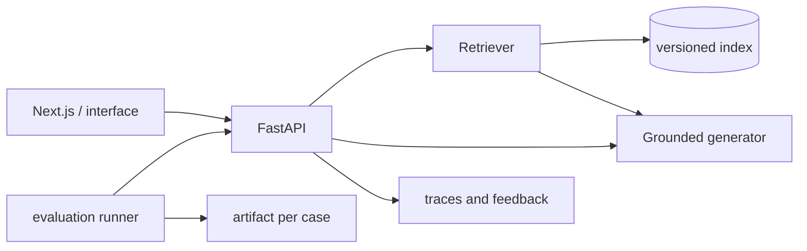

# Module Project — NebulaOps Knowledge Assistant

Build a RAG assistant evaluated on NebulaOps' fictional documentation. The repository
includes a complete baseline API without a network: it is not the final result, but the control against
which you must justify embeddings, reranking, and generation.

## Expected Outcome

The user asks a question, receives a brief answer with citations, and can open exactly the
fragments used. If the evidence is insufficient, the system abstains. An evaluation panel compares
configurations with the frozen dataset without mixing development and test cases.



## Included Baseline

From the root:

```bash
uv sync --extra rag --extra dev
uv run uvicorn app.main:app --app-dir modulo-03-rag/proyecto/backend --reload
```

In another terminal:

```bash
curl -s http://127.0.0.1:8000/health
curl -s -X POST http://127.0.0.1:8000/query \
  -H 'content-type: application/json' \
  -d '{"question":"¿Cuánto dura un enlace de recuperación?","top_k":4}'
```

The baseline loads `labs/data/*.md`, splits by sections, uses TF-IDF, selects phrases, and returns
evidence IDs. It does not call any LLM. Its limitations are deliberate and measurable.

## Mandatory Iterations

1. **Ingestion:** manifest with versioned hashes, parser, and chunker; create, update, and delete.
2. **Retrieval:** embeddings combined with lexical search using RRF; evaluation by document and by chunk.
3. **Reranking:** broad candidate set and small final context; latency and batch measured.
4. **Generation:** grounded prompt, citations per claim, and explicit abstention.
5. **Interface:** question, answer, expandable sources, latency, and feedback; do not hide errors.
6. **Evaluation:** offline runner in CI and authorized RAGAS evaluation with cost limits.
7. **Operations:** health/readiness, logs without sensitive content, timeout, and budget.

## API Contract

`POST /query` accepts:

```json
{"question": "texto no vacío", "top_k": 4}
```

Returns `answer`, `abstained`, `evidence[]`, and `latency_ms`. Each evidence contains `chunk_id`,
`document_id`, title, excerpt, and score. Do not change the contract when replacing the baseline: this ensures that
tests and the comparator remain valid.

## Acceptance Criteria

Regarding the 30 included cases, maintaining the five unanswerable ones:

- doc recall@4 ≥ 0.90 and MRR@4 ≥ 0.85;
- average context recall and faithfulness ≥ 0.75 in the final RAGAS run;
- correct abstention in ≥ 80% of unanswerable questions;
- no uncited claims in the manual audit of 20 responses;
- p95 local latency and estimated cost per 1,000 queries documented;
- `pytest` offline and reproducible, without depending on keys;
- threat model for prompt injection, exfiltration, poisoning, and access control.

An average score does not compensate for a critical failure. Present metrics by tag and five failure cases with their
root cause.

## Structure

```text
proyecto/
├── README.md
└── backend/
    ├── app/
    │   ├── __init__.py
    │   ├── main.py
    │   ├── rag.py
    │   └── schemas.py
    └── tests/
        └── test_api.py
```

The interface and persistent index are part of the student deliverable. Keep the baseline API
as a comparison and add implementations via configuration, not by editing results.

## Submission Evidence

Include the exact command, commit, corpus manifest, model versions, configuration, hardware,
dataset hash, JSON results, and date. The demo must show a correct response, an abstention,
a contained injection, and a known failure; hiding the failure makes the defense less credible.
