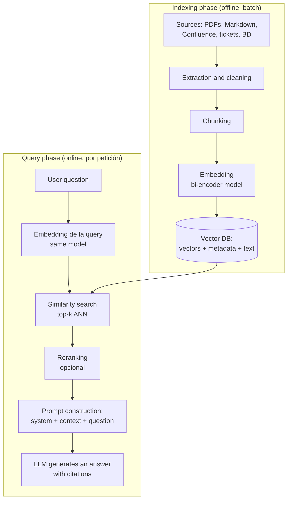

# 01 — RAG Architecture: Ingestion, Embedding, Indexing, and Retrieval

## Why RAG Exists

An LLM has two structural limitations that no prompt can fix:

1. **Frozen Knowledge**: The model only knows what was in its training corpus up to the cutoff. It does not know your internal documentation, your tickets, or yesterday's news.
2. **Finite and Expensive Context**: Although 128k-1M token contexts allow you to "stuff everything in," paying hundreds of thousands of tokens per request does not scale, latency grows linearly with the prompt, and attention quality over huge contexts degrades (the *lost in the middle* effect: models retrieve information located in the middle of a long context worse than at the extremes).

RAG (Retrieval-Augmented Generation, Lewis et al., 2020) addresses both: instead of waiting for the model to *know* the answer, it **delivers the relevant evidence in the prompt**, retrieved at query time from an updatable index.

Alternatives and when they make sense:

| Approach | When to Use It | When Not to |
|---|---|---|
| **RAG** | Changing knowledge, large corpus, need to cite sources | Pure reasoning tasks without external knowledge |
| **Fine-tuning** | Changing *behavior* or *format* (tone, style, custom DSL) | Injecting *facts* — it is expensive, becomes outdated, and hallucinates just as much |
| **Long context (everything in the prompt)** | Small corpus (< dozens of pages), quick prototype | Large corpus, sensitive cost/latency, multi-user |
| **Nothing (model only)** | Stable general knowledge | Any private data or post-cutoff data |

In practice, they are combined: fine-tuning for format + RAG for facts is a common pattern. The mnemonic rule: **fine-tuning teaches *how*, RAG provides the *what***.

## The Two Phases: Indexing (offline) and Querying (online)



Mentally separating these two phases avoids common design errors:

- The **indexing** phase runs when documents change (nightly batch, webhook, event queue). Its metric is *freshness* and *reindexing cost*.
- The **querying** phase runs for each user request. Its metrics are *latency*, *cost per query*, and *retrieval/response quality*.

A decision in one phase conditions the other: if you change the embedding model or the chunking strategy, **you must reindex the entire corpus**. That is why it is advisable to version the index (e.g., `docs_v3_minilm_512tok` collections) and implement blue/green deployment between versions.

## Anatomy of the ingestion phase

### 1. Extraction

The most underestimated step. The quality ceiling of RAG is determined by the quality of the extracted text.

- **PDFs**: `pypdf` for simple digital PDFs; for tables, multi-column layouts, or scanned documents, layout tools (Unstructured, Azure Document Intelligence, Textract) or OCR are required. A table flattened into plain text produces incoherent chunks that poison retrieval.
- **HTML**: remove navigation, footers, and boilerplate (trafilatura, readability) or the index will fill up with "Cookies · Legal Notice · Contact".
- **Markdown / wikis**: the easy case — header structure is gold for hierarchical chunking, do not discard it.

### 2. Cleaning and normalization

Deduplication (repeated documents bias retrieval towards duplicates), normalization of spaces/unicode, and **enrichment with metadata**: source, title, section, date, permissions, language. Metadata is not decorative: it enables filtering (`WHERE team =
'infra'`), access control, and citations in the response.

### 3. Chunking

This is covered in depth in [chapter 03](03-chunking.md). Here, the key idea suffices:
the chunk is **the unit of retrieval**. Chunks that are too large dilute the embedding (mixing topics → the vector does not represent any well); chunks that are too small lose the necessary context for the LLM to answer.

### 4. Embedding and indexing

Each chunk passes through an embedding model (bi-encoder) that converts it into a dense vector (384-3072 dimensions depending on the model). The vector is stored in the vector DB alongside the **original text** and metadata. A practical detail often forgotten: store the text in the DB itself (or a reliable pointer) — in the online phase you need the text, not just the vector.

## Anatomy of the query phase

1. **Embed the query** using the *same model* used during indexing. Mixing models
    (or different versions of the same model) produces incompatible vector spaces: the
   system does not fail with an error; it simply retrieves garbage. This is one of the
   most common silent bugs.
2. **Top-k search**: the DB returns the k most similar chunks (ANN, chapter 02).
   Typical k: 3-10 without a reranker; 20-50 if you rerank later.
3. **(Optional) Reranking**: a cross-encoder reorders the candidates with much higher
   precision (chapter 04).
4. **Prompt construction**. A reasonable skeleton:

```text
system: Eres un asistente de NebulaOps. Responde SOLO con la información del contexto.
Si el contexto no contiene la respuesta, di "No encuentro esa información en la
documentación". Cita la fuente de cada afirmación como [doc: <source>].

user:
<contexto>
[doc: runbook-incidentes.md] Para escalar un incidente P1...
[doc: politica-vacaciones.md] Los empleados disponen de...
</contexto>

Pregunta: ¿Cómo escalo un incidente P1?
```

5. **Generation** and, optionally, post-verification (chapter 08).

## Design decisions and their trade-offs

| Decision | Options | Real trade-off |
|---|---|---|
| top-k | 3 · 5 · 10 · 30+rerank | More k = more recall but more noise, cost, and risk of distracting the LLM |
| Chunk size | 128-1024 tokens | Embedding precision vs. sufficient context to answer |
| Embeddings | local (MiniLM) vs API (OpenAI, Cohere) | Zero cost and privacy vs. multilingual quality and zero ops |
| Search | dense vs hybrid (dense+BM25) | Hybrid rescues exact terms (codes, proper nouns, SKUs) that dense loses |
| Freshness | batch reindex vs incremental | Simplicity vs. update latency |
| Prompt | raw context vs mandatory citations | Citations reduce hallucination and allow auditing, at the cost of some rigidity |

### Hybrid search: don't ignore it

Dense search (embeddings) captures semantics ("how do I request time off?" ≈ "vacation
policy") but is surprisingly poor with **exact identifiers**: error
codes, product names, versions ("error NB-4012"). BM25/keyword nails it. The
majority of production systems combine both signals (e.g., using Reciprocal Rank
Fusion) — Qdrant, Weaviate, OpenSearch, and pgvector+tsvector support this out of the box.

## Common errors

1. **Evaluating with "vibes"**: testing 5 questions by hand and declaring victory. Without an
   evaluation dataset (chapter 07), you don't know if a change improves or worsens performance.
2. **Optimizing generation when retrieval fails**. If the correct chunk is not
   in the top-k, no prompt will fix it. Measure retrieval separately (hit rate, MRR).
3. **Different embedding models in indexing and query** (or mid-stream reindexing
   after switching models).
4. **Ignoring permissions**: indexing confidential docs and serving them to anyone. The ACL
   filter goes in the query to the vector DB (metadata), never "ask the LLM".
5. **Chunks without source**: if you don't save metadata, you can't cite or debug.
6. **Unlimited context**: stuffing 30 chunks "just in case" degrades the response and
   multiplies cost. More context is not better quality.
7. **Not versioning the index**: you change chunking, reindex on top, and can no longer
   compare or rollback.

## Minimum metrics for a production RAG

- **Retrieval**: hit rate@k (is the correct chunk in the top-k?), MRR/nDCG.
- **Generation**: faithfulness and answer relevancy (RAGAS, chapter 07).
- **Operations**: p50/p95 latency per phase (retrieval vs generation), cost per query,
  "answer not found" rate (if it spikes, something broke in ingestion).

## For further reading

- Lewis et al. (2020), *Retrieval-Augmented Generation for Knowledge-Intensive NLP
  Tasks* — the original RAG paper: https://arxiv.org/abs/2005.11401
- Liu et al. (2023), *Lost in the Middle: How Language Models Use Long Contexts*:
   https://arxiv.org/abs/2307.03172
- Gao et al. (2023), *Retrieval-Augmented Generation for Large Language Models: A
  Survey* — an overview of variants (naive/advanced/modular RAG):
   https://arxiv.org/abs/2312.10997
- Qdrant documentation on hybrid search:
   https://qdrant.tech/documentation/concepts/hybrid-queries/
