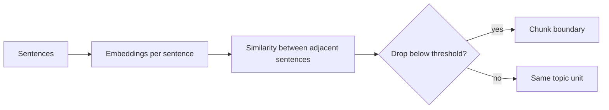
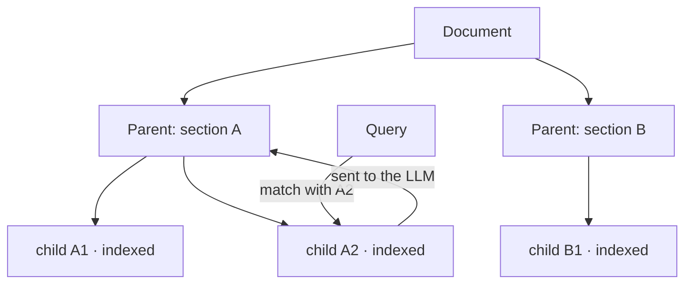

# 03 — Chunking Strategies

## The Problem Chunking Solves

The chunk is the atomic unit of the entire system: it is what gets embedded, what gets indexed,
what gets retrieved, and what the LLM sees. Poor chunking imposes a quality ceiling that
no other component can surpass. The fundamental tension:

- **Small chunks** → the embedding is precise (one topic per vector), retrieval
  is sharp… but the LLM receives fragments without context ("...as indicated above, the
  limit is 3." — 3 what?).
- **Large chunks** → the LLM has plenty of context… but the embedding becomes a
  blurry average of multiple topics, worsening retrieval; additionally, you waste context window
  and may exceed the embedding model's window.

There is no universal size. Reasonable starting points that are then **measured** (lab 03):
256-512 tokens with 10-15% overlap for technical documentation; fewer for FAQs (each
entry is already a unit); more for narrative prose.

## Strategy 1 — Fixed-size (with overlap)

Cut every N tokens/characters, with an overlap of M between consecutive chunks to avoid
splitting ideas right at the boundary.

```text
[--- chunk 1: 512 tok ---]
                  [--- chunk 2: 512 tok ---]      ← solape de 64 tok
                                    [--- chunk 3 ---]
```

- **Pros**: trivial, deterministic, fast, no dependencies. Mandatory baseline.
- **Cons**: blind to structure — splits sentences, tables, and sections in half.
- **Cheap improvement**: the **recursive** variant (popularized by the `RecursiveCharacterTextSplitter` in
  LangChain): attempts to cut by separators in order of preference
   (`\n\n` → `\n` → `. ` → ` `) until it fits within the budget. Respects paragraphs almost
  for free and should be your default "fixed" choice.

Cut by **tokens** and not by characters: model budgets (embeddings
and LLMs) are measured in tokens, and in Spanish the character/token ratio differs from English.

## Strategy 2 — Structural / by document

First things first: use the structure the document already provides. Markdown and HTML have
headers; decent PDFs have sections. Cutting by sections (and subdividing those that
exceed the budget with the recursive splitter) produces chunks aligned with how the
author organized the ideas. Append the header path as metadata and **prepend it to the
chunk text** before embedding:

```text
[Handbook > Política de vacaciones > Solicitud]
Las solicitudes se envían mediante...
```

This context prefix improves both the embedding and the LLM's response, at almost no cost. It is likely the chunking improvement with the best effort/benefit ratio.

## Strategy 3 — Semantic chunking

Idea: let the content decide the boundaries, not a counter. Typical algorithm:

1. Split the text into sentences.
2. Embed each sentence (or sliding windows of 2-3 sentences).
3. Calculate the cosine similarity between consecutive sentences.
4. Where the similarity drops below a threshold (or a percentile of the drops),
   there is a topic change → chunk boundary.



- **Pros**: thematically coherent chunks; shines in text without explicit structure
   (transcripts, long emails, prose).
- **Cons**: costs one embedding per sentence during ingestion; sensitive to the threshold (needs
  calibration per corpus); variable-sized chunks (some may turn out huge and
  require a safety cut); non-deterministic results if you change models.
- **Production Verdict**: test it against the recursive baseline **measuring**. In
  well-structured corpora (documentation with headers) it often does not outperform
  structural chunking, which is cheaper and more predictable.

## Strategy 4 — Hierarchical (parent-child / small-to-big)

Break the precision-context tension using **two granularities**:

- **Child chunks** (small, 128-256 tok): are embedded and indexed → precise retrieval.
- **Parent chunks** (large, 512-2048 tok, or the entire section): are NOT indexed; stored
  separately. When a child matches, the LLM is given **its parent**.



- **Pros**: best of both worlds; very common pattern in production (it is the basis of
   LangChain's "parent document retriever" and LlamaIndex's hierarchical indexes).
- **Cons**: two stores to keep synchronized; deduplicate parents when multiple
  children of the same parent match; more ingestion complexity.
- Lightweight variant: **sentence-window retrieval** — you index sentences and return the sentence
   ± a window of neighbors.

## Strategy 5 — Late chunking

Jina AI's proposal (2024) that inverts the order: instead of *chunking and then embedding*,
**embed the full document with a long-context model and chunk afterwards**,
 at the token embedding level:

1. Pass the entire document (up to 8k tokens) through the transformer → a contextualized
   token embedding, where each token has "seen" the entire document.
2. Define chunk boundaries on the sequence.
3. Each chunk's vector = pooling (mean) of its token embeddings.

The result: the chunk "The limit is 3 days" produces a vector that *knows* it is talking
about the vacation policy, because its tokens were contextualized with the entire
document. It addresses the same lost-context problem as the header prefix or Anthropic's
"contextual retrieval" (which prepends a context summary generated by an LLM to each chunk),
but without the generation cost.

- **Pros**: small chunks without context loss; no extra LLM calls.
- **Cons**: requires a long-context embedding model with access to
  token embeddings (e.g., `jina-embeddings-v3`); not applicable with APIs that only
  return the final vector (OpenAI); documents > window still require macro-chunking.

## Comparison

| Strategy | Ingestion Cost | Complexity | When it shines |
|---|---|---|---|
| Fixed / recursive | Minimal | Minimal | Baseline; heterogeneous corpus; always as a control |
| Structural + header prefix | Minimal | Low | Markdown/HTML/wikis — almost always when structure exists |
| Semantic | Medium (embeddings per sentence) | Medium | Long text without structure |
| Hierarchical | Medium | High (two stores) | Questions requiring broad context with fine-grained retrieval |
| Late chunking | Medium (long-context model) | Medium | Small chunks with references to the rest of the doc |

## How to evaluate chunking (preview of lab 03)

Chunking is evaluated by its effect on **retrieval**, not by aesthetics:

1. Question dataset with the source document/passage annotated (ground truth).
2. Index the corpus with each strategy (same DB, same embedding model).
3. Measure **hit rate@k** (does any retrieved chunk come from the correct doc?) and **MRR**
    (at what position does the first correct one appear?).
4. Then, look at the extreme end-to-end effect with RAGAS (chapter 07): a chunking strategy may
   win in hit rate and lose in faithfulness if it delivers truncated fragments.

## Common errors

1. **Choosing a strategy based on trend without measuring.** A well-tuned recursive baseline often beats
   sloppy implementations of sophisticated techniques.
2. **Splitting tables and code blocks in half**: protect them as indivisible
   units in the splitter.
3. **Excessive overlap** (>25%): inflates the index, duplicates content in the top-k, and steals
   diversity from the context (mitigable with deduplication in retrieval, but better not to create it).
4. **Losing metadata when chunking**: each chunk must inherit the source, section, and date
   from the parent document.
5. **Using a single size for different document types**: a FAQ and a runbook do not require the
   same thing. The pipeline must allow for strategy per source type.
6. **Forgetting the embedding model's window** when setting the maximum chunk size.

## For Further Reading

- Günther et al. / Jina AI (2024), *Late Chunking: Contextual Chunk Embeddings Using
  Long-Context Embedding Models*: https://arxiv.org/abs/2409.04701
- Anthropic (2024), *Introducing Contextual Retrieval*:
   https://www.anthropic.com/news/contextual-retrieval
- LlamaIndex documentation on node parsers (hierarchical, sentence-window,
  semantic): https://docs.llamaindex.ai/en/stable/module_guides/loading/node_parsers/
- Greg Kamradt, *The 5 Levels of Text Splitting* (highly cited reference notebook):
   https://github.com/FullStackRetrieval-com/RetrievalTutorials
