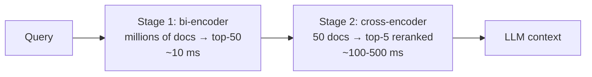

# 04 — Reranking: cross-encoders, Cohere Rerank, and ColBERT

## The Problem: The Bi-Encoder Is Fast Because It's Dumb

Embedding-based retrieval (bi-encoder) compresses each text into **a single vector** independently: the document is embedded without knowing what will be asked of it. This compression loses nuances — negations, relationships between entities, conditions ("only if", "except when") — and therefore the dense top-k usually contains the correct answer… but not always in the first position, and surrounded by thematically similar false positives.

**Reranking** adds a second stage: a more expensive and precise model reorders the candidates pre-selected by the cheap retrieval step.



This is the classic *retrieve & rerank* pattern used by search engines: one stage optimized for **recall** (ensuring the answer is within the top 50) and another for **precision** (ensuring it ranks first).

## Cross-Encoders

A cross-encoder receives **the query and document concatenated** in the same transformer pass. Attention crosses tokens from the query with tokens from the document, capturing interactions that a summary vector cannot. The output is a relevance score.

| | Bi-encoder | Cross-encoder |
|---|---|---|
| Input | query and doc separately | (query, doc) together |
| Output | vector per text | score per pair |
| Precomputable | Yes (entire corpus offline) | No — depends on the query |
| Cost per query | 1 embedding + ANN search | 1 inference **per candidate** |
| Scale | Millions of docs | Tens of candidates |
| Ranking Precision | Medium | High |

This is why you cannot "search with a cross-encoder" directly: scoring 1M documents per query is infeasible. Its place is the second stage, operating on 20-100 candidates.

Open models usable with `sentence-transformers` (class `CrossEncoder`):
`cross-encoder/ms-marco-MiniLM-L-6-v2` (fast, English, the one from lab 04),
`BAAI/bge-reranker-v2-m3` (multilingual, heavier), `mixedbread-ai/mxbai-rerank-*`.

```python
from sentence_transformers import CrossEncoder

reranker = CrossEncoder("cross-encoder/ms-marco-MiniLM-L-6-v2")
scores = reranker.predict([(query, doc) for doc in candidatos])
# ordenar candidatos por score desc y quedarse con los 3-5 primeros
```

## Cohere Rerank (reranking as an API)

If you do not want to serve a model, Cohere offers reranking as a service: you send a query +
list of documents and it returns indices with scores. `rerank-v3.5` is multilingual (Spanish
included) and handles long documents.

```python
import cohere
co = cohere.ClientV2()
res = co.rerank(model="rerank-v3.5", query=query, documents=docs, top_n=5)
```

- **Pros**: zero ops, high quality, multilingual, integrates into any stack.
- **Cons**: cost per search, network latency, documents travel to the provider
   (check compliance), vendor lock-in.

Equivalents: the rerankers from Voyage AI and Jina AI, and on AWS the Amazon Bedrock
Rerank service (chapter 06).

## ColBERT: late interaction

ColBERT (Khattab & Zaharia, 2020) is the middle ground between bi- and cross-encoders. Instead
of one vector per document, it stores **one vector per token**. Relevance is calculated
using **MaxSim**: for each token in the query, the maximum similarity against all tokens
in the document is taken, and then summed.

```text
score(q, d) = Σ_{i ∈ tokens(q)} max_{j ∈ tokens(d)} (E_qi · E_dj)
```

- Document embeddings are **precomputed** (like a bi-encoder) → scalable.
- Query-document interaction occurs at the token level (like a cross-encoder, though
  more superficial) → notably higher precision than a bi-encoder, especially
  out-of-domain.
- Cost: **storage** — hundreds of vectors per document instead of one
   (mitigated with aggressive compression in ColBERTv2 and in PLAID indexes).

In the practical ecosystem: the RAGatouille library facilitates using ColBERT as a retriever
or reranker; Qdrant and Vespa support multivectors with MaxSim natively; models like `colbert-ir/colbertv2.0` and multilingual variants are on Hugging Face.

## Comparison of the three families

| | Bi-encoder | ColBERT (late interaction) | Cross-encoder |
|---|---|---|---|
| Granularity | 1 vector/doc | 1 vector/token | full q×d attention |
| Typical Role | Stage 1 (retrieval) | Powerful Stage 1 or Stage 2 | Stage 2 (rerank) |
| Storage | Low | High (mitigable) | N/A (nothing precomputed) |
| Latency per query | Minimal | Low-medium | High (per candidate) |
| Ranking Quality | Baseline | High | Highest |

## Design Decisions in the Reranking Stage

- **How many candidates to retrieve (k1) and how many to pass to the LLM (k2)?** Starting point:
  k1=25-50, k2=3-5. If k1 is small, the reranker cannot rescue anything that the
  retrieval did not bring (the recall of stage 1 is the ceiling); if k2 is large, you return
  the noise you intended to filter.
- **Score threshold?** In addition to top-n, cut by minimum score: if no candidate
  exceeds the threshold, it is better to respond "I can't find it" than to force irrelevant context.
  Cross-encoder scores are not calibrated across models: set the threshold
  empirically with your evaluation dataset.
- **When is the reranker worth it?** First, measure retrieval alone (hit rate@k, MRR).
  If the correct chunk almost always appears in the top-3, the reranker adds little value and
  adds latency. If it is "in the top-30 but not in the top-5", the reranker is
  exactly the right tool.
- **Latency**: reranking adds tens to hundreds of ms. In interactive chat, this is usually
  acceptable (generation dominates); in autocomplete, it is not.

## Common Errors

1. **Reranking only 5 candidates**: with k1 so low, there is no room for improvement; the reranker needs a broad pool to choose from.
2. **Using an English cross-encoder on a Spanish corpus** and concluding that "reranking doesn't work". Check the model's language support (bge-reranker-v2-m3 or Cohere for multilingual).
3. **Comparing reranker scores across different queries or models** as if they were calibrated probabilities. They only order within the same query.
4. **Silent truncation**: cross-encoders have a limited window (typically 512 tokens for query+doc); a long chunk is truncated, and the score is calculated on the visible fragment.
5. **Measuring only the final LLM quality**: if you add a reranker and the response doesn't improve, you won't know if the problem was retrieval or generation. Measure the ranking (MRR/nDCG) before and after the reranker separately.

## For further reading

- Khattab & Zaharia (2020), *ColBERT: Efficient and Effective Passage Search via
  Contextualized Late Interaction over BERT*: https://arxiv.org/abs/2004.12832
- Santhanam et al. (2021), *ColBERTv2: Effective and Efficient Retrieval via
  Lightweight Late Interaction*: https://arxiv.org/abs/2112.01488
- Nogueira & Cho (2019), *Passage Re-ranking with BERT* — the paper that established the
  retrieve & rerank pattern with transformers: https://arxiv.org/abs/1901.04085
- Cohere Rerank Documentation: https://docs.cohere.com/docs/rerank-overview
- sentence-transformers documentation on cross-encoders:
  https://www.sbert.net/examples/applications/cross-encoder/README.html
