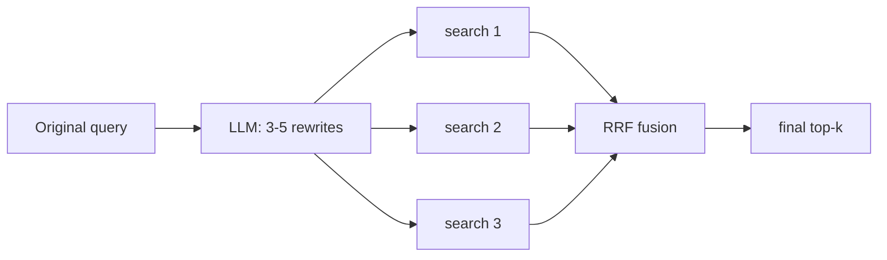
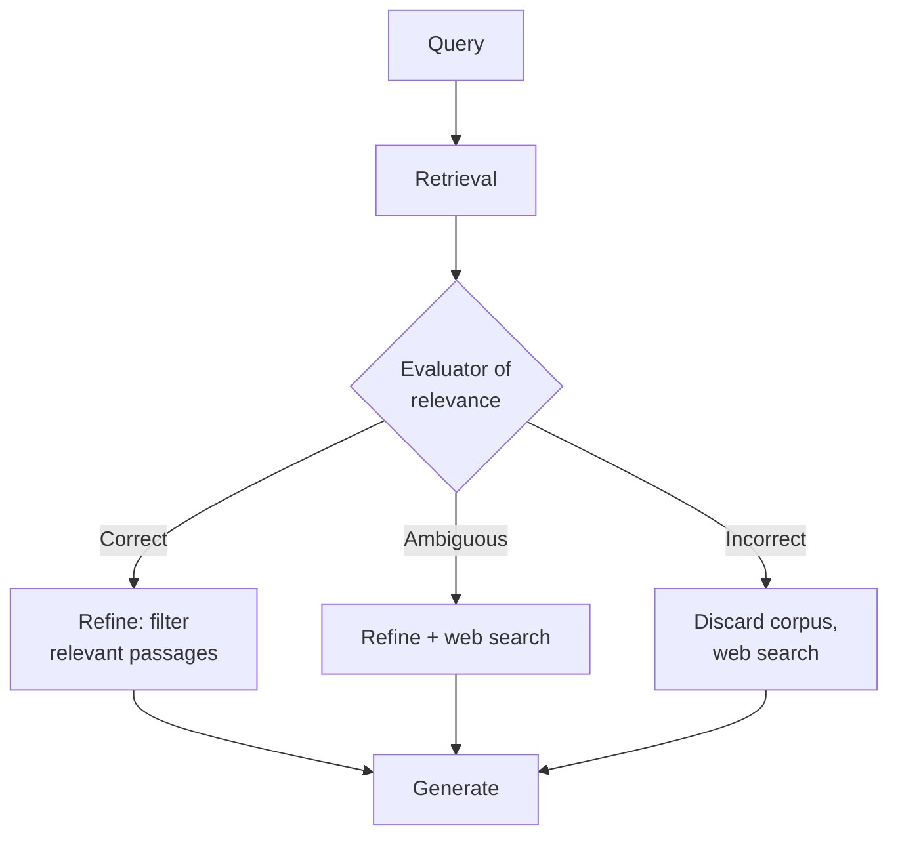

# 05 — Advanced RAG: HyDE, Multi-Query, Self-RAG, and CRAG

Naive RAG (embed → top-k → prompt) fails in predictable ways: poorly formulated queries, vocabulary that doesn't match the corpus, questions requiring multiple pieces of evidence, retrieval that brings in noise, and an LLM that responds uniformly. The techniques in this chapter address each of these points. General rule before applying them: **all incur latency and/or extra LLM calls** — they are justified by measurement, not by default.

## Query Transformation

### Multi-Query (Question Expansion)

The user's query is a single projection of their intent, often poor ("and the vacations?"). Multi-query asks an LLM to generate 3-5 reformulations from different angles, searches with all of them, and **fuses** the results.

The standard fusion is **Reciprocal Rank Fusion (RRF)**: each document adds `1/(k + rank_i)` for each list in which it appears (k≈60). It rewards appearing in multiple lists without relying on incomparable scores across searches.

- **Cost**: 1 cheap LLM call + N searches (searches are cheap).
- **When it shines**: short/ambiguous queries, corpus with heterogeneous vocabulary.
- **Variants**: *decomposition* (splitting a compound question into independent sub-questions, answering each, and synthesizing) and *step-back prompting* (generating a more general question first — useful when the specific one has no direct match).

### HyDE (Hypothetical Document Embeddings)

Gao et al. (2022). Observation: the query and the documents live in different "regions" of the embedding space — a short question doesn't look like a documentation paragraph, even if it contains the answer. HyDE closes this gap:

1. Ask the LLM to **write a hypothetical answer** to the question (without retrieval;
it may contain invented data, it doesn't matter).
2. Embed **that hypothetical document** instead of (or in addition to) the query.
3. Search with that vector: document-to-document instead of question-to-document.

The intuition: the fake document is factually dubious but **stylistically and
thematically** resembles the real documents we are looking for; its neighborhood in the
vector space is correct.

- **When it shines**: zero-shot, technical corpora where questions use plain language
and docs use jargon; when there is no data to fine-tune the retriever.
- **Risks**: if the LLM misinterprets the question, the hypothesis directs the search to the
wrong site (mitigation: search with hypothesis **and** original query and merge);
adds a full generation latency overhead.

## Self-correcting pipelines

### Self-RAG

Asai et al. (2023). Instead of always retrieving and generating whatever comes out, the model
**decides and self-critiques** via special reflection tokens learned during
training:

- `Retrieve?` — Does this question require retrieval, or do I answer directly? (avoids retrieving
for "hello" or for arithmetic).
- `IsRel` — Is this retrieved passage relevant?
- `IsSup` — Is my answer supported by the passage? (groundedness critique).
- `IsUse` — Is the answer useful?

The paper trains a specific model (7B/13B) with these tokens. In industry practice, almost no one deploys the original model: the **idea** is implemented as
a pipeline with standard LLMs — a step that decides whether to retrieve, a document relevance
grader, a support verifier after generation, with retries. LangGraph
documents this version as a canonical pattern.

**Transferable lesson**: conditional retrieval + self-verification with evidence. Cost:
several LLM calls per query.

### CRAG (Corrective RAG)

Yan et al. (2024). Addresses the case "retrieval brought garbage and the LLM answers anyway".
Adds a **lightweight retrieval evaluator** that classifies the retrieved documents and
triggers a corrective action:

- **Correct**: good evidence exists → refine (break into strips, keep the
relevant ones) and generate.
- **Incorrect**: nothing relevant → discard the corpus and resort to an
alternative source (in the paper, web search).
- **Ambiguous**: a mix of both.

The key component is honest and cheap: an evaluator (in the paper, a fine-tuned T5; in
practical implementations, a call to a small LLM with structured output) that
gives the system **an escape route when retrieval fails**, rather than hallucinating
over irrelevant context.

## Comparison and Adoption Criteria

| Technique | Addresses | Extra Cost per Query | Complexity | Adopt if... |
|---|---|---|---|---|
| Multi-query + RRF | Poor/ambiguous queries | 1 LLM call + N searches | Low | Hit rate increases when reformulating manually |
| HyDE | Query↔document gap | 1 generation | Low | Zero-shot retrieval is weak in a corpus with jargon |
| Self-RAG (pattern) | Retrieving too much / unsupported answers | 2-4 LLM calls | High | Mix of queries that need and don't need the corpus; groundedness is critical |
| CRAG | Generating on garbage context | 1 evaluation (+ fallback) | Medium | The system hallucinates when the corpus doesn't cover the question |

Recommended implementation order in a real system (from highest to lowest typical ROI):
**hybrid search and reranking first** (chapters 01 and 04), then multi-query,
then a CRAG-type grader, and full Self-RAG only if the case demands it. Each stage
is validated against the evaluation dataset (chapter 07) before adding the next one:
a 6-stage pipeline that no one has measured is debt, not sophistication.

## Other Patterns Worth Knowing (Quick Map)

- **Contextual retrieval** (Anthropic): prepend a mini-summary of its
  context generated by LLM during ingestion to each chunk. Cost is in indexing, not in query.
- **RAG-Fusion**: popular name for multi-query + RRF.
- **FLARE**: active retrieval during generation — when the model is about to generate a
  token with low confidence, it triggers a search.
- **GraphRAG** (Microsoft): build a graph of entities/communities over the corpus
  and answer global questions ("what are the main themes?") that classic RAG
  cannot, because no individual chunk contains them.
- **Agentic RAG**: retrieval as a tool for an agent that decides when and what
  to search in a ReAct loop (covered in module 4).

## Common Errors

1. **Stacking techniques without a measured baseline.** If you don't know how much simple RAG yields, you
   cannot know what each layer adds. (Lab 05 compares baseline vs multi-query vs
   HyDE on the same dataset.)
2. **Using an expensive model for auxiliary steps.** Reformulating queries and evaluating
   relevance work well with the current small tier (`gpt-5.6-luna` in August
   2026); reserve the large model for the final answer if needed.
3. **HyDE with high temperature**: creative hypotheses scatter the search;
   use low temperature for hypotheses, and always fuse with the original query.
4. **Fusing by score instead of by rank**: scores from different searches are not
   comparable; RRF exists for this reason.
5. **Self-correction loops without a limit**: a strict grader + retries without a cap =
   unbounded latency. Maximum 1-2 corrections and an honest fallback ("I can't find it").
6. **Ignoring the impact on p95 latency**: each sequential LLM call adds seconds.
   Parallelize what can be parallelized (the N searches of multi-query, the document graders).

## To Go Deeper

- Gao et al. (2022), *Precise Zero-Shot Dense Retrieval without Relevance Labels*
   (HyDE): https://arxiv.org/abs/2212.10496
- Asai et al. (2023), *Self-RAG: Learning to Retrieve, Generate, and Critique through
  Self-Reflection*: https://arxiv.org/abs/2310.11511
- Yan et al. (2024), *Corrective Retrieval Augmented Generation*:
   https://arxiv.org/abs/2401.15884
- Cormack et al. (2009), *Reciprocal Rank Fusion outperforms Condorcet and individual
  rank learning methods* (RRF): https://dl.acm.org/doi/10.1145/1571941.1572114
- Edge et al. (2024), *From Local to Global: A Graph RAG Approach to Query-Focused
  Summarization*: https://arxiv.org/abs/2404.16130
- LangGraph tutorials on Self-RAG and CRAG as graphs:
   https://langchain-ai.github.io/langgraph/tutorials/rag/langgraph_self_rag/
