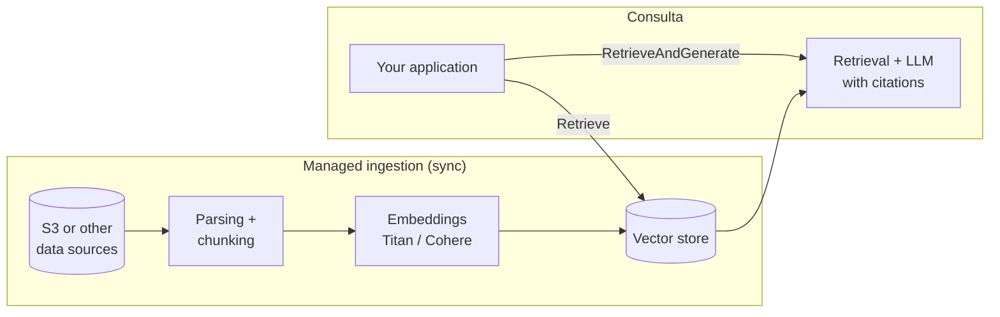

# 06 — Amazon Bedrock Knowledge Bases: Managed RAG on AWS

## What it is and what problem it solves

Amazon Bedrock Knowledge Bases is AWS's managed RAG solution: you point to your data
(typically an S3 bucket), choose an embedding model and vector store, and the
service handles ingestion (parsing, chunking, embedding, synchronization) and
exposes retrieval and generation APIs with citations. It is the answer to "I want RAG on
my documents without building or operating the pipeline."

It fits especially well when: data already lives in AWS, there are compliance
requirements that Bedrock already covers (IAM, KMS, CloudTrail, VPC endpoints, no data retention by
model providers), and the team prefers paying for a managed service over maintaining
a custom pipeline.

## Architecture



### Configurable components

- **Data sources**: S3 is the primary option; there are connectors for Confluence, SharePoint,
  Salesforce, and web crawler (verify their GA status by region before designing around
  them). Synchronization is on-demand or scheduled; it detects additions, deletions, and
  modifications.
- **Parsing**: standard parser (text) or advanced parsing with a foundation model /
  Bedrock Data Automation for complex PDFs, tables, and images (more expensive; enable it
  only for sources that need it).
- **Chunking**: fixed-size (tokens + overlap), hierarchical (parent-child), semantic, no
  chunking (one doc = one chunk), or **custom chunking with a Lambda** — the direct map
  of [chapter 03](03-chunking.md), with the same decisions and trade-offs; being
  managed does not exempt you from choosing and measuring.
- **Embeddings**: Amazon Titan Text Embeddings v2 or Cohere Embed (multilingual) via
  Bedrock.
- **Vector store**: OpenSearch Serverless (the default option), Aurora PostgreSQL
  with pgvector, Pinecone, Redis Enterprise Cloud, MongoDB Atlas, or Amazon S3 Vectors
  (low-cost option for large indexes with less latency requirements).
  The choice matters for the bill: OpenSearch Serverless bills by OCUs with a
  noticeable monthly minimum even if the index is idle — for small prototypes
  it is often the highest cost in the entire KB.

## The two query APIs

**`Retrieve`** — retrieval only: returns chunks with score, text, and metadata. You
build the prompt and call the LLM of your choice (even outside Bedrock). It is the
option when you want control over the prompt, custom reranking, or your own advanced logic.

**`RetrieveAndGenerate`** — full pipeline: retrieval + managed prompt + Bedrock model
(Claude, Nova...) + **structured citations** referencing the passages used.
Less control, less code.

```python
import boto3

client = boto3.client("bedrock-agent-runtime", region_name="eu-west-1")

resp = client.retrieve(
    knowledgeBaseId="KB_ID",
    retrievalQuery={"text": "¿Cómo escalo un incidente P1?"},
    retrievalConfiguration={
        "vectorSearchConfiguration": {
            "numberOfResults": 8,
            # "overrideSearchType": "HYBRID",  # denso + keyword si el store lo soporta
            # "filter": {"equals": {"key": "team", "value": "infra"}},
            "rerankingConfiguration": {
                "type": "BEDROCK_RERANKING_MODEL",
                "bedrockRerankingConfiguration": {
                    "modelConfiguration": {
                        "modelArn": (
                            "arn:aws:bedrock:eu-west-1::foundation-model/"
                            "amazon.rerank-v1:0"
                        )
                    },
                    "numberOfRerankedResults": 5,
                },
            },
        }
    },
)
for r in resp["retrievalResults"]:
    print(round(r["score"], 3), r["location"], r["content"]["text"][:120])
```

Additional capabilities on the query side: hybrid search, metadata filtering
(files `.metadata.json` alongside each document in S3), managed reranking (Bedrock
Rerank), query reformulation, and Bedrock guardrails applied to generation.
For structured data, there are KB variants that perform text-to-SQL on Redshift,
and managed GraphRAG on Neptune — worth knowing, but outside the scope of this module.

## Build vs buy: custom pipeline vs Knowledge Bases

| Dimension | Custom Pipeline (labs in this module) | Bedrock Knowledge Bases |
|---|---|---|
| Time to production | Weeks | Days |
| Fine control (chunking, retrieval, prompt) | Total | Partial (good and growing, but bounded) |
| Ops (index, sync, scaling) | Yours | AWS |
| Cost | Infra + your time | Embeddings + vector store + LLM + (advanced parsing); the managed store dominates in small corpora |
| Lock-in | Low | Medium-high (AWS APIs and services) |
| Compliance/security | You build it | IAM/KMS/VPC/CloudTrail out of the box |
| Evaluation | You build it (RAGAS) | Bedrock Evaluations offers managed RAG evaluation; RAGAS still applies via `Retrieve` |

Honest criterion: if your organization is already on AWS and the use case is "Q&A over documents",
KB solves 80% with 20% of the effort. The custom pipeline is justified when
you need techniques the service does not expose (late chunking, ColBERT, full Self-RAG,
custom embeddings), multi-cloud, or absolute minimum cost at large scale. And even if you use
KB, **everything learned in this module remains your responsibility**: choosing chunking,
evaluating retrieval, measuring hallucinations. The managed part is the pipeline, not the criterion.

## Common mistakes

1. **Assuming "managed" = "well configured"**: defaults (300-token chunking,
   top-5, no hybrid) are a starting point, not a recommendation for your corpus.
   Evaluate with your dataset just as you would with a custom pipeline.
2. **Surprise at the OpenSearch Serverless bill** in development environments: to
   test, consider Aurora PostgreSQL (or S3 Vectors) as a store, and delete experimental KBs.
3. **Forgetting synchronization**: uploading docs to S3 does not update the index; you must
   trigger the sync job (or schedule it) and monitor its parsing failures.
4. **Missing metadata**: without files `.metadata.json` there is no filtering by team,
   date, or permissions, and multi-tenancy becomes impossible to ensure.
5. **Using `RetrieveAndGenerate` when you need prompt control**: if you are going to fight
   against the managed prompt, use `Retrieve` and generate it yourself.
6. **Ignoring regional limits**: embedding models, connectors, and features
   vary by region and evolve quickly; verify in the official documentation before
   committing to an architecture.

## To go deeper

- Official Bedrock Knowledge Bases documentation:
  https://docs.aws.amazon.com/bedrock/latest/userguide/knowledge-base.html
- Chunking options and advanced parsing:
  https://docs.aws.amazon.com/bedrock/latest/userguide/kb-advanced-parsing.html
- `Retrieve` / `RetrieveAndGenerate` APIs (bedrock-agent-runtime in boto3):
  https://boto3.amazonaws.com/v1/documentation/api/latest/reference/services/bedrock-agent-runtime.html
- Bedrock pricing (embeddings, rerank, evaluation):
  https://aws.amazon.com/bedrock/pricing/
- AWS blog on RAG evaluation in Bedrock:
  https://aws.amazon.com/blogs/machine-learning/
