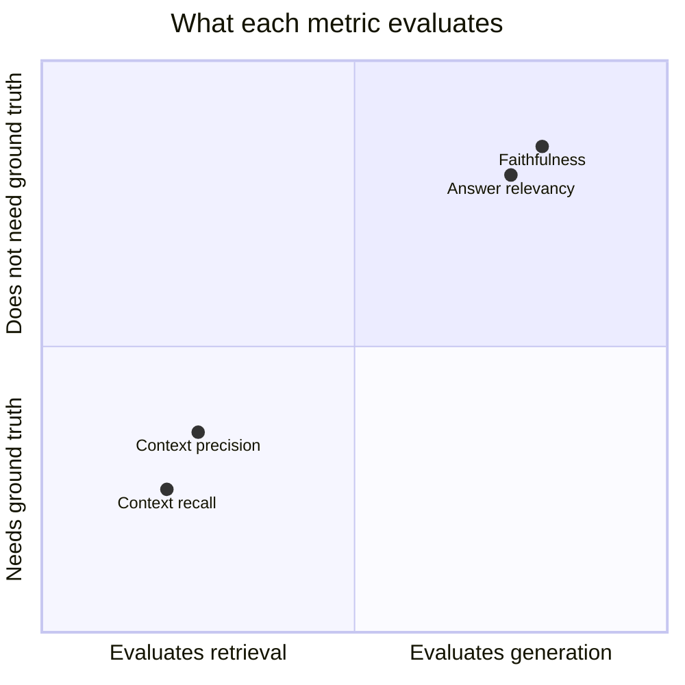
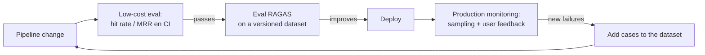

# 07 — Evaluating RAG with RAGAS

## Why evaluation is half the system

A RAG system has too many knobs (chunking, k, embedding model, hybrid yes/no, reranker, prompt...) to tune by eye. Without automated evaluation, every change is a gamble: it might improve the 5 questions you test manually and sink the 200 you don't. Evaluation turns RAG development into engineering: you change one thing, run the dataset, compare metrics, and decide based on data.

Furthermore, RAG fails in **two distinct places** that require separate diagnosis:

- **Retrieval**: Did we retrieve the correct evidence?
- **Generation**: Does the answer use that evidence faithfully and answer the question?

Optimizing generation when retrieval fails (or vice versa) is wasted time. A good metrics framework tells you **where** the problem is.

## The evaluation tuple

Every RAG metric operates on some combination of four elements:

| Element | What it is |
|---|---|
| `question` | The user's question |
| `contexts` | The retrieved chunks passed to the LLM |
| `answer` | The generated answer |
| `ground_truth` | The reference correct answer (annotated by humans or generated and reviewed) |

## The four core RAGAS metrics

RAGAS (Retrieval-Augmented Generation Assessment, Es et al., 2023) uses **LLM-as-judge**: an evaluator LLM that decomposes and verifies claims. Its four classic metrics cover the retrieval×generation quadrant:



### Faithfulness (generation, without ground truth)

*Is everything the response claims supported by the retrieved context?*

Mechanics: the LLM judge decomposes the `answer` into atomic claims and verifies each one against the `contexts`. Score = supported claims / total claims.

It is the **anti-hallucination metric**: a low faithfulness score means the model is adding content that does not come from the evidence (correct or not — that is another metric).

### Answer relevancy (generation, without ground truth)

*Does the response actually answer the question?*

Ingenious mechanics: the judge generates N hypothetical questions from the `answer` and measures their similarity (embeddings) with the original `question`. An evasive, incomplete, or rambling response generates questions that do not resemble the original → low score. It penalizes "lots of text, little answer"; it does not check factual correctness.

### Context precision (retrieval, with reference)

*Of the retrieved chunks, are the relevant ones present and at the top?*

It evaluates the **signal vs. noise** of the retrieval and rewards order (relevant items in the first positions weigh more — it is a precision@k weighted by rank). A low context precision with good recall says: "the evidence arrives, but buried in garbage" → raise the retrieval bar or add a reranker.

### Context recall (retrieval, with ground truth)

*Does the retrieved context contain everything necessary to provide the correct answer?*

Mechanics: decomposes the `ground_truth` into assertions and checks how many are
attributable to `contexts`. A low recall says: "the evidence didn't even arrive" → the
problem is with chunking, embeddings, k, or corpus coverage, and **no prompt can
fix it**.

### Diagnosis with all four together

| Symptom | Reading | Typical Action |
|---|---|---|
| recall ↓ | Evidence is not retrieved | Review chunking, k, embedding model, hybrid |
| recall ↑, precision ↓ | Evidence with too much noise | Reranker, lower final k, score threshold |
| precision/recall ↑, faithfulness ↓ | The LLM ignores or embellishes the context | Stricter prompt, mandatory citations, better model |
| faithfulness ↑, answer relevancy ↓ | Faithful but doesn't answer | Prompt (instruction to answer directly), insufficient context |

## Build the evaluation dataset

This is the part with the most work and the most value. Options, from best to worst quality:

1. **Real user questions** (production logs) annotated by humans.
2. **Manual annotation by domain experts**: 30-100 questions with ground truth and
   source document. For an internal project, 50 well-made questions are enough to
detect regressions.
3. **Synthetic generation reviewed**: RAGAS includes `TestsetGenerator` (generates questions
   of different types — simple, reasoning, multi-context — from the corpus).
   Generate 3× what you need and **review manually**: synthetic questions tend to
   mimic the document's vocabulary (giving away the retrieval) and are sometimes trivial or
   impossible.

Dataset rules: include **negative** questions (whose answer is not in the
corpus — the system should say "I don't know"), multi-document questions, and paraphrases that
do not share vocabulary with the source. Version the dataset with the code.

## RAGAS in practice

Since RAGAS 0.4, the recommended API is object-oriented: each metric is instantiated and
scored with `ascore`. This avoids relying on implicit columns and makes clear what data
each judge consumes:

```python
import asyncio

from openai import AsyncOpenAI
from ragas.embeddings import embedding_factory
from ragas.llms import llm_factory
from ragas.metrics.collections import AnswerRelevancy, Faithfulness


async def score() -> dict[str, float]:
    client = AsyncOpenAI()
    judge = llm_factory("gpt-5.6-luna", client=client)
    embeddings = embedding_factory(
        "openai",
        model="text-embedding-3-small",
        client=client,
    )
    faithfulness = await Faithfulness(llm=judge).ascore(
        user_input="¿Cuánto dura el enlace?",
        response="Dura 30 minutos.",
        retrieved_contexts=["El enlace caduca a los 30 minutos."],
    )
    relevancy = await AnswerRelevancy(
        llm=judge,
        embeddings=embeddings,
        strictness=1,
    ).ascore(
        user_input="¿Cuánto dura el enlace?",
        response="Dura 30 minutos.",
    )
    return {
        "faithfulness": float(faithfulness.value),
        "answer_relevancy": float(relevancy.value),
    }


print(asyncio.run(score()))
```

Lab 06 fixes RAGAS 0.4.3, evaluates the four metrics, and saves configuration, averages, and
detail per sample. Since that release carries Instructor/OpenAI SDK 2.x, the live mode
uses `setup/requirements-ragas.txt` in an isolated process; the rest of the course retains
OpenAI SDK 3.x. It also offers explicitly labeled deterministic proxies for CI;
it does not present them as equivalent to an LLM judge.

### Cost and reliability of the LLM-judge

- Each metric makes multiple calls to the judge **per sample**: a dataset of 50 questions
   × 4 metrics can mean hundreds of calls. Use a cheap model as judge
   (`gpt-5.6-luna`, in the August 2026 catalog) for iteration and a higher tier
  for final evaluation if in doubt. Revalidate the catalog before running.
- The judge has variance: the same evaluation twice does not yield identical numbers. Compare
  trends and clear differences, not hundredths. For important decisions, run
   2-3 times or increase the dataset size.
- Audit the judge: manually review the 5-10 worst cases for each metric. Sometimes the
   "failure" is the judge's, not the pipeline's — and sometimes you discover a type of error that
  no metric captures.

## Complementary metrics (non-RAGAS)

- **Classic retrieval without LLM**: hit rate@k, MRR, nDCG against the annotated source document
  . Cheap, deterministic, perfect for CI on every commit (labs 03-05 use
  them). RAGAS is reserved for deeper, less frequent evaluation.
- **Answer correctness** (RAGAS): compares answer vs ground_truth (factual + semantic)
   — the "final" grade end-to-end.
- **Latency and cost per query**: a 2% quality improvement that doubles latency
  is usually not an improvement.

## Continuous evaluation: the full cycle



The evaluation dataset is a living artifact: every real production failure you
discover becomes a new case. Thus the dataset converges toward what your users
actually ask.

## Common errors

1. **Evaluating only end-to-end**: without separate retrieval metrics you don't know which
   component to fix.
2. **100% synthetic dataset without review**: measures what is easy, not what is real.
3. **No negative questions**: the system that never says "I don't know" seems perfect
   until a user asks something outside the corpus.
4. **Treating scores as absolute truth**: 0.83 vs 0.85 with 50 samples and a stochastic
   judge is noise, not improvement.
5. **Evaluating with the same model that generates** without at least reviewing bias: LLM
   judges tend to favor outputs from their own family (self-preference bias).
6. **Not versioning dataset + configuration + results together**: without this there are no
   valid comparisons between experiments.

## To go deeper

- Es et al. (2023), *RAGAS: Automated Evaluation of Retrieval Augmented Generation*:
   https://arxiv.org/abs/2309.15217
- RAGAS documentation (metrics, testset generation):
   https://docs.ragas.io/
- Zheng et al. (2023), *Judging LLM-as-a-Judge with MT-Bench and Chatbot Arena* —
   reliability and biases of LLM judges: https://arxiv.org/abs/2306.05685
- Alternatives for contrast: TruLens (RAG triad), DeepEval, promptfoo (asserts for
  RAG in CI), Arize Phoenix (observability + evals).
