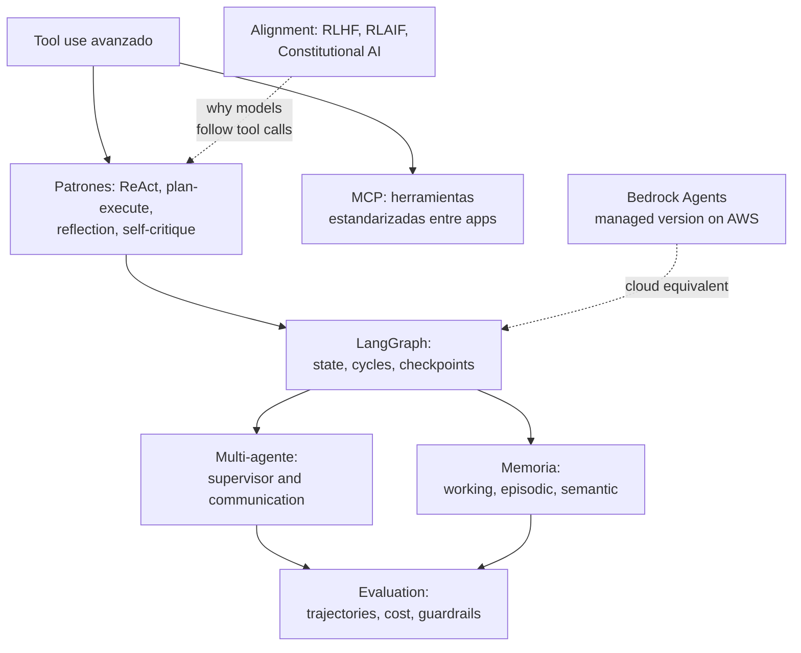

# Module 04 — Agent and tool interfaces

> Agents capable of planning, reasoning, and using tools. Multi-agent systems with LangGraph and MCP.
> Memory, flow control, and reliability evaluation. **~55 hours of work.**

## What you will be able to do upon completion

1. Implement the ReAct loop **by hand**, without frameworks, and explain exactly what each component does.
2. Model agents as **state graphs** in LangGraph: cycles, conditionals, checkpoints, and human-in-the-loop.
3. Develop and publish a **MCP server** of your own and connect it to Claude Desktop / Claude Code.
4. Design robust tools: clear contracts, error handling, idempotency.
5. Build a **multi-agent system with a supervisor** and reason about when (not) it is worth it.
6. Equip an agent with working, episodic, and semantic memory.
7. Explain the architecture of **Amazon Bedrock Agents** (action groups, KBs) in the context of AIF-C01.
8. Evaluate agents: trajectories, determinism, cost per task, and safety guardrails.
9. Situate RLHF, RLAIF, and Constitutional AI within the alignment and fine-tuning landscape.

## Prerequisites

- Modules I–III completed (specifically: function calling from Module II and embeddings from Module III).
- Group `agents` dependencies installed from the **repo root**:

```bash
uv sync --extra agents
```

- `.env` at the root with `OPENAI_API_KEY` (the labs use `gpt-5.6-luna`, verified in
  August 2026; almost all also accept `ANTHROPIC_API_KEY` +
   `claude-haiku-4-5`). `LANGSMITH_API_KEY` is optional but
  recommended from lab 02 onwards to view traces.

## Study order and estimated times

| # | Theory | Associated Lab | Hours |
|---|--------|--------------|-------|
| 1 | [`teoria/01-patrones-de-agentes.md`](teoria/01-patrones-de-agentes.md) — ReAct, plan-execute, reflection, self-critique | [`labs/01_react_desde_cero.py`](labs/01_react_desde_cero.py) | 7 |
| 2 | [`teoria/02-langgraph.md`](teoria/02-langgraph.md) — state graphs, cycles, conditionals, checkpoints | [`labs/02_langgraph_basico.py`](labs/02_langgraph_basico.py), [`labs/03_langgraph_ciclos_condicionales.py`](labs/03_langgraph_ciclos_condicionales.py), [`labs/04_langgraph_checkpoints.py`](labs/04_langgraph_checkpoints.py) | 10 |
| 3 | [`teoria/03-mcp.md`](teoria/03-mcp.md) — MCP architecture and server development | [`labs/05_mcp_server.py`](labs/05_mcp_server.py) | 6 |
| 4 | [`teoria/04-tool-use-avanzado.md`](teoria/04-tool-use-avanzado.md) — tool design, errors, idempotency | (cross-cutting: applied in all labs) | 4 |
| 5 | [`teoria/05-multi-agente.md`](teoria/05-multi-agente.md) — coordination, supervisors, communication | [`labs/06_multiagente_supervisor.py`](labs/06_multiagente_supervisor.py) | 7 |
| 6 | [`teoria/06-memoria.md`](teoria/06-memoria.md) — episodic, semantic, and working memory | [`labs/07_memoria_agente.py`](labs/07_memoria_agente.py) | 6 |
| 7 | [`teoria/07-bedrock-agents.md`](teoria/07-bedrock-agents.md) — action groups, knowledge bases | no lab (requires AWS account; console flow documented) | 3 |
| 8 | [`teoria/08-evaluacion-de-agentes.md`](teoria/08-evaluacion-de-agentes.md) — determinism, costs, guardrails | (mini-project evaluated with this rubric) | 5 |
| 9 | [`teoria/09-alignment-y-fine-tuning.md`](teoria/09-alignment-y-fine-tuning.md) — RLHF, RLAIF, Constitutional AI | no lab (theoretical) | 4 |
| — | [`ejercicios.md`](ejercicios.md) — 12 exercises + mini-project (research agent) | Tests and rubric | 13 |

**Suggested effort: 50–60 h.** Move forward when you can produce the evidence, not when a date arrives.

## How to work through the module

1. Read the theory from the **before** block of the lab; each lab assumes the concepts from its theory file.
2. Run each lab, read it entirely, and modify it (each docstring suggests variations). The labs
   offer offline workflows and have iteration limits. Before using live modes,
   calculate the cost using the current rate and set a budget.
3. Complete the exercises from the block upon finishing it, not all of them at the end.
4. The **mini-project** (exercise 12) is the module's milestone: a research agent
   with 3+ tools, traces, and evaluation. Save it: it becomes the input to Harness Engineering.

## Module Mind Map



## Honest Warning Before Starting

Most problems you will encounter in production **do not require an agent**: a fixed pipeline of
2-3 LLM calls is cheaper, faster, and easier to debug. This module repeatedly emphasizes
the question "Do I need an agent here?" — knowing how to answer it is as important as knowing how to build them.
Read it with this critical mindset: it is what distinguishes an engineer from someone who just chains demos.
