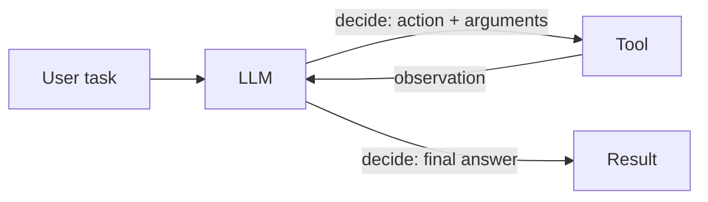
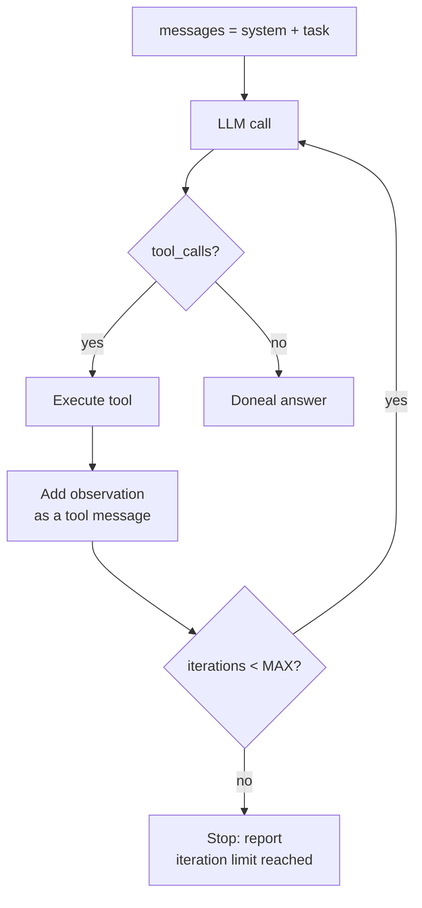
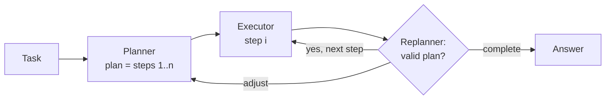
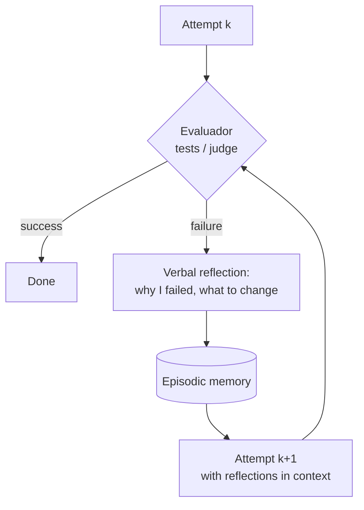

# 01 — Agent Patterns: ReAct, Plan-Execute, Reflection, Self-Critique

> **Objective:** understand what an LLM agent is (and what it is not), master the four
> fundamental patterns, and know how to choose the simplest one that solves your problem.
> **Associated Lab:** [`../labs/01_react_desde_cero.py`](../labs/01_react_desde_cero.py)

## 1. What is an agent (and what it is not)

The useful definition, taken from Anthropic's "Building effective agents" (2024):

- **Workflow:** a system where the LLM and tools are orchestrated via **predefined code
  routes**. The developer decides the flow; the LLM fills in the steps.
- **Agent:** a system where the **LLM dynamically directs its own process** — deciding which
  tool to use, in what order, and when it is finished.

The difference is not the number of LLM calls but **who controls the flow**. A fixed five-step pipeline
(classify → search → summarize → draft → review) is a workflow however sophisticated it may be. A loop where the model chooses between stopping or calling one of N tools
is an agent even if it only loops twice.

Minimal anatomy of an agent:



Three components: a **model** that reasons, a set of **tools** with clear contracts,
and a **loop** with a stopping condition. Everything else (memory, planning, multi-agent) are
extensions of this core.

### 1.1 When NOT to use an agent

This section comes first on purpose. Use a workflow (or a single call) when:

- **The flow is known in advance.** If you can draw the step diagram without conditionals
  that depend on the content, you don't need the LLM to decide the flow.
- **Latency or cost matter.** A typical ReAct agent makes 3–10 calls where a workflow
  would make 1–2. Each turn adds cumulative latency and forwards the entire history (cost grows
  approximately quadratically with the number of steps if you don't manage context).
- **You need debuggability and predictable behavior.** A workflow always fails in the same
  place; an agent fails in new ways every day.
- **The task involves a single tool.** "Query this API and format the result" is simple
  function calling (Module II), not an agent.

Anthropic's practical rule: *find the simplest system possible; increase complexity only when simplicity proves insufficient*. Agents trade latency and cost for autonomy — that trade-off only pays off in open-ended tasks where you cannot enumerate the steps.

## 2. ReAct: Reasoning + Acting

The foundational pattern, from the paper **"ReAct: Synergizing Reasoning and Acting in Language Models"**
(Yao et al., 2022). The idea: interleave **reasoning traces** (Thought) with **actions**
(Action) and their **observations** (Observation), in a loop, until reaching an answer.

```text
Question: ¿Cuánto es la población de Francia dividida entre 4?
Thought: Necesito la población de Francia. Usaré la búsqueda.
Action: search[población de Francia]
Observation: Francia tiene 68 millones de habitantes (2024).
Thought: Ahora divido 68.000.000 entre 4.
Action: calculator[68000000 / 4]
Observation: 17000000.0
Thought: Ya tengo la respuesta.
Final Answer: 17 millones.
```

Why does it work better than acting without reasoning or reasoning without acting? The paper measures this on HotpotQA
and ALFWorld: reasoning **without** actions hallucinates facts (it cannot query anything), and
actions **without** reasoning lose the thread in multi-hop tasks. The thought trace
acts as an incremental plan and as a record of what is already known; observations anchor the
reasoning in real data.

### 2.1 ReAct in 2025: from parsed text to native tool calling

The original paper parsed text (`Action: search[...]`) with regular expressions — fragile: the
model invents formats, closes brackets incorrectly, mixes languages. Today, the same pattern is implemented
using native **function calling** from the APIs: the model returns `tool_calls` structured objects, you
execute the tool, and return the result as a `role: "tool"` message. The conceptual loop
is identical; only the transport changes. The reasoning ("Thought") survives as the text the
model emits before the tool call, or as extended reasoning in models that support it.

In lab 01 you implement exactly this: the ReAct loop by hand using the OpenAI API, without
frameworks, so you see that "an agent" is ~60 lines of Python.



### 2.2 ReAct Weaknesses

- **Myopia:** decides one action at a time; in structured tasks (flight + hotel + car booking,
  with cross-constraints) it may make early decisions that invalidate later ones.
- **Growing context:** each turn adds messages; in long tasks the history explodes
   (§5, common errors).
- **No structural self-correction:** if a strategy fails, it tends to insist on it
   (the history of failed attempts "anchors" the model in the same direction).

These weaknesses motivate the other three patterns.

## 3. Plan-and-Execute

Separate planning from execution:

1. **Planner:** one call (to a powerful model) produces an explicit plan: a list of steps.
2. **Executor:** executes each step (with a cheap model, or with a mini-ReAct per step).
3. **Replanner (optional):** after each step, checks if the plan is still valid and adjusts it.



**Advantages:** the plan is inspectable (you can show it to a human before executing), steps can be parallelized if they are independent, and the executor does not need the full history — only its step and the relevant results, which controls the context. Notable variant:
**ReWOO** (Xu et al., 2023) generates the complete plan with variables (`#E1`, `#E2`...) and executes the tools without calling the LLM again between steps, drastically reducing tokens.

**Disadvantages:** rigid in the face of the unexpected (hence the existence of the replanner) and the initial plan is made "blindly", without having seen any observations. Use it when the task has a clear structure and costly steps that should be approved before execution.

## 4. Reflection and self-critique

Family of patterns where the model **evaluates and improves its own output**:

- **Basic self-critique (generator–critic):** generate → critique (same or different call) →
  regenerate incorporating the critique. Two or three rounds are usually sufficient; more produce
  diminishing returns and sometimes degradation (the model "over-corrects").
- **Reflexion** (Shinn et al., 2023): the agentic version. The agent attempts the full task,
  an evaluator (tests, heuristic, or LLM-judge) gives a success/failure signal, and the agent writes
  a **verbal reflection** ("I failed because I assumed X; next time I must Y") that is saved in an
  episodic memory and injected into the next attempt. It is "verbal reinforcement learning":
  the policy improves between episodes without touching the weights. On HumanEval, Reflexion on GPT-4
  went from ~80% to 91% pass@1.



**Critical condition:** reflection only adds value if there is a **reliable evaluation signal**
(tests that pass/fail, a verifier, a well-calibrated judge). A model critiquing itself without an external signal tends toward complacency ("everything is correct") or inventing problems.
If you cannot verify the result, reflection is expensive theater.

## 5. Common errors (you will see them all)

1. **Infinite loops.** The agent repeats the same action with the same arguments because the observation does not provide what it expects. Mitigations: hard iteration limit (**always**, in every agent loop, without exception — all labs in this module include this), detect repetition of (tool, arguments) and cut off, and tool error messages that **suggest what to change** instead of just "error".
2. **Context explosion.** Huge history + observations (e.g., a 200 KB HTML as an observation) → skyrocketing cost, latency, and the model losing the thread ("lost in the middle"). Mitigations: truncate/summarize observations before adding them, sliding window with a summary of older content (you will see this in file 06 on memory), and tools that return only the minimum useful output.
3. **Ambiguous tools.** Two overlapping tools (`search` and `lookup` doing almost the same thing) or vague descriptions → the model chooses incorrectly or alternates between them. The quality of an agent depends more on the **design of its tools** than on the prompt (file 04).
4. **Stopping too late.** The agent already has the answer but continues "verifying" with more calls. Mitigation: explicitly instruct the stopping criterion in the system prompt and reward direct answers in examples.
5. **Trusting the reasoning trace as if it were the real state.** The "Thought" might say "I have already saved the file" without any tool having actually done so. The state of truth is the observations, not the thoughts.

## 6. Choosing a pattern: decision guide

| Situation | Pattern |
|---|---|
| Pre-enumerable flow | **Workflow** (not agent) |
| Open-ended task, few steps, clear tools | **ReAct** |
| Long task with structure, costly steps, or requiring approval | **Plan-and-execute** |
| Reliable verifier available (tests, judge) and margin for retries | **+ Reflexion** |
| Critical quality output (report, code) without a hard verifier | **+ self-critique (1–2 rounds)** |

Patterns are composable: a plan-and-execute architecture whose executor is ReAct with final self-critique is a perfectly reasonable design — if the task justifies it.

## For further reading

- Yao et al., *ReAct: Synergizing Reasoning and Acting in Language Models* (2022) — [arxiv.org/abs/2210.03629](https://arxiv.org/abs/2210.03629)
- Shinn et al., *Reflexion: Language Agents with Verbal Reinforcement Learning* (2023) — [arxiv.org/abs/2303.11366](https://arxiv.org/abs/2303.11366)
- Anthropic, *Building effective agents* (2024) — [anthropic.com/research/building-effective-agents](https://www.anthropic.com/research/building-effective-agents) — the most influential text on when to use workflows vs. agents; read it in full.
- Xu et al., *ReWOO: Decoupling Reasoning from Observations* (2023) — [arxiv.org/abs/2305.18323](https://arxiv.org/abs/2305.18323)
- Madaan et al., *Self-Refine: Iterative Refinement with Self-Feedback* (2023) — [arxiv.org/abs/2303.17651](https://arxiv.org/abs/2303.17651)
