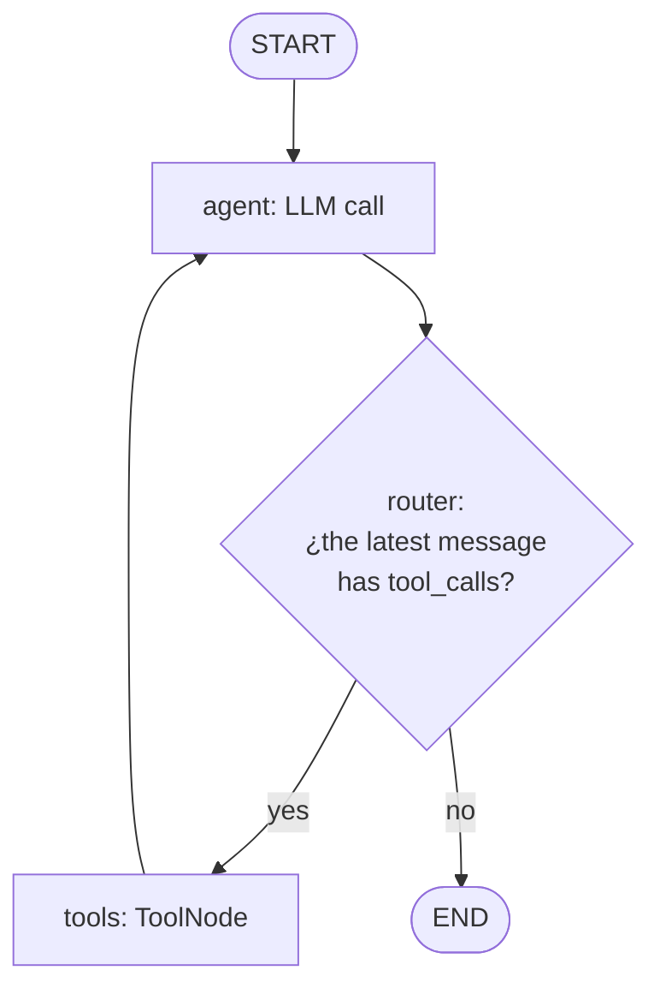
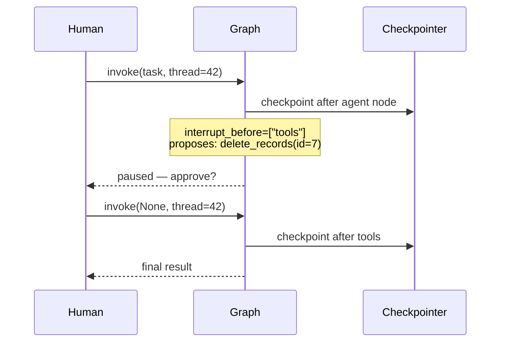

# 02 — LangGraph: state graphs, cycles, conditionals, and checkpoints

> **Objective:** model agents as explicit state graphs: nodes, conditional edges,
> bounded cycles, checkpoint persistence, and human-in-the-loop.
> **Associated Labs:** [`../labs/02_langgraph_basico.py`](../labs/02_langgraph_basico.py),
> [`../labs/03_langgraph_ciclos_condicionales.py`](../labs/03_langgraph_ciclos_condicionales.py),
> [`../labs/04_langgraph_checkpoints.py`](../labs/04_langgraph_checkpoints.py)

## 1. Why a graph framework (after doing it by hand)

In lab 01 you wrote the ReAct loop in ~60 lines. So, why LangGraph? Because that
hand-crafted loop falls short as soon as you need: **persist** state across executions,
**pause** for a human to approve an action, **resume** after a failure, branch the flow
based on conditions, or combine multiple agents. All of that is infrastructure, and rewriting it
per project is a mistake.

LangGraph models the application as a **state machine**: a directed graph where nodes
are functions (LLM calls, tools, pure logic) and edges define which node comes next.
Unlike a classic DAG (Airflow, a pipeline), **cycles are allowed** — and an agent *is*
a cycle: LLM → tool → LLM → ...

What you get with the framework:

- **Explicit and typed state** — everything flowing through the graph is in a single inspectable object.
- **Checkpointing** — state is saved after each step; you can resume, time-travel, or
  run in independent threads per user.
- **Built-in human-in-the-loop** — interrupt before/after a node and resume with human input.
- **Event streaming** — see every transition in real time (and traces in LangSmith).

What you pay: an additional layer of abstraction to learn and debug. For a simple single-tool
loop, lab 01 remains the correct answer.

## 2. The three concepts: State, Nodes, Edges

### 2.1 State

A schema (typically `TypedDict`) that defines the shared "canvas". Each key can carry
a **reducer**: a function that defines how the new value is combined with the existing one.

```python
from typing import Annotated
from typing_extensions import TypedDict
from langgraph.graph.message import add_messages

class State(TypedDict):
    messages: Annotated[list, add_messages]  # reducer: apendiza en vez de sobreescribir
    intentos: int                            # sin reducer: el último valor gana
```

`add_messages` is the star reducer: nodes return new messages and the reducer appends them to the list (deduplicating by id). Without a reducer, returning `{"messages": [msg]}` **would clear** the history. This detail causes half of beginner bugs in LangGraph.

Nodes **do not mutate** the state: they receive the current state and return a dictionary with the keys they want to update. LangGraph applies the reducers. This makes each step reproducible and enables checkpointing.

### 2.2 Nodes

Python functions `state -> dict` (partial state update). A node can call an LLM, execute a tool, or be pure logic. LangGraph comes with `ToolNode` pre-built: it executes the `tool_calls` of the last AI message and returns the corresponding `ToolMessage`.

### 2.3 Edges

- **Normal:** `graph.add_edge("a", "b")` — after `a`, always `b`.
- **Conditional:** `graph.add_conditional_edges("agent", router, {"tools": "tools", END: END})` — a
   **deterministic** function inspects the state and returns the name of the next node. This is where the agent's control flow lives.
- **Special:** `START` (entry) and `END` (termination).

The complete ReAct agent, as a graph:



The `agent → tools → agent` cycle is the essence. The router is your code, deterministic and testable — the LLM decides *by emitting tool_calls or not*, but the logic that routes that decision is standard Python. This separation (the model proposes, the graph disposes) is the key design idea.

```python
from langgraph.graph import StateGraph, START, END
from langgraph.prebuilt import ToolNode

def route(state: State) -> str:
    last = state["messages"][-1]
    return "tools" if last.tool_calls else END

builder = StateGraph(State)
builder.add_node("agent", call_llm)
builder.add_node("tools", ToolNode(tools))
builder.add_edge(START, "agent")
builder.add_conditional_edges("agent", route, {"tools": "tools", END: END})
builder.add_edge("tools", "agent")
graph = builder.compile()
```

## 3. Cycles and how not to die in them

An unfrened cycle is an infinite loop with an API bill. Three brakes, use them combined:

1. **`recursion_limit`** — LangGraph halts execution after N "supersteps" (default 25) and
   throws `GraphRecursionError`. It is the airbag, not the service brake: catch it and degrade with
   elegance.
2. **State Counter** — a `intentos` key that a node increments and the router checks:
   upon reaching the maximum, it routes to a "honest surrender" node that explains what was
   achieved and what was not. This is the service brake: it provides a controlled exit, not an exception.
3. **Stagnation Detection** — if the state does not change between turns (same tool,
   same arguments, same observation), it halts: repeating will not fix anything.

In lab 03 you implement a "generate → evaluate → retry" loop with a counter and conditional
exit — the skeleton of any agent with self-critique.

## 4. Checkpoints: persistence, threads, and time-travel

A **checkpointer** saves a snapshot of the state after each superstep. Upon compilation:

```python
from langgraph.checkpoint.memory import InMemorySaver
graph = builder.compile(checkpointer=InMemorySaver())  # en producción: SQLite / PostgreSQL

config = {"configurable": {"thread_id": "usuario-42"}}
graph.invoke(
    {"messages": [{"role": "user", "content": "¿Qué incidentes P1 siguen abiertos?"}]},
    config,
)
```

- **`thread_id`** identifies a conversation/session. Invoking again with the same `thread_id`
   **continues** from the last checkpoint (free short-term memory); a new `thread_id`
   starts from scratch. One thread per user/conversation is the standard pattern.
- **`get_state(config)` / `get_state_history(config)`** — inspect the current state or the entire
   history of checkpoints.
- **Time-travel:** you can take an old checkpoint, modify the state with
   `update_state`, and resume from there — a branching of history. Extremely useful for debugging
   ("what would have happened if the tool had returned something else?") and for tests.

Backends: `InMemorySaver` (RAM, for development and tests) and checkpoint packages for
SQLite/PostgreSQL for real persistence. Install them separately and run their setup/migrations;
the checkpointer interface allows preserving the graph.

## 5. Human-in-the-loop

With a checkpointer, pausing is trivial — and it is the feature that justifies LangGraph in any
agent that touches money, production data, or the outside world:

```python
graph = builder.compile(checkpointer=saver, interrupt_before=["tools"])
```

The graph halts **before** executing the `tools` node, with the proposed tool call already visible
in the state. The process may end; hours later, another invocation with the same `thread_id`:

- **Approve:** `graph.invoke(None, config)` — `None` means "continue from where you were".
- **Reject/correct:** `graph.update_state(config, {"approval": "rejected"})` to edit a
  `approval` field declared in the state (e.g.
  replacing the tool call or injecting a rejection message) and then resume.



Modern versions add `interrupt()` callable *inside* a node (dynamic pause with payload for the human, resumed with `Command(resume=valor)`), which is more flexible than static `interrupt_before`. Lab 04 uses the static version for clarity and mentions the dynamic one.

## 6. Common LangGraph Errors

1. **Forgetting the reducer** in `messages` and overwriting the history at every node (symptom: the "amnesic" agent that eternally repeats the first action).
2. **Putting logic in the prompt that should be an edge.** "If the search fails, try with another query, max 2 times" as an instruction to the LLM is a plea; as a router + counter, it is a guarantee. Anything that can be deterministic should be.
3. **Huge state.** Storing full HTMLs or DataFrames in the state inflates every checkpoint and every prompt. Store references (paths, ids) and let tools read the heavy data.
4. **Trusting `recursion_limit` as flow control** instead of as an airbag: the user sees an exception instead of a degraded response.
5. **Not setting `thread_id`** and being surprised that there is no memory, or using a global one and mixing conversations from different users.
6. **Debugging blindly.** Activate LangSmith (`LANGSMITH_API_KEY` + `LANGSMITH_TRACING=true` in the
    `.env`): every execution is traced node by node with prompts, responses, and latencies. Debugging agents without traces is archaeology.

## 7. LangGraph or doing it by hand? (Honest criteria)

| You need... | By hand (lab 01) | LangGraph |
|---|---|---|
| Simple loop, 1–3 tools, no persistence | ✅ fewer dependencies, zero magic | overkill |
| Persistence / resumption / user threads | you'd reinvent SQLite + serialization | ✅ |
| Human-in-the-loop with long pauses | very costly to get right | ✅ |
| Flows with branches, bounded cycles, multi-agent | spaghetti of ifs | ✅ |
| Total control and zero dependencies (library, edge) | ✅ | heavy |

The valuable skill is not "knowing LangGraph": it is knowing how to model a problem as a state machine.
The framework only saves you the plumbing.

## To go deeper

- Current LangGraph Docs — [docs.langchain.com/oss/python/langgraph/](https://docs.langchain.com/oss/python/langgraph/) — in particular the guides on *persistence*, *human-in-the-loop*, and *streaming*.
- Official tutorial "Introduction to LangGraph" (LangChain Academy) — [academy.langchain.com](https://academy.langchain.com/courses/intro-to-langgraph) — free, the best guided tour.
- Anthropic, *Building effective agents* (2024) — the workflows section (prompt chaining, routing, orchestrator-workers) maps 1:1 to graph topologies.
- LangSmith — [docs.smith.langchain.com](https://docs.smith.langchain.com/) — traces and evaluation; we will revisit it in file 08.
