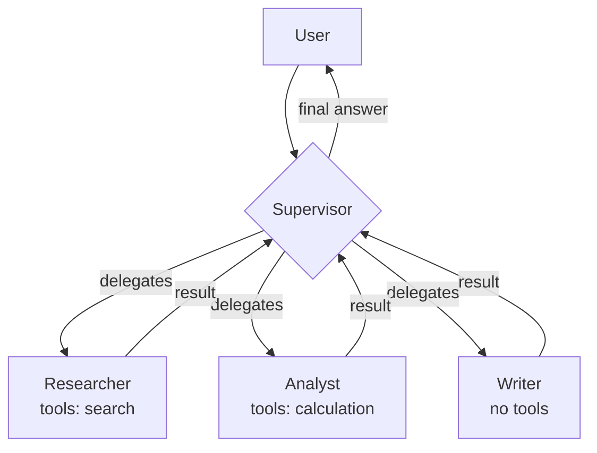
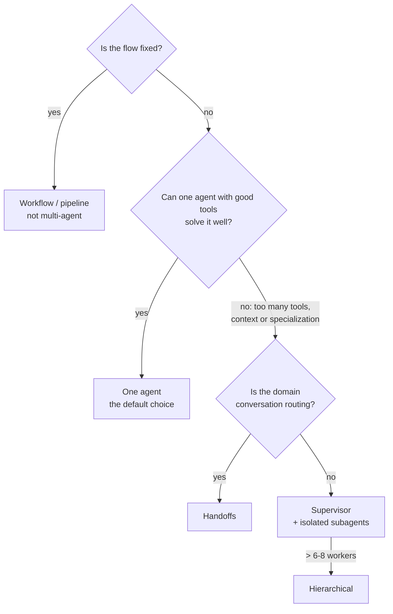

# 05 — Multi-agent systems: coordination, supervisors, communication

> **Objective:** learn about multi-agent topologies (supervisor, hierarchical, network, handoffs),
> how agents communicate, and — above all — when a single agent is the correct answer.
> **Associated Lab:** [`../labs/06_multiagente_supervisor.py`](../labs/06_multiagente_supervisor.py)

## 1. Why (and why not) to split into multiple agents

A "multi-agent system" is a system where multiple agent loops — each with its own prompt,
tools, and sometimes its own model — collaborate on a task. Legitimate reasons to split:

1. **Tool overload.** An agent with 30 tools makes poor choices; three agents with 8–10 coherent
tools each make good choices. (The attention window over schemas is finite.)
2. **Context isolation.** Each sub-agent works with its own short history instead of
dragging everything along; the orchestrator only receives summaries. This is the most effective
tactic against "context explosion".
3. **Real specialization:** distinct and incompatible system prompts (a ruthless critic
and a creative writer do not coexist well in a single prompt), or different models by cost
(powerful planner, cheap workers).
4. **Parallelism:** independent subtasks running simultaneously (e.g., researching 5 sources
in parallel, like Anthropic's multi-agent research system).

And the symmetric warning: **each extra agent adds latency, cost, and a new mode of failure**
(misunderstandings between agents, duplicated work, loss of information in summaries). The
majority of "multi-agent" systems published as demos would be faster, cheaper, and
more reliable as a single agent with good tools — or as a workflow. Start with one;
split only when you measure that the split improves something concrete.

## 2. Topologies

### 2.1 Supervisor (orchestrator–workers)

A central agent receives the task, decides which specialist acts, receives its result, and decides the
next step (another specialist, or to finish). Workers do not talk to each other: all
communication goes through the supervisor.

In LangGraph: the supervisor is an LLM node whose **structured** output (an enum:
`researcher | analyst | writer | FINISH`) feeds a conditional edge that routes to the worker;
each worker returns to the supervisor. This is the topology of lab 06 and the most used in production
because the flow is traceable: you always know who decided what.

**Inherent risks:** the supervisor as a bottleneck (everything passes through its context — ask workers
for summaries, not transcripts), and the **ping-pong**: supervisor and worker bouncing the
task back and forth without progress. Same remedy as always: turn counter in the state and forced exit.

### 2.2 Hierarchical

Supervisors of supervisors: a higher level delegates to teams, each team has its own
supervisor and workers. Scales organizationally (developable and testable teams separately)
at the cost of more layers where information can be lost. Only makes sense when a flat supervisor
would exceed ~6–8 workers.

### 2.3 Mesh (peer-to-peer) and handoffs

Each agent can pass control to any other (**handoff**: "I'm transferring this conversation
to the refunds agent, with this context"). This is the OpenAI Swarm/Agents SDK model and the
`Command(goto=...)` of LangGraph. Natural for **conversational routing** (customer support: triage → specialist), but as a general architecture a fully connected mesh is difficult
to trace and debug — with N agents there are N² possible routes. Prefer a supervisor unless the domain
is genuinely "transfer the call to the appropriate department".

### 2.4 Pipeline and debate

- **Pipeline:** A → B → C fixed (writer → critic → editor). If the order is fixed, this is a
  workflow with LLM stages — the most debuggable option; do not call it multi-agent nor give it
  a supervisor.
- **Debate / committee:** several agents propose, critique each other's proposals, and a judge decides.
  Improves reasoning tasks on benchmarks (Du et al., 2023) at a brutal token cost
  (N agents × R rounds). Niche: high-value point decisions. It is the pattern of the
  "agent council" you already know if you use agent committees in your workflow.

## 3. Communication and shared state

Two communication models, with distinct consequences:

1. **Shared history:** all agents read/write the same message list (in
   LangGraph, the same `messages` channel in the state). Simple, maximum transparency — but the
   context grows with everything from everyone, and each agent's prompts must coexist with messages
    "from others".
2. **Isolated states + summaries (private scratchpads):** each sub-agent runs with its own
   history; only a distilled result returns to the supervisor (in LangGraph: subgraphs with
   their own state schemas, or invoking the worker as a function). Controls context, at the cost
   of deciding *what* is distilled — information loss in the summary is the typical silent bug
   of these systems.

Rule of thumb: shared history for ≤2–3 agents and short tasks; isolation with summaries
as soon as the task is long or the workers are verbose. In both cases, define the **handoff contract**: exactly which fields the worker receives (task, minimum context, expected response
format). Misunderstandings between agents are contract misunderstandings, and are fixed in the
contract, not by adding "please be clear" to the prompt.

Lessons from Anthropic's multi-agent research system (2025), the most useful public writeup
on this in production:

- The orchestrator must give each sub-agent **explicit objective, output format, recommended
  tools, and limits**; vague instructions produce duplicated work and gaps.
- **Scale effort to complexity**: simple queries, 1 agent and 3–10 tool calls; large
  tasks, more subagents with clear budgets — encode these rules in the orchestrator's prompt.
- Multi-agent systems burn ~15× more tokens than a chat; they are only worth it for tasks whose
  value justifies it.

## 4. Common multi-agent-specific errors

1. **Multi-agent for aesthetics.** Splitting "because specialized agents are better" without
   measuring it. Each agent-agent boundary is a potential loss of information.
2. **Ping-pong and courtesy loops.** Two agents thanking each other and re-delegating the task.
   Global turn limit + prompts that prohibit delegating without adding new work.
3. **Duplicate work in parallel** due to vague distribution instructions (two workers researching
   the same thing). Distribution is handled by the orchestrator with clear limits, not the workers.
4. **Lossy summaries at the critical point:** the worker found the key data, the summary omitted it, the supervisor concluded incorrectly. Require workers to use an output format with mandatory fields ("findings", "sources", "gaps").
5. **Evaluating only the final result.** When it fails, you don't know which agent failed. Trace each
   transition (LangSmith) and also evaluate the supervisor's intermediate decisions (file 08).
6. **Budget with no owner:** N agents × M turns × growing context = surprise bill.
   Token/call budget per task, measured and with a cutoff.

## 5. Decision criteria (executive summary)

## For further reading

- Anthropic, *How we built our multi-agent research system* (2025) — [anthropic.com/engineering/multi-agent-research-system](https://www.anthropic.com/engineering/multi-agent-research-system)
- LangGraph Docs, *Multi-agent systems* — [langchain-ai.github.io/langgraph/concepts/multi_agent/](https://langchain-ai.github.io/langgraph/concepts/multi_agent/) — supervisor, hierarchical, handoffs with `Command`.
- Anthropic, *Building effective agents* (2024) — orchestrator-workers pattern.
- Du et al., *Improving Factuality and Reasoning in Language Models through Multiagent Debate* (2023) — [arxiv.org/abs/2305.14325](https://arxiv.org/abs/2305.14325)
- Wu et al., *AutoGen: Enabling Next-Gen LLM Applications via Multi-Agent Conversation* (2023) — [arxiv.org/abs/2308.08155](https://arxiv.org/abs/2308.08155)
