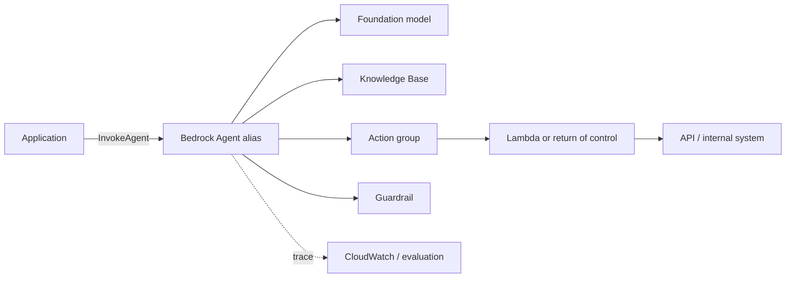

# 07 — Agents for Amazon Bedrock

> Theoretical topic with walkthrough. Requires an AWS account to execute and may incur costs.

Agents for Amazon Bedrock is AWS's managed option for orchestrating a foundation model,
action groups, and Knowledge Bases. The service resolves part of the loop and deployment; you remain
responsible for tool contracts, permissions, evaluation, costs, and effects.

## 1. Component Map



- **Agent:** instructions, model, and orchestration strategy.
- **Action group:** set of actions described by functions or an OpenAPI schema.
- **Executor:** typically Lambda; you can also request *return of control* to execute in your app.
- **Knowledge Base:** managed retrieval that the agent can query.
- **Guardrail:** content policies, topics, words, and sensitive information detection.
- **Alias:** logical endpoint pointing to a prepared version of the agent.
- **Session:** conversation identified by `sessionId`, with attributes and state.

## 2. Lifecycle

1. Create the agent with a least-privilege IAM service role.
2. Choose a compatible model and write instructions.
3. Add action groups and, if applicable, a Knowledge Base and a Guardrail.
4. **Prepare** validates and builds the working draft.
5. Test in the test alias with traces enabled.
6. Create an immutable version and an environment alias.
7. Invoke the alias from the application.
8. Evaluate, monitor, and promote or revert the alias.

Do not connect production to the mutable draft. The alias allows controlled deployment and rollback.

## 3. Designing action groups

A narrow, typed action beats a generic Lambda:

```yaml
openapi: 3.0.3
info:
  title: NebulaOps Incidents API
  version: 1.0.0
paths:
  /incidents/{incidentId}:
    get:
      operationId: getIncident
      description: Recupera estado y severidad de un incidente existente. No modifica datos.
      parameters:
        - name: incidentId
          in: path
          required: true
          schema:
            type: string
            pattern: '^INC-[0-9]{6}$'
      responses:
        '200':
          description: Incidente encontrado
        '404':
          description: El incidente no existe
```

Separate read from write. `getIncident` can be executed automatically; `closeIncident` should require confirmation, additional authorization, and an idempotency key.

The Lambda validates all parameters again. The schema guides the model; it does not authenticate the user
nor verify that the change makes sense.

## 4. Lambda vs. Return of Control

**Lambda executor:** Bedrock invokes the function with the action group event. This is advisable when the
integration lives in AWS and you want a managed flow.

**Return of control:** the agent returns the action and parameters to your application; your code
executes and resumes the session with the result. This is advisable if:

- you need interactive confirmation;
- the API lives outside AWS;
- you want to apply authorization using your application's context;
- the effect must pass through your own queue or workflow;
- you need to control retries and idempotency exactly.

Do not return credentials or internal errors to the model. Translate failures into safe and
actionable results.

## 5. Invocation from boto3

The inference client is `bedrock-agent-runtime`, distinct from the management client:

```python
import boto3


runtime = boto3.client("bedrock-agent-runtime", region_name="eu-west-1")
response = runtime.invoke_agent(
    agentId="ABCDEFGHIJ",
    agentAliasId="TSTALIASID",
    sessionId="user-42:conversation-7",
    inputText="Consulta el estado del incidente INC-004217",
    enableTrace=True,
)

parts: list[str] = []
for event in response["completion"]:
    if "chunk" in event:
        parts.append(event["chunk"]["bytes"].decode("utf-8"))
    if "trace" in event:
        trace = event["trace"]
        print(trace)

answer = "".join(parts)
print(answer)
```

The response is an event stream. Process chunks, traces, return-of-control signals, and errors; do not assume
that a single text block always arrives.

Generate `sessionId` on the server and associate it with the authenticated user. Do not allow a client to read or
continue other users' sessions by choosing IDs.

## 6. Sessions, Attributes, and Memory

Session attributes are intended for short-lived data such as locale or tenant filters. Do not store secrets, and do not trust attributes provided by the client without validating them. For authoritative data, query the source system via an action.

If you enable memory capabilities, define retention, isolation, correction, and deletion as described in topic 06. "Managed" does not eliminate privacy obligations.

## 7. Integrated Knowledge Bases

Integration facilitates the agent's decision to retrieve context. Nevertheless, you must measure:

- ingestion coverage and quality;
- chunking and embeddings;
- metadata filtering by tenant/version;
- context precision/recall;
- faithfulness and citations;
- behavior with an empty or contradictory corpus.

An explicit retrieval action may be preferable when you need to control top-k, reranking, traces, or an existing vector store.

## 8. IAM and Networking

The agent's role should only be able to invoke the specific models, KBs, guardrails, and Lambdas it needs. The Lambda uses a separate role limited to its backend. Separate identities so that compromising one layer does not grant all permissions.

Common controls:

- conditions based on ARN and region;
- KMS for encrypted data where applicable;
- Secrets Manager for external credentials;
- VPC endpoints/PrivateLink depending on architecture;
- CloudTrail for administrative changes;
- logs with PII redaction and defined retention.

## 9. Traces and Evaluation

`enableTrace=True` helps you observe orchestration reasoning, action group selection,
inputs, outputs, and retrieval. Traces may contain sensitive data: control access and
retention.

Minimum dataset:

- correct selection of each action;
- cases where no action should be called;
- invalid arguments and ambiguous entities;
- timeouts, 4xx, 5xx, and empty results;
- authorization denied;
- confirmation of actions with side effects;
- direct and indirect prompt injection;
- step limit and cost per task.

Measure final success, tool selection accuracy, argument accuracy, steps, latency, and cost.

## 10. Bedrock Agents vs. LangGraph

| Need | Bedrock Agents | LangGraph |
|---|---|---|
| Managed AWS operation | strong | you build it |
| Precise graph control | limited/configurable | high |
| Vendor portability | low | high |
| IAM/KB/Guardrails integration | native | manual |
| Debugging each transition | service traces | own state and code |
| Complex deterministic logic | can be forced | natural |

Choose based on operational and control requirements. Do not use Bedrock Agents just because you already use a Bedrock model; a single Converse call plus a deterministic workflow may be sufficient.

## Common errors

1. Granting broad Lambda permissions because "only the agent calls it".
2. Deploying the draft instead of versioning and using aliases.
3. Treating guardrails as a substitute for authorization.
4. Failing to capture the complete event stream or failure traces.
5. Allowing destructive actions without confirmation/idempotency.
6. Confusing `bedrock-agent` (control plane) with `bedrock-agent-runtime` (inference).
7. Evaluating only in the console with happy-path examples.

## To go deeper

- Agents for Amazon Bedrock: https://docs.aws.amazon.com/bedrock/latest/userguide/agents.html
- Action groups: https://docs.aws.amazon.com/bedrock/latest/userguide/agents-action-create.html
- Runtime `invoke_agent`: https://boto3.amazonaws.com/v1/documentation/api/latest/reference/services/bedrock-agent-runtime/client/invoke_agent.html
- Security in Amazon Bedrock: https://docs.aws.amazon.com/bedrock/latest/userguide/security.html
