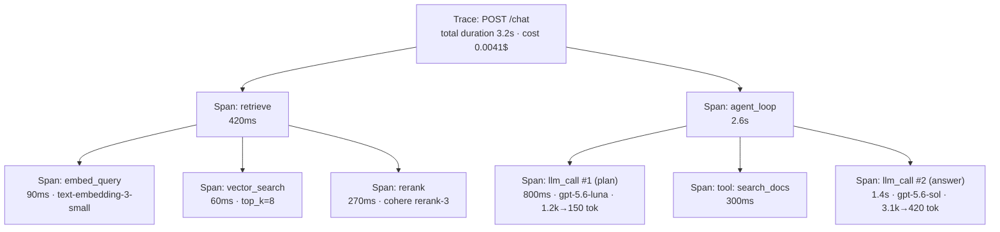
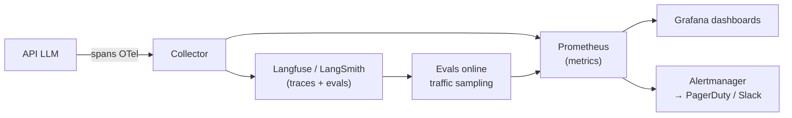

# LLM Observability: Traces, Spans, Metrics, and Alerts

> **Associated Labs:** [`01_trazas_manuales.py`](../labs/01_trazas_manuales.py) and
> [`02_langsmith_tracing.py`](../labs/02_langsmith_tracing.py)

## Why LLM Observability is Different

A classic web service is (almost) deterministic: same input, same output, and failures
are exceptions you can catch. An LLM system fails in ways that do not throw any
exception: the response arrives with 200 OK but is a hallucination, the agent enters a loop
of 40 calls costing €2, or an "innocent" prompt change degrades quality by 15%
without any dashboard noticing.

The practical consequence: **classic observability (is it alive? does it respond quickly?) is
necessary but not sufficient**. You need three layers:

1. **Infrastructure**: latency, throughput, HTTP errors, saturation. The usual stuff.
2. **LLM-specific**: input/output tokens, cost per request, model used, cache hit rate, number
   of agent steps, failed tool calls.
3. **Quality**: user feedback, online evaluations (LLM-as-judge on traffic samples), rate of "I don't know" responses, detection of degradation via drift.

Layer 3 connects to the next topic in the module ([continuous evaluation](02-evaluacion-continua.md)):
observability and evaluation are the same muscle, one looks at production and the other at CI.

## The Mental Model: Traces, Spans, and Metadata

The vocabulary comes from distributed tracing (OpenTelemetry) and all LLM tools
have adopted it:

- **Trace (trace)**: the complete record of a user request, from end to end.
   "The user asked X and this is everything that happened until we responded".
- **Span**: each operation within the trace, with start, end, and metadata. A span can
  contain child spans, forming a tree.
- **Metadata/attributes**: key-value pairs about the span: model, tokens, temperature,
  prompt version, user ID (pseudonymized), estimated cost.

A typical trace for an agent-based RAG system:



This tree answers the questions that matter in production:

- Where does the time go? (here: in the second LLM call, not in the retrieval)
- Where does the money go? (in the call to `gpt-5.6-sol` with 3.1k input tokens)
- What exact context did the model see when it hallucinated? (the input of the `llm_call #2` span)

**Golden rule**: if you don't save the complete inputs and outputs of every LLM call, you can't debug. A log saying "LLM call, 200 OK, 1.4s" is useless when the user reports a bad response. The trade-off is privacy and volume — managed with short retention, sampling, and PII redaction, not by abandoning the payloads.

## The four metrics you must always emit

| Metric | Type | Example dimensions (labels) | Purpose |
|---|---|---|---|
| `llm_request_duration_seconds` | histogram | model, endpoint, success/error | P50/P95/P99 Latency. In LLM streaming, it also measures **TTFT** (time to first token): this is what the user perceives. |
| `llm_tokens_total` | counter | model, direction (input/output) | Basis for cost and detecting bloated prompts. |
| `llm_cost_usd_total` | counter | model, feature, tenant | Cost per request, per feature, and per client. Essential for pricing. |
| `llm_errors_total` | counter | model, type (rate_limit, timeout, content_filter, invalid_json) | LLM errors have their own types: a provider 429 and malformed JSON are mitigated in different ways. |

Derived metrics are built on these four: cost/day, average cost per conversation,
output/input token ratio (if it rises, your responses are getting longer), cache hit
rate, etc. The lab [`01_trazas_manuales.py`](../labs/01_trazas_manuales.py) implements
this exactly by hand, without any platform, so you see there's no magic.

### LLM Latency: P95 and TTFT, not the mean

LLM latency has a long tail: the mean lies. Report percentiles. And with streaming,
separate two numbers:

- **TTFT (time to first token)**: startup perception. Typical target < 1 s.
- **Total duration**: depends linearly on output tokens (~each output token
costs one forward pass). If you want to reduce total latency, the cheapest lever is usually **asking for shorter responses**, not changing infrastructure.

## Structured logs: JSON or nothing

In production, a log is an event that a machine will aggregate, not a sentence for humans.
Minimum reasonable format for each LLM call (generated by lab 01):

```json
{
  "timestamp": "2026-08-21T10:32:11Z",
  "event": "llm_call",
  "trace_id": "a1b2c3",
  "model": "gpt-5.6-luna",
  "latency_ms": 812,
  "tokens_in": 1240,
  "tokens_out": 158,
  "cost_usd": 0.000281,
  "prompt_version": "support-v3",
  "success": true
}
```

Things people discover too late:

- **`prompt_version` is the most valuable dimension** and almost no one emits it. Without it, you
  cannot correlate "we deployed prompt v4 on Tuesday" with "satisfaction dropped on
  Tuesday".
- `trace_id` propagated across all components (API → retriever → agent) is what
  allows you to reconstruct the trace. With OpenTelemetry, this comes for free via context.
- Full payloads (prompt and response) go to a separate store with its own retention and
  access controls, not to the general log.

## Platforms: LangSmith, Langfuse, and the OTel Ecosystem

| | **LangSmith** | **Langfuse** | **OpenTelemetry + generic backend** |
|---|---|---|---|
| Model | Proprietary SaaS (LangChain Inc.); self-host only on enterprise plan | **Open-source (MIT core)**, free self-host with Docker, or cloud | Open standard; you choose the backend (Jaeger, Grafana Tempo, Datadog…) |
| Integration | Trivial with LangChain/LangGraph (env vars and done); `@traceable` for your own code | Own SDK + `@observe` decorator; OpenAI/LangChain/LiteLLM integrations | Manual instrumentation or auto-instrumentation (e.g., OpenLLMetry) |
| Strengths | Integrated datasets + evals with tracing; playground to reproduce calls; annotation queues | Cheap self-host, prompt management, evals, good multi-provider support | Total neutrality; integrates with the observability your company already has |
| Weaknesses | Relative lock-in; high-volume costs; cumbersome outside the LangChain ecosystem | Less polished in evals than LangSmith; operating self-host is your responsibility | Does not understand LLM semantics out-of-the-box: you must set up tokens/cost/evals |
| When to choose it | You already use LangChain/LangGraph and want speed | You want data control (GDPR, healthcare, banking) or predictable costs | Large organization with an established observability platform |

Reality notes:

- The three options converge: Langfuse and LangSmith accept OTel traces, and the
  **GenAI semantic convention** of OpenTelemetry (`gen_ai.*` attributes) is on its way to becoming the common
  standard. Instrumenting with OTel is the least risky bet over a 3-year horizon.
- The cost of these platforms scales by ingested events/spans. A 30-step agent
  generates 30+ spans per request: at 100k requests/day, that's millions of spans. **Sample**:
   100% of traces with errors or negative feedback, 1–10% of the rest.
- In this module's docker-compose ([docker/](../docker/README.md)), we spin up
   **Langfuse self-hosted** alongside the API, so you can see the full stack without depending
  on any SaaS.

## Alerts: What Pings and What Doesn't

An alert must be actionable at 3 a.m.; everything else is a dashboard. For LLMs:

**Alerts (page):**

- Error rate > threshold (separating provider 429/5xx from your own errors).
- P95 latency or TTFT out of SLO for N minutes.
- **Spend**: hourly cost > X, or daily cost projection > budget. This is the
  most specific LLMOps alert: a runaway agent loop can burn hundreds of
  euros overnight. Set a budget and circuit breaker, not just an alert.
- Drop in the output validation success rate (invalid JSON, guardrail triggered
  in > X% of responses).

**Dashboards (no page):**

- Slow quality drift (online evals), token distribution, cache hit rate,
  model mix in the router.



## Common Errors

1. **Logging only metadata and not payloads.** When the quality bug arrives, you won't be able to reproduce it. Save inputs/outputs with controlled retention and access.
2. **Measuring average latency instead of percentiles**, and not measuring TTFT in streaming.
3. **Not versioning prompts in traces.** Every prompt change is a deployment; if it doesn't appear in telemetry, it's an invisible deployment.
4. **Calculating cost with hardcoded prices and not updating them.** Provider prices change several times a year. Centralize the price table (or use LiteLLM's, which maintains it) and add a date.
5. **Instrumenting only LLM calls.** Retrieval, reranking, and tools also fail and are also slow; without their spans, every debugging session starts blind.
6. **Alerting on quality with hard thresholds on small samples.** An LLM-as-judge on 20 requests/hour has huge variance; alert on windows and trends.
7. **Sending PII to an observability SaaS without passing it through legal.** Prompts contain user data. Redact PII or self-host (Langfuse) if the data is sensitive.

## To Go Deeper

- LangSmith — observability documentation: <https://docs.langchain.com/langsmith/observability>
- Langfuse — self-hosting and architecture: <https://langfuse.com/self-hosting>
- OpenTelemetry — semantic conventions for GenAI: <https://opentelemetry.io/docs/specs/semconv/gen-ai/>
- OpenLLMetry (Traceloop) — OTel auto-instrumentation for LLMs: <https://github.com/traceloop/openllmetry>
- Google SRE Book, ch. 6 "Monitoring Distributed Systems" (the four golden signals): <https://sre.google/sre-book/monitoring-distributed-systems/>
- Prometheus — metric types and histograms: <https://prometheus.io/docs/concepts/metric_types/>
