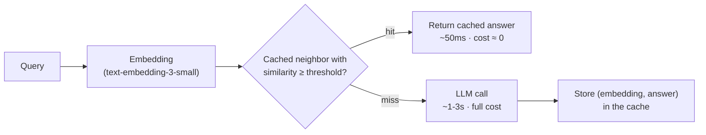

# Cost optimization: semantic caching, model routing, and batching

> **Associated Labs:** [`03_cache_semantico.py`](../labs/03_cache_semantico.py) and
> [`04_model_routing.py`](../labs/04_model_routing.py)

## Understand the bill before optimizing it

The cost of an LLM system using a provider API is, essentially:

```
coste = Σ requests × (tokens_in × precio_in + tokens_out × precio_out)
```

Three observations that organize all the techniques in this chapter:

1. **Output tokens typically cost 3–4× more** than input tokens. Shorter
   answers = cheaper *and* faster.
2. **The price difference between tiers can be an order of magnitude** (e.g.,
    `gpt-5.6-luna` vs. `gpt-5.6-sol`, Haiku vs. Opus). No infrastructure optimization comes close to the savings of using
   the small model where sufficient → *routing*.
3. **A large portion of real traffic is repetitive**: the same questions, the same system
   prompt, the same documents in context → *caching* in its three forms.

Before optimizing, **measure** (chapter [01](01-observabilidad.md)): cost per request,
per feature, and per user. Optimization without measurement is superstition; with measurement,
it usually starts with an embarrassing finding like "40% of the spend is a cron job no one
remembers."

Recommended order of levers, by savings/effort ratio:

| Lever | Typical Savings | Effort | Quality Risk |
|---|---|---|---|
| Shorten prompts and outputs (clean context, `max_tokens`, ask for conciseness) | 20–50% | Low | Low |
| Provider prompt caching | 50–90% of the repeated prefix cost | Low | None |
| Model routing (small by default, large on demand) | 30–70% | Medium | Medium |
| Exact and semantic response caching | Depends on traffic (hit rate) | Medium | Medium |
| Batch API for offline workloads | Fixed 50% | Low | None (if you tolerate latency) |
| Self-hosting open models | Variable; only at large scale | High | High |

## Caching: three distinct levels that people confuse

### 1. Prompt caching (provider-side, on the prefix)

OpenAI, Anthropic, and Bedrock cache the **prefix** of the prompt (system prompt, few-shot examples, long documents) and charge for cached tokens at a fraction of the price (50% for automatic caching in OpenAI; up to 90% discount with explicit caching in Anthropic). They do not return cached responses; they only reduce the cost of reprocessing the same prefix.

Design implication: **place static content at the beginning and variable content at the end**. A 4k-token system prompt followed by the user's question will cache those 4k tokens; if you interleave the current date at the beginning of the system prompt, you break the cache on every request.

### 2. Exact Response Caching

`hash(modelo + params + prompt) → respuesta`, in Redis or similar. A high hit rate occurs only when inputs are repeated literally (FAQs with buttons, batch pipelines). It is cheap, has no false positives, and uses TTL.

### 3. Semantic Caching (lab 03)

The idea: "How much does it cost to send an email with an attachment?" and "How do I attach a file to an email, do you charge me?" should share the same response. Pipeline:



The critical parameter is the **similarity threshold**, which is a pure trade-off:

- High threshold (≥ 0.95): few hits, almost no false positives.
- Low threshold (≤ 0.85): good hit rate, but you start returning **incorrect answers
  with full confidence** — the worst possible failure mode, because there is no error to log.

Hard rules learned in production:

- **Never semantically cache personalized responses** (they depend on the user, the date, or the state of an account). Only use general and stable knowledge. Segment the cache by tenant if there is private data: a cross-tenant hit is a data leak.
- Cosine similarity does not understand negations or entities: "Can I cancel?" and "Can I cancel without cost?" are very close. Measure the hit rate **and** the false positive rate with a labeled dataset before setting the threshold (lab 03 does both).
- Invalidation: short TTL (hours/days) + purge when the knowledge base changes.
- Tools: the lab does it manually (embeddings + cosine, so you understand it); in production, use Redis with vector search (LangCache), GPTCache, or the integrated cache of a gateway like LiteLLM.

## Model routing: the expensive model only when necessary

Most traffic for a real assistant is trivial (greetings, FAQs, rephrasing)
and a minority is difficult (multi-step reasoning, code, long analysis). Paying
for the flagship/Opus tier for 100% is throwing money away; using only the small one degrades the 20% that is difficult.

Query classification strategies, from simple to sophisticated:

1. **Heuristics** (length, keywords, is there code?, does it ask for analysis?): free,
   surprisingly effective as a baseline. This is what lab 04 implements.
2. **Volume LLM Classifier**: `gpt-5.6-luna` decides "simple/complex"; measures the
   actual cost of the run instead of copying an expiring figure.
   You pay one extra but small call; be careful with added latency.
3. **Trained Classifier** (logistic regression/BERT on embeddings of queries
   labeled with "was the small model enough?"): what RouteLLM and commercial routers
   (OpenRouter, Martian, LiteLLM's routing) do.
4. **Cascade (fallback)**: always try the cheap one first; if the response fails validation
   (invalid JSON, judge scores it low, the model itself says "I'm not sure"),
   retry with the expensive one. Maximum savings, but doubles latency in scaling cases and
   you need a reliable validator.

Router metrics you must monitor: % of traffic per model, escalation rate, and —
the one that is forgotten — **quality per branch** (evals sampled on what the
cheap one responded). A router without evals silently drifts toward "everything to the cheap one, quality in
free fall".

Architecture note: routing fits naturally into an **LLM gateway** (LiteLLM
proxy, OpenRouter, Bedrock inference profiles): a single point that already centralizes keys,
retries, spending limits, and telemetry. If you are going to do serious routing, do it there and not
scattered across the app code.

## Batching: two distinct meanings

### Provider Batch API (offline)

OpenAI and Anthropic offer batch endpoints: you upload thousands of requests, commit to
waiting (up to 24 hours, usually much less), and they charge **50% of the price**. Use it for
anything non-interactive: massive embedding generation, catalog enrichment,
nighttime evals, retroactive classification. It is the easiest lever in
this chapter: same code, half the price, zero quality risk.

### Continuous batching (on your own serving)

If you serve open-source models (chapter [05](05-despliegue-open-source.md)), the
server
(vLLM, TGI) groups concurrent requests in each GPU forward pass. This is not a
technique you "activate" from the client: it is the reason why vLLM multiplies
throughput compared to serving with raw transformers. Here, only the conceptual
link matters: online batching = GPU throughput; batch API = latency discount.

## Other levers you should know

- **`max_tokens` and output format**: requesting compact JSON with short fields instead of
  prose reduces output tokens (the expensive ones) without losing information.
- **Context truncation in RAG**: passing 4 relevant chunks instead of 12 mediocre ones saves
  and also improves quality (lost in the middle, Module III).
- **Conversation history**: summarizing or truncating the history instead of forwarding it
  in full; a long chat without history management grows quadratically in cost.
- **Distillation / fine-tuning of a small model** using outputs from the large one: convert
  a stable task from a general tier to a small fine-tuned model. Only for high-volume
  and well-scoped tasks: fine-tuning is a maintenance trade-off.

## Common Mistakes

1. **Optimizing without a quality baseline.** First the eval suite (chapter 02), then
   the router and cache. Otherwise, you won't know what you broke.
2. **Semantic caching with a threshold chosen "by eye".** The threshold is chosen with a dataset of
   pairs (real duplicate / similar-but-different) by looking at false positives.
3. **Caching responses with personal or temporary data.** "What is my balance?" can never
   come from a shared cache.
4. **Routing without branch telemetry.** Visible savings, invisible degradation.
5. **Ignoring the Batch API.** Teams that fight over cents in the prompt while running
   millions of embeddings at interactive price.
6. **Jumping to self-hosting "to save" too early.** An A100/H100 GPU running
    24/7 plus the engineer who maintains it costs more than the API bill for most
   small products. Do the full calculation (chapter 05).
7. **Breaking prompt caching** by putting variable content (date, user name)
   at the beginning of the prompt.

## For Further Reading

- OpenAI — prompt caching and Batch API: <https://platform.openai.com/docs/guides/prompt-caching> · <https://platform.openai.com/docs/guides/batch>
- Anthropic — prompt caching: <https://docs.anthropic.com/en/docs/build-with-claude/prompt-caching>
- GPTCache (semantic caching architecture): <https://github.com/zilliztech/GPTCache>
- Redis — semantic caching for LLMs: <https://redis.io/docs/latest/develop/ai/>
- RouteLLM (routing paper and framework): <https://arxiv.org/abs/2406.18665>
- LiteLLM — router and proxy/gateway: <https://docs.litellm.ai/docs/routing>
- Kwon et al., "Efficient Memory Management for LLM Serving with PagedAttention" (vLLM, continuous batching): <https://arxiv.org/abs/2309.06180>
