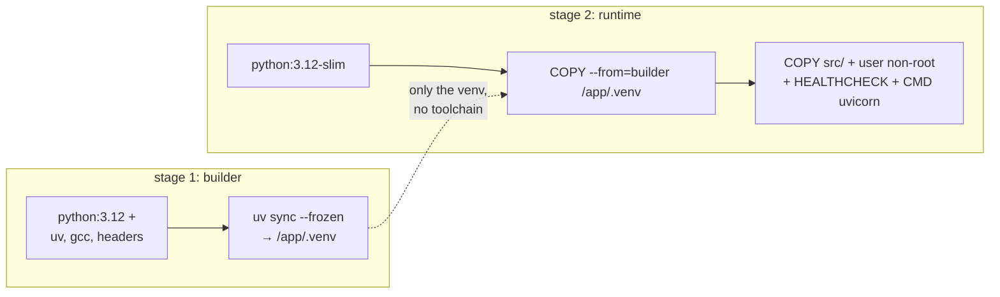

# Docker for LLMs: Containers, Multi-Stage Builds, and Image Optimization

> **Associated Practice:** [`docker/`](../docker/README.md) — Real multi-stage Dockerfile
> for a FastAPI + Prometheus API, explained and verifiable without keys.

## What Exactly to Containerize (and What Not)

In an LLM system, there are three packagable components, each with entirely distinct profiles:

| What | Typical Image | Particularity |
|---|---|---|
| **The Application API** (FastAPI calling OpenAI/Bedrock) | 150–400 MB | It is a standard Python service. This chapter focuses on this. |
| **The Inference Server** (vLLM, TGI, Triton) | 5–15 GB | CUDA base, drivers, requires `--gpus`; the **model weights NEVER go into the image**: they are mounted as a volume or downloaded at startup. |
| **The Support Stack** (Langfuse, Redis, Postgres, vector DB) | per official image | Orchestrated with compose; you do not build it yourself. |

The rule regarding weights deserves emphasis: a 7B model is ~14 GB in fp16. Putting them in the
image results in 20 GB images that take 10 minutes to pull, break the limits of
many registries, and couple the code version to the model version. Weights are *data*:
volume, object storage (S3), or download at startup with local caching.

## Minimum Review: Layers and Build Cache

Each instruction in the Dockerfile creates an immutable layer. Docker reuses cached layers
up to the first instruction whose input changed; from there, it rebuilds everything. From this
comes rule #1 for every Python Dockerfile:

```dockerfile
# MAL: cualquier cambio de código reinstala todas las dependencias
COPY . .
RUN pip install -r requirements.txt

# BIEN: las dependencias solo se reinstalan si cambia el lockfile
COPY pyproject.toml uv.lock ./
RUN uv sync --frozen --no-dev
COPY . .
```

In an LLM project, this matters doubly: dependencies like `torch` or `vllm` weigh
gigabytes and take minutes; with the correct order, a rebuild after touching code takes
seconds.

## Multi-Stage Builds: Why and How

A multi-stage build uses a "builder" image with all compilation tools
and copies to the final stage **only the artifacts**: the venv and the code. Result: a final
image without compilers, without pip caches, without `.git`, and often half the size.



Concrete benefits:

- **Size**: less pull time = faster deployments and autoscaling (in Fargate or
  Lambda, image size is literally cold start latency).
- **Attack surface**: no gcc, no curl, no pip in the final image, an attacker
  who gains execution has far fewer tools. This connects with the
   [chapter 08](08-seguridad-y-governance.md).
- **Build/runtime separation**: build secrets (private repo tokens) are used
  in the builder and do not exist in the final image (use `--mount=type=secret`, never `ENV`).

The [module Dockerfile](../docker/Dockerfile) implements this pattern with `uv` and is
commented line by line in [docker/README.md](../docker/README.md).

## Production image checklist for an LLM API

1. **Base `-slim`, pinned version** (`python:3.12-slim-bookworm`, not `latest`).
   Alpine + Python is a known trap: musl forces wheel compilation (pydantic,
   numpy…) and builds become slow and fragile.
2. **Aggressive `.dockerignore`**: `.git`, `.venv`, `__pycache__`, datasets, notebooks,
    `.env`. A `.env` copied to an image is a secret leaked to everyone who can
   pull.
3. **Non-root user** (`USER app`). Serious runtimes (and security scanners)
   require it.
4. **Environment-specific secrets, never in the image**: `docker run -e OPENAI_API_KEY` locally;
   in AWS, Secrets Manager injected via the task definition ([chapter 06](06-aws-despliegue.md)).
5. **`HEALTHCHECK` / health check endpoint `/health`**: the orchestrator needs to distinguish "starting"
   from "dead". For an LLM API, the health check **must not** call the LLM provider
    (it would charge you and couple your health to theirs); only check that the process responds.
6. **Graceful shutdown**: uvicorn handles SIGTERM, but ensure you use the *exec*
   form of CMD (`CMD ["uvicorn", ...]`, with brackets) so signals reach the process
   and in-flight requests (which in LLMs last seconds) finish before dying.
7. **LLM-tailored timeouts**: a long response can take 60–120 s. Align
   uvicorn/gunicorn timeout, load balancer, and client, or you will have phantom 504s.
8. **Vulnerability scanning in CI**: `docker scout cves` or `trivy image` as a step
   in the pipeline.
9. **Explicit platform**: on Mac with Apple Silicon, build with
    `--platform linux/amd64` if the target is Fargate/EC2 x86 (or use multi-arch builds
   with buildx). The "it works on my machine" of 2026 is a CPU architecture error.

## Particularities of GPU images (self-hosted serving)

When the container is the inference server (vLLM, TGI, Triton):

- Base on NVIDIA CUDA images (`nvidia/cuda:12.x-runtime`) or directly the
  official image (`vllm/vllm-openai`, which already resolves the torch/CUDA/driver
  version hell). **Use the official one unless there is a strong reason not to.**
- On the host, the **NVIDIA Container Toolkit** is required; it is executed with `--gpus all`
   (or `runtime: nvidia` in compose).
- The host driver version must be ≥ the one required by the image's CUDA: this is the
  most common startup failure in GPU deployments.
- In Kubernetes: `resources.limits: nvidia.com/gpu: 1` + device plugin. Out of scope
  for this module, but the concept is identical.
- On a Mac (like this development machine) **there is no CUDA**: GPU containers
  do not run. For local development, native Ollama is used (lab 06) and GPU serving is learned
  in theory or on a temporary cloud instance.

## docker-compose as an LLMOps lab

Compose shines for bringing up the full stack of this module locally: the API and
Prometheus for metrics. Traces from lab 02 can be sent to LangSmith separately.
Patterns used by our
[docker-compose.yml](../docker/docker-compose.yml):

- `depends_on` with `condition: service_healthy` to start in real order, not just
  creation order.
- Internal network: Prometheus scrapes the API by service name (`http://api:8000`);
  only essential ports are published to the host.
- Named volumes for Postgres persistence.
- Read-only filesystem, `cap_drop: ALL` and `no-new-privileges` to practice hardening.

## Common Errors

1. **Copying the code before the lockfile** and losing the dependency cache on every
   build (the #1 error in Python Dockerfiles, and the most costly with ML dependencies).
2. **Baking model weights or `.env` inside the image.** The former are data, the
   latter is a security incident.
3. **`FROM python:3.12` plain** (1 GB including the toolchain) or the opposite extreme,
   Alpine, which breaks wheels. `-slim` is the sweet spot.
4. **CMD in shell form** (`CMD uvicorn app:app`): signals go to `/bin/sh`, SIGTERM
   does not reach uvicorn, and the orchestrator ends up killing the container with LLM requests
   mid-flight.
5. **Health check that calls the LLM**: you pay to check your health and your liveness depends
   on OpenAI's uptime.
6. **Ignoring the CPU architecture** when building on Apple Silicon to deploy on x86.
7. **A single worker without justification**: for an LLM API, the workload is I/O-bound (waiting
   for the provider); an async uvicorn with few workers performs poorly; what you need is
   well-implemented async concurrency, not 16 processes.

## For Further Reading

- Docker — multi-stage builds: <https://docs.docker.com/build/building/multi-stage/>
- Docker — Dockerfile best practices: <https://docs.docker.com/build/building/best-practices/>
- uv in Docker (official guide from Astral, the pattern we use): <https://docs.astral.sh/uv/guides/integration/docker/>
- Official vLLM image: <https://docs.vllm.ai/en/latest/deployment/docker.html>
- NVIDIA Container Toolkit: <https://docs.nvidia.com/datacenter/cloud-native/container-toolkit/latest/index.html>
- Self-hosted Langfuse with Docker Compose: <https://langfuse.com/self-hosting/docker-compose>
- Itamar Turner-Trauring, "Docker packaging for Python" (reference series): <https://pythonspeed.com/docker/>
