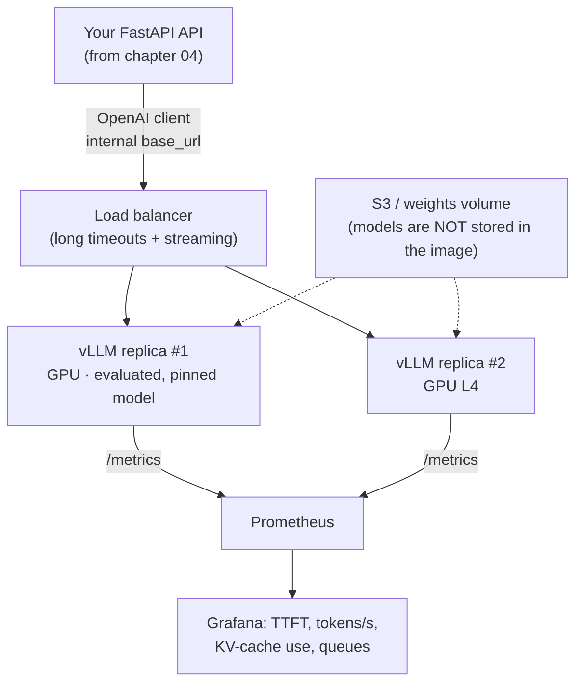

# Open-source LLM Deployment: vLLM, Ollama, and Triton Inference Server

> **Associated Lab:** [`06_ollama_local.py`](../labs/06_ollama_local.py)

## When Does It Make Sense to Serve Your Own Model?

Before the tool, the decision. Serving an open model (Llama, Mistral, Qwen,
Gemma…) on your infrastructure competes with paying for an API. Legitimate reasons:

- **Data**: regulatory or contractual requirements that data must not leave your
  infrastructure (healthcare, banking, defense, on-premise).
- **Scale Cost**: with high, sustained volume, an amortized GPU is cheaper
  than paying per token. The key word is *sustained*: the GPU costs the same at 5 %
  utilization as at 90 %.
- **Latency/Control**: small models fine-tuned to your task, predictable latency without
  relying on external rate limits, frozen versions (no one deprecates your model).
- **Own Fine-tuning**: if you have fine-tuned a model, you must serve it somewhere.

The honest number: an instance with a serious GPU (L4/A10G in the cloud) costs on the order
of $500–1,500/month running 24/7, plus the engineering time to operate it. With APIs
for small models at cents per million tokens, **the break-even point is much further
away than intuition suggests**. Do the math with your real traffic before buying
the "self-host = savings" argument.

## Serving Concepts That Explain All Benchmarks

- **Continuous Batching**: the server mixes requests at each generation step on the
  GPU instead of waiting for a batch to finish. This is the technique that separates a production server
  (vLLM, TGI, TensorRT-LLM) from a script with `transformers`. It multiplies
  throughput by 5–20x under concurrent load.
- **PagedAttention** (vLLM's original contribution): manages the KV cache as
  paged memory, eliminating fragmentation and allowing many more simultaneous requests
  in the same VRAM.
- **KV Cache**: attention memory grows with (number of sequences × length). It is the
  true scarce resource of an LLM server: VRAM not occupied by weights is occupied by the
  KV cache, and when it runs out, throughput collapses.
- **Quantization** (AWQ, GPTQ, FP8, and GGUF in llama.cpp/Ollama): weights in 4–8 bits.
  Reduces VRAM usage by 2–4x with a small (but not null) quality loss: evaluate with YOUR suite,
  not with the leaderboard).
- **Serving Metrics**: TTFT (perceived latency), tokens/second per request
   (read speed), server aggregate throughput (total tokens/s), and
  sustainable concurrent requests. You optimize throughput *or* latency; marketing benchmarks
  usually only teach the one that favors them.

## The Three Contenders

### Ollama — The Local Development Path

Ollama packages llama.cpp with a Docker-like experience: `ollama pull <tag>`,
`ollama run <tag>`, and an HTTP server with an **OpenAI-compatible API** on
`http://localhost:11434/v1`. This compatibility is the key pedagogical and practical point: the
same client code (`openai.OpenAI(base_url=...)`) works against Ollama, vLLM, or
OpenAI by changing a single URL — exactly what Lab 06 demonstrates.

- Runs on CPU and consumer GPUs, including the Metal GPU on Macs (this machine, an
  M-series with unified memory, is an excellent environment for Ollama).
- Uses quantized GGUF models; loads and downloads models on demand.
- Its niche: local development, prototypes, personal apps, edge. **It is not** designed
  to serve production concurrent traffic: its batching and multi-user management
  are minimal compared to vLLM.

### vLLM — the de facto standard for GPU production

Academic project (Berkeley) turned into the most widely used server for open LLMs.
Python/PyTorch, serves Hugging Face models directly, exposes an
OpenAI-compatible API, and implements continuous batching + PagedAttention, tensor parallelism
for multi-GPU, quantization, speculative decoding, and structured outputs.

- Its niche: production on NVIDIA GPUs (and increasingly AMD/other accelerators),
  from a single L4 up to multi-node clusters.
- Operating it means operating GPUs: choosing `--max-model-len`, `--gpu-memory-utilization`,
  monitoring the KV cache (exposes Prometheus metrics on `/metrics`), and sizing
  replicas.

### Triton Inference Server — NVIDIA's generalist inference platform

Triton is not an "LLM server": it is a server for **any model** (vision, TTS,
recommenders, LLMs) with connectable backends (TensorRT-LLM, PyTorch, ONNX, Python…),
versioned model repository, ensembles (chained model pipelines within the
server), and integrated metrics/health. For LLMs, the highest-performance path is
**Triton + TensorRT-LLM backend**, which requires compiling the model into specific "engines"
for the target GPU.

- Its niche: organizations with many heterogeneous models, ML platform teams,
  and those needing to squeeze out every last token/s of NVIDIA hardware.
- Cost: notably higher operational complexity (compilation per GPU, configuration
  of the repository, two components to version). It appears in the NCA-GENL syllabus and in
  SageMaker (which offers it as a managed container).

### Comparative table

| | **Ollama** | **vLLM** | **Triton (+TensorRT-LLM)** |
|---|---|---|---|
| Objective | Local development, edge | GPU production, high throughput | Multi-model inference platform |
| Installation | One binary, one `pull` | `pip install vllm` / Docker image (requires NVIDIA GPU) | NGC image + model repository + engine compilation |
| Hardware | CPU, Metal (Mac), consumption GPUs | NVIDIA GPUs (datacenter/consumption), multi-GPU | NVIDIA GPUs, multi-GPU/multi-node |
| Model format | Quantized GGUF | HF weights (safetensors), AWQ/GPTQ/FP8 | Compiled TensorRT-LLM engines per GPU |
| API | OpenAI-compatible + own API | OpenAI-compatible | Own HTTP/gRPC; OpenAI-compatible (frontend) |
| Continuous batching | Limited | Yes (industry reference) | Yes (in-flight batching) |
| Real concurrency | Low (a few users) | High (hundreds of streams) | High |
| Operational curve | Trivial | Medium | High |
| When to choose it | Prototype, develop, demos, personal privacy | Serving an open LLM in production: the sensible default | Many heterogeneous models or extreme performance on NVIDIA |

Honorable mentions you will see in the market: **TGI** (Hugging Face, very similar to vLLM in
role), **SGLang** (leading performance, radix cache for shared prefixes),
**llama.cpp/llamafile** (the base of Ollama, for CPU/edge), **LM Studio** (desktop
GUI). The decision analysis is the same: local or production? how much
concurrency? how much complexity can you operate?

## Reference architecture for a vLLM deployment

Typical decisions: homogeneous replicas with one model each (simpler than
multi-model per GPU); autoscaling by queue depth or KV cache usage, not by
CPU; health check on `/health` of vLLM itself; and the client always using the
OpenAI-compatible API to be able to switch servers without touching the app.

## Common Errors

1. **Benchmarking with a single request** and concluding that "vLLM isn't that great." vLLM's advantages emerge under concurrency; with a single user, llama.cpp can be just as fast.
2. **Ignoring the KV cache when sizing**: "the model fits in the GPU" is not enough; without free VRAM for the cache, concurrency collapses. Monitor
    `vllm:gpu_cache_usage_perc`.
3. **Choosing an enormous maximum context "just in case"** (`--max-model-len 128k`): the KV
   cache is reserved based on this; you pay in concurrency for what you don't use in context.
4. **Using Ollama to serve multi-user production traffic.** It works… until
   20 users arrive at once.
5. **Not re-evaluating after quantization.** AWQ/GGUF-Q4 usually lose little, but "usually" is not
   an SLO: run your eval suite (chapter 02) on the quantized model.
6. **Forgetting the total cost**: GPU 24/7 + storage + the on-call engineer. Compare against batch and the provider's current volume tier before signing.
7. **Locking in to a server's proprietary API** when an OpenAI-compatible one exists:
   portability between Ollama/vLLM/provider is free if you respect it from day 1.

## For Further Reading

- vLLM — documentation: <https://docs.vllm.ai/>
- Kwon et al., "Efficient Memory Management for LLM Serving with PagedAttention": <https://arxiv.org/abs/2309.06180>
- Ollama — docs and OpenAI-compatible API: <https://docs.ollama.com/> · <https://docs.ollama.com/openai>
- NVIDIA Triton Inference Server: <https://docs.nvidia.com/deeplearning/triton-inference-server/user-guide/docs/>
- TensorRT-LLM: <https://nvidia.github.io/TensorRT-LLM/>
- Hugging Face TGI: <https://huggingface.co/docs/text-generation-inference/>
- BentoML — "LLM Inference Handbook" (serving metrics and trade-offs): <https://bentoml.com/llm/>
