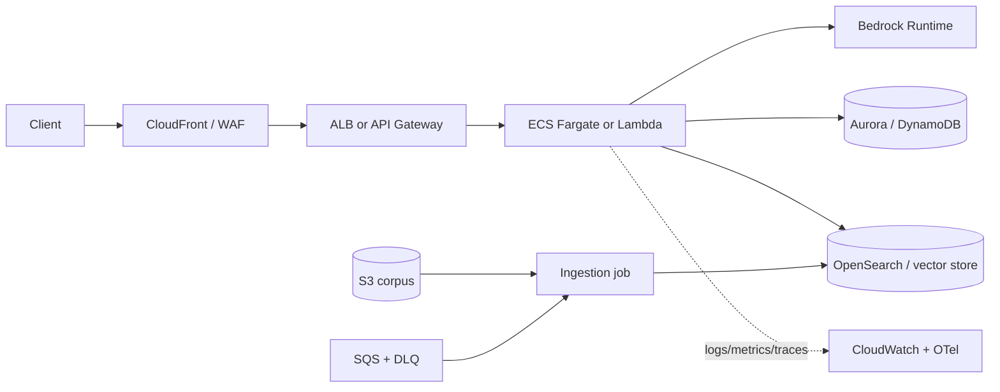

# 06 — Deployment and Monitoring on AWS

> Theoretical walkthrough: no lab requires an AWS account. The principles apply to the RAG system
> or agent built in modules III–IV.

"Deploying on AWS" does not identify an architecture. First, separate **model**, **application**,
**data** and **offline work**. Each component has a distinct scaling, security, and cost profile.

## 1. Two Independent Decisions

### Who serves the model?

- **Amazon Bedrock:** Managed multi-model API; you pay per usage/capacity and delegate serving.
- **SageMaker real-time endpoint:** You choose the artifact/container/instance and operate the endpoint.
- **ECS/EKS/EC2 with vLLM or TGI:** Maximum control; also maximum GPU responsibility.
- **External provider:** The app runs on AWS and calls an API outside your account.

### Where does the application run?

- **Lambda:** Short requests, irregular traffic, event-driven workers.
- **ECS Fargate:** Persistent API/container without managing nodes.
- **ECS on EC2 / EKS:** Control or scale that justifies operating capacity.
- **App Runner:** Simple managed web deployment when its limits fit.
- **SageMaker endpoint:** ML inference, not a general substitute for a business API.

Do not deploy a GPU model within Lambda. The function can orchestrate a call to Bedrock or
an endpoint, but its limits and lifecycle do not align with heavy serving.

## 2. Decision Matrix

| Option | Fits when | Watch out for |
|---|---|---|
| Lambda + Bedrock | Low/irregular volume, simple API | cold start, timeout, streaming, connections |
| ECS Fargate + Bedrock | Continuous API, streaming, workers | minimum tasks, load balancer, idle cost |
| SageMaker endpoint | Own model and managed ML stack | instance always active, autoscaling/cold start |
| ECS/EKS GPU + vLLM | High stable volume, batching control | drivers, GPU capacity, upgrades, observability |
| Batch + SQS/Step Functions | Non-interactive ingestion/evals | idempotency, DLQ, limits and backpressure |

Calculate the crossover point with real traffic. A "cheaper GPU per million tokens" becomes expensive if
it sits idle 90% of the time.

## 3. Reference architecture with Bedrock



Separate ingestion from serving. A broken PDF must not block the API healthcheck, and a new chunking strategy must be able to reindex in parallel with its own version.

## 4. Lambda: pattern and limits

Lambda works well as a fine-grained adapter:

```python
import json
import os

import boto3


runtime = boto3.client("bedrock-runtime", region_name=os.environ["AWS_REGION"])


def handler(event: dict, context: object) -> dict:
    body = json.loads(event.get("body") or "{}")
    question = str(body.get("question", "")).strip()
    if not question or len(question) > 4000:
        return {"statusCode": 400, "body": json.dumps({"error": "invalid_question"})}

    response = runtime.converse(
        modelId=os.environ["BEDROCK_MODEL_ID"],
        system=[{"text": "Responde de forma breve y no inventes datos."}],
        messages=[{"role": "user", "content": [{"text": question}]}],
        inferenceConfig={"maxTokens": 300, "temperature": 0.1},
    )
    answer = response["output"]["message"]["content"][0]["text"]
    return {
        "statusCode": 200,
        "headers": {"content-type": "application/json"},
        "body": json.dumps({"answer": answer}),
    }
```

In production, add authentication, tracing, explicit error/throttling management, budgeting, and streaming if the frontend requires it. Reusing the client outside the handler allows pooling.

Lambda risks:

- cold starts and heavy dependencies;
- duration and payload size;
- bursts that multiply expensive model calls;
- DB connections without adequate proxy/pooling;
- lack of backpressure if each request triggers massive jobs.

Reserve concurrency and quotas to turn an unlimited bill into an operational limit.

## 5. ECS Fargate: persistent API

Minimum components:

- ECR image with immutable digest and scanning;
- task definition with CPU/memory and non-root user;
- secrets injected from Secrets Manager, not in the image;
- ALB with TLS, cheap healthcheck, and deregistration delay;
- autoscaling by CPU, memory, requests, or queue metric;
- logs and metrics with correlation IDs;
- two Availability Zones for high availability.

`/health/live` only confirms the process is alive. `/health/ready` checks necessary dependencies
with short timeouts. Do not make a paid LLM call in every healthcheck.

For streaming, review ALB/API Gateway timeouts, keep-alive, and cancellation when the client
disconnects; continuing to generate tokens after abandonment costs money.

## 6. SageMaker endpoints

Use them when you need to serve your own artifact/model with managed ML capabilities:

- real-time endpoints for interactive latency;
- asynchronous inference for larger payloads or duration;
- serverless inference for certain intermittent profiles;
- batch transform for offline batches;
- multi-model endpoints when the pattern and size fit.

For large LLMs, validate container support, GPU, tensor parallelism, quantization, context,
streaming, and autoscaling. Do not assume that a container that loads locally fits on the instance.

Version model artifact, image, serving parameters, and prompt. An endpoint with only the name
`production` is not reproducible.

## 7. Asynchronous processing

Mass ingestion, embeddings, and evals must enter via a queue:

```text
API → SQS → worker → resultado persistente
             ↘ error agotado → DLQ
```

Design:

- idempotency key per task;
- visibility timeout longer than a normal execution;
- limited retries and error classification;
- DLQ with alarm and runbook;
- `queued/running/succeeded/failed` state queryable;
- concurrency limit towards providers;
- checkpoints to resume batches.

Step Functions is suitable for workflows with branches, waits, compensation, and auditing; not for wrapping
a single call.

## 8. IAM and Secrets

Separate roles:

- **task/function role:** app runtime permissions;
- **execution role:** download image, logs, and startup secrets;
- **ingestion role:** read corpus and write index;
- **CI role:** deploy, with no access to production data;
- **human roles:** temporary and audited access.

Apply specific resources/actions, conditions, and separation by environment. A global wildcard
`bedrock:*` or `s3:*` speeds up prototyping and blocks a serious security review.

Secrets Manager/Parameter Store save secrets; KMS controls encryption. Do not log values or
expose them as command-line arguments.

## 9. Network

Usual pattern:

- Public ALB/API Gateway; tasks, DB, and indexes in private subnets;
- security groups referencing each other, not broad CIDRs;
- VPC endpoints for compatible AWS services when privacy/cost justify it;
- NAT controlled for external APIs;
- restricted egress if risk requires allowlist/proxy;
- WAF/rate limiting in front of the public endpoint.

"It's in a VPC" does not mean secure. IAM, application authorization, and tenant filters remain
necessary.

## 10. Observability with CloudWatch and OpenTelemetry

Correlate a request with:

- `trace_id`, `request_id`, pseudonymized user/tenant;
- service version, prompt, model, and index;
- spans `retrieve`, `rerank`, `llm`, `tool`;
- tokens, cost, latency, throttling, retries;
- safety status and sampled quality metrics;
- dependency and region.

Minimum alarms:

- 5xx rate and timeout;
- p95/p99 latency and time to first token;
- Bedrock/endpoint throttling;
- SQS age/depth and messages in DLQ;
- unhealthy tasks;
- daily spend/anomaly and tokens per request;
- drop in quality metric.

An alarm without an owner or runbook is noise.

## 11. Safe Deployment

Pipeline:

1. tests, dependency/image scan, and offline eval;
2. push to ECR by digest;
3. deploy to staging with synthetic dataset;
4. smoke + load + security;
5. canary or blue/green;
6. observe metrics and promote;
7. rollback image ** and ** configuration/prompt/index.

Vector index migrations use blue/green: build the new version, evaluate it, switch the read alias, and retain the previous one during the rollback window.

## Common Errors

1. Choosing a service based on familiarity before measuring traffic.
2. Mixing heavy ingestion with user requests.
3. Autoscaling based on CPU when the bottleneck is an external API or a queue.
4. Exposing tasks/DB publicly without need.
5. Using healthchecks that call the LLM.
6. Not limiting concurrency or spend.
7. Being able to revert the image but not the prompt or index.

## To Deepen

- AWS Well-Architected, Machine Learning Lens: https://docs.aws.amazon.com/wellarchitected/latest/machine-learning-lens/
- Bedrock runtime and Converse: https://docs.aws.amazon.com/bedrock/latest/userguide/conversation-inference.html
- ECS Fargate: https://docs.aws.amazon.com/AmazonECS/latest/developerguide/AWS_Fargate.html
- SageMaker deployment: https://docs.aws.amazon.com/sagemaker/latest/dg/deploy-model.html
- AWS Distro for OpenTelemetry: https://aws-otel.github.io/
