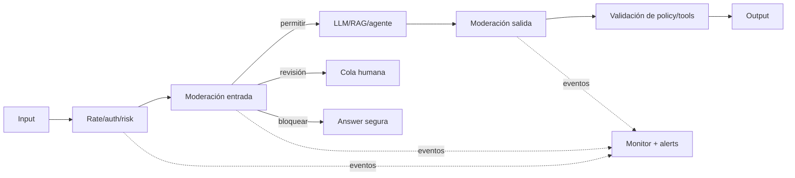

# 09 — Safety in Production: Policies, Guardrails, and Response

Safety is maintaining behavior within defined harm limits, even with adversarial inputs, uncertainty, and distribution shifts. It is not the same as security: security protects assets from threats; safety reduces harmful outcomes or actions. They overlap.

## 1. Policy Before Classifier

Write a concrete taxonomy for the product:

| Category | Action | Product Example |
|---|---|---|
| Allowed | Respond | Legitimate technical explanation |
| Allowed with limits | Respond safely | General health information with sources |
| Requires review | Pause/escalate | High-impact or ambiguous decision |
| Blocked | Reject and offer alternative | Specific harm instructions |
| Emergency | Defined message and resources | Imminent risk per policy |

Define severity, exceptions (education, prevention, fiction), jurisdiction, age, and channel. A moderator cannot enforce a policy that the team has not written.

## 2. Layered Architecture



Layers:

- Deterministic controls for size, type, rate, and permissions;
- Input classification/moderation;
- Model instructions;
- Retrieval/tool restrictions;
- Output moderation and validation;
- Human review;
- Monitoring and response.

No layer is perfect. Measure how they fail together.

## 3. Input Moderation

Classify intent and risk, but preserve legitimate context. The word "bomb" appears in
news, chemistry, safety, and damage contexts. Evaluate false positives by language/dialect and attacks with:

- altered spelling and Unicode;
- mixed encoding or languages;
- role-play and fiction;
- fragmented requests across multiple turns;
- content within documents/images;
- "translate this text" transformation.

The full conversation can change the meaning. Moderating only the last message loses
accumulative patterns; sending everything also increases privacy/cost. Design a risk state.

## 4. Output moderation

The model may generate disallowed content even with an innocuous input, or reproduce PII/secrets from
the context. Check:

- policy categories;
- sensitive data and secrets;
- URLs/domains and attachments;
- existing citations;
- dangerous operational instructions;
- format and length;
- claims requiring a disclaimer/source;
- tool calls before executing them, not just the final text.

For streaming, moderating only at the end allows harmful tokens to be displayed. Options: buffer by blocks,
a model with appropriate guarantees, incremental moderation, and the ability to cut the stream. Each option
adds latency.

## 5. Deterministic and model-based guardrails

**Deterministic:** enums, schemas, allowlists, permissions, secret regexes, limits, state machine.
High precision for clear rules.

**Classifiers/models:** intent, contextual toxicity, semantic risk. Broader coverage, but
probabilistic and biased.

**LLM-judge for policy:** flexible for complex policies; more expensive/slow and vulnerable to prompt
injection if it receives content without isolation.

Combine them. Never use a judge to authorize a write that an ACL can decide exactly.

## 6. Amazon Bedrock Guardrails

Bedrock Guardrails can apply filters and policies to inputs/outputs based on current capabilities: denied topics, content categories, words, sensitive information, and grounding/relevance checks in supported scenarios. It can be used alongside model invocations or via standalone evaluation APIs depending on configuration.

To adopt it:

1. version the guardrail and configuration;
2. create a dataset by category, language, and legitimate exception;
3. measure precision/recall and latency;
4. decide behavior on timeout/error;
5. log the decision and version without exposing unnecessary payload;
6. test bypasses and model changes.

A managed guardrail does not replace permissions, tool validation, or product policy.

## 7. Fail-open or fail-closed

If the moderator does not respond:

- **fail-closed:** blocks/pauses. Suitable for actions or high-risk domains; reduces
  availability.
- **fail-open:** continues. Suitable only if the impact is low and there are subsequent controls.
- **degradation:** read-only mode, safe generic response, or human queue.

Decide by category, not globally. Document the guardrail's SLO and alert on bypass due to failure.

## 8. Human review and escalation

The queue needs:

- priority by severity and SLA;
- minimum content and draft;
- reason for escalation and policy version;
- allowed actions for the reviewer;
- double control for high impact;
- structured feedback for eval;
- protection of staff against sensitive content.

Do not promise an immediate response if the human SLA is measured in hours. The UX must clearly communicate what is happening.

## 9. Metrics

By category and language:

```text
precision = bloqueos_correctos / bloqueos_totales
recall    = casos_dañinos_bloqueados / casos_dañinos_totales
FPR       = casos_legitimos_bloqueados / casos_legitimos_totales
FNR       = casos_dañinos_permitidos / casos_dañinos_totales
```

Additionally:

- escalation rate and review time;
- appeals/overrides and outcomes;
- confirmed bypasses;
- recidivism by actor (with privacy);
- guardrail latency/cost;
- decisions per version;
- incidents and near misses.

The threshold depends on the potential harm. Maximizing recall may block legitimate users seeking assistance.

## 10. Dataset safety

Layers:

1. clear examples of allowed/blocked items;
2. boundaries and exceptions;
3. linguistic and cultural variants;
4. obfuscated and multi-turn attacks;
5. indirect injection in sources;
6. outputs generated by the live system;
7. anonymized failures and incidents.

Separate the red-team set from the daily test set to prevent overfitting. Refresh periodically and control access: the dataset may contain dangerous material.

## 11. Abuse and adaptive behavior

Attackers learn from rejection messages. Avoid revealing internal rules or exact thresholds.
Combine account signals, rate, session patterns, and content within legal
and privacy constraints.

Controls:

- stepped rate limits;
- context/tools/spending limits;
- cooldown or additional verification;
- block mass automation, not just a single prompt;
- channels for researchers and false positives;
- review of new attack clusters.

## 12. Alerts and runbooks

Alert on:

- spike in blocks or sudden drop to zero;
- increase in FNR in human sampling;
- guardrail timeout/error;
- critical category detected;
- escalations outside SLA;
- drift from new language or endpoint;
- version change without associated evaluation.

Runbook:

1. confirm signal and scope;
2. activate safe mode or remove variant;
3. preserve IDs and evidence with restricted access;
4. adjust policy/control, not just a single prompt phrase;
5. add regression cases;
6. reevaluate false positives;
7. communicate and close with postmortem.

## Common errors

1. Moderating only input and assuming output is safe.
2. Applying the same threshold to all categories/languages.
3. Ignoring tool calls because "the final text is clean".
4. Not deciding fail-open/fail-closed.
5. Training the adversarial test until it memorizes it.
6. Hiding false positives and measuring only blocks.
7. Leaving alerts without a runbook or owner.

## For further reading

- Bedrock Guardrails: https://docs.aws.amazon.com/bedrock/latest/userguide/guardrails.html
- OpenAI Moderation guide: https://platform.openai.com/docs/guides/moderation
- OWASP GenAI Security Project: https://genai.owasp.org/
- NIST AI RMF Generative AI Profile: https://www.nist.gov/publications/artificial-intelligence-risk-management-framework-generative-artificial-intelligence
