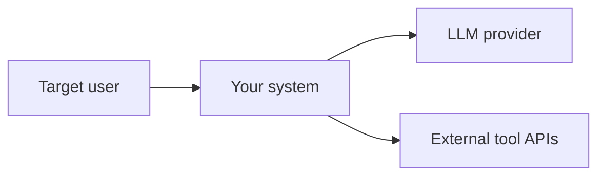
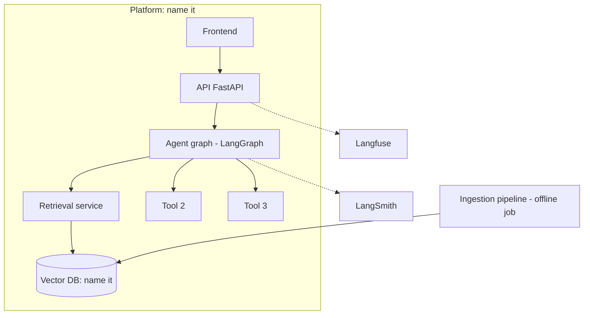
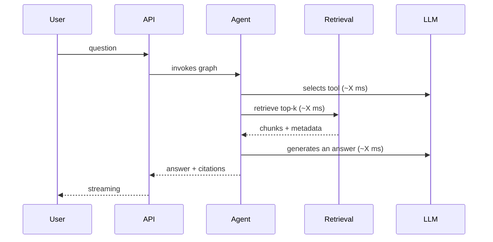

# Architecture Document — [Project Name]

> **How to use this template.** Replace each instruction block (quotes like this) with your content and delete them. Target length: 8–15 equivalent pages. An architecture document is not a technology catalog: it is the record of *decisions* and the *trade-offs* that justify them. Anything that constitutes a decision with real alternatives goes into an ADR ([format here](plantilla-adr.md)); this document references and connects them.

**Version:** v1.0 · **Date:** YYYY-MM-DD · **Author:** [name] · **Status:** draft / in review / approved

---

## 1. Context and Problem

> 3–5 paragraphs. Who is the user, what do they do today without your system, what does it cost them (time/money/errors), and what will they do with it. End with a negative scope statement: what the system **does not** do (just as important as what it does; you will be asked about this in the defense).

## 2. Requirements

### 2.1 Functional

> Numbered list (RF-1, RF-2…) of user-observable capabilities. Each in a verifiable sentence. Example of the expected style: "RF-3: when a question's answer is not in the corpus, the system explicitly states so and does not invent" — note that it is testable.

### 2.2 Non-functional (with number, not with adjective)

| ID | Requirement | Target | How it is measured |
|---|---|---|---|
| RNF-1 | End-to-end latency | P95 < 3 s | k6 load test, 15 min, see [deployment guide](../05-guia-despliegue.md) |
| RNF-2 | Availability | ≥ 99% in a window of ≥ 2 weeks | External monitor (UptimeRobot) |
| RNF-3 | Answer fidelity | RAGAS faithfulness ≥ 0.75 | Evaluation dataset, see [RAG guide](../03-guia-rag.md) |
| RNF-4 | Cost per query | < [your target] € | Langfuse instrumentation |
| RNF-5 | Security | No secrets in repo; sandbox in execution tools; rate limiting | Review + test |

> Add your own. A non-functional requirement without a "how it is measured" column is not a requirement; it is an intention.

## 3. Architecture View

### 3.1 Context Diagram (C4 Level 1)

> Who interacts with the system and which external systems it interacts with. Mermaid or exported image.

### 3.2 Container Diagram (C4 Level 2)

> The central diagram of the document. Every box must exist in your code or your cloud: no aspirational boxes. Include: frontend/client, API, agent orchestrator, ingestion pipeline (it is a distinct container from the serving one!), vector DB, observability, and where requests enter.

### 3.3 Request Flow

> Sequence diagram of the typical query, with real latencies measured per segment once you have the system (v1: estimated; final version: measured). This is the diagram you will use to justify where each latency optimization applies.

## 4. Technology Stack and Justification

> Table of chosen components. The key column is the last one: the alternative that lost. If you cannot name a serious alternative for any row, either you did not research it, or the decision was trivial and does not warrant a row.

| Layer | Choice | Why (1 line) | Discarded Alternative → ADR |
|---|---|---|---|
| LLM Generation | | | `adr/ADR-001.md` |
| Embeddings | | | |
| Vector DB | | | |
| Agent Orchestration | | | |
| API / Backend | | | |
| Cloud Platform | | | |
| Observability | | | |

## 5. Architecture Decisions (ADR Index)

> Minimum 5 ADRs for the capstone. Candidates that almost always warrant one: vector DB choice, chunking strategy, LLM model(s) and cheap/expensive routing policy, agent architecture (why graph and not chain), deployment platform, and what you do when retrieval finds nothing.

| ID | Title | Status |
|---|---|---|
| `ADR-001` | | accepted |
| `ADR-002` | | accepted |
| ADR-NNN | Decision pending registration | Owner and target date |

## 6. Data

> Corpus origin, license/legal status, volume (documents, chunks, total tokens), ingestion pipeline (steps, idempotency, how re-indexing works), and metadata schema for each chunk. Include what PII the corpus contains and what you do about it (even if the answer is "none, because X").

## 7. Security

> The five minimums, with one sentence each about your concrete implementation: (1) secret management, (2) prompt injection — what enters the prompt from the user and the corpus and what you mitigate, (3) sandboxing/permissions for each agent tool, (4) rate limiting and API public auth, (5) what you log in traces and whether it contains user data.

## 8. Scalability and Known Limits

> Be honest: where the system breaks first as it grows (the vector DB? the LLM provider's rate limit? the cost?). Connect to the [cost projection](../07-analisis-de-costes.md). A solid "known limits" section earns more points in the defense than pretending it scales infinitely.

## 9. Document Change Log

| Version | Date | Change |
|---|---|---|
| v1.0 | | Initial version (week 1) |
| v2.0 | | Review with the system already measured (week 5–6) |

> The document is submitted twice: v1 at the end of week 1 (with estimates) and the final version in week 6 (with measured numbers and the ADRs that have changed status). The difference between the two versions is itself defense material: what you thought, what you learned.
