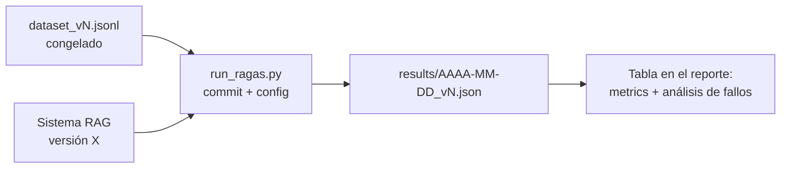

# Capstone RAG Pipeline Guide

Deliverable 2 requires a complete RAG pipeline (ingestion, indexing, retrieval, generation) with **RAGAS faithfulness ≥ 0.75** demonstrated on a custom evaluation dataset. This guide serves as the technical checklist and, above all, the evaluation protocol: a metric without a protocol is worthless. The theory is covered in [Module 3](../modulo-03-rag/); here you will find only what is required of you.

## 1. Technical Pipeline Checklist

### Ingestion (separate job from serving)

- [ ] Ingestion is an **independent script/job** separate from the API (it runs offline; the API only reads the index). Mixing the two is the number one anti-pattern.
- [ ] **Idempotent and re-executable**: running it twice does not duplicate chunks (use deterministic IDs, e.g., hash of `doc_id + posición`).
- [ ] Extraction adapted to the actual format of the corpus (PDFs with tables ≠ Markdown ≠ HTML). You have inspected **manually** the output of at least 10 documents, including the ugly ones (tables, lists, headers/footers).
- [ ] Ingestion log: how many documents entered, how many failed and why (a corpus where "8% of PDFs failed" without your knowledge contaminates everything else).

### Chunking

- [ ] The chunking strategy is a **decision documented in an ADR**, not the framework's default. You know the average size and distribution of your chunks in tokens.
- [ ] Each chunk carries **metadata**: source document, section/title, position, and the filtering fields for your domain (version, category…).
- [ ] Elements that do not survive blind chunking (tables, code blocks, requirement lists) receive specific treatment (intact chunk, serialization to text, or summary + original).

### Retrieval

- [ ] top-k and threshold chosen with data (see §3), not by default.
- [ ] **Hybrid search or reranker**: at least one of the two, with ablation demonstrating what it contributes (see §4). Vector-search-only often leaves you below 0.75 on technical corpora.
- [ ] Metadata filtering working when the query allows it.
- [ ] **"No answer" case**: when retrieval returns chunks below the relevance threshold, the system states this instead of generating on noise. This is what best protects your faithfulness.

### Generation

- [ ] The generation prompt requires **citing sources** (chunk/document ID) and the API returns them structured, not embedded in prose.
- [ ] Explicit and tested instruction not to respond outside the retrieved context.
- [ ] Streaming response to the client (affects latency perception and the P95 you report: define whether you measure time-to-first-token or total time, and state it).

## 2. The Evaluation Dataset

This is the piece that separates a serious capstone from a demo. Requirements:

- **Minimum 50 questions** (recommended 60–80) with this composition:

| Type | Approx. % | What it measures |
|---|---:|---|
| Simple factual (answer in 1 chunk) | 40% | Retrieval baseline |
| Multi-chunk (combine 2+ fragments or documents) | 25% | System's real merit |
| With implicit filter (version, category, date) | 15% | Metadata and filtered retrieval |
| **No answer in the corpus** | 10% | Abstention (the classic trap) |
| Ambiguous or poorly phrased, like real people ask | 10% | Robustness |

- Each entry has: `pregunta`, `respuesta_de_referencia` (written or verified by you against the corpus, with the source annotated), and `chunks_relevantes` (IDs) to be able to calculate context recall/precision.
- **You can generate question drafts with an LLM, but each one passes your human review**: unreviewed synthetic questions tend to be easy-for-retrieval (share exact vocabulary with the chunk) and inflate metrics. Rephrase at least half with vocabulary distinct from the source text.
- The dataset is **frozen by version** (`eval/dataset_v1.jsonl`, `v2`…): if you touch it after measuring, comparison between iterations dies. Adding questions ⇒ new version.
- **Iterating the system against the full dataset is prohibited.** Divide: ~70% development (iterate freely) and ~30% holdout that you only run for the final report. If you only report the development set, state it explicitly; hiding it and having it surface during the defense is much worse.

## 3. RAGAS Evaluation Protocol

Mandatory metrics and objective:

| Metric | What it measures | Objective |
|---|---|---|
| **Faithfulness** | That what is stated is supported by the retrieved context | **≥ 0.75 (elimination gate)** |
| Answer relevancy | That the answer addresses the question | ≥ 0.75 recommended |
| Context precision | That what is retrieved is signal and not filler | report |
| Context recall | That what is necessary is among what is retrieved | report (key diagnostic: if low, the problem is retrieval, not generation) |

Protocol:

1. **Set the judge**: exact model and version of the RAGAS evaluator LLM, temperature 0. Changing the judge between measurements invalidates the historical series. The judge must be **distinct or equal to the generator, but declare it** (judge == generator is a known bias; if you can, use a judge from another family).
2. Run the evaluation **with a versioned script** (`eval/run_ragas.py`) that dumps results to JSON/CSV with date, dataset version, system commit, and configuration (model, top-k, chunk size). Without this, there is no reproducibility and the claim does not hold.
3. **Run the final measurement 2–3 times**: the judge has variance. Report mean and range; if the range crosses 0.75, you have not passed the gate, you just got lucky once.
4. Cost: evaluating 60 questions × 4 metrics with an economical judge costs pennies; with an expensive one, a few euros. Budget it and use the economical judge during development, confirming the final figure with the judge you declare in the report.

## 4. How to report (required format)

Your evaluation report (in the project README or in `eval/REPORTE.md`) must contain:

1. **Results table** by metric (mean ± range of repetitions), separating dev and holdout, with the exact configuration of the measured system.
2. **Iteration series**: table showing how metrics evolved with each relevant change (baseline → +hybrid → +reranker → prompt v3…). This is the evidence that the final figure is not a coincidence, and the best slide for your defense.
3. **At least one ablation**: same measurement with and without a costly decision (the reranker, or the special table chunking). "The reranker increases faithfulness from 0.71 to 0.79 at the cost of +180 ms and +0.0004 €/query" is the phrase that defines a high pass.
4. **Failure analysis**: the 5–10 worst-scored questions, classified by cause (retrieval failure / generation failure / questionable reference / unanswered question incorrectly abstained) and what you would do with each class. A 0.78 with failure analysis is worth more than a 0.85 without it.
5. **Declared limitations**: judge used and its bias, dataset size, what is not covered.

## 5. Errors that fail this deliverable

- Measuring only once, on the last day, and getting 0.74.
- Dataset generated 100% by LLM without review, with questions that literally repeat phrases from the corpus.
- Changing dataset and system simultaneously between measurements (you don't know what moved the metric).
- Reporting only faithfulness: without context recall you cannot diagnose anything in the defense.
- Not versioning the configuration: you will be asked "with what top-k did that 0.79 come out?" and "I don't remember" invalidates the number.
