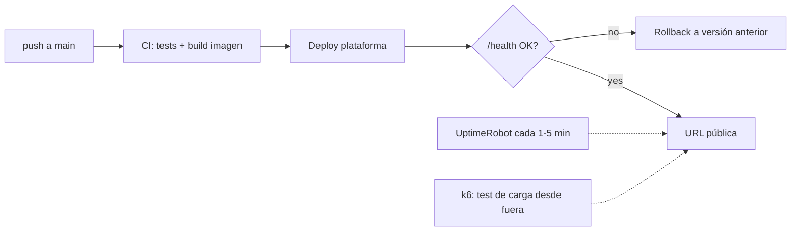

# Cloud Deployment Guide

Deliverable 4 requires **a public URL, uptime ≥ 99%, and P95 latency < 3 s**, all three with measured evidence, not just assertions. This guide compares platforms, defines how to measure each metric in a way that withstands scrutiny, and establishes the minimum production checklist.

Prerequisite decision that conditions everything: **deploy in week 2**. Uptime is demonstrated over an observation window; if you deploy in week 5, mathematically you can no longer present two weeks of history.

## 1. Platform Comparison

Capstone profile: Containerized API (FastAPI + agent), managed vector DB separately, and low traffic. Pricing, free tiers, regions, and suspension policies change frequently: check the official pages on the day you decide and save the URL, date, currency, and taxes in the ADR. The table compares architectural properties; the cost column is filled in with the current quote.

| Platform | Verified Monthly Cost | Pros | Cons | Fits if… |
|---|---|---|---|---|
| **Railway** | _Fill from official pricing_ | Deploy from repo in minutes, integrated logs and environment variables | Check RAM, available regions, egress, and suspension policy of the chosen plan | You prioritize delivery speed and the region meets your measured P95. |
| **Fly.io** | _Fill from official pricing_ | Regional selection and fine control of Machines | More operational decisions; auto-stop/cold start affects latency | You need a nearby region and want to control lifecycle and scaling. |
| **Render** | _Fill from official pricing_ | Managed flow, integrated TLS and domains | Verify if the chosen plan suspends the service and measure its cold start | You already know the platform and the plan sustains the SLO without sleeping. |
| **AWS App Runner / ECS Fargate** | _Calculate compute, network, logs, and registry_ | Native IAM, ECR, and CloudWatch; good cloud traceability | Larger configuration surface and cost split across services | You want to demonstrate AWS architecture and have budgeted for its operation. |
| **AWS Lambda + API Gateway** | _Calculate requests, duration, network, and concurrency_ | Scales to zero and charges by usage | Cold starts with heavy dependencies; streaming and multi-step agent require validating limits | The traffic profile is sporadic and your tests meet P95 and duration. |
| **VPS + Docker** | _Sum instance, backups, network, and operational time_ | Host control and predictable cost | You operate TLS, firewall, patches, backups, and rollback | You can demonstrate hardening and reproducible operation. |

Cross-cutting rules:

- **The vector DB must be managed** (free tier) unless justified in the ADR: losing the index during a redeploy is the classic accident of week 4.
- **The LLM model is an external API**: do not include local inference in the capstone deployment; RAM/GPU requirements break all previous budgets.
- Document the choice as **ADR with the table above filled in with your numbers** (including the latency measured from your region to the platform).

## 2. The Public URL

- [ ] HTTPS mandatory (all platforms in the table provide it; on VPS, Caddy or certbot).
- [ ] A **minimal usable frontend** at the root: a simple chat page suffices, but the tribunal must be able to use the system without `curl`. (Streamlit/Gradio deployed separately is also acceptable; document the two URLs then.)
- [ ] `GET /health` is **liveness** and only confirms that the process is handling HTTP; it must respond
  quickly and not call paid services. `GET /ready` is **readiness**: it checks configuration and
  critical dependencies with short timeouts. The external monitor watches both and alerts differently: down process vs. live instance but unable to serve traffic.
- [ ] **Rate limiting** (e.g., slowapi) and a **simple API key** for expensive endpoints: your URL is public for weeks and your LLM budget is finite. Leave a demo/guest mode with strict limits for the tribunal.
- [ ] Secrets in the platform's manager, never in the repo. `.env.example` document the variables.

## 3. Measuring Uptime ≥ 99%

**Required protocol:**

1. Register with a free external **monitor** (UptimeRobot, Better Stack free tier) against `/health`, with a 1–5 min interval, **on the same day as the first deploy**.
2. Reporting window: **≥ 2 continuous weeks** before submission. 99% uptime over 2 weeks allows for ~3.4 hours of cumulative downtime — this is an achievable benchmark even with some clumsy redeployments, but not if the service sleeps.
3. Evidence: capture/export of the monitor's dashboard showing the percentage and incident history. Self-measuring with a cron job on the same machine does not count (if the machine goes down, your meter goes down too).
4. Each recorded outage > 10 min requires an explanatory line in your report ("redeploy without health check on Railway, 22 min, fixed by enabling overlapping deploy"). Explained outages demonstrate maturity; unexplained outages deduct double.

## 4. Measure P95 latency < 3 s

An honest P95 number requires defining what you measure and under what load:

1. **Define the measurement point**: end-to-end from the client (as required by the capstone), on the main query endpoint. If your response is streaming, report **two** figures: time-to-first-token and total time, and state that the 3 s gate is evaluated on TTFT + justify why (user perception), or on total if you do not stream. Choosing the metric *after* seeing the numbers is cheating; fix it beforehand.
2. **Tool**: k6 or Locust, versioned script in the repo (`load/`).
3. **Minimum scenario**: 10–15 min duration, 3–5 concurrent virtual users with realistic think-time, and a set of ≥ 20 varied queries from the evaluation dataset (not the same query, which caches itself). Executed **against the public URL**, not against localhost.
4. **Report**: P50 / P95 / P99, error rate, and the breakdown by segment using your traces (what part is retrieval, what part is LLM). The breakdown is what turns the number into engineering: "P95 2.4 s, of which 1.9 s are the generation call" tells you where NOT to optimize.
5. Run the test **twice on different days** (LLM providers have bad hours) and report both.

If you do not reach 3 s: the levers in order of usual performance impact — streaming + measuring TTFT, faster model for the agent's routing steps (the "decide tool" step does not need the expensive model), parallelizing retrieval with what is possible, trimming context (fewer, better-chosen chunks), and caching repeated queries. Each lever applied goes to your ADR or cost analysis.

## 5. Minimum production checklist

- [ ] **Docker**: buildable image with `docker build` in a clean environment; the platform deploys that image (not "it works on my machine with uv run").
- [ ] **CI/CD**: push to `main` → tests → automatic deploy (GitHub Actions or the platform's auto-deploy with a test gate). A manual deploy via SSH documented by hand fails this point.
- [ ] **Structured logs** (JSON) with a request-id per request that also appears in the LangSmith trace: this is your only diagnostic tool on the day something fails in front of the tribunal.
- [ ] **Tested rollback**: you know (and have practiced once) how to revert to the previous version in < 5 min.
- [ ] Clean restart: the container can die and come back without intervention (nothing critical in memory/local filesystem; the index lives in the managed vector DB).
- [ ] Billing budget/alert activated on the platform and on the LLM provider (see [LLMOps guide](06-guia-llmops.md)).

## 6. Errors that fail this submission

- Free plan that puts the service to sleep: the tribunal's first request takes 40 s and real uptime is fiction.
- Uptime monitor registered in the last week: there is no window to report.
- P95 measured with 1 request locally, or with the same cached query 500 times.
- Vector index inside the container: every deploy wipes the corpus.
- The LLM provider's API key in the public repo. This does not lower the grade: it is a security incident and is treated as such (rotate, document the postmortem).